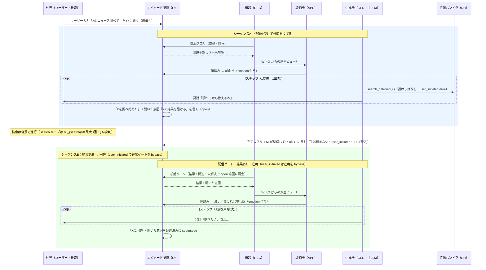

# familiar-ai ユースケース②：ニュース検索（ユーザー起点・新フレーム）（v0.1）
 
## 目的
ユーザーが頼んだニュース/時事を、deferred で調べて結果を返す。新フレームでの「**ユーザー起点・最優先・deferred 検索・user_initiated による在席ゲートの bypass**」を通す検証ケース。⑤（自発）の対になるユーザー起点版。
 
## 前提（確定事項の適用）
- **トリガ＝ユーザー入力**（最優先。発火ではない。進行中の自発活動があれば境界で中断＝[D-発火] 改訂）。
- **A（受けて検索）と B（結果→回答）は別シーケンス**（[D-検索]＝検索は非同期）。
- 配信ゲートは **結果有り／在席** の2条件のみ。**user_initiated は在席を bypass**（ユーザーが話している時点で在席は自明）。**夜間の控えめさは T 側の D レート（時間帯倍率・課題10）、社会的な遠慮は出口側の発話抑制で別途扱い、ゲート条件には含めない**。
- 記憶は **O 単一**・**W は O からの派生ビュー**（[D-記憶単一化]）、MI は最小（[D-MIモデル]）、I は純イベント駆動（[D-周期]）。
## 現状コードとの関係（【コード事実】）
- **deferred-first パターン**：`search_deferred(query, source='tavily')`（即発火・非ブロック）→ 一言 ack →end turn。次ターンで `[バックグラウンド検索完了: …]` を読んで回答。blocking `tavily_search`/`brave_web_search` は限定例外のみ。
- `DeferredSearchTool.set_user_turn` で **user_initiated をタグ付け**。`pending_context()` が結果を返してクリア。`user_initiated` は在席（presence）ゲートを bypass する。
- Tavily 注意：`search_depth='basic'`（fast/ultra-fast は日本語ニュースが stale）、`time_range` は day/week/month/year、`country` パラメータ禁止。
## シーケンス図（I の反復版）
 

 
## 流れ
 
### シーケンスA：依頼を受けて検索を投げる
1. **トリガ＝ユーザー入力**：「Xのニュース調べて」を **O に書く**（最優先）。進行中の自発活動があれば境界で中断（[D-発火]）。
2. **W 構築＋評価（同期・案A）**：O から想起で W を組み（関連・ユーザーの好み）、評価器が依頼内容を把握→前向き（emotion 付与）。
3. **行動**：主LLM が `search_deferred(X, source='tavily', search_depth='basic')`（非ブロック・user_initiated=true）を投げ、一言「調べてから教えるね」と言って turn を閉じる。
4. **A 閉じる**：「Xを調べ始めた」＋開いた意図「Xの結果を届ける（user_initiated）」を **O に書く（open）**。
### シーケンスB：結果到着 → 回答
5. **結果再入**：deferred 結果は**完了キューへ（生のまま O に積まない）**。完了キュー経由で I が起き、**フルLLM が整理して1つの O に畳む**（`user_initiated`・[D-O書込]／[D-検索]）。次ターンの想起で W に上がる。
6. **配信ゲート**：結果有り／在席の2条件。**user_initiated は在席を bypass**（ユーザー起点なので在席は自明）。満たす tick で B が立つ。
7. **W 構築＋評価（同期）**：結果＋関連＋未解決で **open 意図に再会**（[D-単一想起]）。評価器が依頼適合・質を見て満足／無ければ申し訳（emotion 付与）。
8. **行動**：主LLM が結果を読み、「調べたよ、Xは…」と回答。
9. **B 閉じる**：「Xに回答」を O に記録。開いた意図を配送済みに supersede。
## 注意点
- 既定は **deferred（2シーケンス）**。即答が要る限定例外のみ blocking（[D-検索]）。
- **結果なし（理由は問わない＝404/429/未投入を峻別しない）**のときは、$L_{search}$（最大3回）内で投げ直すか、B で正直に「見つからなかった」と返す。
- **ユーザー入力は最優先**：進行中の自発活動（例：⑤のニュース準備）があれば境界で中断し、ユーザー依頼を先に処理（[D-発火] 改訂）。
- **日本語ニュースの鮮度**：`search_depth='basic'`・適切な `time_range`・`country` 不使用。
- **夜間・社会的な遠慮はゲートで止めない**：夜間は T 側の D レート（時間帯倍率・課題10）、社会的な遠慮は出口側の発話抑制で扱う。
## このユースケースからの要求（残課題への送り・状態付き）
- **〔確定（機構）／値は課題5〕驚き S の動機づけ**：取得ニュースが予測とズレるほど読みたくなる流れ。**機構は [D-値踏み] で確定**＝A←機械的驚き（result/観測 vs O）→ mood/drive 変調、P/Pn/Dom←LLM 値踏み、**D→調停で drive-serving**。読みたくなる強さの**値は課題5**。
- **〔確定（整理済み）〕人の在/不在を作業文脈に**：配信ゲートの在席＝**I 自前の InsightFace 判定**（[D-知覚]）、社会文脈の「人がいる/いない」＝**I 自身の観測（O）→想起で W**。T(G) の presence は private で I は読まない（[D-B分離]）＝**二重持ちでなく用途別**（T＝知覚驚き用／I＝ゲート・社会文脈用）。
- **〔確定〕開いた意図の supersede 表現**：open 意図＝**O の MI（status=open）**、解決＝supersede（activation 落とす）。[D-MIモデル]／[D-単一想起]／[D-気がかり統合]。
- **〔確定・課題5 H〕deferred の値**：検索/取得 TTL＝10秒（外部応答待ちのみ）・$L_{search}$＝3・$MaxConc$=3（暫定・課題7）・$MaxPend$=7・同期化（即答は blocking）。タスク状態は結果あり/なしの2値・機械リトライなし（[D-外部安定]）。
- **〔未対応・課題6/8〕移植**：`DeferredSearchTool`／`pending_context`／`user_initiated` タグの新フレーム流用（gap 分析＝課題6 → TDD 改造＝課題8）。