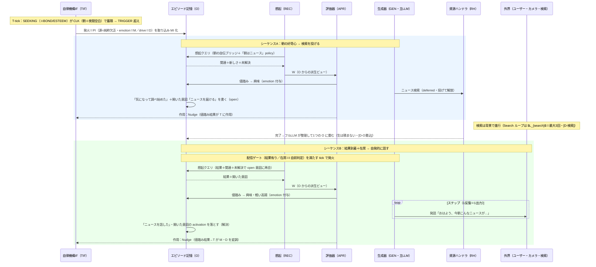

# familiar-ai ユースケース⑤：朝の自発ニュース（新フレーム）
 
## 目的
朝、外的トリガなしにパジュが自分からニュースを取りに行き、ユーザーが居れば自発的に話す。新設計の「純粋欠乏発火からの能動立ち上がり・deferred 検索・自発発話の出口」を一通り通す検証ケース。
 
## 前提（確定事項の適用）
- 駆動＝**SEEKING＋BOND＋ESTEEM の複合（欲求ベクトル）＋ CLK 朝修飾**（外的 cue なし＝**純粋欠乏発火**）：知りたい（SEEKING）に加え、**話題を共有して関わりたい（BOND）**・**頼られるためにニュースを知っておきたい＝役立つ/有能でありたい（ESTEEM）**。発火は単一欲求でなく5欠乏ベクトルで立つ（dominant は SEEKING だが BOND/ESTEEM も寄与）。
- **A（好奇心→検索）と B（結果＋在席→共有）は別シーケンス**（[D-検索]＝検索は非同期／1 cue→1 Activity）。
- 発火ペイロード＝**PI**（源カテゴリ→content／M→`emotion`／D→`drive`／時刻→store timestamp・[D-発火ペイロード]／[D-T境界]）。
- I は純イベント駆動（3キュー待ち・[D-周期]）、記憶は **O 単一**・**W は O からの派生ビュー**（[D-記憶単一化]）、MI は最小（[D-MIモデル]）。
## 現状コードとの関係（【コード事実】）
- `_morning_reconstruction` は**セッション最初のターンのみ**呼ばれる自伝ブリッジ（昨日→今日）で、**ニュースではない**。本ケースではこの想起を「**朝の最初の活動での R の recall**」として取り込む。
- deferred 検索の **proactive 配信ゲート**（結果有り／在席）は既存。本ケースの **B の発火条件**として持ち込む（夜間は配信ゲート外＝T 側の D レートで扱う。下記参照）。
- 「朝になったら自分からニュースを取りに行く」完結ループは**未実装**。部品（deferred 検索・配信ゲート・朝文脈・curiosities/policy）を新フレームに組み直す。
## シーケンス図（I の反復版）
 

 
## 流れ
 
### シーケンスA：朝の好奇心 → ニュース検索を開始（ユーザー不要）
1. **発火（純粋欠乏）**：T-tick で D の SEEKING（＋BOND／ESTEEM）が CLK（朝＋夜間の空白）でレート修飾されて蓄積し、TRIGGER 超え。源カテゴリ＝純粋欠乏。**発火＝PI を取り込み O に MI 化**（drive ベクトルに SEEKING 高・BOND/ESTEEM 寄与が載る）。
2. **W 構築＋評価（同期・案A）**：O から想起で W を組む。ここで朝の自伝ブリッジと「朝はニュースを見る」policy/curiosity が想起される。評価器＝朝・未確認・見る価値あり、emotion＝興味。
3. **行動**：主LLM が SEEKING を満たす手として「ニュースを deferred 検索で投げる」を選ぶ（投げて解放）。ユーザー不在ならまだ話さない。「ニュースを届ける」を O の**開いた意図**（for-X 結果未配送＋supersede）として置く。
4. **A 閉じる**：「気になって調べ始めた」＋開いた意図を **O に書く（open）**。検索は in-flight。
### シーケンスB：結果到着＋在席 → 自発的に共有
5. **結果再入**：deferred 結果は**完了キューへ（生のまま O に積まない）**。完了キュー経由で I が起き、**フルLLM が整理して1つの O に畳む**（[D-O書込]／[D-検索]）。想起で W に上がる（専用の特別起床ではない）。
6. **B の発火条件**：proactive 配信ゲート（結果有り／在席）を満たした tick で B が立つ。**在席は I 自前の判定**（[D-知覚]・T(G) の presence は private）。
7. **W 構築＋評価（同期）**：結果＋関連＋未解決で **open 意図に再会**（[D-単一想起]）。評価器＝共有価値の有無、emotion＝notable なら興味・軽い高揚。
8. **行動**：主LLM が自発発話「おはよう、今朝こんなニュースが…」を出力。
9. **B 閉じる**：「ニュースを話した」を O に記録。開いた意図の activation を落とす（解決・supersede は使わない）。
## 注意点
- A の時点でユーザー不在なら**発話しない**。「届ける」は O の開いた意図として保留し、B で配送・supersede。
- 検索は deferred（投げて解放）。結果は完了キュー経由で I が起き、**フルLLM が整理して1つの O に畳む**→想起で W に上がる。連鎖検索（Search ループ）は **$L_{search}$＝最大3回**まで（[D-検索]・課題5 H）。
- B は配信ゲート（結果有り／在席）を満たす tick でのみ立つ。**夜間の控えめさは T 側の D レート（CLK 夜間空白・課題10）で、社会的な遠慮は出口側の発話抑制（作業文脈として「人がいる/いない」を W 構築で持ち、主LLM が判断）で別途扱う**（どちらもゲート条件に含めない）。
- ニュースの鮮度：日本語ニュースで stale を避ける検索バックエンド選択（現状コードに注意書きあり）。
- 純粋欠乏発火が朝に集中しすぎないよう、発火時の放電量と蓄積レートで間隔を調整する（不応期は置かない・課題5/10）。
## このユースケースからの要求（残課題への送り・状態付き）
- **〔確定〕開いた意図・policy 昇格**：開いた意図＝**O の MI（status=open）→supersede**（[D-MIモデル]／[D-単一想起]）。「朝はニュース」policy は **観測→方針の昇格を O の外＝REST 内省**で行う（[D-O書込] 案A・表現/更新の詳細は課題6）。
- **〔未対応・課題5〕暫定値**：SEEKING の朝レート修飾・TRIGGER・夜間空白の効き（夜間は T 側の D レートで扱う・配信ゲート外）。**複合動機**＝SEEKING（知りたい）＋BOND（話題で関わりたい）＋ESTEEM（頼られるため知っておく）の各寄与。
- **〔確定〕純粋欠乏発火の明文化**：外的 cue なし D→TIF は **[D-発火]**（発火＝当該 D を放電・I 非関与）／**[D-T同期]**／**[D-想起手がかり]①情動**で明文化済み。値は課題5。
 