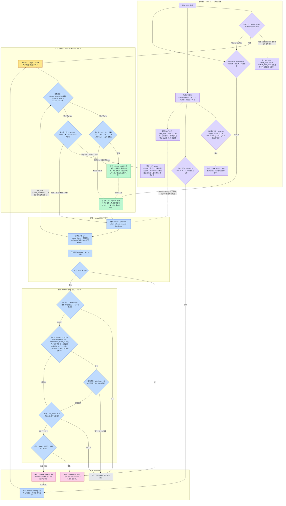

# familiar-ai イベント駆動ループ（#11・段階5）（v0.78）

## 位置づけ

**この文書は段階ごとの実装記録である。いまの姿ではない。**（2026-09-10 に明記）

#11 は現行のターン駆動 ReAct ループを、目標の**純イベント駆動ループ**（3キュー AIF/DIF/完了・1反復1出力・軽量LLM 調停）へ差し替える大工事だった。前提（起動源＝Drive・拡散想起）は実装済み。**増分・新ループを `loop/` に並行実装し `EVENT_LOOP` で現行 `run()` と排他切替**する（既定 off）形で始め、段階を薄い縦切りで進めた。

**移行は完了している。** 各段落は「そのとき何を作ったか」の記録として読むこと。以下は、
書かれている当時の名前と、いまの実物との対応である。

| 当時 | いま |
|---|---|
| `EVENT_LOOP` フラグと排他切替 | **撤去済み**（環-c）。ループは常に走る |
| 旧 `run()`（ReAct 本体・735 行） | **撤去済み**（環-c）。`agent.run()` は**話者の同定とスラッシュコマンドだけを見る 61 行の入口**で、中身は `InformationProcessing.run_iteration()` |
| `_dispatch_recall` / `_run_recall` | `_dispatch_lookup` / `_run_lookup`（環-g・調べものを1つの語に束ねた） |
| `with_recall`（真偽値） | 動作名の集合（`_tools(actions=…)`） |
| 意図 O（`_live_intent_id` ほか） | **求めの版チェーン**（`設計方針_求めの版チェーン`） |

**いまのループの正本**は、構造が `設計図_Mermaid` ③、語が `用語_略語一覧`、直近の設計判断が
`設計方針_ループの語を束ねる`（環-g）と `設計方針_主LLMを投げっぱなしにする`（環-h）である。

## 段階1・スライス1（実装済み）

**人の発言（会話入力 trigger）→ 拡散込み想起（W）→ 1反復で1発話**。ツールを渡さず1出力を保証（発話のみ）。多段 ReAct はしない。

- **`loop/prompt.py`**：案B（クリーン最小・日本語ルール）の system プロンプト。
  - 静的核 `EVENT_SYSTEM_PROMPT`＝`(agent :type embodied (body eyes/neck/voice/**net**・**足なし**))`＋`(loop :one-output-per-iteration)`＋`(identity :id family-bond)`（家族の一員・切れない関係・時に厳しく・誰よりも愛する）＋rules（正直・**no-raw-internal-metrics**〔social_policy から移植〕・一人称視点取り・validation・bid・人格・言語）。net＝`search_deferred`/`fetch_deferred`（結果は後の反復で届く）。
  - `build_event_system_prompt(...)`＝静的核＋**自己認識 MI（ME.md＋FAMILY.md＋capabilities）**＋在席＋**PI（mood/drive 定性・生値なし）**＋W。**撤去対象（social_policy・mental_snapshot・interoception・relationship スカラ）は載せない**。
- **`loop/event_loop.py`**：`begin_request(agent, utterance)`＝`recall`（5軸＋拡散込み）で W→system 構築→`stream_turn(tools=[])` で1発話→永続化は既存 `_run_post_response_pipeline`（**utility LLM のみ・フルLLM 不使用**）を spawn。
- **Config**：`EVENT_LOOP`（既定 off）。**`run()` 先頭で on の user turn のみ `begin_request` へ排他切替**（`is True` 厳格判定・自発ターンは対象外）。

**挙動不変**：`EVENT_LOOP` off（既定）で現行 `run()` 経路のまま・全体テスト緑。

## 段階1・スライス2（実装済み）

**内部ツール `recall` を QC（完了キュー）経由で連鎖**させる、`設計図_Mermaid` ③ I 詳細図の最小縦切り。外部I/Oの無い `recall` を題材に、取込→O→W の連鎖機構だけを先に作る。

- **`InformationProcessing`（I：情報処理機構）**：`loop/event_loop.py` に新設。属性 `_completion_queue`（**QC**・`asyncio.Queue`）と、メソッド `begin_request`（**LPM**：ループ核の drain 反復）を持つ。O・C（Config）・W・RH 相当のツール実行は既存実体を持つ `agent` を当面参照。AIF/DIF/QA/QD、ARB/APR/ACT/MNT のクラス分離は後続段階（stub しない）。
- **反復フロー**（④シーケンス整合）：(1) **取込**＝QC を drain し完了結果を **O 書込**（`save_async_with_id`, kind=`observation`）、(2) **REC**＝`recall_async` で W 構築、(3) **GEN**＝`stream_turn([say, recall])`。**say**→発話して反復終了／**recall**→**RH** が非同期に実行し結果を **QC へ**（投げた時点で反復終了）。相関ID は使わず結果は O→W で再会（[D-単一想起]）。
- **連鎖上限**：`event_max_iterations`（env `EVENT_MAX_ITERATIONS`・既定5）。上限の反復では recall を渡さない。既定が3だったとき、ネットの調べもの（`search_deferred` でリンクを得る→`fetch_deferred` で本文を読む→答える）が3手を使い切り、答える手が残らなかった（実機で観測）。
- **完了 MI の content 上限**：`completion_content_max`（env `COMPLETION_CONTENT_MAX`・既定8192文字）。取ってきた本文を切ると、表なら見出しだけが残って中身が消える。値は埋め込みモデル bge-m3 の入力上限 8192 トークン（`sentence_bert_config.json` の `max_seq_length`）に合わせてある。1文字＝1トークンになる字もあるため、8192 *文字* なら常に 8192 トークン以下に収まり、埋め込みが後ろを落とさない。O に書く文面と W に載せる文面は同一にする。
- **supersede**：ループ中に書いた O（トリガ・open 意図・完了）の id を `_run_post_response_pipeline(superseded_ids=...)` へ渡し、ターン観察保存後にその id で `mark_superseded`。恒久記録は会話 summary O が担う。

### 求めの版チェーン

以前は、人の発話（トリガ O）・調べると決めた記録（意図 O）・結果が届いた記録（完了 O）を
別々の direction で書き、求めが決着したときに `close_with_children` で親と全子をまとめて
畳んでいた。`superseded_by` が「版が新しくなった」と「求めが決着した」の2つを兼ねており、
用語一覧の定義（「版履歴専用。解決には使わない」）から外れていた。

**求めを1本の版チェーンにした**（`設計方針_求めの版チェーン`）。各版が求めの状態で、新しい
版が直前の版だけを畳む。`direction="求め"` の1本の鎖になり、意図 O・完了 O・中断 O は無く
なった。`close_with_children` は撤去した。

```
「昨日の天気覚えてる？」と聞かれた
「昨日の天気覚えてる？」と聞かれ、1番：recall「昨日の天気」を起動中
「昨日の天気覚えてる？」と聞かれ、1番：recall「昨日の天気」の結果が届いた：…
```

**並行する調査は求めの中の通し番号で列挙し、鎖は分岐させない。** 状態は「求め」の状態で
あって個々の調査の状態ではないので、3件飛んでいても求めの状態はひとつである。届いた完了は
番号で対応づく。`deferred` の完了は語で届くので、語から番号を引く。

**同じ語はこの求めのあいだ二度と調べない。** `deferred` は自前で同じ意図を止めていたが、
`recall`・`see`・`look` は素通りで、実機では同じ `recall` を4反復続けて投げた（語は MD5 まで
一致）。4回とも同じ記憶を取ってきて無駄になった。止めた調査は完了として積み、反復を続ける
（投げずに黙って帰ると、完了も時間切れも来ないまま飛行中の数だけが残る）。

**人の発話の記録と、自分が答えた記録は鎖の外**にあり、畳まれない。発話の記録には、検索を
始めたときに「検索を始めた」を**一度だけ**追記し、埋め込みを作り直す（あとから content を
足すだけだと、content と situated ベクトルが食い違い、足した文言が検索に効かない）。

打ち切りも版のひとつで、何を打ち切ったかは版の content が持つ。

### 取込の起点をめぐる一律の規則

除外が効いていたのは `recall` ツールの検索だけで、**毎反復の W 構築は素通し**だった。反復1では直前に書いたトリガ O をそのまま拾う（問いと同一文なのでコサインは最大に近く、必ず上位に来る）。しかも鎖の先頭が W に載るかどうかはコサイン任せで、保証は無かった。

そこで、取込で書いた記録（＝鎖の先頭）について次を一律の規則とする。

- **検索から外さない**：取込 O は候補集合の一員として同じ採点を通す。手がかりは取込の content そのものなので、候補に入れば必ず上位に来る。以前は「枠を食う」と嫌って外していたが、いま届いた結果を全文で見せる必要がある以上、1位に来るのが正しい順位である。`recall` ツール側は、自分が出した検索が自分自身を拾わないよう意図 O だけを狭く除外する（別の話）。
- **手組みで加えない**：以前は取込の内容を W の先頭へ決定的に置いていたが、候補集合から載るようになったので撤去した。正本 [D-想起起動] は「O に乗った後は共通の流れで1本」と定める。コサインの運に左右されない。
- **自己認識 MI は常時**：`ME.md`・`FAMILY.md`・`capabilities` はプロンプトの安定部として毎反復入る（想起の pinned 機構ではなく直接注入）。

鎖の先頭は id と内容の対で持つ（`_advance_chain(id, content)`）。W へ加えるのに内容が要るためで、QA（情動）・QD（機器）を足すときも、取込で書いた記録を同じ関数へ渡せば同じ挙動になる。

### 絞り込み付きベクトル検索の取りこぼし

想起の手がかりを直しても、猛暑の記憶が出てこなかった。ログには `recall score` が1行も無く、例外も出ていない。候補が 0 件で採点ブロックに入っていなかった。

同じクエリ・同じ人物・母集合 2707 件に対する実測:

| 設定 | 返った候補 |
|---|---|
| 既定 | **0 件** |
| `hnsw.ef_search = 200` | 3 件 |
| `hnsw.iterative_scan = relaxed_order` | **5 件** |

HNSW 索引は `situated_embeddings.vector` 単体に張られている（`idx_se_hnsw`）。一方クエリは `person_id` と `superseded_by IS NULL` で絞り込むため、索引が先に集めた近傍候補（`ef_search` 既定 40）に絞り込みが当たり、大半が落ちる。同じ観測を人数分の視点で持つ設計なので、単純計算でも候補の 3/4 が消える。`n=1→1 件、n=5→1 件、n=20→1 件、n=50→50 件` という振る舞いも、LIMIT が大きいと計画器が索引を諦めて全走査へ切り替わるためである。

**イベントループ固有ではなく、現行 `run()` の想起も同じ経路で取りこぼしていた。**

対策として、接続の確立時に `SET hnsw.iterative_scan = relaxed_order` を入れる（pgvector 0.8.2）。絞り込みを通った行が必要数に達するまで走査を続ける機構で、走査量は `hnsw.max_scan_tuples`（既定 20000）が抑える。修正後は「最近むちゃくちゃ暑い日があったよね、いつだっけ？」に対し `昨日の猛暑に比べれば今日はいくらか楽だという安堵。`（2026-07-24）が返るようになった。

### 取込 a0 の歪みと再計算

絞り込み検索の取りこぼしは、想起だけでなく **`content_novelty`** も壊していた。novelty は「AGENT_SELF 視点の situated 近傍 K=7 件の平均コサインの裏返し」で測り、`a0 = clip(1.5 × novelty, 0, 1.5)` として保存される。その近傍検索も `person_id`・`superseded_by`・`kind <> 'self_model'` で絞り込むため、本当の近傍が取れず、近傍が K 未満なら既定値へ落ち、揃っても平均コサインが低く出て novelty が過大になっていた。

a0 は想起スコアの加算部で**最大の重み**（`w_a=1.5`）を持つ。その結果、名前の羅列でできた場面記録が a0≈0.95 で上位を占め、内容のある会話（a0≈0.45）を押し下げていた。

全走査の正確な近傍で計算し直した試算（本番 2707 件）:

| kind | 件数 | 変更前 | 変更後 |
|---|---|---|---|
| `conversation` | 1432 | 0.452 | 0.766 |
| `self_model` | 685 | 0.407 | 1.061 |
| `utterance` | 59 | 0.968 | 0.832 |
| `scene` | 19 | 0.952 | 0.707 |

マイグレーション `2026-07-25-031_recompute_groundedness_g0.py` で一括再計算する。近傍の母集合は取込時と同じ（AGENT_SELF 視点・生きている・`self_model` を除く）とし、**その記録より前の記録だけ**を見て取込時を再現する。当時 superseded でなかった行が今は superseded ということはありうるので、再現は近似である。

なお `self_model` が上がるのは定義どおりである（母集合から除かれるため似た近傍が構造的に存在しない）。自己モデル文が人の問いへの想起で上位に来る件は、a0 ではなく**想起の母集合に入れるべきか**という別の論点として扱う。

**全件平均ではなく近傍 K 件平均を使う理由**も実測で確かめた。全件平均では novelty が 0.979 に張り付き標準偏差 0.038 しかない（2000 件のほとんどが無関係なので平均コサインが ≈0 に潰れる）。近傍 7 件平均は平均 0.498・標準偏差 0.131 で、似たものが既にあるかどうかを区別できている。

### 想起の手がかり

想起はベクトル検索だが、その query に**どの反復でも最初の発話**を渡していた。反復2以降は取り込んだもの（完了 O）と無関係な検索になっており、④ の「REC→O：想起クエリ（手がかり）」＝取り込んだ事実を手がかりに W を組む、という形になっていなかった。

手がかりを**鎖の先頭の内容**にする（反復1なら人の発話、反復2以降なら完了 O の内容）。埋め込みの回数は増えず、埋める文字列が変わるだけ。実測でも想起は1反復あたり 17〜23ms（500 字の埋め込みと DB 挿入で 26ms）で、LLM 呼び出しの 2〜4 秒に対し 1% 未満である。

保存済みベクトルの再利用（記録そのものと同じ位置で探す）は、速度目的では不要と判断した。削れるのは上記の数十 ms にとどまる。

### 想起件数

自己干渉が消えた後の実機で、「最近むちゃくちゃ暑い日があったよね、いつだっけ？」に対し想起の上位が `I am very concerned about the heat.`（2026-07-22・自己モデル文）と別件の観測で埋まり、猛暑そのものの記憶が上位に来なかった。枠が 3 しかないため、関係の薄い記憶が混じると本命が押し出される。

W に載せる件数は `MemoryConfig.recall_k`（env `RECALL_K`・**既定 7**）が決め、W 構築と `recall` ツールの既定件数をここから取る。これは正本の W 載せ上限 $K$（`課題5_パラメータ仮案` §92）である。

候補をいくつ集めるかは別のつまみで、`MemoryConfig.recall_primary_n`（env `RECALL_PRIMARY_N`・**既定 50**）が各軸の `LIMIT` を決める（同 §93 の一次絞り件数 $N$）。当初は両者を一つの件数で兼ねており、各軸が 5 件しか集めていなかった。$N$ はフルLLM へ渡らず再スコアにしか使わないので、トークン量とは無関係に広く取れる。

床（`min_score`・既定 0.05）は採点後に効く。イベント駆動ループの想起はこれを渡しておらず、既定 0.0 で床が効いていなかった。連想想起（`agent.py`）は渡していたので、経路によって挙動が違っていた。

### 想起の重みを選ぶ基準（駆動源）

5軸の重みは trigger 種別で決める（`課題5_パラメータ仮案` の D 節）。選ぶ基準は「この求めを何が始めたか」ではなく、**この反復が何を手がかりに動くか**である。反復1の手がかりは人の言葉だが、完了が届いて起きた反復の手がかりは結果の本文で、性質が違う。取込で完了を1件でも書いたなら、その反復の trigger は「完了」になる。

**起点（`_trigger_kind`）は書き換えない。** 起点は静穏時間のゲート（`_should_hold`）が使っており、「自分から話しかける時間帯か」を判断する。完了で起きた反復のたびに起点を「完了」へ書き換えると、人に話しかけられて始まった求めが夜間にゲートへ掛かり、返事が保留されて翌朝に届く。重みの選択は反復ごとの局所的な判断なので、起点とは別に持つ。

なお `_trigger_kind` に「完了」が入る経路は元々無く、設定されるのは発話・情動・機器の3つだけだった。

### 重みの揺らぎと INFO ログ

採用値はプロファイルそのものではなく、各軸に $\pm$ 幅の一様乱数を足したものである。値が仮値のままでは、どの向きへ動かせばよいかが分からない。反復ごとに少し振り、採用値と結果を残して実挙動から選べるようにする。

想起1回につき INFO を1行出す。`event-loop 想起 trigger=完了 w=(1.62,1.41,0.47,1.38,1.05) 基底=(1.50,1.50,0.50,1.50,1.00) 上位=0.391/0.312/0.284 7件` の形で、trigger・採用値・基底・上位のスコア・件数を持つ。**記憶の内容は出さない**（会話と記憶の内容を INFO 以上に出さない方針。中身は DEBUG の想起の内訳にある）。1ターンあたり最大5行になる。

### 想起の例外：degrade と伝播を分ける

`recall` は失敗を `[]` へ degrade しつつトレースを残していたが、**呼び出し側は「記憶が0件」と「想起が壊れた」を区別できなかった**。`by_vector` に引数を足したとき、署名不一致の `TypeError` が `[]` に化け、在席者相関のテストが別の顔で落ちた。

- `TypeError`・`AttributeError`・`NameError`（コードの誤り）は**再送出**して即座に表面化させる。
- それ以外（DB 障害・埋め込み生成の失敗など運用上の失敗）は従来どおり loud に記録して `[]` へ degrade し、会話は落とさない。

### ループ記録の鎖と、検索の自己干渉

実機で「最近めちゃくちゃ暑かった日があったよね、いつだっけ？」と聞くと、`recall` が返したのは**自分が書いたばかりのトリガ O と意図 O** だった。モデルはそれを読んで「調べたけど結果がまだ届いてない」と答えた。中身が文字どおりそう書いてあるので当然の反応である。

原因は順番にある。記録は検索より**前**に書かれる。トリガ O は問いと同一文なのでコサインが最大に近く、意図 O は query 文字列を丸ごと含むので、その query で探せば必ず上位に来る。supersede は検索の後にしか効かないので、前倒ししても間に合わない（実測でも recall 完了から supersede まで 48ms、その間に検索は走らない）。

- **1本の鎖にする**：`トリガO → 意図O → 完了O → 意図O2 → …` と、新しい記録が直前の生きた記録を supersede する（`_advance_chain`）。生き残るのは常に**鎖の先頭1件だけ**。意図を書いた時点でトリガは死ぬので、その意図が出した検索にトリガは出てこない。
- **除外は意図 O 自身だけ**：意図 O だけは自分の検索の最中に生きているので鎖では殺せない。`by_vector` に `exclude_ids` を通し、`recall` ツールの実行時に**その検索を出した意図 O の id だけ**を狭く除外する。`direction` による広い除外は要らない。
- **W は鎖の先頭を普通に拾う**：反復1ならトリガ、反復2以降なら完了 O。モデルは「自分が探して、こう見つけた」を見失わない。広い除外なら W からも完了が消えるため、別経路で W へ注入する仕組みが要ったが、それが不要になった。
- ターン末に始末するのは鎖の先頭1件だけ（`superseded_ids`）。

### トリガ O の解決と後始末の位置

トリガ O は問いと同一の文なので、その問いで想起すると **r=1.000 で必ず1位**に来て、本物の記憶を下位へ押し下げる（実機では天気の記憶が4位・5位に落ちた）。加えて、ターン末の後始末が `if camera_used:` ブロックの中にあり、カメラを使わないイベントループのターンでは**一度も走っていなかった**（発話したターンの後もトリガ O が `live` のまま残っていた）。

- **完了がトリガも解決する**：完了 O を記録した時点で、open 意図に加えてトリガ O も同じ完了で supersede する。探した結果が出れば、その発話は処理済みだという扱い。連鎖の途中で効くので居座りが即座に消える。
- **後始末をカメラ分岐の外へ**：`_run_post_response_pipeline` の supersede を会話 summary の保存後へ移し、宛先を「観察 O があればそれ、無ければ会話 O」とした。カメラを使わないターンでも必ず走る。
- 完了が解決した O（トリガ・意図）は、ターン末の一括 supersede には載せない（解決のつながりを残すため）。

### 書き込みの重複スキップと supersede の先着勝ち

`materialize_save_event` は同じ内容（`person_id`・`content`・`kind` が一致し、30 秒以内で生きている行）を見つけると挿入せずに済ませる。ところが成功と同じ返り値を返していたため、呼び出し側の `save_with_id` は**実際には書かれていない行の id** を返していた。その id を宛先に supersede すると、どこも指さない壊れた記録になる。イベントループの意図 O は、同じ問いに 2 回目の `recall` を投げると**まったく同じ文字列**を書くので、この経路を踏む。

- **重複時は既存行の id を返す**：`materialize_save_event` の返りを `str | None`（この内容を保持する行の id・失敗は `None`）に変えた。重複判定の `SELECT` は元から既存行の `id` を取っていたので、それを返すだけで済む。
- **supersede は先着が勝つ**：`mark_superseded` の `UPDATE` に `AND superseded_by IS NULL` を足し、既に解決済みの行は張り替えない。重複で同じ id を受け取った側が、飛行中の完了に解決された後で再び解決を試みても、「どの完了がこの意図を解決したか」のつながりが保たれる。

### 完了の取りこぼし（受け皿を作り直さない）

実機で、投げた `recall` 2件のうち**1件の完了が黙って消えた**。診断ログが決定的だった。

```
RH 完了をQCへ（qsize=1 意図=523a0066）
駆動体が完了を受領（inbox=0）      ← 積んだのに 0
取込（items=0 inflight=1 qsize=0）  ← 完了が消えた
```

駆動体の `self._drained_completions.append(await self._completion_queue.get())` は、**`append` を await の前に束縛する**。待っている間に取込が `items, self._drained_completions = self._drained_completions, []` で受け皿を差し替えると、await から戻った駆動体は**捨てられた古いリスト**へ積む。取込が待機中に挟まったときだけ完了が失われる、タイミング依存の取りこぼしだった。

- **取込は受け皿を作り直さない**：`list(...)` で中身を写して `clear()` で空にする（同一オブジェクトを保つ）。
- **駆動体は await の後に属性を引く**：`item = await get()` してから `self._drained_completions.append(item)`。

### 反復の終端と駆動体

`begin_request` の中に `for _i in range(max_iters)` を置き、1ターンで最大3反復を一気に回していた。これは反復とターンの混同で、④シーケンスの「**1反復＝1ステップ**で境界が中断点」に反する。反復の出力は発話とは限らず、**動作（ツールを投げること）も出力**なので、`recall` を投げた時点でその反復は終わる。

- **`begin_request` は1反復だけ**実行して終わる。ツールを投げた反復は発話を持たないので空文字を返す。
- **駆動体**（`_drive`）を段階1に前倒しで実装した。QC 到来で起き、次の反復を回す（時計は見ない）。発話は起きた反復が直近の出力先（`on_text`）へ出す。駆動体は `agent.close()` で止める。
- **連鎖上限**：発話が出るまでの連鎖長を数え、上限に達した反復では **`recall` をツールとして渡さない**（返ってきても投げない）。これで連鎖は必ず閉じ、発話が出る。

### recall の非同期実行（RH → QC → LPM）

当初は `recall` を反復の中で同期に `await` し、その場で得た結果を QC へ積んでいた。QC は取り込みキューであり、非同期の産み手と反復ループの間に置く緩衝なので、同期実行の結果をそこへ入れるのは筋が通らない。1反復ぶんの人工的な遅延が生まれ、意図を書く反復と結果を取り込む反復が分かれる原因になっていた。

- **RH（実行担当）**が `recall` を `asyncio.create_task` で実行し、結果を QC へ積む（当時 `_dispatch_recall` / `_run_recall`。いまは `_dispatch_lookup` / `_run_lookup`）。ループは投げたら待たずに次の反復へ進む。
- **LPM の取込**（`_intake`）は QC を drain する。QC が空でも投げっぱなしの結果が未着なら、**届くまでブロッキングで待つ**（イベント駆動＝キュー到来で起きる）。未着かどうかは in-flight 数で判断し、何も投げていなければ待たない。
- 実行が失敗しても必ず結果を QC へ積む（失敗した旨の文字列）。積まれなければループが永久に待つため。

### 意図の単一性と上限の伝達

完了による解決だけでは足りなかった。**完了が意図を解決するのは次反復の先頭にある QC 取込だけ**で、ループの出口は3つ（say・沈黙・上限）ある。どの出口にも取込は無いので、最後の反復で書いた意図は構造上いつまでも未解決で残る。加えて空応答のターンでは永続化パイプラインが先頭で return するため、後始末が丸ごと飛ぶ。結果として未解決の意図が DB に溜まり、W に「結果はまだ無い」が並び、モデルは何度でも探し直した。

- **書込み時点で単一にする**：新しい意図を書いたら、まだ生きている前の意図をその意図で supersede する（`_live_intent_id` で追跡し、完了が解決したときは外す）。出口がどれであっても、生きた意図は常に高々1件になる。

### 出力を決定後の1回に限る

ツールを選ぶ反復でモデルが前置きの地の文（「まず記憶を探してみるね！」）を出し、それが反復ごとに画面へ流れて重複表示された。生成中は `on_text` を渡さず、say を決めたときとフォールバックのときにだけ決定後に1回出す。1反復1出力の原則に合わせた。

### 日時の注入

実機で「一昨日の天気おぼえてる？」に対し「一昨日って何日だっけ？」と聞き返した。案B のプロンプトを新しく書いたとき、現行 `run()` が可変部に必ず入れている `(now :datetime "…")` を落としていたため、**今日が何日か分からず**、相対的な日付表現を自分で解けなかった。

`build_event_system_prompt` に `clock.now_local_str()` を使った日時を足し、現行 `run()` と同じ書式で毎反復渡す。

### 反復番号の注入

`build_event_system_prompt` に `iter_ctx` を足し、`[反復] 2/3` を毎反復渡す。上限の反復では `（これ以上は探せない。いまある材料で答える）` を添える。

**挙動不変**：`EVENT_LOOP` off（既定）で現行 `run()` 経路のまま。

## 診断ログ（実装済み）

`begin_request` は、反復の進行と結末を後からログだけで再構成できるよう記録する。挙動（分岐や出力）は変えず、記録だけを足している。

- **反復ごと**（`debug`）：先頭に `iter=N/M`（N は 1 始まりの反復番号、M は上限）を付ける。反復頭 `event-loop iter=N/M 開始`、QC 取込 `event-loop iter=N/M QC取込=K件`（取込があった反復のみ）、決定直後 `event-loop iter=N/M 決定=say|recall|none`。どの反復のトレースかが一目で分かる。
- **連鎖の終了**（`info`）：発話で連鎖が閉じたとき `event-loop 終了: 反復=N 結末=発話|沈黙 text_len=L` を1行。ツールを投げて終わった反復は `event-loop 反復 N/M 出力=ツール投げ（続きは完了で起きる）` を出す。

会話や記憶の中身はログに出さない（`text_len` の長さのみ）。

## 段階2（実装済み）

実測で1ターン 10.5 秒のうち **LLM が 10.2 秒**、想起と DB は 0.3 秒だった。`recall` を投げるだけの反復にもフルLLM を同期で使っており、発話に至るまで 3 回フルを起こしていた。

### 軽量LLM 調停の3分岐

`loop/arbiter.py` を新設。反復の頭で軽量LLM に、人の言葉と W を見せて次の一手を選ばせる。**基準は作り込まず自己判断**とし、調整はプロンプトで行う（正本 段4 の指示）。

- **light**：短文で答えきれる会話は軽量LLM が応答して反復を閉じる（**フルを起こさない**）。
- **full** ：言語生成が要る会話はフルLLM を起こす。**思考の深さ（effort）も軽量LLM が決める**。
- **action**：探すと決まっている反復は、軽量LLM が語を決めて `recall` を投げ反復を閉じる（**フルを起こさない**）。

判定できないとき・**2 秒**の時間切れは **full／effort=high** へ倒す（従来と同じ挙動＝退行しない）。

**分かれ目は「結果が届いたか」ではなく「いまある材料が問いに答えるに足るか」**。材料が無ければ `action`、届いたが答えきれなければ `action`（別の角度で調べ直す）、足れば `full`。届いた時点で答えに向かわせると、まだ答えられないのに答えてしまう。

**調停には人格（ME）を渡す。** 発話の出口は2つ（調停の light とつなぎ、フルLLM の答え）で、軽量側にだけ ME が無いと、同じ人格が2つの口で違う口調で喋る（実機で「調べてくるね！」と「調べてみますね。」が混ざった）。

**調停には反復上限（capped）も渡す。** 渡さないと上限でも `action` を選び、コード側が捨てるのでその反復の判断が丸ごと無駄になる。上限では `light` か `full` だけを選ばせる。

**話者は顔と自己申告の2つの経路から取る。** カメラの無い CUI では PMM の在席が常に空になり、話者は `/speaker` や `[名前]` が動かす `PersonRegistry.active_name` にしか現れない。これを読まないと相手が誰でも「分からない」に倒れ、口調が丁寧語だけに固定される（実機で観測）。顔で特定できていればそれを優先し、できていなければ自己申告を、**顔では確認していない旨を添えて**渡す。既定の話者は置かない。既定名のままを話者として渡すと、家族の誰かを決め打ちしてその人向けの口調で話し始めることになる。

上限で打ち切った反復には `INFO` を1行出し、終了ログにも上限到達の有無を書く。`iter=N/M` の DEBUG だけでは、たまたま N 回で終わったのか打ち切ったのかを後から区別できない。

上限に達した反復では、フルLLM に「**調べきりたかったが上限に達したことを述べ、そのうえで現時点で分かることを返す**」と指示する。黙って手持ちで繕うと、材料不足だったことが相手に伝わらない。

W に並ぶループの記録は**自分の覚え書きであって読み上げる文ではない**という制約（`workspace-is-notes-not-script`）を静的核に置く。これが無いと、完了 MI の内部の言い回し（「調べた結果が届いた」）をそのまま復唱する（実機で観測）。

### 思考の深さの呼び出しごと指定

`_build_thinking_params(effort)` と `stream_turn(effort=…)` を足した。既定 `None` はインスタンスの設定（`THINKING_EFFORT`・既定 high）のまま。他の backend は署名だけ揃えている（未対応）。

### system プロンプトのキャッシュ分割

backend は `system` を `(安定部, 可変部)` の対で受けると、安定部に `cache_control: ephemeral` を付けて再処理を省く。`build_event_system_prompt` は 1 本の文字列を返していたため**キャッシュが効いていなかった**。対で返すようにし、安定部（静的核＋ME＋FAMILY＋capabilities）を反復ごとに再処理しないようにした。

## 段階3（実装済み・スライス1＝QA 結線／スライス2＝QD 結線）

### T（自律機構）の常駐タスク

`loop/tonic.py` を新設。**時計を持つのは T だけ**で、I（駆動体）は3キューを待つだけ、という正本③の役割分担を実体化した。$P_T$＝**0.5 秒**（課題5 A節の確定値・蓄積式にも入るので勝手に動かさない）ごとに drive を蓄積し、閾値で発火させ、**AIF 経由で QA へ積む**。

drive の蓄積と発火判定は `core.drive_dynamics` の純関数が持つ。同じ処理は GUI の描画ループにも埋まっていた（`gui.py:_tick_drives`）一方で **CUI には drive5 を進める経路が無く**、自律が動く条件が入口ごとに違っていた。T を1本立てて揃えた。

自発の可否は **`DRIVE5_AUTONOMOUS`**（5欲求）で決める。旧 `DesireSystem`（15欲求）用の `AUTO_DESIRE` とは系統が違うので独立させた。

### QA と3キューの union 待ち

`InformationProcessing` に `_affect_queue`（QA）を足し、駆動体を `asyncio.wait(FIRST_COMPLETED)` で **QC と QA を同時に待つ**形にした。待つ対象は配列で持つので、**QD を足すときは1本加えるだけ**で済む。待機に上限は設けない：終了は `close()` の cancel が待ちの最中でも即座に効き、定期的に目を覚ますこと自体が「時計を見る」動作になるため。

### 反復の起点の一般化

`_utterance`（文字列）を7箇所で直参照しており、**人の発話がある前提**だった。情動で起きた反復では空文字になり、`make_user_message("")` で空の user メッセージを送ることになる。起点を `(内容, 種別＝発話｜情動｜機器｜完了)` に広げ、想起の手がかり・調停への入力・open 意図の content・user メッセージを**鎖の先頭から取る**ようにした。情動で起きた反復は、取込で書いた情動 O（`[内的な促し:SEEKING] …`）が起点になる。

### 発話の配信ゲートと `pending_speech`

drive 発火でも身体の動作を取るが、**発話は聞く相手が居て初めて意味を持つ**（正本③ の配信ゲート＝結果有り＋在席）。在席が無ければ話さず、「話したかったが、聞く相手が居なかった」を O に残して **`pending_speech` へ積む**（`add`・`list_active`・`freshness_score`・`is_expired` は実装済みだったが、読み出し側の呼び出しが 0 件だった）。寿命（鮮度切れ・参照先 supersede で失効）は `pending_speech` 側が持つので、新しいキューは作らない。

### 話す／話さない（To-Be・v0.75・2026-09-17）

入口（黙る）→ 反復 → 出口（居るか・静穏）→ 結末 を 1 枚に。黙っている／居ないあいだに溜めたものがいつ出るかまで含む。
「居るか」の詳細は `知覚在席` §3-2b、タイマーの音は `設計方針_タイマー` v0.2。



| 場面 | 決まり |
|---|---|
| 黙っている | 入口で止める（情-h）。解くのは機器「タイマー」・本人の「話していいよ」・止める頼み・時間切れ・頼んだ人の退室 |
| 居るか | **マイクで拾った声は数えない**（テレビ・物音・聞き違い・v0.77）。自分が話してから／`/speaker` を打ってから 60 秒〔仮〕は居る。センサあり：滞留窓 180 秒内に人。センサ無し：在席表。在席表は「誰か」だけで、センサが誰も居ないを 60 秒〔仮〕見続けたら失効（話者の指定は残す） |
| 誰も見えないときの会話入力 | **入口で止める**（v0.78・情-h と同じ器）：O に「誰も見えないあいだに聞いた」で残し、求めを立てない（調停も主LLM も回らない）。人が映った最初の求めの W に「誰も見えなかったあいだ（…）に届いたもの」として列挙し、主LLM がそのとき判断する（テレビの声なら無視できる）。同時に SEEKING を発火閾値の半分〔仮〕押し上げる（案ア）。以前は出口で止め、返事の本文を作ってから `pending_speech` に溜めていた |
| 止まったとき（出口） | 情動 → 独白／**機器 → 保留**（`pending_speech`・本文は機器側で決まっている）。発話が起点の求めは入口で止まるので出口には来ない |
| 見回りの行き先 | 情動が起点の求めの `[いま]` に「見ていない順」（定点ごとに最後に見た時刻）。調停が `look` で行き先を書かなければ最も長く見ていない定点を機械で入れる（人に頼まれた `look` は触らない） |
| 静穏時間 | 起点が発話でなければ止める（返事は通す） |
| つなぎ | 一言出した相手には本応答も出す（黙っていての依頼だけは守る） |
| 通り抜け | 確かめて掛けたタイマーの鳴りは、在席・静穏・沈黙のどれにも掛けない |
| タイマーの音 | 声の代わりに音を 30 秒〔仮〕。声の口を通らないのでマイクの門は立たず「止めて」が届く。静穏時間は確かめたものだけ |

### 在席の判定（実機で見つかった不具合）

在席ゲートを入れたところ、**目の前で人が話しかけているのに「誰も居ない」と判定**され、返事まで保留になった。原因は2つ。

1. `_last_human_at` の更新が**永続化パイプラインの中**、つまり応答が終わったあとだった。応答が空だとパイプライン自体が走らないため、**一度詰まると永久に更新されない**。→ 発話を受け取った時点で印を付けるようにした。印は時刻なので、連鎖が長引いて相手が去れば自然に切れる（独り言にはならない）。
2. `_social_presence_permission` が**カメラが有効なら顔検出だけで確定**し、`_last_human_at` の分岐へ到達しなかった。→ 在席の証拠を「顔が見えている」と「直近5分以内に話しかけられた」の**どちらかが立てば在席**に変えた。

### 在席の文脈（誰が居るか）

「誰かが居る」ではなく**誰が居るか**を渡す。名前に加えて**確信度**も添える（曖昧な認識と確かな認識を同じに扱わない）。誰も認識できていないときも空文字にせず、その事実を明示する（空だと自発発話の宛先が分からないまま出る）。

```
(present :speaker "パパ" :confidence 0.92 :others "たいきくん" :confidence 0.61)
(present :speaker "unconfirmed" :note "顔は確認できていないが直近に話しかけられた")
(present :none true :note "誰も確認できていない")
```

**#8 への申し送り**：ここで扱えるのは既知の人物だけで、「顔は見えるが誰か分からない未知の人」を表せない。PMM の在席は InsightFace が埋める **identity**（誰か）であり、設計が定める **presence**（在/不在＝T(G)・YOLO で連続）とは別物である。identity を presence の代わりに使うのは暫定で、**二層の分離と未知の在席者は残課題 #8**（在席系の精緻化）で扱う。

### W の組み立ては1本の経路にする

以前は、想起で拾った記録だけが候補集合の union と5軸採点を通り、ループ自身が O へ書いた
記録（意図 O・完了 O）は採点を通らず**手組みの文字列**として W へ連結されていた。そのため
記録が W に載るかどうかが「畳むか畳まないか」で決まり、優先度の計算がどこにも効かなかった。

手組み（調べたものの一覧・待っている調べもの・取込の決定論的な追加）を撤去し、中身は
候補集合の一員として入るようにした。正本 [D-想起起動] の「O に乗った後は共通の流れ
（O → 根づき → W 構築〔5軸採点〕→ 調停）で1本」に一致する。

**量は件数と字数の両方で抑える。** W 載せ上限 $K$（`recall_k`・既定7）に加えて、W 全体の
字数枠（`workspace_max_chars`・既定 40000）を課す。枠を超えたら**適合度の低い件から丸ごと
落とす**。1件の途中では切らない。切ると、調べた結果の枕だけが残って中身が消える（実機で
`「目の前を見る」を see で調べた結果が届いた：` だけが W に載った）。落とした件数は info に
残す。

字数枠 40000 の根拠は、1つの求めで届きうる完了 O が全部同時に全文で載る大きさである。
反復上限5 で5反復目は調べられないので完了は最大4件、1件の上限が 8192 字なので 32768 字。
これに余裕を見た値で、**この帯は未実測**（調停プロンプトの実測は合計 8619 字まで）。

`said`（言ったつなぎ）と `held`（配る保留）は手組みのまま残す。どちらも O にあるが、
`held` は `pending_store` が鮮度と配達を管理しており、想起とは別の規則を持つ。

一覧は投げるたびに記録している `(語 → 動作)` から組み、求めが決着した時点で捨てる（`_finish`）。合成した状態ラベルではなく、**実際に投げたものの記録**である。

### QD（DIFキュー＝機器）と人の出入り（スライス2）

QD に積むのは**人の出入り**（入室・退室）。動体そのものは「誰か」を判定できずイベントとしては粗いので載せない。既定 off の `MOTION_WATCH` の既存経路（GUI アイドル）はそのまま残し、移設は #12 で扱う。

在席者の集合を見て前回との差分を取るのは **T**（時計を持つ唯一の側）。$P_T$ ごとの tick で `scan_presence()` が走る。読むのはメモリ上の辞書（ロック付き）で、DB も I/O も触らない。起動直後の1回目は差分を取らない（既に居る人を「たった今来た」と扱わないため、未走査と空集合を区別する）。

**新しい人が増えた瞬間すべてで立てる。** 既に誰か居るところへもう1人来ても入室になる。誰が来たかで話す内容が変わるので、ゼロから立ち上がった瞬間だけに絞らない。

```
(入室, "たいき が来た")
(退室, "たいき が居なくなった")
```

**保留していた発話を配るのは、在席がゼロから立ち上がった瞬間だけ。** 保留は「聞く相手が居なかった」から溜まったものなので、相手が現れた瞬間に配れば足りる。会話中に家族が増えるたび割り込ませない。同時に2人来ても配るのは1回。寿命（鮮度切れ）は `pending_speech` 側が持つので、新しいキューは作らない。

**身元の情報源は暫定である。** いま「誰が」は PMM（InsightFace）からしか取れず、これは用語一覧の二層（在/不在＝T(G)、誰か＝I）に対する乖離そのもので、#8 で整理する。**QD へ流すイベントの形（種別・誰が）は取得方法から独立**させてあるので、#8 では `Tonic.scan_presence` の読み出しを差し替えるだけで済む。

**実機で試せる範囲**：`set_speaker` が在席者に加えるので、CUI の `/speaker <名前>` で入室が立つ（カメラ不要）。**退室は CUI から起こせない**（`presence_watcher` はカメラが要り、`PersonTool` はエージェントに登録されていない）ので、実機確認は #8 まで待つ。

### 動作の表（拡張の余地）

ツールの選び方を `with_recall`（真偽値）から**動作名の集合**へ広げた。真偽値は動作が2つのときしか成り立たず、`see`・`look` が増えたら破綻する。`_ACTIONS` の表に1行足すだけで身体を繋げる形にし、表に無い名前は黙って落とす（まだ繋いでいない身体を要求されても壊れない）。

**実機で確認した経路**（発火から発話まで 5.6 秒）:

```
Drive fired: seeking → QA へ積む       ← T が発火させた
駆動体が情動を受領（SEEKING）           ← I が起きた
iter=1/3 調停=action effort=high        ← まず探すと判断
iter=2/3 QC取込=1件                     ← 探した結果が完了キューから届いた
iter=2/3 調停=full effort=medium        ← 言葉にすると判断
終了: 反復=2 結末=発話
```

## 段階4（実装済み・二段生成）

正本③ 段5 が定める**内部二段**を `full` 分岐へ当てた。フルで答えると決めたとき、**同じ同期フロー内で**軽量LLM がつなぎを即答し、続けてフルLLM を起こして本応答を出す。**1つの work の内部二段**であって、反復をまたがず別の出力でもない（1反復1出力は保たれる）。

**つなぎは内容に触れない。** 答えの前に置かれるので、中身を先取りすると本応答と食い違う。`action` のつなぎ（これから調べると伝えるだけ）とは、この点が違う。

**`effort=low` では挟まない。** 実測でフル生成は `low` が 0.8〜3.6 秒、`high` が10秒近くかかる。速く返るときに前置きを挟むとテンポが悪くなる。深く考えるときだけ、待ち時間を埋める。

**つなぎの口調は相手に合わせる。** 調停プロンプトから見本の文言（タメ口の「調べてみるね」）を外し、【あなたは誰か】と【一緒に暮らす人たち】に従うことと、一つの返事の中で丁寧さを混ぜないことを明記した。見本があると、その口調が規則より近くにあり、パパ（大人＝ですます）にタメ口で返していた（実機で観測）。

## 直前の会話を次の反復が拾えるようにする

**候補集合が1軸しかなかった。** 設計 [D-想起合成] は**多軸 union 一次絞り**（重み>0 の各軸で `ORDER BY … LIMIT N` して UNION）を定めているが、実装は関連軸（`by_vector`）だけだった。そのため話題が近くない限り直近の記録は候補にすら入らず、新しさ $t$ は「候補に入ったあとの並べ替え」にしか効かなかった。`ObservationStore.by_time`（**基準時刻に近い順**・鍵は `COALESCE(last_recalled_at, timestamp)`＝採点の起点と同じ）を足して union する（$w_t>0$ のときだけ集める）。基準は調停が人の言葉から動かせる（既定は現在時刻）。関連軸以外から入った候補には `situated_cosines` で話者視点の $r$ を補い、公平に採点する。**活性軸は使わないと決めた**（導出値で索引の対象が無く、score の加算部でだけ効かせる）。**感情軸は実装済み**（`emotion_vec`＝ロジット空間の4次元・HNSW・出発点はそのターンの気分）。これで設計が定める軸はすべて揃った。

**乗算ゲートは触っていない。** $score=r^{w_r}\times M$ で $r$ が拒否権を持つが、直近の会話なら $t\approx1$・$a_{norm}\approx0.7$ で $M\approx0.7$、関連が低め（$r=0.3$）でも $score\approx0.21$ となり下限 0.05 を大きく超える。潰れるのは $r$ がほぼ 0 の本当に無関係なものだけで、いま起きていた問題は候補集合の欠落で説明できる。

**自分の答えは発話の時点で O に書く。** 反復が作る MI（トリガ・意図・完了・機器・情動・つなぎ）は `materialize_now=True` を await しており、埋め込みと situated まで済んで返る。本応答だけが背景の永続化（要約・内省・自己モデル更新＝実測2秒）に委ねられ、そのあいだに次の反復が起きると「さっき何と言ったか」を拾えなかった（実機で「それだけ？」に聞き返した）。

**書くだけでは足りず、閉じる側にする必要がある。** 子として書くと求めの決着（`close_with_children`）で `superseded_by` が入り、想起の候補（新しさ軸・関連軸とも `superseded_by IS NULL`）から外れる。`close_with_children(parent_id, new_id)` は `new_id` 自身を除外するので、**本応答 MI を `new_id` に渡す**と、親と生きた子は全部閉じ、この1件だけが生き残る。決着が「答えた」という記録に集約される形でもある。

2秒後に届く会話要約がこの記録を supersede し、恒久記録は要約が担う。**残課題**：要約は言い回しを残さないので、逐語の記録は閉じたあと辿れない。拡散想起で閉じた記録を辿れるようにするのは今後の拡張想起の中で扱う。

## 段階5（実装済み・既定の反転）

**撤去ではなく既定の反転**にした。`EVENT_LOOP` の既定を `True` にし、旧 `run()` は `EVENT_LOOP=0` で残す。旧経路は比較対象として要る：`/speaker` の配線、会話履歴、自己認識の注入は、いずれも**旧経路と突き合わせて欠落を見つけた**。消すと、おかしくなったときに何と比べればよいか分からなくなる。削除そのものは #12。

**同じ役目が二重に動くのを塞ぐ。** GUI のアイドルループは drive の蓄積と発火・deferred の配信を自分で担っており、イベント駆動ループでは T（Tonic）と QC が同じ役目を持つ。既定を反転すると両方が走り、drive は二重に蓄積して発火が早まり、deferred は二重に配信される。アイドルの入口で**1回だけ判定**し、自発系をまとめて飛ばす（#12 でこの塊ごと切り取れる）。

**動体だけは通す。** イベント駆動ループに受け皿が無いため（QD に載せるかは #12 で扱うと決めた）、ゲートより前に置いてどちらの経路でも動くようにする。

`desire_name` 付きのターン（GUI の自発ターン）は分岐の条件から旧経路のままだが、入口を塞いだので呼ばれない。**段階5の完了条件は「旧経路が既定で呼ばれないこと」**で、コードの削除は #12。

## 実機で見つけて直したこと（GUI で既定にしたあと）

### 発話の出口が2つあることの帰結

**GUI に何も表示されなかった。** GUI は「発話は `on_action("say", …)` で来る」前提で作られており、素テキスト（`on_text`）は say の**前**の途中経過としてしか扱わず、say が出たら捨てる。イベント駆動ループは `on_text` にしか流しておらず、CUI では見えていたので気づかなかった。`_emit()` を1つ置き、発話の3経路（本応答・つなぎ・素テキスト）すべてで両方へ流す。ログ表示・ひとりごと判定・音声タグの除去は `on_action` 側に集まっているので、GUI 側は変更しない。

**つなぎとフル本応答で口調が割れた。** つなぎは軽量LLM、本応答はフルLLM が書く。1つの求めの途中で軽量側が何度も口を挟むと、**聞いている側には別々の人格が交互に喋っているように聞こえる**。対処は3つ。

1. **調査中は完了キューだけを待つ。** 飛行中の調査があるあいだ、QA・QD は**消費せずキューに残す**（取りこぼしではなく待たせるだけ）。1つの求めの途中に別の話が割り込まない。代償として drive の発火と人の入退室への反応が、その求めが終わるまで遅れる。
2. **材料が届いた反復ではつなぎを挟まない。** 待つものがもう無いのに「待って」と言う理由がない。実機では検索結果の1秒後に前置きが出て、そこだけ口調が割れた。
3. **二言目以降は、まだ考えている最中だと伝わるだけの短い言葉にする。** 用件を述べ直さず、何を調べているかにも触れない。**つなぎを止めるのではなく性質を変える**（一言目は「これから調べる」、二言目以降は継ぎの言葉）。

**口調の指示を、つなぎを書けと言っている場所の直後へ移した。** 以前は離れた位置にあり、短いつなぎのときだけ守られなかった。調停には `complete()` を使っておりプロンプトキャッシュは効いていない。仮に入れても `{now}`（毎分変わる）が境界を作るので、移動元も移動先もその手前で、先頭からの一致長は変わらない。

**口調が揃うかは実機で確認できていない。** 位置を変えるだけで効くかは推測で、指示の追加はこの日すでに2度外している（見本の写し取り・二言目の性質）。外れたら、つなぎをフルLLM に本応答と同時に書かせる（段階4 の即答の狙いは失われる）か、機構で正すことになる。

**プロンプトに、そのまま言える見本を置かない。** カギ括弧で括った文言は指示より強く働き、写される。実機で2度起きた（タメ口の見本が口調を固定した／待ちの見本が「それだけ？」への答えとしてそのまま出た）。書き方の説明（長さ・機能）で指定し、見本が混じっていないことをテストで検査する。

### 静穏時間は自分から話しかけない時間

起点を区別せずに掛けており、**話しかけられても黙って `pending_speech` へ溜め、翌朝に届く**動きになっていた。人の発話が起点の反復（`_trigger_kind == "発話"`）には掛けない。在席と沈黙依頼は起点によらず掛かるので、静穏時間だけを分ける。

出所は**環境変数（`QUIET_HOURS_START`／`QUIET_HOURS_END`）→ Config の既定（23〜7）の2段だけ**。`~/.familiar_ai/schedule.conf` と `ROUTINES.md` の読み取りは撤去した。どちらも存在せずコード内の既定が効いているだけで、出所が4段あるとどの値が効いているのかを確かめるのに4箇所を見ることになる。

### 「黙っていて」と頼まれたら黙る

**気づくのは軽量LLM（調停）。** 言い方は無数にあり文字列の一覧は必ず漏れる。調停は毎反復の頭で必ず通るので、そこで判断すれば発話の出口すべてに効く。`Decision.silence` を立てたら、依頼を `agent_state` に残す。

**止めるのは発話すべて**（自発だけでなく、話しかけられても話さない）。**解けるのは退室と時間**（`SILENCE_MINUTES`・既定60分）。**頼んだ本人以外が話しかけたときの返事だけは通す**（v0.55・2026-09-13）。依頼は「自分の邪魔をしないで」であって、他の人の質問まで止めるものではない（実機で、たいきの「だまってて」のあとパパの「今度の火曜日の天気は？」への答えが、たいきが居る限り溜まった）。依頼は消さないので、本人への返事と自発の発話（情動・機器が起点）は止めたままである。誰が話しているかは `_current_speaker_name`（在席表の `is_speaker`、無ければ `/speaker` の明示）で引き、依頼の宛先を決めるのと同じ 1 箇所を使う。頼んだ人が在席者の集合から消えれば、その時点で効かなくなる——**判定だけで済むので解除の処理を別に持たない**。黙っているあいだの言葉は捨てず `pending_speech` へ溜める。**「もう話していいよ」と解かれたら消す**（v0.68・2026-09-16）。調停が、黙っていたところへ話していい・しゃべっていいと解かれたと読んだら `lift_silence` を立て、ループは頼んだ本人が言ったときだけ `_release_silence` で `clear_silence()` を呼ぶ（他の人が言っても解かない）。**話しかけられただけでは解かない**（黙っていてほしい人が用事だけ言うことはある）。実機で、11:47 の「待てぃ」を調停が沈黙の依頼と読んで 60 分になり、解く口が無かった（それまで解ける条件は退室と期限だけで、`clear_silence()` に呼び手が無かった）。あわせて調停の指示に、待つよう言われただけ（待って・待てぃ）は沈黙の依頼ではない旨を足した。**機械の守りを重ねる**（v0.70・`core/silence_rules.py`・2026-09-16）。指示だけでは両方向で外れた——「待てぃ」「しなよ」（STT の断片）を沈黙と読んで 60 分黙り、「話していいよ」を解除と読まなかった（15:16）。(1) 掛ける側：`silence_minutes` が立っても、発話に自分の名前（`config.agent_names`＝`ME.md` の名前・呼び方）が無ければ受けない（`names_me`・設計どおりの条件を機械で）。(2) 解く側：本人の発話が話していい・しゃべっていいを含めば（`is_release`）、調停の返りに依らず `_release_silence`。(3) 調停へ、いま黙っていること（誰から・あと何分）を `[いま]` に添える（`silence_note`）。黙っている前提が無いと「解かれた」と読めない。

**沈黙は入口で止め、明けたら 1 つの求めにまとめる**（v0.73・情-h・2026-09-16）。上の作りは出口（配信ゲート）で止めていたので、(a) 発話ごとに求めが立ち、調停・調べもの・主LLM が全部回ってから止まる、(b) 他人への返事を通す例外（案イ・v0.55）が出口の「誰宛か」判定として入り込む、(c) 止めた返事を `pending_speech` に溜め、配れる場面が在席の立ち上がりとタイマーの鳴りに限られる、という歪みがあった。改めた：**黙っているあいだ、駆動体は新しい求めを始めるきっかけ（会話入力・機器・情動）を入口（`_swallow_if_silent`）で止め、O に「聞いた／起きた／湧いた」として残すだけにする**（`core/silence_hold.Heard`・器は `_muted`）。誰の声でも同じ——**案イは撤回**。会話入力の Future には空を返す（GUI は吹き出しだけ）。通すのは解くきっかけだけ（`silence_hold.lifts`）：タイマーが鳴る（機器「タイマー」）・頼んだ本人の「話していい」・頼んだ本人の止める頼み（止めて・ストップ）。明けた瞬間の求め（解く言葉の求め、タイマーの知らせ、期限切れなら T が `check_silence_lifted` で積む機器「沈黙が明けた」）に、溜めたものを `Request.heard_while_silent` として渡し、W の作業状態の枠に列挙する（`silence_hold.render`：会話は新しいものから原文・上限 `SILENT_HEARD_MAX_CHARS`〔仮 4,000 字〕・溢れは「ほか N 件（記憶にある）」・機器と情動は件数）。列挙に載せた記録は想起の列（k=7）から除く。主LLM が 1 回でまとめて答える。出口の沈黙判定は撤去（`_delivery_block_reason` は沈黙を知らない）。`pending_speech` は不在の保留にだけ使う。

**名前の守りはゆるい読みで見る**（v0.74・2026-09-17）。v0.70 の守り（名前が入っていなければ掛けない）は正確な部分一致だったが、STT が「パジュ」を 体重／パチュー／はじゅ と書き起こし、「静かにして」が 3 回とも落ちた（実機 15:31〜15:32・`黙っているよう読めたが、名前で呼ばれていないので受けない`）。`silence_rules.names_me` はカタカナ→ひらがな・長音を落とす・小書きを大きく・濁点半濁点を落とす**ゆるい読み**で比べ、名前が 3 文字以上なら **1 文字違い**（置き換え 1 つ、または 1 文字の抜け・足し）まで名前とみなす。2 文字以下は何にでも当たるので完全一致のまま。「待てぃ」「しなよ」「体重を静かにして」は引き続き通らない。あわせて `ME.md` の「名前：」に聞き違いの綴りを並べ（守りは全部を見る）、STT には先頭 1 語を手がかり（`hotwords`）として渡す（`音声入力からGUIへの経路` v0.6）。喋っている最中の「静かにして」が `tts_active` で捨てられる件（15:31:24）は別に残る。

### 直近のやりとりは W の枠（実装済み・v0.57）

W は**調停と主LLM で同じ作り方**にする。v0.56 までは想起の部分だけが `compose()` で共通で、直近のやりとりは
`_recent_for_arbiter`（継起の範囲で無条件・最新 2 往復）と `_recent_ctx`（続き先の判定が「続き」の
ときだけ・逐語）の**2 経路**に分かれている。判定は待てないので調停には効かず、主LLM にだけ効く——
記憶が 2 つある状態である。実機では、こうきと話した直後の入室の反復で直近が空になり
「おかえり、こうき！」と挨拶した（2026-09-13・F）。

改訂後の W の枠は 3 つで、組むのは `compose()` 1 箇所：

1. **直近のやりとり**——時系列で最新 $n$ 往復（無条件）＋ 各々から継起の辺があるぶんさかのぼった鎖。逐語。
2. **いまの求めの作業状態**——開いている版・届いた結果（全文）。
3. **過去の記憶**——想起（5 軸）で上がったもの（120 字）。1 に載った記録は id で除く。

$n$ は Config に 2 つ（`RECENT_EXCHANGES_ARBITER`＝3・`RECENT_EXCHANGES_MAIN`＝6）。記憶に関する
両者の差はこの窓の大きさだけで、主LLM だけが余分に受け取るのは記憶でないもの（内部状態・反復回数・
規則）に限る。続き先の判定は継起の辺を書くだけで、W の中身を決めない（待たない）。REST 内省で
$n$ を統計的に見直す。詳細は `設計方針_MI間の関係` v0.15「段 4 改訂」。

### 保留していた発話は W へ流す

MI の content へ差し込まない。保留の記録（`direction="保留"`）は観測なので**想起でも W に上がってくる**（実機のログで、入室の反復の想起上位4件が保留 O だった）。content にも差し込むと同じ話が二重に載る。

**いつ言いたかったかを添える。** 経過時間だけだと「23時台に言いたかった」という文脈が落ち、時刻だけだと日付をまたいだとき「昨夜」か「今朝」か決まらない。両方あれば、言葉を組み立てる側が自然な言い方を選べる。まとめ方はモデルに任せる（同じ挨拶が並ぶこと自体が伝える価値のある事実）。

**配った分は `pending_speech` から消し、元の O も supersede する。** 消さないと想起で W に上がり続けて何度も蒸し返す。**何件を流したかを `INFO` で残す**：system プロンプトの全文は出していないので、これが無いと「載ったが触れられなかった」のか「そもそも載っていない」のかを区別できない（実機で、配られたのに発話がそれに触れなかった。原因は未特定）。

## 実機で見つけて直したこと（想起と打ち切り）

**計測ログの行が増えた**（v0.61・記-a-に・2026-09-14）：調停（秒・分岐・時間切れ）、直近（窓・端の起点・窓の外の次の起点）、申告（判定ごとの id 列）、関連（拡散想起の 2 並びのどちらから載せたか）。REST 内省の層 3 が集計して設定値を動かし、読み終えた `rest_logs/measure.log` を改名する。登録した設定値（窓 $n$・$HL$・`diffuse_far_share`・調停の時間切れ・内部状態の境目）は **DB > 既定** で `.env` を読まない。

**システム文の安定部に自己像 `[いまの自分]` が載る**（v0.60・記-a-へ・2026-09-14）。`[一緒に暮らす人たち]` の後（規則と同じ層）。主LLM と調停は同じ文（`event_loop._self_image_text()`＝DB の現在値、無ければ `defaults/self_image.yaml` の種）。1 日 1 回（REST 内省）しか変わらないのでキャッシュを壊さない。記憶ではないので W の窓の差は無い。

**道具の失敗は「その道具はいま使えない」として運ぶ**（v0.59・出-o・2026-09-13）。カレンダー MCP が `TypeError` を返し、それが「結果が届いた：TypeError…」と**成功の形**で W に載った。主LLM は正しい引数で 4 回呼び直したが、同語の二度投げ禁止に止められ、上限まで空回りして 25 秒後に「見つかりませんでした」と答えた（実機 J）。失敗の中身（型・鍵・上限）は対処できる情報ではない。直したのは 4 つ。(1) **失敗を印で運ぶ**——`MCPClientManager.call_result`（本文・画像・`ok`。サーバーの `isError`・未接続・時間切れ・例外を `ok=False`）、`DIF.call_tool` は `(本文, ok)`、`Trigger.failed`・`Lookup.failed`、`push_completion(failed=)`。(2) **文は「N番：…は道具が使えず失敗した」だけ**（版・W・主LLM）。生のエラー文は WARNING のログにだけ残す。(3) **失敗した道具はその求めのあいだ候補から外す**（`Request.failed_actions`・主LLM の道具定義と調停の `extra_actions` から落とす。道具名と動作名は `_action_family` で揃える）。名前で呼べなければ叩き直しは構造で起きない。再試行はしない。(4) **代わりのある道具は代わりで続ける**——検索は Brave／Tavily の 2 つなので、`DeferredSearchTool` が片方の `ok=False` を見たらもう片方で検索し、両方失敗のときだけ `failed=True` で届ける。取得・予定・家の決まり・Notion は代わりが無いので (3) の扱い。

**同じ語で4反復続けて調べた。** 意図（投げた語）も完了（返った結果）も MD5 まで一致していた。W には「この求めのために調べたもの」の一覧が届いており（検査で確認済み）、**同じ状態から同じ判断を返していた**だけである。調停の分かれ目に**行き止まりの出口が無く**、材料が足りない限り再検索へ向かうしかなかった。「調べたが答えが得られず、試せる角度も無い → 分からないと伝える」を足し、「すでに調べた語と同じ語では投げない」と明記した。

**話しかけられたら調べかけを打ち切る。** 人が言い直したなら前の調査を続ける意味がない。飛行中の呼び出しを止め、取り込んでいない完了は捨て、**何を打ち切ったかは O に残す**（`direction="中断"`）。その記録で親と生きた子を閉じる。人の発話は3キューを通らず `begin_request` を直接呼ぶので、打ち切らないと**駆動体の反復と同じ状態を共有したまま並走**していた。

**想起した記憶の扱いをフルLLM が申告する。** `say` に `memory_verdicts`（`important`／`useless`／`referred`／`unused`）を足し、W に出た記憶すべてについて返させる。判定語は英語（精度が上がる）。これが段2 の更新契機で、**想起しただけでは何も更新しない**。

**時間軸の起点を書かれた時刻に一本化した。** 起点が `last_recalled_at` で、想起のたびに `now` へ更新されていたため、一度上がった記録が自分を押し上げ続けた（実機で 47日前の挨拶が t=1.000 で居座り、5秒前の自分の発話を W から押し出した）。強化A（想起回数で半減期を伸ばす）も外した（`課題5` F節で廃止確定）。

**打ち切りは世代番号で畳む。** 飛行中の呼び出しを止めて完了を捨てるだけでは足りず、**走っている反復**（フルLLM を呼んでいる最中のもの）が生き残って調べものを投げ、そのまま喋った（実機で「そうですか」が2回出た）。打ち切りのたびに世代番号を上げ、**調停の後と生成の後**で世代を照合して、古い世代の反復はそこで捨てる。飛んでいる調査の完了も、投げた世代が古ければ取り込まない。

**調べものが遅いときは1回だけ知らせる。** 実測で `search_deferred` は平均 2.5 秒、最大 22.1 秒（32 例）かかる。つなぎを一度言ったきり20秒黙るので、忘れられたように見える。閾値（`LOOKUP_SLOW_SECONDS`・既定5秒）を超えたら完了キューへ**進捗**として1件積み、その反復は**つなぎだけを出して求めを閉じない**。完了キューの要素は `(語, 結果, 意図id, 種別)` の4つ組で、種別は「完了」か「進捗」である。

**ループの記録を拡散想起の母集合へ載せた**（意図・完了・中断・逐語／つなぎは除く）。逐語は会話要約に supersede されて想起の4軸から引けないが、拡散想起は閉じた記録も辿れる。ただし母集合に無ければ届かず、実機で逐語の WR 掲載数は0だった。

## 目と首を動作の表へ繋ぐ（#14・実装済み）

`see`（撮って見る）と `look`（首を振る）は `tools/camera.py` にあるが、動作の表に無く旧 `run()` からしか呼べなかった。既定を反転した時点（段階5）で、新しい系統から目と首が落ちていたことになる。

**`recall` と同じ扱いにした。** `recall` も同期で結果が返る動作で、`_run_lookup` の中で実行して完了キューへ積む。同じ経路に乗せれば 1反復1出力 が保たれ、見ると決めた反復はつなぎだけ出し、見た結果が届いた次の反復で話す。

**撮っただけでは何も伝わらない。** `see` が返すテキストは「撮って保存した」と言うだけで、何が写っているかは画像のほうにある。首を振っただけの `look` に画像は無い。

**主LLM は写真そのものを見る**（v0.43・2026-09-12）。見た印（`観察` の MI）に画像の在りか（`image_path`・カメラの保存先）を持たせ、**その求めのあいだ**、主LLM を呼ぶ本文に画像ブロックを添える（`_seen_image`・`_user_content`）。添えるのはその求めの最新1枚だけ（1枚 ≈ 970 トークン。求めが閉じれば要らない）。過去の記憶の画像は添えない。画像を受け取るのは主LLM だけで、調停・整合チェック・申告の軽量LLM は文字だけである。整合チェックには「画像を受け取った：はい」と印の文を材料として渡す（`coherence.facts_ctx`）。以前は VLM のラベル列だけが主LLM に渡り、規則（「この反復で見た画像に写っていたことだけ」）を満たしようがなく、主LLM は `see` を出し直し続けた（実機・止められた see 3回・考えた回数 6）。

**意味づけは即席で書き、VLM は背景で差し替える**（v0.43）。VLM（`scene.py` の `extract_entities`・Gemini へ画像を送る）は実測 2.3 秒で、`see` の帰りのほぼ全部だった。まずローカルの人検出モデル（YOLO・COCO 80 種・`PersonDetector.labels`・数十ミリ秒）で見た印を書き、完了を積む。VLM は背景で投げ、返ったら**新しい観察 MI**（VLM のラベル・同じ `image_path`・同じ親）を書いて旧を supersede（`改訂`）し、`turn_records` の `見た` の id を新へ差し替える（`_refine_seen_mark`）。求めが別の世代なら O の差し替えだけ行う。VLM が空・失敗なら即席の印が残る。記憶の文（想起・埋め込みの材料）は VLM の細かさで残り、返事は待たない。

**タイマーは道具で掛け、T が鳴らし、確かめたものだけゲートを通り抜ける**（v0.65・知-n・2026-09-15・`設計方針_タイマー` v0.1）。主LLM の道具 `set_timer`／`start_stopwatch`／`cancel_timer` は `recall` と同じ「その場で返る調べもの」で、結果を見て次の反復が言葉にする。状態は表 `timers`、記憶は O の `予定`。T が毎 tick due を拾って `fired_at` を打ち、`機器` の求め「タイマー」を積む。静穏時間・沈黙の依頼に掛かるものは `set_timer` が登録せず「確かめて」を返し、`confirmed=true` で掛けたものだけ `Request.passes_gate` で `_delivery_block_reason()` を通り抜ける。止める口は道具と `/timer stop [id]`（LLM を通さない）。W には `[タイマー]` の枠（残り／経過・直前に鳴ったもの）。

**自発ターンは「人と話した」に数えない**（v0.64・情-g・2026-09-15）。実機（11:27〜13:08）で `seeking` が 5 分おきに 18 回・毎回「ひとり 1 回目」だった。ひとりの回数（情-d・倍々に伸ばす）を戻す条件は `last_human_at > reset_at` で、`_run_post_response_pipeline` が `if user_input:` で毎ターン `_last_human_at` と `record_conversation()` を書き、ループは情動が起点の求めにも cue（「[内的な促し:SEEKING] …」）を `user_input` として渡していたため、自発ターンのたびに 0 へ戻っていた。以前の `not is_desire_turn` はループが常に False を渡していたので効いていなかった（09-12 の「1 時間に 16 回」が直っていなかった理由）。直し：ループが `human=self._req.trigger_kind == "発話"` を渡し、pipeline は `human` のときだけ `record_conversation()`。人の印 `_last_human_at` は入口（`push_utterance`）だけが付ける。

**`AnthropicBackend.complete()` は思考ブロックを飛ばして本文をつなぐ**（v0.64・環-l・2026-09-15）。Sonnet 5 は返りの先頭に `ThinkingBlock` を置くことがあり、`content[0]` だけを見ていたので空文字を返していた。REST の層 1 ①が 69 回すべて「返りを読めなかった」（806 秒・書いた 0）、層 4 も「capabilities が空」。本番の 2026-06-13 の 60 件で再現。`_text_of(resp)` が `TextBlock` を全部つなぐ（`complete_with_image` も同じ）。

**個人ティアの道具は、その人のターン以外では存在しない**（v0.63・知-f・2026-09-14）。道具名が `_<誰かの英字>` で終わるもの（`ask_vault_yusuke`）は、FAMILY.md の `英字` で人と結び、`_current_speaker_name()` がその人のときだけ定義の一覧に残す（`core/tool_gate.gate_personal_tools`）。掛ける場所は `_gated()` の 1 つで、主LLM の道具（`_tools()` の出口）と調停の候補（`_extra_actions()`）の両方が通る。description で頼まず、定義から落とす——存在しない道具は呼べない。話者が分からなければ個人ティアは全部落とす。設計は `設計方針_家の記録との接続` v0.3 §3。

**期間を持つ道具は、見出しに期間を入れ、調停は日数を渡す**（v0.62・出-p・2026-09-14）。「明日の僕の予定わかる？」に調停が `family_schedule` を選んだが、調停の経路の入力は `{}`（道具の既定＝今日だけ）で、返りに明日の行は無かった。主LLM は `days=2` で 4 回呼び直したが、見出しが「家族の予定を見る」で固定だったため同語の二度投げ禁止に止まり、上限まで空回りして「まだはっきり確認できない」と答えた（実機 19:49・`app.log` 209〜312 行）。直したのは 3 つ。(1) **見出しが期間を含む**——`_MCP_LOOKUPS` の `family_schedule` は `家族の予定を見る（{days} 日ぶん）`（`_query_label` が入力の `days`・無ければ 1 を埋める）。入力が違えば別の求めで、二度投げ禁止は同じ入力の繰り返しだけを止める。(2) **調停に調べられる範囲を渡す**——候補の文に「query に今日から何日ぶんかを数字だけで書く：1〜14・今日＝1・明日＝2・今週＝7」と書き、`_tool_input_for` が `query` の数字を `days` にする（1〜14 に丸める・読めなければ `days` を渡さず道具の既定に任せる・書き忘れは `1`）。主LLM には MCP の定義（`days` の説明と範囲）がもともと渡っている。(3) **`調べもの` のログ行に道具の入力を載せる**（`days=2`・`query=…`、値は 40 字まで）——何で呼んだかが後から分かる。

**MCP の同期の道具は、動作名と道具名の両方で引ける**（v0.54・知-j・2026-09-13）。`house_rules` は動作の表に載っていたが、主LLM が `get_house_rules` を呼んでも `_LOOKUP_ACTIONS` に道具名が無く捨てられ、調停が投げても `_dif.lookup`（検索と取得しか知らない）へ流れて空振りしていた——実機で一度も呼ばれた記録が無い。`_MCP_LOOKUPS`（動作名／道具名 → 道具名・見出し）を置き、`_run_lookup_body` が `DIF.call_tool` で呼んで完了として積む（`recall` と同じ）。`family_schedule`（`get_family_schedule`・家の予定・`設計方針_家の予定との接続`）と `notion_search`／`journal`（`search_notion`／`get_journal`・`設計方針_Notionとの接続`・知-k）を足し、調停の候補にも繋がっているときだけ載せる（`extra_actions`）。query が要る道具（`notion_search`）は見出しに語を入れる。

**情動で起きた求めは「自分がしたくなったこと」として渡す**（v0.53・情-e・2026-09-13）。自発なので、誰かの許可は要らず、動作に理由も要らない。以前は内声（`VOICE_*`）が「理由まで結論づけて」「結果を踏まえて話す」と要求し、調停には `[人の言葉]` の下に、主LLM には人の発言と同じ形で渡っていた（実測：調停のつなぎ 9/9 が相手への断り、主LLM 9 回中 5 回が理由を作った・`根拠台帳` §33）。直し：(1) 内声は「湧いた気持ち」だけ（`探索したい気持ちが湧いている。見る・調べる・首を向ける、のどれかをする。したくなければ何もしなくてよい。`）。(2) 調停は起点が `情動` のとき「行動を決める」型（`arbitrate(origin=)`・見出し `[いま湧いたこと]`・「許可は要らない。理由も要らない」・`light` 以外の text は捨てる＝つなぎ無し）。(3) 主LLM は本文を `[いま湧いたこと] …`＋但し書きにし、予算は `[独り言] 目標 20 字・40 字以内（言わなくてもよい。誰にも向けない）`、規則 `first-person-perspective-taking` を落とす。人の発話・機器の求めは変えない。実測：調停 5/5 つなぎ無し・主LLM 5/5 が 20〜30 字の独り言で断り・要求・理由づけ 0。

**道具呼び出しが文で返ったら拾う**（v0.53）。Sonnet 5 が `<invoke name="recall">…</invoke>` を tool_use ブロックでなく本文として返し（「今日の予定は？」・約 50 回に 1 回）、ループは素テキストとして画面と O に出した。`core/tool_text.tool_calls_from_text` が読み、`_run_main_llm` が呼び出しに直す。

**整合チェックの規則と材料を絞り直した**（v0.58・出-n・2026-09-13）。2 日間の実測でチェック 60 回・違反 31 回、違反文に出た規則は `declare-memory-use`／`memory_verdicts` が 43 件で、申告（`say` の引数）を渡されていないチェッカーが文だけを見て「申告が欠けている」と言っていた（申告は `apply_memory_verdicts` が数えており、実際には 11/11 だった）。直したのは 4 つ。(1) **チェッカーへ渡す規則は、文と機械の事実だけで反しているか言える 7 つ**（`CHECKER_RULE_IDS`・`rules_for_checker()`）。`declare-memory-use`・`voice-only-from-say`・関わり方 3 つ・`personality-from-me`・`language-match` は外す。正本は変えない。(2) **届いた結果（この求めの open な版・完了 O）は申告の有無に関係なく事実として渡し、切らない**（1 件 2,000 字・`facts_ctx(arrived=)`・`_checker_facts`）。申告した記憶を 200 字で切っていたため、検索結果の「雨のち曇 · 最高 · 25 ℃」が見えず差し戻された（15:55）。(3) **言い直しに根拠を添える**——`[SELF-CHECK]` の文に同じ事実と「事実に無いことは言わない（分からないなら分からないと言う）」を付ける。2 度目の検査はしない（往復させない）のは据え置き。(4) **申告の母数は過去の記憶の列だけ**（`Workspace.verdict_map`）。記-h で直近の行にも id が付き `記憶の判定 7/19 件` のように母数が膨れていた。続き先の判定には両方を含む `id_map` を使う。効果の実測（規則別の違反数・差し戻しの秒数の前後比較）は別に行う。

**整合チェックには、主LLM が使ったと申告した記憶の中身を渡す**（v0.52・2026-09-13）。材料（`coherence.facts_ctx`）は件数と日付だけで、記憶にある天気（11:24 に自分が答えた『明日は晴れ・最高 30℃…』）で答えた返事が「検索も提示も無いのに事実を言った」（`no-invented-knowledge`）にされ、言い直しで「確証はないから検索してから」と後退した。`memory_verdicts` の `referred`／`important` の行の本文を `主LLM が使ったと申告した記憶（N 件・これが根拠）` として渡す（`coherence.used_lines`）。

**世の中のことでも、新しい結果が作業状態にあればそれで答える**（v0.52・2026-09-13）。調停プロンプト末尾の「世の中のこと（天気・ニュース・調べもの）は search_deferred」は無条件で、1 時間前の返事（『明日 9 月 14 日の東京は晴れ・最高 30℃…』）が記憶に生きていても 1 回目で検索へ行った。「作業状態に同じことについての結果や自分の答えが、時刻から見て十分新しい形であるならそれで答える。無いとき・古いときだけ search_deferred。古いかは各行の時刻から判断（天気は数時間、ニュースはその日のうち）」へ改めた。

**停止ボタンは求めへ届く**（v0.52・環-j・2026-09-13）。会話入力の `Future` は最初の反復で解決するので、調べものを投げた時点で GUI のターンは終わり（`GUI turn end`）、停止ボタンは無効になっていた。続きの反復（完了→調停→主LLM→発話）は駆動体の上で回り、待ち手が居ない。ループは「求めが開いた／閉じた」を通知し（`set_request_state_listener`・`_begin_request` で真、`_finish`／打ち切りで偽）、GUI はそのあいだ停止を有効にする。押されたら `agent.interrupt()` → `abort_current()`——話しかけ直しの打ち切り（`_abort_lookups`）と同じ口で、飛行中の調べものと主LLM の背景タスクを cancel し、未取込の完了を捨て、世代を進め、打ち切った版を O に残す。世代が進むので飛行中だった返りは出す前に畳まれる。**すでに鳴り始めた声は止められない**（合成済みの再生の停止は別課題）。

**配信ゲートは「誰かがいる」で決める**（v0.51・知-h・2026-09-13）。「聞く相手が居ない」の判定（`agent._social_presence_permission`）を、在/不在の層（YOLO）→ 顔の照合 → 直近 5 分の発話、の順にした。顔が未登録でも目の前に人が居れば話す。詳細は `知覚在席` §3-2b。

**実機（2026-09-13 09:45）で見つけた 4 つの穴を塞いだ**（v0.50）。
(1) **人検出の推論を直列に**——在席（`count`）と即席ラベル（`labels`）が同じ YOLO を別スレッドから同時に呼び、読込直後の融合処理が競合して `'Conv' object has no attribute 'bn'` で落ち、即席ラベルが 0 件になっていた（`PersonDetector._infer_lock`）。
(2) **写真の在りかは求めが持つ**——`Request.seen_image_path`。W に載っているかで探すと、VLM の差し替え（新しい記録）が検索に載る前の瞬間に「写真なし」になり、調停が see を出し直した。`_seen_image` は W を見ない。求めが閉じれば消える。
(3) **つなぎは疑問文にしない**——調停が検索を投げながら「何を調べましょうか？」と聞き返した。`_say_filler` が「？」で終わる文を機械で落とす。
(4) **調停に直近のやりとりを渡す**（`_recent_for_arbiter`・最新 2 往復・無条件）——主LLM への直近は続き先の判定を待って載せるが、調停はその判定と並走しているので待てず、渡していなかった。「明日の天気は？」の次の「調べて」を、調停が新しい検索（今日のニュース）にした。
(5) **この求めの記録は W に全文で載せる**（`workspace._lines(full=open_ids)`）——W の 1 行は 120 字で切っており、求めの版が持つ「調べた結果が届いた：…」の中身（『9月14日(月) 30℃/22℃ 40%』）が外に落ちていた。検索は成功していたのに、調停は「詳細」を検索し直して上限まで回り、主LLM は「数字は読み取れなかった」と答えた（同日 11:04）。`compose` の docstring は「1 件の途中では切らない」と言っていたが `_lines` が切っていた。過去の記憶は 120 字のまま。
あわせて **重いモデルを起動時に温める**（`core/warmup.py`）——YOLO と DINOv2 は最初の see まで読まれず、初回の see が 5.3 秒かかって「5 秒超え」のつなぎまで出た。読込と空の 1 枚の推論（融合）を起動時に背景で済ませる。

**つなぎを出したなら本応答も出す**（v0.49・環-i・2026-09-13）。つなぎ（`_say_filler`）と本応答（`_speak`）は別々に配信ゲートを引くので、あいだで在席の証拠（顔の検出・直近 5 分の窓）が切れると「見てみますね」だけ出て本文が保留（人が起点）／独白（欲求が起点）になった（実機 2026-09-12 21:21）。一度つなぎを口に出した求め（`Request.said_fillers` が空でない）では、`_speak` は「聞く相手が居ない」「静穏時間である」で止めない——つなぎを聞いた相手が居た事実を優先する。例外は「黙っているよう頼まれている」だけ（名前で呼ばれた明示の依頼は、つなぎの後でも守る）。つなぎ自体の判断と、つなぎを出していない求めの本応答は変えない。

**独り言は相手が居なければ言わず、積まず、思ったことだけ残す**（v0.48・情-c・2026-09-13）。起点が `情動`（欲求）の求めで配信ゲートが閉じているとき、`_speak` は `pending_speech` へ積まずに本文を返し、結末 `独白` で閉じる。`_finish` が「考えたが言わなかった：…」を役割 `独白` で O に書く（想起にも上がる）。理由（聞く相手が居ない／静穏時間／黙っているよう頼まれている）に依らず同じ。人の発話・機器が起点の求めは今までどおり保留する。あわせて、不在の独り言には写真を添えない（`_user_content`・1 枚 ≈ 970 トークン。実機では主LLM 費の 4 割がここだった）。つなぎは今までどおりゲートが閉じていれば捨てる（つなぎと本応答の判断の食い違いは 環-i）。以前は無人でも欲求のたびに see→写真つき主LLM まで回し、本応答を保留に積んでいた（2026-09-12 に 4 回）。

**返事の長さは数字で渡し、`max_tokens` はそこから固定する**（v0.47・出-k-ろ・2026-09-12）。規則「say() は 1〜2 文」だけでは実測 60〜195 字が通った（`根拠台帳` §32）。決める反復で `reply_budget.decide(effort, researched, w_count)` が返事の予算（目標・上限・`max_tokens`）を返し、可変部の先頭に `[返事] 目標 40 字・80 字以内` を置く。値は 課題5 G 章——既定 40／80、high 80／160、この求めでネット調査をしたら 160／240（優先）。`max_tokens` は上限字数×2＋申告分（W の件数×20＋60）＋思考分（low 256／medium 1024／high 2048）で、`config.max_tokens`（4096 固定）は使わない。切れたら（`stop_reason=max_tokens`）INFO に残す。言い直しも同じ値。**effort は既定 low**、medium は限定列挙 3 つ（ひと言で表せない複雑な気持ちを受け止める／4 つ以上の記憶を踏まえて応える／調べた結果をまとめる）、high は人が「よく考えて」と明示したときだけ。調停が倒れたときも low。主LLM が出した see の帰りは low 固定（`Request.see_effort` は撤去）。

**調停も see を選べる**（v0.44）。カメラを向ける判断が主LLM だけにあると、「何が見えますか？」でも想起→調停→主LLM を経てやっと see に着く（実機 2.6 秒）。調停は「見るべき」と分かっても手段が無く、`search_deferred「カメラで周囲の様子を観察する」` へ逃げて空振りした（実機）。カメラがある構成でだけ（`arbitrate(can_see=True)`）、`action` の候補に `see` を載せる。query は要らない（見出しは固定「目の前を見る」なので、調停が投げても主LLM が投げても同じ鍵になり、「すでに調べた語は投げない」の抑止がそのまま効く）。投げ方は既存の `_start_lookup(action="see")`。

**see の帰りは、出した側が判断する**（v0.43→v0.44）。求めに誰が出したかを控える（`Request.see_by`＝`主LLM`／`調停`）。主LLM が見ると決めたなら、その続きは主LLM——`_decide` は調停を呼ばず `full` を返し、思考の深さは low（v0.47）。軽量LLM に判定し直させると `light` を選んで画像を見ずに即席のラベル文だけで答えたり、`recall` へ逸れたりした（実機）。調停が見ると決めたなら、帰りも調停が判断する。W には即席のラベルの見た印が浮いており、調停のプロンプトが「『わたしが見た』の行は即席のラベル（写っている物の名前・80 種の粗さ）。見えているものを聞かれただけなら、そのラベルで `light` に答えてよい。細かく語る・写真を見て判断する必要があるなら `full`（写真そのものは主LLM にだけ渡る）」と告げる（v0.45）。`full` なら主LLM は写真つき、`light` なら軽量LLM がラベルだけで答える。ラベルはローカルの人検出（YOLO・1 枚 8 ms・実測）で、机が `dining table` になり棚や引き出しは出ない粗さである。

**調停が見に行った帰りには、調停にも写真を渡す**（v0.46・2026-09-12）。v0.45 は「ラベルで足りるなら light」と決めたが、実機ではこの部屋で YOLO が `bench` 1 語・`chair、dining table`・0 件と揺れ、調停は材料不足で 4 回とも full へ倒れた（同じ W を机上で与えると 24/24 が light を選ぶので、判断ではなく材料の問題）。`_decide` は `see_by == 調停` の帰りで `_seen_image` の写真を `arbitrate(image_b64=)` に渡し、調停は `complete_with_image(prompt, image, system=)` で判断する（人格・家族はシステム文のまま。3 つの担い手の `complete_with_image` に `system` の口を足した）。但し書きは「写真を添えた。見えているものを聞かれただけなら写真を見て light、込み入った説明や記憶を踏まえるなら full（主LLM にも同じ写真が渡る）」。写真を受けられない担い手は文字だけで進む。費用は 1 枚 約 0.01 円（Gemini）。調停が何を選んだか（`調停=light effort=… action=…`）は INFO に、渡した W の全文は DEBUG に残す。

**自分から見に行った帰りは、返事の場面の但し書きを渡さない**（v0.66・2026-09-16）。起点が `情動`（SAFETY／SEEKING の促し）で調停が `see` を出した帰りにも v0.46 の但し書き（「見えているものを**聞かれただけなら** light に答えてよい」）がそのまま渡っており、誰にも聞かれていないのに返事の体裁の一言を作った（実機 09:16「はい、静かにしていますね」・09:51「お仕事中ですね、静かにしていますから」）。`self_doing` の帰りには専用の但し書き `_SEE_NOTE_OWN_LOOK`——「自分が見に行った帰りで、誰にも聞かれていない。**いつも通りなら text を空にして黙る**。言うのは様子が変わった・気づいたことがあるときだけ。返事や約束の形にしない」——を渡し、`_BRANCHES_SELF` の light も「黙るのが基本」の向きにした。返事の場面（起点が `発話`）は従来どおり。

**調停が首を向ける**（v0.68・2026-09-16）。「右見れる?」「もっと右を見て」に調停は `see`（いまの向きで撮る）しか選べず、正面のまま「右側はタンスと椅子が見えていますよ」と答えた（`look` は主LLM の道具にしか無く、`needs_tools` にも首振りの語が無い）。カメラがあるとき（`can_see`）調停の候補に `look` を載せる（`_SEE_OPTION`）：`tool_input` に `{"direction":"右|左|上|下"}` か `{"pose":"定点の名前"}`、向きか定点名を `query` に書いてきたときはそれを入力にする（`poses.DIRECTIONS` に入っていれば向き）、見出しは固定 `LOOK_QUERY`、つなぎは言わない。ループ側は `look` を `_LOOKUP_ACTIONS` として既に持ち、見出し `_query_label` は定点名か向きを使う。帰りは完了として次の反復へ届き、調停が写真を撮る（`see`）か一言で済ますかを選ぶ。

**機器の知らせは返事ではない**（v0.72・2026-09-16）。実機 17:00 で「10秒のタイマーをかけてその間黙ってて」で掛けたタイマーが鳴り、その知らせ（起点＝機器）の求めで調停が `set_timer` を 3 本掛け直し（ラベル違いで同語二度投げの守りは効かない）、同時に鳴って「かしこまりました」が 3 回続いた。起点が機器でも調停は返事型（`_LEAD_REPLY`・見出し `[人の言葉]`）のままで、W の直近にある人の言葉をいまの頼みとして読んでいた（出-q の機器版）。起点が `機器` なら `_LEAD_DEVICE`（これは機器からの知らせ・直近のやりとりは済んだこと・人の言葉に改めて応じない）と見出し `[届いた知らせ]` を渡す。加えて機械の守り：タイマーが鳴った求め（`request_text` が `[タイマー]` で始まる）では `_extra_actions` から `set_timer`・`start_stopwatch` を外す（`cancel_timer` は残す）。

**`look` の帰りは `see` と同じ扱い**（v0.71・2026-09-16）。実機 15:11 で「右向いて」に調停が `look` を選び首は 0.5 秒で回ったが、帰りの調停が `look` を 3 回選び直し（同語なので機械が投げない）、上限で主LLM が「はーい、右向いてみるね！」と言うまで 18 秒かかった。`see` には帰りの扱い（誰が出したかを控える・出した側が判断する・写真と但し書きを渡す・見た印を残す）があり、`look` には無かった——**首を向けただけで、向いた先を誰も見ていなかった**。`look` は首を向けたあと**その場で 1 枚撮る**（`CameraTool._turned`・首振りと目は一続きの動作・向けなかったときは撮らない）。ループは `_CAMERA_ACTIONS=("see","look")` で両方を同じに扱う：調停が出せば `see_by=調停`（`_dispatch_arbiter_action`）、主LLM が出せば `主LLM`、取込で `_see_returned` を立て、`_run_camera` は見た印（「押入を見た。見えたもの：…」）を残す。帰りの但し書き（`_SEE_NOTE_WITH_PHOTO`）に「首を向けた帰りなら首はもう向いている——もう一度 look は選ばず、向いたことを light で一言」を足した。

**列から取り出す口は `_take_trigger` の 1 つ・会話入力は保留箱より常に先**（v0.69・環-m・2026-09-16）。実機 12:40 で「おやすみなさい」が 88 秒返らず、STT の入力が 6 件溜まった。ログで確定した穴は 3 つ。(A) `_take_trigger` が保留箱（打ち切りで回した入室）を**列を見ずに**先に返し、列で待つ会話入力より入室の求めが先に走った（規則は 会話入力 ＞ 機器 ＞ 情動）。(B-1) `_intake` が列を種類を見ずに空にしていた——3 本のキューだったころの「QC を drain」が `a57cf94`（1 本化）で名前だけ置き換わって残り、入室の求めの取込が会話入力を完了として取った。(B-2) 取込は対応する意図の無い物を無言で捨て、会話入力の Future は誰にも解決されなかった。直し：`_take_trigger` は列を空にして仕分け（完了→完了箱・新しい求め→手元）、①保留箱と手元に会話入力があれば**調査中でも**それを返す ②調査中でなければ保留箱を待った順 ③同時到着から 機器 ＞ 情動 で 1 つ ④完了箱があれば取込へ。`_intake` は列に触らず完了箱だけを見る。意図の無い完了は warning、万一 会話入力 が来たら error にして Future に例外を返す（何も溜めない・起きたら必ず見える）。

**自発の求めでは、直近のやりとりを済んだこととして渡す**（v0.67・出-q・2026-09-16）。自発の求めにも `[直近のやりとり]` は載る（記-h）。そこに済んだ入室と自分の挨拶が並ぶと、軽量LLM はそれを「いま起きたこと」と読んで挨拶をやり直した（実機 09-15 15:56・16:03「パパ、おかえりなさい」）。`_LEAD_SELF` に「直近のやりとりは済んだこと。入室・挨拶・終わった話に改めて反応しない。相手が話を切り上げていたら黙る。言うのは新しいことがあるときだけ」を足した。

**求めの見出しを動作ごとに作る。** 見出しは `tool_input` の `query` か `url` から取っていたが、`see` の入力は空で `look` は向きしか持たない。両方とも空文字になり、飛行中の一覧・完了の照合・W の「この求めのために調べたもの」がすべて同じ鍵で衝突する。`see` は「目の前を見る」、`look` は「首を左へ向ける」のように作る。

**カメラも VLM も落ちる前提の機器**なので、例外は畳んで完了として積む（`recall` と同じ degrade）。見た事実まで失うと、求めが閉じないまま残る。

**`look` は相対のままにした**（`left`／`right`／`up`／`down` と度数）。設計が定める絶対 pan/tilt と定点は、在席マップと norm と見回りが共有する構造なので、#16 で扱う。

## 起動したら自律が回り始める（実装済み）

I も T も在席センサも動体イベントも、実装では `run()` の中、しかも `user_input` があるときにしか立たなかった。**起動しても、人が話しかけるまで何ひとつ回っていない。** `感情ループ全体像` が「起動源は Drive の時間蓄積と発火」と定めるのに対し、実際の起動源は人の発話だった。

同じ根から3つの症状が出ていた。

- `/speaker` を最初に打つと入室イベントが立たない（T がまだ無い）
- 在/不在が「連続」にならない（`知覚在席` §3-2 は G（T 側・連続）と定める）
- 保留していた発話を配る起点（在席がゼロから立ち上がる瞬間）が来ない

`agent.start_autonomy()` を新設し、**GUI と CUI の両方の入口から呼ぶ**。何度呼んでも二重には立たない。`EVENT_LOOP=0` では立てない（旧経路では GUI の描画ループが drive を進めるので、両方が進めると蓄積が二重になる）。

実機で、起動しただけで `Drive fired: seeking` が出ることを確認した。

## 沈黙依頼は名前で呼ばれたときだけ受ける（実装済み）

周囲の会話が書き起こされてターンを起こしている。実機で、本人の「パジュ黙って」は届かず、**別の人の会話が入力になっていた**。名前を呼ばれていない「黙って」まで拾うと、無関係な会話で黙り込む。**呼びかけ語を要求するのは沈黙依頼だけ**で、普通の会話は従来どおり名前なしで通る。

**長さも受け取る。** 真偽値では「5分だけ黙って」に応えられず、いつも既定になっていた。`silence` を数値（分）へ広げ、**0 を「黙らない」**、**-1 を「頼まれたが長さの指定なし」**に当てる（項目を増やさない）。既定は 15 分、上限は 60 分で、超える指定は**弾かずに丸める**（黙らないより意図に近い）。

**名前の正本は `ME.md`**（「名前： …」）。`.env` の `AGENT_NAME` と設定画面の項目は撤去した（正本を1つにする）。読点で並べれば、どの呼び方でも通る。GUI の設定画面には**読むだけの行**として一覧を出す。

## 調停プロンプトの並び（実装済み）

キャッシュは**前方一致**で効くので、変わりうるものが固定のものより前にあると、それが変わるたび後ろ全部が作り直しになる。渡すものを増やしてきた結果、実機で調停が 2 秒で返らず時間切れになり、沈黙依頼が読まれないまま倒れた。

固定（人格・家族・規則）を先、変わるもの（上限の但し書き・時刻・在席・人の言葉・作業状態）を後ろへ組み直した。**上限の但し書きは5反復に1回だけ現れる**ので、固定部の前に置くと現れた回に全部が作り直しになる。

**名前は `[あなたは誰か]`（`ME.md`）に既に入っている**ので、別枠で渡さない。規則のほうからそこを指す。

**所要時間を残す。** 実測で、普通の会話は 0.93〜1.10 秒（プロンプト 5,000 字）。「黙って」のときだけ 2 秒を超え、**裏で待って測ったところ 4.18 秒**だった。時間切れの値は未決。

**`see` の候補と写真の但し書き**（v0.44）はカメラがあるときだけ差し込む（`see_option`・`see_note`・`actions`）。無い構成では文言が一字も変わらない。


## 次の段階

段階1 から段階5 まで完了している。**#12 も完了した**（2026-09-10 確認）——旧 `run()` と
GUI アイドル分岐は環-c で撤去し、機器の起点は `push_device`（DIF が呼ぶ）で QD へ入る。
`#11` としてやることは残っていない。

ループの続きは 環-e（口を作り実体を切り出す）・環-f-い（IIF・待ち行列の統合）・環-g（語を
束ねる・完了）・環-h（主LLM を投げっぱなしにする・完了）として `課題8_段取り設計` が持つ。

## 確定した方針

- 言語：ルール文は日本語、骨格キーワード・ツール名は英語。
- 身体：実機に脚なし＝legs/walk 無し。net（インターネット）を body-tool に。音楽 MCP は実装時に body へ追加（動的検出が理想）。
- 家族：FAMILY.md（名簿）は自己認識 MI として既に注入済み。家族への根本的な立ち位置は `identity :id family-bond` として静的に持たせた。

---

## 更新履歴

> v0.78：不在の会話入力を情-h の器で入口止めに（`_swallow_if_unheard`・`pending_speech` は機器の知らせ専用・押し上げは入口で）（2026-09-17）。図と表。
> v0.77：マイクは在席の証拠にしない（自分の発話・`/speaker` 60 秒）・声で SEEKING を押し上げる・見回りの行き先（2026-09-17）。To-Be の図と表。
> v0.75：**話す／話さない（To-Be）の図と表**（知-p・知-n-ろ・2026-09-17）——居るかはセンサ＋声 60 秒、在席表は誰かだけで 60 秒で失効、タイマーは音。
> v0.74：名前の守りをゆるい読みに（2026-09-17・STT が名前を 体重／はじゅ と書き、沈黙依頼が 3 回落ちた）。`ME.md` の名前の並びと `hotwords` も。
> v0.73：沈黙は入口で止め、明けたら 1 つの求めにまとめる（情-h・案イ撤回・`core/silence_hold.py`）（2026-09-16）。
> v0.72：機器の知らせは返事ではない——`_LEAD_DEVICE`／`[届いた知らせ]`・鳴ったタイマーの求めでは掛ける道具を外す（2026-09-16）。
> v0.71：`look` の帰りを `see` と同じ扱いに（向いた先をその場で撮る・`_CAMERA_ACTIONS`・帰りの但し書き）（2026-09-16）。
> v0.70：沈黙依頼の機械の守り——名前が無ければ掛けない・「話していい」で解く・調停に黙っている状態を渡す（`core/silence_rules.py`）（2026-09-16）。
> v0.69：列から取り出す口を `_take_trigger` の 1 つにし、会話入力は保留箱より常に先（環-m・実機 12:40 の 88 秒の詰まり）（2026-09-16）。
> v0.68：「もう話していいよ」と解かれたら沈黙依頼を消す（調停の `lift_silence`・`_release_silence`・待つよう言われただけは依頼でない）・調停の候補に `look`（首を向ける）（2026-09-16）。
> v0.67：自発の求めでは直近のやりとりを済んだこととして渡す（出-q・2026-09-16）。
> v0.66：自分から見に行った帰りの調停に専用の但し書き（いつも通りなら黙る・返事の形にしない）。返事用の「聞かれただけなら」が自発の帰りにも渡り、聞かれていないのに返事の体裁の一言を作っていた（2026-09-16）。
> v0.65：タイマー（道具で掛け・T が鳴らし・確かめたものだけ通り抜け・`/timer stop`）（知-n・2026-09-15）。
> v0.64：自発ターンを「人と話した」に数えない（情-g）・`complete()` が思考ブロックを飛ばす（環-l）（2026-09-15）。
> v0.63：話者ゲート（個人ティアの道具はその人のターン以外では存在しない・知-f・2026-09-14）。
> v0.62：期間を持つ道具（`family_schedule`）の見出しに期間を入れ、調停に日数の範囲を渡す（出-p・2026-09-14）。
> v0.61：**計測ログの行を足し、登録した設定値を DB > 既定 に**（2026-09-14・記-a-に）。
> v0.60：**システム文に自己像 `[いまの自分]`**（2026-09-14・記-a-へ）。
> v0.59：**道具の失敗を印で運び、文は「道具が使えず失敗した」だけにし、失敗した道具を求めのあいだ候補から外す。検索は片方が失敗したらもう片方で**（2026-09-13・出-o）。
> v0.58：**整合チェックの規則を判定できる 7 つに絞り、届いた結果を切らずに渡し、言い直しに根拠を添え、申告の母数を過去の列に戻した**（2026-09-13・出-n 1〜4）。
> v0.57：直近のやりとりの枠を**実装済み**にした（2026-09-13・記-h・`Workspace`）。
> v0.56：**直近のやりとりを W の枠として一本化する設計**（2026-09-13・設計のみ・`MI間の関係` v0.15）。調停と主LLM の記憶の差は窓の大きさ $n$ だけにする。
> v0.55：**沈黙依頼のあいだも、頼んだ本人以外への返事は通す**（2026-09-13・案イ）。**やりとりの関係は閉じるときに同期で書く**（要約は背景で末尾へ・`設計方針_MI間の関係` v0.14）。同日、調停が選んだ MCP の道具にその道具が受け取る入力だけを渡す（`_tool_input_for`）・器の無い完了は打ち切られたものとして捨てる（停止ボタン・M）の 2 つの実機の穴も塞いだ。
> v0.54：**MCP の同期の道具を動作名と道具名で引く・家族の予定（`family_schedule`）**（2026-09-13・知-j）。`get_house_rules` が一度も呼ばれていなかった穴も塞いだ。
> v0.53：**情動の求めは自分がしたくなったこととして渡す**（情-e）・**文で返った道具呼び出しを拾う**（2026-09-13）。
> v0.52：**停止ボタンは求めへ届く**（2026-09-13・環-j）。求めの開閉を通知し、GUI が `abort_current` で打ち切る。**世の中のことでも新しい結果が W にあればそれで答える**（調停の規則を条件つきに）。**整合チェックに申告した記憶の中身を渡す**。
> v0.51：**配信ゲートは「誰かがいる」で決める**（2026-09-13・知-h）。
> v0.50：**実機の 5 つの穴**（2026-09-13）——YOLO 推論の直列化・写真の在りかを求めに・つなぎは疑問文にしない・調停に直近 2 往復・この求めの記録は W に全文（検索結果が 120 字で切れていた）。起動時のモデル温め。
> v0.49：**つなぎを出したなら本応答も出す**（2026-09-13・環-i）。`said_fillers` が空でなければ「居ない」「静穏時間」で止めない。「黙っていて」だけは守る。
> v0.48：**独り言は相手が居なければ言わず、積まず、思ったことだけ残す・不在なら写真も添えない**（2026-09-13・情-c）。
> v0.47：**返事の予算と effort の既定**（2026-09-12・出-k-ろ）。長さを数字で渡し `max_tokens` を固定。effort は既定 low・medium 限定列挙・high は明示だけ。`see_effort` 撤去。
> v0.46：**調停が見に行った帰りには調停にも写真を渡す**（2026-09-12）。YOLO のラベルは材料不足で調停が毎回 full へ倒れた（机上では同じ W で 24/24 light）。`arbitrate(image_b64=)`・3 担い手の `complete_with_image` に `system`。調停の選択を INFO、W の全文を DEBUG に残す。
> v0.45：**ラベルで足りる問いは調停が light で答える**（2026-09-12）。調停への但し書きを「見えているものを聞かれただけならラベルで light、細かく語るなら full」に変えた。実機で「何が見えますか？」が毎回 full（主LLM 7.4 秒）へ行っていた。YOLO は 1 枚 8 ms、DINOv2 は 13 ms（実測）。
> v0.44：**調停も see を選べる・帰りの判断は出した側に返す**（2026-09-12）。カメラがある構成でだけ調停の候補に `see` を載せ、`Request.see_by` で誰が出したかを控える。主LLM が出したなら調停を飛ばし、調停が出したなら調停が判断する（写真は主LLM にだけ渡ることをプロンプトが告げる）。
> v0.43：**主LLM が写真そのものを見る**（2026-09-12・実機で `see` の出し直しが止まらなかった）。見た印に `image_path`、その求めの最新1枚を主LLM の本文へ画像ブロックで添える。意味づけは YOLO で即席に書き VLM は背景で差し替える（2.3 秒を待たない）。see の帰りは調停を飛ばして主LLM へ戻す。主LLM への規則 `no-fake-perception` と目の説明を実態（写真は次の反復に届く）へ直した。
> v0.42：**段階ごとの実装記録であることを冒頭に明記した**（2026-09-10・群C の点検）。
> `EVENT_LOOP` と旧 `run()` は撤去済みで、`_dispatch_recall` などの名前も環-g で変わって
> いるのに、冒頭が予定を現在形で書いていた。当時の名前といまの実物の対応表を置いた。
> 「次の段階（未実装）」も直した——残りとしていた **#12 は完了している**。

> v0.40：**求めを1本の版チェーンにした**。`superseded_by` が版履歴と解決の2つを兼ねていたのを解き、`direction="求め"` の1本の鎖にした。意図 O・完了 O・中断 O と `close_with_children` は無くなった。並行する調査は通し番号で content に列挙し、鎖は分岐させない。同じ語はこの求めのあいだ二度と調べない。発話の記録には「検索を始めた」を一度だけ追記し、埋め込みを作り直す。

> v0.39：**W の組み立てを候補集合の1本の経路へ統合**した。手組み（調べたものの一覧・待っている調べもの・取込の決定論的な追加）を撤去し、取込 O を想起の候補から外すのもやめた。量は $K$（7件）に加えて W 全体の字数枠（`workspace_max_chars`・既定 40000）で抑え、**1件の途中では切らず**適合度の低い件から丸ごと落とす。

> v0.38：**用語の分離（6概念）を反映**した。`activation`・`a`・`score` に相乗りしていた量を、日本語・英語・記号の頭文字をすべて分けた（根づき groundedness g／高ぶり arousal a／勢い dynamism d／地力 merit m／顕著性 salience s／適合度 fit f）。旧称「覚醒」「喚起」は高ぶりへ統一した。定義は `用語_略語一覧` にある。

> v0.37：**想起の重みを trigger 別にした**（`課題5_パラメータ仮案` の D 節が傾向だけ確定していたもの）。重みを選ぶ基準は「この求めを何が始めたか」ではなく「この反復が何を手がかりに動くか」で、取込で完了を書いた反復は trigger が「完了」になる。**起点（`_trigger_kind`）は書き換えない**（静穏時間のゲートが使っており、書き換えると人に話しかけられて始まった求めが夜間に保留される）。採用値はプロファイルに $\pm$ 幅の一様乱数を足したもので、trigger・採用値・基底・上位のスコアを想起1回につき INFO へ1行残す（記憶の内容は出さない）。

> v0.36：**想起を正本の2段へ分けた**。W 載せ上限 $K$（`recall_k`・既定 7）と一次絞り件数 $N$（`recall_primary_n`・既定 50）を別のつまみにし、旧 `recall_n`（既定 5）は改名で消えた。各軸が 5 件しか集めていなかったのが 50 件になる。床を課すときの候補過剰取得は $N$ に役目を譲って撤去した。イベント駆動ループの想起が `min_score`（0.05）を渡していなかったのも是正した（既定 0.0 で床が効いていなかった）。

> v0.35：**沈黙依頼を名前で呼ばれたときだけ受ける**ようにし、**長さの指定**（0＝黙らない／-1＝指定なし／既定15分・上限60分）を入れたことを反映。名前の正本を `ME.md` に一本化（`AGENT_NAME` は撤去）。**調停プロンプトを固定→可変の順へ組み直した**（キャッシュは前方一致で効く）ことと、所要時間の実測（普通 0.93〜1.10 秒、「黙って」は 4.18 秒）を記録。
> v0.34：**起動したら自律の側（I・T・在席センサ・動体イベント）が回り始める**ようにしたことを反映。それまでは人の入力があるときにしか立たず、`/speaker` の入室が立たない件・在/不在が連続にならない件・保留を配る起点が来ない件は、すべてこの同じ根だった。
> v0.33：**目と首を動作の表へ繋いだこと（#14）** を反映。`recall` と同じ扱いにして 1反復1出力 を保ち、撮った画像は VLM で言葉にして完了へ載せる。求めの見出しを動作ごとに作る（`see`・`look` は `query` を持たず、空文字だと別々の求めが同じ鍵で衝突する）。
> v0.32：**打ち切りの世代番号**（走っている反復と飛んでいる調査の完了を畳む）と、**調べものが遅いときの進捗**（完了キューの4つ目＝種別・つなぎだけ出して閉じない）を反映。あわせて「次の段階」を現在地へ直した（段階1〜5 は完了済みで、残るのは #14 と #12）。
> v0.31：想起と打ち切りの一連を反映（同じ語での再検索と行き止まりの出口・調べかけの打ち切り・記憶の扱いの申告・時間軸の起点・拡散想起の母集合）。
> v0.30：感情軸の一次絞りを実装したことを反映（多軸 union の軸がすべて揃った）。
> v0.29：新しさ軸を**時間軸**（基準時刻からの隔たり）へ改めたことを反映。
> v0.28：多軸 union の残りについて、**活性軸は一次絞りに使わないと決めた**ことを反映（残るは感情軸）。
> v0.27：つなぎの口調が揃うかは実機で確認できていないことを明記（位置を変えるだけで効くかは推測）。
> v0.26：GUI で既定にしたあとに実機で見つけた不具合と対処をまとめて反映。発話を `on_action("say")` でも知らせる（GUI の表示経路）、調査中は完了キューだけを待つ、材料が届いた反復ではつなぎを挟まない、つなぎの二言目以降を継ぎの言葉にする、口調の指示をつなぎの記述の直後へ移す、プロンプトに見本を置かない、静穏時間は自発だけに掛ける・出所を環境変数と Config の2段にする、「黙っていて」の依頼、保留を W へ「いつ・何を言いたかったか」として流す。
> v0.25：**段階5（既定の反転）を実装**。`EVENT_LOOP` の既定を on にし、旧 `run()` は `EVENT_LOOP=0` で残す（撤去は #12）。GUI アイドルの自発系（drive の蓄積と発火・deferred の配信）は入口で1回判定してまとめて飛ばし、二重に動くのを防ぐ。動体はゲートより前で通す。
> v0.24：直前の会話を次の反復が拾えるようにした。新しさ軸の一次絞りを足して候補集合を多軸 union にし（設計 [D-想起合成] との乖離を解消）、自分の答えを発話の時点で O へ書き、求めを閉じる側にして候補から外れないようにした。乗算ゲートは触っていない（候補集合の欠落で説明が付くため）。逐語を拡散想起から辿れるようにするのは残課題。
> v0.23：**段階4（二段生成）を実装**。`full` 分岐でも軽量LLM がつなぎを即答してからフルLLM を起こす（内部二段・1反復1出力は保つ）。つなぎは内容に触れない。`effort=low` では挟まない。あわせて調停プロンプトからタメ口の見本を外し、口調が相手に従うようにした。
> v0.22：W の先頭に「この求めのために調べたもの」の一覧を置く。鎖は先頭1件しか生き残らず、取得結果の本文が長いため、何を調べたかが埋もれて同じ URL を2反復続けて取りに行っていた（実機で観測）。
> v0.21：**段階3 スライス2（QD 結線）を実装**。T が $P_T$ ごとに在席者の集合を見て差分を取り、人の出入り（入室・退室）を QD へ積む。駆動体は3キューの union 待ちになった。在席がゼロから立ち上がった瞬間だけ、保留していた発話（`pending_speech`）を配る。身元の情報源（PMM）は暫定で、イベントの形を取得方法から独立させてあるので #8 では読み出しの差し替えだけで済む。動体は載せない（既定 off の既存経路のまま・移設は #12）。
> v0.20：**段階3 スライス1（QA 結線）を実装**。T（自律機構）の常駐タスクを `loop/tonic.py` に新設し（$P_T$＝0.5 秒・`DRIVE5_AUTONOMOUS` で自発可否）、drive 発火を QA へ積む。駆動体は QC と QA の union 待ちへ（QD は1本足すだけ）。反復の起点を `(内容, 種別)` へ一般化し、情動で起きた反復が空の user メッセージを送らないようにした。発話に配信ゲート（在席）を入れ、聞く相手が居なければ `pending_speech` へ保留。実機で見つかった在席判定の不具合2件（更新が応答後だった・カメラ有効時に顔だけで確定していた）を修正し、在席の文脈に「誰が居るか」と確信度を渡すようにした（未知の在席者は #8）。ツールの選び方を動作名の集合へ広げ、身体を足せる形にした。
> v0.19：段階2＝軽量LLM 調停の3分岐を実装。あわせて思考の深さ（effort）を軽量LLM に決めさせ、system プロンプトをキャッシュ用に分割した。
> v0.18：取込 a0（内容の新規性）を正確な近傍で一括再計算した（同じ絞り込み検索の取りこぼしで歪んでいた）。
> v0.17：絞り込み付きベクトル検索が候補をほとんど返していなかった問題を修正（pgvector の反復スキャンを有効化）。想起全体に効く。
> v0.16：想起の手がかりを「取り込んだもの」＝鎖の先頭にした（反復2以降も最初の発話で探し続けていた）。
> v0.15：W に載せる想起件数を Config 化（`RECALL_N`・既定 5）。3 枠では本命が押し出されていた。
> v0.14：取込の起点を「検索から外し、W へ決定的に加える」一律の規則にした。あわせて想起の例外を degrade と伝播に分けた。
> v0.13：ループ記録を1本の鎖にし（新しい記録が直前を supersede）、検索の除外は「その検索を出した意図 O 自身」だけに絞った。
> v0.12：system プロンプトに日時を注入（「昨日」「一昨日」を自分で解けず日付を聞き返していた欠落の修正）。
> v0.11：重複スキップ時に書かれていない id を返していた問題を修正（既存行の id を返す）。あわせて supersede を先着勝ちにした。
> v0.10：完了がタイミング次第で黙って失われる不具合を修正（取込が受け皿のリストを作り直していた）。
> v0.9：完了がトリガ（人の発話）O も解決するようにし、ターン末の後始末がカメラ分岐に埋もれて一度も走っていなかった不具合を直した。
> v0.8：反復とターンの混同を解消。1反復はツールを投げた時点で終わり、続きは駆動体が QC 到来で起こす。連鎖上限の反復では recall を渡さない。
> v0.7：recall を RH（実行担当）が非同期に実行する形にし、LPM は QC 到来で起きる（未着なら届くまで待つ）。
> v0.6：意図の単一性を書込み時点で保証し（新しい意図が生きている前の意図を supersede）、上限に達した反復の意図には「これ以上は探さない」と書くようにした。
> v0.5：完了が open 意図を supersede して解決するようにし（「結果はまだ無い」が残り再検索する不具合の修正）、生成中のストリームを止めて出力を決定後の1回に限り、反復番号をコンテキストへ注入した。
> v0.4：取込でトリガ（人の発話）O を、recall 決定時に open 意図 O を書くようにした（同じ recall を繰り返して空応答になる不具合の修正）。
> v0.3：`begin_request` に診断ログを追加（反復番号つき debug、ターン終了の info 総括、上限空終了の warning）。挙動不変。
> v0.2：スライス2（内部ツール recall を QC 経由で連鎖）を実装。I（情報処理機構）を `InformationProcessing` クラスとして起こし、QC（完了キュー）と LPM（ループ核＝`begin_request`）を実体化。
> v0.1：段階1スライス1（人の発言→拡散込み想起→1反復1出力）を実装。正本＝`I内部設計根拠`・`設計図_Mermaid` ③。
