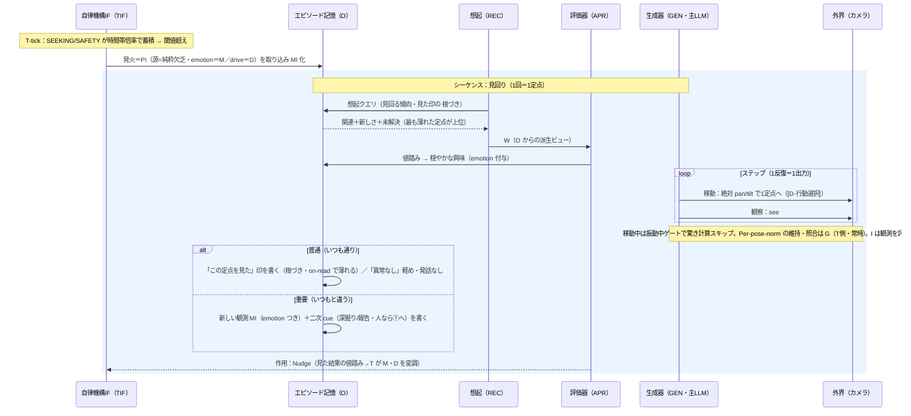

# familiar-ai ユースケース③：昼夜見回り（新フレーム）（v0.1）
 
## 目的
パジュが外的トリガなしに自分からカメラを動かして部屋を見回り、昼夜で強弱が変わる。⑤と同じ純粋欠乏型だが、出口が発話でなく**カメラ移動＋観察**で、[D-行動選択]・絶対 pan/tilt・振動中ゲート・Per-pose-norm 照合・**O→W 構築での定点選択**を通す検証ケース。
 
## 前提（確定事項の適用）
- 駆動＝**SEEKING（＋SAFETY）の純粋欠乏発火**。**行動は固定割り当てでなく、I が O の傾向＋文脈＋主LLM で選ぶ**（[D-行動選択]）。
- 動作＝**絶対 pan/tilt で1定点**へ移動して観察（[D-向き]）。移動中は**振動中ゲート（案A）**で驚き計算スキップ。
- **1回＝1定点**。全定点の巡回は複数回の見回りの積み重ねで創発。次の定点は **O→W 構築で最も薄れた印（最後に見てから一番経った）**を選ぶ（見た印は O の MI・根づき 減衰）。
- 昼夜は**③固有ルールを置かない**：頻度は drive（時間帯倍率・課題10）、発話は在席・社会的文脈（I 自前の在席・O→W）、動作は無音なので常に可。
- 記憶は **O 単一**・**W は O からの派生ビュー**（[D-記憶単一化]）、MI は最小（[D-MIモデル]）、I は純イベント駆動（[D-周期]）。
## 現状コードとの関係（【コード事実】）
- 見回り/探索に相当する欲求（`look_around`／`explore`）と idle 時のもの思いがコードにある。周辺の novelty が `look_around` をブーストする反応経路もある。本ケースは [D-行動選択] により **drive=behavior 固定から転換**し、SEEKING/SAFETY の発火＋O の傾向で行動を選ぶ形に組み直す。
- 昼夜：夜＝22〜6時。夜は低 urgency の自発行動を抑制。
- カメラの向き（pan/tilt）は [D-向き] で **AbsolutePanTilt=True 確認済み**（絶対 pan/tilt を読める・指定できる）。
- 「自分から見回り、O→W 構築で最も薄れた定点を選ぶ」完結ループは**未実装**。部品（絶対 pan/tilt・Per-pose-norm・見た印 MI の 根づき 減衰・配信ゲート）を新フレームに組み直す。
## シーケンス図（I の反復版）
 
> 注：シーケンス図は [D-I内部]／パターンB 整合（O 中心・取り込みで O 書込 → 想起で W 構築 → 評価 → 生成/動作 → O 書込）。
 

 
## 流れ
 
### シーケンス：見回り（1回＝1定点）
1. **発火（純粋欠乏）**：T-tick で SEEKING（＋SAFETY）が時間帯倍率で蓄積し、閾値超え。源＝純粋欠乏。**発火＝PI を取り込み O に MI 化**（open 意図）。
2. **W 構築＋評価（同期・案A）**：O から想起で W を組む（見た印の 根づき で**最も薄れた定点が上位に上がる**）。評価器＝見ておく価値、emotion＝穏やかな興味。**行動は固定でなく、主LLM が傾向＋文脈から見回りを選ぶ**（[D-行動選択]）。
3. **行動（1反復＝1ステップ）**：主LLM が「絶対 pan/tilt で1定点へ移動 → 観察」を実行。**移動中は振動中ゲートで驚き計算スキップ**。Per-pose-norm の維持・照合は G（T 側・常時）が担い、I は観測を評価。**1回で見るのは1定点のみ**。
4. **分岐**：
   - **普通**：**O に「この定点を見た」印**（根づき・on-read で薄れる）と「見回った・異常なし」を軽く記録、**発話なし**。定点ごとの「普通」は G が **T(G) の norm レジスタ**に反映。
   - **重要（いつもと違う）**：**新しい観測 MI（emotion つき）**を作り、**二次 cue を O に書く（別シーケンス）**＝深掘り／報告。人なら①帰宅挨拶の経路。
5. **割り込み**：見回り中に継続優先度を上回る発火（人の出現・ユーザー入力）が来たら、**境界で見回りを中断して譲る**。1ステップ中はハードに止めず、未達は O に開いた意図（[D-発火]）。
6. **閉じる／作用**：O 記録＋ TIF へ作用（見た結果の値踏み→T が M・D を変調）。**巡回は次回以降の見回りで W が次の薄れた定点を選ぶことで創発**。
## 注意点
- **1回＝1定点**。全定点の巡回は複数回の見回りの積み重ねで生まれる（一活動で全部はなめない）。
- **昼夜は③固有ルールを置かない**：頻度は時間帯倍率（課題10）、発話は在席・社会的文脈（B/W）、動作は無音なので常に可。夜は SEEKING を下げ SAFETY を上げる選択もありうる（課題10へ申し送り）。
- **驚かないために**：自分でカメラを動かすので、移動中は振動中ゲートで驚き計算をスキップ。到着後の Per-pose-norm 照合で、本当の変化だけに気づく。
- **記録の区別**：定点ごとの「普通」は **T(G) の norm レジスタ**（Per-pose-norm・定点更新）、出来事は O（追記）。**重要な発見は新しい O**。
- 純粋欠乏発火が偏らないよう、発火時の放電量と蓄積レートで間隔を調整する（不応期は置かない・課題5/10）。
## このユースケースからの要求（残課題への送り・状態付き）
- **〔確定〕Per-pose-norm 照合・更新／在席**：Per-pose-norm の維持・照合は **G（T 側・常時）が T(G) の norm レジスタ**で行い、I は触れない（[D-知覚]／[D-B分離]／[D-T同期] GMD↔レジスタ）。在席は **I 自前の判定**（[D-知覚]）。旧「課題1（同期・受け渡しの明文化）」は本件で適用済み。
- **〔確定（機構）／値は課題5〕見た定点の印・作業文脈・presence/norm 更新規則**：見た定点の印＝**O の MI**（根づき・on-read で薄れ、W 構築で薄れた順に上がる・[D-記憶単一化]／[D-MIモデル]）、作業文脈＝**O→W 構築**、presence/norm の更新規則＝**T(G) レジスタ**（[D-知覚]・別紙「設計詳細_活性・O書込・知覚在席」§3）。**W 構築の重み・値は課題5**。
- **〔未対応・課題5〕暫定値**：定点の数・角度、時間帯区切り、閾値・放電量等。
- **〔課題6-2 確定／時間帯倍率は課題10〕旧欲求名・時間帯倍率**：旧欲求名 `look_around`／`explore` → **SEEKING**（コード上の意図＝好奇心・課題6-2 確定）。**『見回り＝警戒』は欲求でなく [D-行動選択]**（SEEKING/SAFETY 発火＋O 傾向から行動選択・SAFETY の実体は self_protect）。時間帯倍率の設定は課題10。