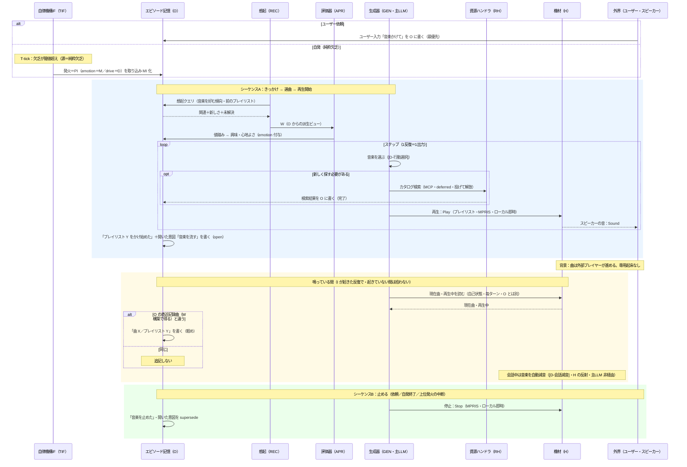

# familiar-ai ユースケース④：音楽再生（新フレーム）（v0.3）
 
## 目的
ユーザー依頼または自発で音楽（プレイリスト）を再生し、鳴っている間の曲送りを必要なだけ O に残し、会話中は自動で音量を絞る。新フレームの「**ローカル出力（MPRIS）・選曲だけ deferred・自己状態は溜めず H 読み・H の機械的反射（会話減音）・停止での簡素な終了**」を一通り通す検証ケース。発話でなく音楽が出口だが、出力は発話と同型（[D-内外境界]）。
 
## 前提（確定事項の適用）
- きっかけ＝**ユーザー依頼（最優先）＋自発（純粋欠乏発火）**の両方（[D-発火]）。
- 対象＝**プレイリスト単位**。選曲＝**主LLM が選ぶ**（[D-行動選択]）。
- 操作＝**I 側のローカル（MPRIS）**。**選曲（カタログ検索）だけ MCP・deferred**（[D-検索]）。再生・停止・音量は**ローカル即時同期**（H の直接操作＝[D-内外境界]／[D-自己状態]）。
- 現在状態（鳴っているか・曲・音量）は**溜めず H から読む**（[D-自己状態]）。持続させるのは音楽の意図・文脈（**O の開いた意図**／W 構築）だけ。
- **音量はユーザー指示のみ**。自動の音量変更は**会話中の自動減音**だけ（[D-会話減音]・H の機械的反射・主LLM 非経由）。
- 記憶は **O 単一**・**W は O からの派生ビュー**（[D-記憶単一化]）、MI は最小（[D-MIモデル]）、I は純イベント駆動（[D-周期]）。
## 段 1 の実装（2026-09-21・知-aa・`5e310d9`／`5e86a7a`／`f4be9c7`）

**鳴らす先は `spotifyd`**（OAuth でログイン・Connect の機器名「パジュ」・音は PipeWire 経由で
Yamaha へ・LAN の発見は切る・自動再生なし・初期音量 50）。操るのは **MPRIS（D-Bus）**で、
`io/music.py` が口を持つ。実機で分かった癖が 3 つある。

- **バス名は起動のたびに変わる**（`org.mpris.MediaPlayer2.spotifyd.instance<PID>`）。前方一致で探す。
- **MPRIS の口は、この機が再生中の機器になってから現れる**。無いときは `spotifyd` 自身の口
  （`rs.spotifyd…` の `TransferPlayback`）で再生をこちらへ移してから鳴らす。移した直後はまだ
  口が立っていないので、最大 3 秒待つ。
- **止めるのは `Stop` ではなく `Pause`**。`Stop` は口ごと消えるのに音の流れが残り、止めたつもりで
  鳴り続けた（Spotify 側も「どの機器も再生していない」と返して掴めなくなる）。

**鳴らす直前に機器をこちらへ**（v0.3・2026-09-21・`a730581`）。口が出ないのは「この機がまだ
再生中の機器でない」ときなので、鳴らす直前に Web API の `PUT /v1/me/player`（`play: false`）で
**音を鳴らさずに**現役にする（`io/spotify_web`）。アクセス鍵は 1 時間で切れるが、更新用の鍵で
自動的に取り直す（1 度だけ試し、駄目ならログに残して諦める。人の再承認は要らない）。
**起動時と REST では切り替えない**——家族が別の機器で聴いているのを奪わないため、頼まれた瞬間だけ
持ってくる（本人の決定）。これでスマホから機器を選ぶ手間は要らなくなった。

**プレイリストは人が書く `MUSIC.md`**（`名前：URI[：ランダム]`・機外に出さない・雛形を同梱）。
名前は言葉で呼ぶときの言い方で、「ケイマンかけて」のように含んでいれば当たる。**順番かランダムかは、
表の 3 つ目の欄が既定で、言われた言葉（「ランダムで」「順番に」）がそのつど上書きする。**
一覧は Spotify の Web API から取り込んだ（`/me/playlists`・20 件）。Web API は自分用のアプリ登録
（PKCE・秘密鍵なし）で通し、鍵は `~/.familiar_ai/spotify_token.json` に置く。なお**新しいアプリは
プレイリストの中身（曲一覧）を読めない**（403）。鳴らすのに要るのは URI だけなので段 1 には響かない。

**道具は 4 本**：`play_music`（名前・順番）・`stop_music`・`next_track`・`music_volume`。器
（`agent._music_tool`）が無い機体では渡さない。返りはそのまま伝えられる文で、できなければ断りを返す。

**鳴っているあいだは音楽の話だけを通す**（本人の決定・2026-09-21）。`agent.mic_gate_reason` に
音楽を足し、通す言葉は `core/music_rules.is_music_word`（音楽の操作と、表にあるプレイリストの名前）
が決める。**時間の道具は通さない。** 止めればふだんの状態に戻る。

**寿命は 30 分**。T の刻みが `loop/music_watch.check_music_expired` を呼び、止めて
「30 分たったから、音楽を止めるね」と言う（知らせは DIF の口を通す——T は I の中へ直接手を伸ばさない）。

**会話中の自動減音**：パジュが声を出しているあいだ音量を **4 分の 1** にし、声が終わって **10 秒**
おいて基準へ戻す（`DIF.set_music_ducker` → `music_watch.duck_while_speaking`）。基準は**そのつど
MPRIS から読む**（人が変えた値を踏み潰さない）。**絞れなくても声は出す**——最初の形は `DIF.speak` の
例外抑止の内側にあり、音楽の口が壊れると声そのものが消えた（テストが 4 件捕まえた）。

**溜めるのは 2 つだけ**（`core/music_state.MusicState`）：鳴っているという印と、鳴らし始めた時刻。
曲名・音量・鳴っているかは MPRIS から読む（[D-自己状態]）。門と寿命が即答するために、この 2 つだけを持つ。

**段 2 以降**（未着手）：曲送りの記録・自発の音楽・カタログ検索・O への書き込み。

## 現状コードとの関係（【コード事実】）
- src に**音楽機能・音楽 MCP は無い**。"sound" 系は全て発話（音声合成）／マイク入力。接続済み MCP は検索（brave/tavily）と Gmail/Calendar/Drive/Notion のみ。
- **発話中フラグ（voice_guard）は既存**＝「会話中」判定の材料に使える。
- 【事実】MPRIS はローカル制御の標準で、公式 Spotify Linux アプリ／spotifyd（`--use-mpris`）が露出する。再生・停止・音量・状態取得・楽曲メタデータ取得が可能。発話と音楽は Linux の音声サーバが混ぜて同一スピーカーから同時に出せる。
- 「自分から音楽をかけ、会話中は自動で絞る」完結ループは**未実装**。部品（MPRIS 制御・発話中フラグ・カタログ検索 MCP・O 記録）を新フレームに組み直す。
## シーケンス図（I の反復版）
 

 
## 流れ
 
### シーケンスA：きっかけ → 選曲 → 再生開始
1. **トリガ**：ユーザー依頼（最優先）か、自発（純粋欠乏発火・源＝純粋欠乏）。自発なら T-tick で欠乏が閾値超え、**発火＝PI を取り込み O に MI 化**。ユーザー依頼も **O に書く**。
2. **W 構築＋評価（同期・案A）**：O から想起で W を組む（音楽を好む傾向・前のプレイリスト）。評価器＝かける価値・どのプレイリスト、emotion＝興味・心地よさ。**行動は固定でなく主LLM が選ぶ**（[D-行動選択]）。
3. **行動（選曲）**：かけたいプレイリストが既知なら検索不要。新しく探すときだけ**カタログ検索（MCP・deferred・投げて解放）**。②と同型で結果は後のターンで拾う。
4. **行動（再生）**：プレイリストが決まったら H 経由で**再生開始（MPRIS・ローカル即時）**。外部に出るのはスピーカーの音だけ（[D-内外境界]）。
5. **A 閉じる**：「プレイリスト Y をかけ始めた」＋開いた意図「音楽を流している」を **O に書く**（**プレイリスト出来事は必ず**・open）。
### 背景：鳴っている間（専用起床なし）
6. **曲送り**は外部プレイヤーが進める。I が起きている反復で H の現在曲を読み、**O の直近記録曲（W 構築で得る）と違うときだけ**「曲 X／プレイリスト Y」を O に**軽め**追記（同じなら何もしない・次の W 構築で直近記録曲も更新される）。専用ポーリングはせず、純粋アイドル中（I が起きていない間）の曲送りは拾わないことがある（[D-周期]。O は全曲ログでなく「気づいた出来事」）。
7. **会話中の自動減音**：会話中（発話開始で ON・無発話が一定時間続いて OFF）は H が音楽の実効音量を自動で絞る（[D-会話減音]・機械的反射・主LLM 非経由）。基準音量はユーザー指示の固定値で触らず、会話終了で基準へ戻す。
### シーケンスB：止める
8. **契機**：ユーザー「止めて」（最優先）／自発終了（REST が高い・別活動へ切替など主LLM が選ぶ）／上位発火で音楽活動が境界中断（[D-発火]）。**中断も停止**で扱う（簡素化）。
9. **停止**：H 経由で停止（MPRIS）。「音楽を止めた」を O に記録し、開いた意図を supersede（終了）。
## 注意点
- **選曲（検索）だけ非同期**（[D-検索]）、再生制御（再生・停止・音量）は**ローカル即時同期**（H の直接操作＝[D-内外境界]／[D-自己状態]）。「再生」は投げると鳴り続けるが呼び出し自体は即返る。
- **現在状態は溜めない**：鳴っているか・曲・音量は必要時に H から読む（[D-自己状態]）。持続するのは音楽の意図・文脈（**O の開いた意図**／W 構築）。
- **音量はユーザー指示のみ**。自動の音量変更は会話中の自動減音だけ（[D-会話減音]）。在席連動の自動音量制御は置かない。
- **止めるは常に停止＋意図 supersede**。一時停止＋意図保持はしない（中断も停止で簡素化）。
- **O 記録の粒度**：プレイリスト出来事（かけ始め／止め／プレイリスト切替）は必ず、曲単位は変化時のみ軽め（案1・課題2/3）。
- 音楽は発話と同型の出力で、外部はスピーカーの音だけ（[D-内外境界]）。発話と同一スピーカーに混ざるため会話中の減音が要る。
## このユースケースからの要求（残課題への送り・状態付き）
- **〔確定〕O 書込の粒度・直近記録曲**：プレイリスト出来事は必ず／曲は変化時のみ軽め（案1・[D-O書込]）。**直近記録曲＝O の直近を W 構築で持つ**（W に溜めない・[D-記憶単一化]／[D-O書込]）。
- **〔未対応・課題5〕暫定値**：会話中の OFF までの「一定時間」・減音率・選曲 deferred TTL。
- **〔未対応・課題6/7〕実機・移行**：音楽 MCP 接続と MPRIS バックエンド（公式 Spotify Linux アプリ／spotifyd）の実機確認、Spotify Premium・Connect デバイス常駐の前提確認。
- **〔未対応・課題6/10〕自発音楽の欠乏・時間帯倍率**：自発音楽の発火がどの欠乏か（SEEKING/REST/BOND 等＝5欲求名は課題6）と時間帯倍率との関係（課題10）。

## 更新履歴

> v0.3：鳴らす直前の機器の切り替えと鍵の更新を足した（2026-09-21・`a730581`）。スマホで機器を選ぶ必要が無くなった。
> v0.2：**段 1 を実装した**（2026-09-21・知-aa）。spotifyd＋MPRIS・`MUSIC.md`・道具 4 本・鳴っているあいだの門・寿命 30 分・会話中の減音。実機で分かった癖（バス名が変わる・口は鳴ってから出る・止めるのは Pause）を記した。
> v0.1：初版（2026-08-29 以前）。2026-09-17 に file 名へ版を付けた（タイトルの版と揃える）。
