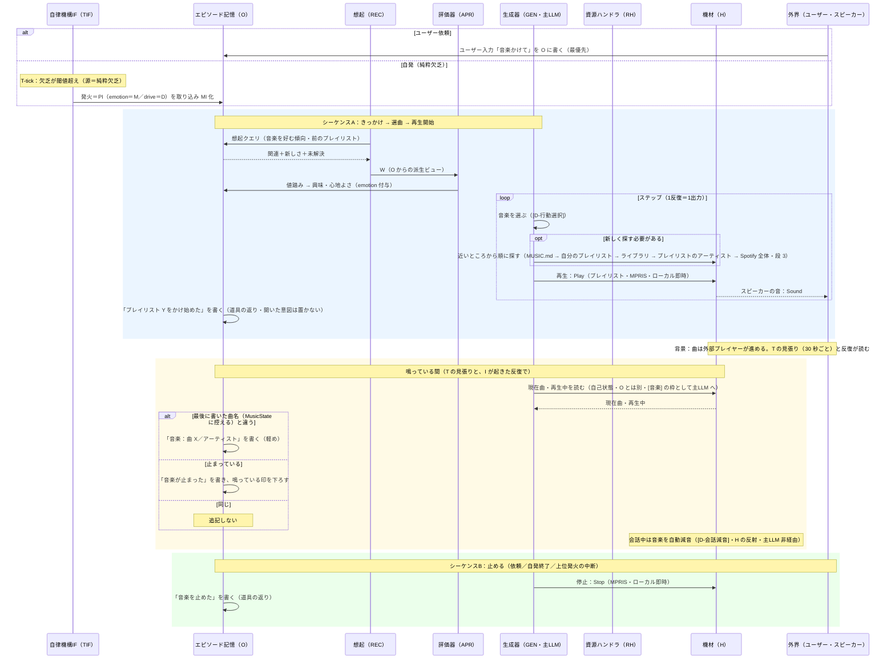

# familiar-ai ユースケース④：音楽再生（新フレーム）（v0.9）
 
## 目的
ユーザー依頼で音楽を再生し（自発では**かけない**。勧めて、返事を聞いてからかける・2026-10-02 本人の決定）、鳴っている間の曲送りを必要なだけ O に残し、会話中は自動で音量を絞る。新フレームの「**ローカル出力（MPRIS）・選曲だけ deferred・自己状態は溜めず H 読み・H の機械的反射（会話減音）・停止での簡素な終了**」を一通り通す検証ケース。発話でなく音楽が出口だが、出力は発話と同型（[D-内外境界]）。
 
## 前提（確定事項の適用）
- きっかけ＝**ユーザー依頼**。自発（欲求の発火）で**かけることはしない**（2026-10-02・本人の決定）。自発でするのは、晩に用意した 1 曲を、話しかけてよいときに「こんな曲あるけどどう？」と**勧める**ことだけ（段 4）。
- 対象＝**プレイリスト単位**。選曲＝**主LLM が選ぶ**（[D-行動選択]）。
- 操作＝**I 側のローカル（MPRIS）**。選曲（カタログ検索）は Spotify の Web API を直接引く（`io/spotify_web`・段 3。MCP・deferred にはしなかった——検索は 1 秒未満で返り、目録は晩に読んで DB に持つので待たせない）。再生・停止・音量は**ローカル即時同期**（H の直接操作＝[D-内外境界]／[D-自己状態]）。
- 現在状態（鳴っているか・曲・音量）は**溜めず H から読む**（[D-自己状態]）。持続させるのは O の記録（かけ始め・曲送り・止め）だけで、開いた意図は置かない（2026-09-30・本人の決定イ）。
- **音量はユーザー指示のみ**。自動の音量変更は**会話中の自動減音**だけ（[D-会話減音]・H の機械的反射・主LLM 非経由）。
- 記憶は **O 単一**・**W は O からの派生ビュー**（[D-記憶単一化]）、MI は最小（[D-MIモデル]）、I は純イベント駆動（[D-周期]）。
## 段 1 の実装（2026-09-21・知-aa・`5e310d9`／`5e86a7a`／`f4be9c7`）

**鳴らす先は `spotifyd`**（OAuth でログイン・Connect の機器名「パジュ」・音は PipeWire 経由で
Yamaha へ・LAN の発見は切る・自動再生なし・初期音量 50）。操るのは **MPRIS（D-Bus）**で、
`io/music.py` が口を持つ。実機で分かった癖が 3 つある。

- **バス名は起動のたびに変わる**（`org.mpris.MediaPlayer2.spotifyd.instance<PID>`）。前方一致で探す。
- **MPRIS の口は、この機が再生中の機器になってから現れる**。無いときは `spotifyd` 自身の口
  （`rs.spotifyd…` の `TransferPlayback`）で再生をこちらへ移してから鳴らす。移した直後はまだ
  口が立っていないので、最大 3 秒待つ。
- **止めるのは `Stop` ではなく `Pause`**。`Stop` は口ごと消えるのに音の流れが残り、止めたつもりで
  鳴り続けた（Spotify 側も「どの機器も再生していない」と返して掴めなくなる）。

**鳴らす直前に機器をこちらへ**（v0.3・2026-09-21・`a730581`）。口が出ないのは「この機がまだ
再生中の機器でない」ときなので、鳴らす直前に Web API の `PUT /v1/me/player`（`play: false`）で
**音を鳴らさずに**現役にする（`io/spotify_web`）。アクセス鍵は 1 時間で切れるが、更新用の鍵で
自動的に取り直す（1 度だけ試し、駄目ならログに残して諦める。人の再承認は要らない）。
**起動時と REST では切り替えない**——家族が別の機器で聴いているのを奪わないため、頼まれた瞬間だけ
持ってくる（本人の決定）。これでスマホから機器を選ぶ手間は要らなくなった。

**プレイリストは人が書く `MUSIC.md`**（`名前：URI[：ランダム]`・機外に出さない・雛形を同梱）。
名前は言葉で呼ぶときの言い方で、「ケイマンかけて」のように含んでいれば当たる。**順番かランダムかは、
表の 3 つ目の欄が既定で、言われた言葉（「ランダムで」「順番に」）がそのつど上書きする。**
一覧は Spotify の Web API から取り込んだ（`/me/playlists`・20 件）。Web API は自分用のアプリ登録
（PKCE・秘密鍵なし）で通し、鍵は `~/.familiar_ai/spotify_token.json` に置く。なお**新しいアプリは
プレイリストの中身（曲一覧）を読めない**（403）。鳴らすのに要るのは URI だけなので段 1 には響かない。

**道具は 4 本**：`play_music`（名前・順番）・`stop_music`・`next_track`・`music_volume`。器
（`agent._music_tool`）が無い機体では渡さない。返りはそのまま伝えられる文で、できなければ断りを返す。

**鳴っているあいだは音楽の話だけを通す**（本人の決定・2026-09-21）。`agent.mic_gate_reason` に
音楽を足し、通す言葉は `core/music_rules.is_music_word`（音楽の操作と、表にあるプレイリストの名前）
が決める。**時間の道具は通さない。** 止めればふだんの状態に戻る。
**ただし文頭に名前があれば何でも通す**（2026-09-30・本人の決定ア）。

**寿命は 30 分**。T の刻みが `loop/music_watch.check_music_expired` を呼び、止めて
「30 分たったから、音楽を止めるね」と言う（知らせは DIF の口を通す——T は I の中へ直接手を伸ばさない）。

**会話中の自動減音**：パジュが声を出しているあいだ音量を **4 分の 1** にし、声が終わって **10 秒**
おいて基準へ戻す（`DIF.set_music_ducker` → `music_watch.duck_while_speaking`）。基準は**そのつど
MPRIS から読む**（人が変えた値を踏み潰さない）。**絞れなくても声は出す**——最初の形は `DIF.speak` の
例外抑止の内側にあり、音楽の口が壊れると声そのものが消えた（テストが 4 件捕まえた）。

**溜めるのは 3 つだけ**（`core/music_state.MusicState`）：鳴っているという印と、鳴らし始めた時刻と、
最後に O に書いた曲名（段 2 で足した）。いまの曲名・音量・鳴っているかは MPRIS から読む（[D-自己状態]）。
印と時刻は、門と寿命が即答するために持つ。最後に書いた曲名は、機器の状態の写しではなく、ループが O に
書いた事実の控えである（曲が変わったときだけ書くため・本人の決定イ）。

## 段 2 の実装（2026-09-30・知-aa・`8cc7ac8`／`9b77c81`）

**MPRIS を読むのは 1 か所**（`loop/music_watch.observe`）で、T の見張り（30 秒ごと）と反復の両方が呼ぶ。
黙って聴いているあいだの曲も残すため、T の見張りでも読む（本人の決定イ。設計の「専用の見回りはしない」を
改めた。見張りは 30 分の寿命のためにもともと 30 秒ごとに回っていた）。読んで分かったことで 2 つを決める。

- **曲送り**：最後に書いた曲名と違えば、「音楽：曲 X／アーティスト」を O に書く。プレイリスト名は
  MPRIS が返さないので入れない（かけ始めの記録「「ケイマン」をかけ始めた」に残っている）。
- **鳴り終わり**：「鳴っている」の印が立っているのに止まっていれば（口が無いときも）、印を下ろして
  「音楽が止まった」を O に書く。声の入口の門が開き、30 分の「止めるね」は言わない。声には出さない。

記録は求めを立てない口（`DIF.record`／`note_device`）で書く。曲が変わるたびに考え始めないためである。
**読めないときは何もしない**——機器は落ちる前提で、読めないことを「止まった」とは見ない。

**いまの曲を主LLM へ渡す**：鳴っているあいだ、`[音楽] 曲名／アーティスト（音量 N%）` をタイマーの枠と同じ
場所に置く（`_music_now` が反復ごとに読む）。「パジュ、いま何の曲？」に答えられる。

**開いた意図は置かない**（本人の決定イ）。「いま鳴っている」は `[音楽]` の枠が毎回 MPRIS から読んで渡し、
過去はかけ始め・曲送り・止めの記録が O に残る。開いた意図は閉じそこねると鳴っていないのに W に残る。

## 段 3 の実装：近いところから順に探してかける（2026-10-01〜02・知-aa・`614a276`／`b1ace82`）

正解はあなたが作ったプレイリストや、そこに入っているアーティストであることが多い（本人：ケイマンの正解は自分の
プレイリスト）。そこで Spotify 全体をいきなり探さず、`play_music` が**近いところから順に**探す。

1. `MUSIC.md`（表記ゆれを均して照らす：けいまん → ケイマン。名前の判定と同じゆるい読み）
2. 自分のプレイリスト（名前で）
3. 自分のライブラリ（保存したアルバムと曲）
4. プレイリストに入っている曲と、アーティスト（アーティストは検索して、名前がぴったり合う人を選ぶ）
5. Spotify 全体の検索（主LLM が「曲・アーティスト・アルバム・プレイリスト」を指す。プレイリストとライブラリに
   居るアーティストの結果を先に選ぶ）

返りで何をどこから見つけたかを言う（「ライブラリに無かったので、Spotify から探した「Lemon」（米津玄師）をかけ始めた」）。

**プレイリストの中身は晩に読む**（本人の決定ア）。REST が自分の Spotify のプレイリストの中身と保存したアルバムと
曲を読み直し、DB（`agent_state` の `music_catalog`・`core/music_catalog`）に持つ。読めなかったプレイリストは前の
中身を残す。中身は**新しい口 `/playlists/{id}/items`** で読む——古い口 `/playlists/{id}/tracks` は、自分で作った
プレイリストでも 403 だった（実機 2026-10-01）。ジャンル・関連アーティスト・おすすめの口は使えない（ジャンルの欄が
無い・403・404）。Spotify を呼ぶのは `io/spotify_web.Spotify` だけ。

## 段 4 の実装：音楽を勧める（2026-10-02・知-aa・`f3ea732`／`5fcf0ea`）

自分で**かける**ことはしない（本人：こわい）。晩に 1 曲だけ用意し、話しかけてよいときに勧め、返事を聞いてからかける。

- **候補を作る**（REST の晩・1 晩 1 件・本人の決定）：フルLLM に、プレイリストのアーティスト（多い順）・気に入って
  もらえた曲・断られた曲を渡し、プレイリストに入っていない曲を 1 つ理由つきで選ばせる（その人の別の曲でも、似た
  テイストの人でも）。おすすめの API が無いので、似たテイストはフルLLM の知識で選ぶ。機械が検索で曲名と
  アーティストの両方が合うことを確かめ、プレイリストにある曲・前に勧めた曲・断られた曲を除く。候補が残っていれば
  作らない。
- **勧める**（1 日 1 回まで・本人の決定）：bond・esteem の発火（話しかけてよいとき）で、その日にまだ勧めていなければ、
  主LLM のシステム文に `[音楽のおすすめ]`（曲名・アーティスト・理由）を載せる。「こんな曲あるけどどう？」と聞くかは
  主LLM が決める。声にした返事に曲名が入っていたら、機械が勧めた印をつける。
- **返事**：勧めた日の会話では何を勧めたかを載せ、主LLM が `music_suggestion_reply` で受ける。「気に入った」ならかけて
  気に入った曲に控え（次の候補の材料になる）、「いらない」ならその曲は二度と勧めない（アーティストは避けない）。
  返事が無いまま 2 回勧めた候補は捨てて、晩に次を用意する。
- 持つもの：DB（`agent_state` の `music_suggestion`・`core/music_suggestion`）に、候補・最後に勧めた日・気に入った曲・
  断った曲・前に勧めた曲。

## 鳴らせるようにした直し（2026-10-07・知-ak・`9bd544f`／`bbc5d0e`／`df130a6`）

実機 2026-10-07 12:59、「ケイマンをランダムでかけて」で鳴らなかった。原因は 3 つあった。

- **音楽が「いま使えない」に載っていた**：`capabilities.yaml` の音楽の項目は `enabled_tool: play_music` だが、いま取れる
  道具を数える `capability_state.live_tool_names` が MCP の道具しか数えていなかった。システム文に
  `[いま使えない] play_music` が載り、主LLM は `play_music` を呼ばずに「音楽の機能が使えない」と答えた。いまは
  エージェントの `_…_tool` のうち定義を返すもの（音楽・タイマー・アラーム・ストップウォッチ・記憶）も数える。
  REST の層 4（能力の要約）も同じ数え方なので、要約にも音楽が載る。
- **spotifyd が立っていなかった**：手で起動する決まりだった。いまはパジュが立ち上げる（`io/spotifyd.py`）。
  - 起動時：音楽の器があれば、居なければ `spotifyd --no-daemon --config-path <SPOTIFYD_CONFIG>` で立ち上げる（待たない）。
  - `play_music` の前：居なければ立ち上げ、機器「パジュ」が Spotify に見えるまで 1 秒おきに最大
    `MUSIC_SPOTIFYD_WAIT_SEC`（10 秒〔仮〕）待つ。もう居れば待たない。
  - 居るかはプロセスで見る（自分で立てたものはその手綱、ほかは `pgrep -x spotifyd`）。MPRIS の口は機器が現役に
    なってから出るので、待機中は見えない。
  - 終了時は自分で立てたものだけを止める。人が立てたものには触らない。本体は PATH → `~/.local/bin/spotifyd` の
    順に探し、無ければ警告を残して「かけられなかった」と返す。
- **主LLM の呼び出しが拾われていなかった**（13:28・上の 2 つを直したあと）：主LLM は `play_music` を呼んだが、求めは
  「沈黙」で閉じた。主LLM の道具の呼び出しのうちループが拾うのは `_LOOKUP_ACTIONS` の名前だけで、音楽の 5 つが
  載っていなかった。音楽を実行する口（`_run_lookup`）へ届くのは、調停（Jev）が動作として選んだときだけだった。
  いまは 5 つを載せ、タイマーと同じ道（`_start_lookup` → 完了 → 次の反復）を通る。

## 現状コードとの関係（【コード事実】・2026-09-30）
- 段 1 は実装済み（上の節）。口は `io/music.py`（MPRIS）と `io/spotify_web.py`（機器の切り替え）、道具は `tools/music.py`、決まりは `core/music_rules.py`、溜める印は `core/music_state.py`、寿命と減音は `loop/music_watch.py`。音楽 MCP は無い。
- **鳴っているあいだの門は声の入口にある**（`realtime_stt_session._passes_gate`）。通すのは、文頭に名前（「パジュ」）がある言葉と、音楽の操作と、表にあるプレイリストの名前。名前つきなら何でも通す（「パジュ、いま何の曲？」「パジュ、3 分測って」・2026-09-30・本人の決定ア）。名前は GUI が声の入口へ差し込む（`set_agent_names`）。
- **音楽の操作の言葉にも名前が要る**（2026-09-30・本人の決定）。声の入口の門を通った言葉も、そのあと窓の門（`_swallow_if_unheard`）を通る。名前で開いた窓（30 秒）の中なら名前は要らない。タイマーの操作と同じ扱い（`設計方針_話していいかの決まり` §2.4）。
- アプリを通して鳴らしたことはまだ無い（2026-09-20 以降のログに `play_music` は 0 件）。`spotifyd` は、2026-10-07 からパジュが起動時と `play_music` の前に立ち上げる（上の節）。
- 曲送りの記録・鳴り終わり・`[音楽]` の枠は段 2、カタログ検索は段 3、勧めることは段 4 で実装した（上の節）。自分から音楽を**かける**ことは作らない（本人の決定）。
## シーケンス図（I の反復版）
 

 
## 流れ
 
### シーケンスA：きっかけ → 選曲 → 再生開始
1. **トリガ**：ユーザー依頼。自発（欲求の発火）では**かけない**（2026-10-02・本人の決定）。自発でするのは勧めることだけ（段 4）。ユーザー依頼は **O に書く**。
2. **W 構築＋評価（同期・案A）**：O から想起で W を組む（音楽を好む傾向・前のプレイリスト）。評価器＝かける価値・どのプレイリスト、emotion＝興味・心地よさ。**行動は固定でなく主LLM が選ぶ**（[D-行動選択]）。
3. **行動（選曲）**：近いところから順に探す（段 3）。手元（`MUSIC.md`・晩に読んだ目録）に無いときだけ Spotify の Web API で探す（1 秒未満・その場で返る）。
4. **行動（再生）**：プレイリストが決まったら H 経由で**再生開始（MPRIS・ローカル即時）**。外部に出るのはスピーカーの音だけ（[D-内外境界]）。
5. **A 閉じる**：「プレイリスト Y をかけ始めた」を **O に書く**（**プレイリスト出来事は必ず**・道具の返り。開いた意図は置かない）。
### 背景：鳴っている間（T の見張りと反復）
6. **曲送り**は外部プレイヤーが進める。T の見張り（30 秒ごと）と、I が起きている反復で H の現在曲を読み、**最後に書いた曲名と違うときだけ**「音楽：曲 X／アーティスト」を O に**軽め**追記する（同じなら何もしない）。黙って聴いているあいだの曲も残る。止まっていれば「音楽が止まった」を書き、鳴っている印を下ろす。
7. **会話中の自動減音**：会話中（発話開始で ON・無発話が一定時間続いて OFF）は H が音楽の実効音量を自動で絞る（[D-会話減音]・機械的反射・主LLM 非経由）。基準音量はユーザー指示の固定値で触らず、会話終了で基準へ戻す。
### シーケンスB：止める
8. **契機**：ユーザー「止めて」（最優先）／自発終了（REST が高い・別活動へ切替など主LLM が選ぶ）／上位発火で音楽活動が境界中断（[D-発火]）。**中断も停止**で扱う（簡素化）。
9. **停止**：H 経由で停止（MPRIS）。「音楽を止めた」を O に記録する（道具の返り）。
## 注意点
- **選曲（検索）だけ非同期**（[D-検索]）、再生制御（再生・停止・音量）は**ローカル即時同期**（H の直接操作＝[D-内外境界]／[D-自己状態]）。「再生」は投げると鳴り続けるが呼び出し自体は即返る。
- **現在状態は溜めない**：鳴っているか・曲・音量は必要時に H から読む（[D-自己状態]）。持続するのは O の記録だけ（開いた意図は置かない）。
- **音量はユーザー指示のみ**。自動の音量変更は会話中の自動減音だけ（[D-会話減音]）。在席連動の自動音量制御は置かない。
- **止めるは常に停止**。一時停止＋再開はしない（中断も停止で簡素化）。
- **O 記録の粒度**：プレイリスト出来事（かけ始め／止め／プレイリスト切替）は必ず、曲単位は変化時のみ軽め（案1・課題2/3）。
- 音楽は発話と同型の出力で、外部はスピーカーの音だけ（[D-内外境界]）。発話と同一スピーカーに混ざるため会話中の減音が要る。
## このユースケースからの要求（残課題への送り・状態付き）
- **〔確定〕O 書込の粒度・直近記録曲**：プレイリスト出来事は必ず／曲は変化時のみ軽め（案1・[D-O書込]）。**直近記録曲は `MusicState.last_title` に控える**（2026-09-30 に「O の直近を W 構築で持つ」から改めた・本人の決定イ）。
- **〔未対応・課題5〕暫定値**：会話中の OFF までの「一定時間」・減音率・選曲 deferred TTL。
- **〔未対応・課題6/7〕実機・移行**：音楽 MCP 接続と MPRIS バックエンド（公式 Spotify Linux アプリ／spotifyd）の実機確認、Spotify Premium・Connect デバイス常駐の前提確認。
- **〔取り下げ・2026-10-02〕自発音楽の欠乏・時間帯倍率**：自発でかけることはしない（本人の決定）。代わりに、話しかけてよいとき（bond・esteem）に勧める（段 4）。

## 更新履歴

> v0.9：鳴らせるようにした直しに 3 つめの原因を足した（2026-10-07・知-ak 段 3・`df130a6`）。主LLM の音楽の呼び出しを拾う一覧に音楽の 5 つが無く、`play_music` が捨てられて沈黙で閉じていた。
>
> v0.8：鳴らせるようにした直しを足した（2026-10-07・知-ak）。いま取れる道具にアプリ自身の道具も数え、`[いま使えない] play_music` を消した。spotifyd をパジュが立ち上げる（起動時と `play_music` の前・最大 10 秒〔仮〕待つ・自分で立てたものだけ止める）。
>
> v0.7：**段 3（近いところから順に探してかける・プレイリストの中身を晩に読む）と段 4（音楽を勧める）を実装した**（2026-10-01〜02・知-aa）。自発でかけるのはやめた（本人の決定）。選曲は MCP でなく Web API を直接引く。
> v0.6：**段 2 を実装した**（2026-09-30・知-aa）。曲送りと鳴り終わりを O に残し、T の見張りでも読む。`[音楽]` の枠を主LLM へ渡す。溜めるのは 3 つ（最後に書いた曲名を足した）。開いた意図は置かない（本人の決定イ）。
> v0.5：鳴っているあいだも、文頭に名前があれば何でも通すことを書いた（2026-09-30・本人の決定ア）。
> v0.4：「現状コードとの関係」を段 1 の実物に合わせて書き直した。音楽の操作の言葉にも名前が要ることを書いた（2026-09-30・知-aa・本人の決定）。
> v0.3：鳴らす直前の機器の切り替えと鍵の更新を足した（2026-09-21・`a730581`）。スマホで機器を選ぶ必要が無くなった。
> v0.2：**段 1 を実装した**（2026-09-21・知-aa）。spotifyd＋MPRIS・`MUSIC.md`・道具 4 本・鳴っているあいだの門・寿命 30 分・会話中の減音。実機で分かった癖（バス名が変わる・口は鳴ってから出る・止めるのは Pause）を記した。
> v0.1：初版（2026-08-29 以前）。2026-09-17 に file 名へ版を付けた（タイトルの版と揃える）。
