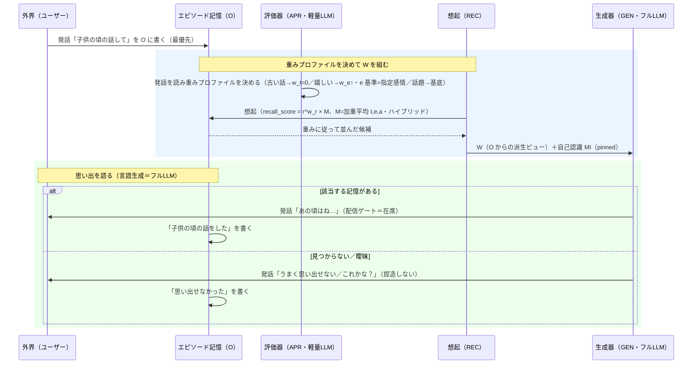

# familiar-ai ユースケース⑥：記憶を問う対話（想起の重みプロファイル切り替え）（v0.2）

> v0.2：残課題を実装実態へ更新。ハイブリッド5軸合成（r/t/e/a/p）＋e 軸接続＋基底重み (1,1,1,1.5,1.0) は実装済みで、残るは評価器が発話から重みプロファイルを可変に出す部分だけ。基底プロファイルの「現コードとは非一致」を一致済みへ訂正。
 
> v0.1：想起の重みプロファイルを5軸 (w_r,w_t,w_e,w_a,w_p)（在席者相関 p を含む・[D-在席相関]）へ更新。以降版番号で管理。
 
## 目的
ユーザーが記憶を問う（「昔こんな事あったよね？」「嬉しかったこと思い出して」「子供の頃の話」）とき、W 構築の主役は **vector 関連とは限らない**。想起合成の **重みプロファイル**を発話に応じて切り替え、関連・感情一致・新しさのどれを効かせる／無効化するかを変えて W を作る検証ケース。[D-想起合成] のハイブリッド合成・重みプロファイル（w_r は関連ゲート／w_t,w_e,w_a,w_p は加算部係数・w=0 で当該項を外す／w>1 で強調・w_p は在席者相関＝[D-在席相関]）と、感情一致の基準切り替えを一通り通す。
 
**記憶を問う/語る動機には BOND・ESTEEM がある**：思い出を共有して関わりたい（BOND）、**過去に役立った自分（うまくやれた・頼られた出来事）を思い出す**ことで有能感・自尊を確かめたい（ESTEEM）。ユーザーからの問いだけでなく、パジュ自身が純粋欠乏（BOND/ESTEEM）でこうした想起を始めることもある。
 
## 前提（確定事項の適用）
- 起動＝**機器イベント（ユーザー発話）**。発話も専用扱いせず統一関数（[D-発話]）。
- 想起＝[D-想起合成] `recall_score = r^(w_r) × M`（M＝(w_t·t+w_e·e+w_a·a+w_p·p)/(w_t+w_e+w_a+w_p)＝加重平均・ハイブリッド＝関連だけ乗算ゲート）。**重みプロファイル (w_r,w_t,w_e,w_a,w_p) は seed が運ぶ**（既定＝**基底プロファイル** (1,1,1,1.5,1.0)→在席者がいる間は r·(t+e+1.5a+p)/4.5、在席者ゼロは p を外し (1,1,1,1.5)・コードと一致（`recall_w_p`／`recall_presence_expand`）。w_p は在席者相関＝[D-在席相関]）。
- **重みの決定＝評価器（軽量LLM）**が発話を読んで差し替える（構造化出力・[D-反復出力]）。
- **感情一致 e の基準は seed が決める**：感情を問う発話では「発話が指定した感情価」を評価器が抽出（情動発火時の基準＝自分の M とは別）。
- 1反復＝1出力（[D-反復出力]）／記憶は **O 単一**・**W は O からの派生ビュー**（[D-記憶単一化]）／MI 最小（[D-MIモデル]）。
- 言語生成は**フルLLM（生成器）**、重み決定・値踏みは**軽量LLM（評価器）**（[D-I内部]）。
## 三つの問いの型と重みプロファイル（層3＝1ターン上書きの例）
**重みプロファイルは3層で決まる（[D-プロファイル調整]）**：層1 既定（基底 (1,1,1,1.5)）▷ 層2 Config（REST のみ更新）▷ **層3 1ターン上書き**（下表）。層3 は**同ターンには効かず次の1ターンの想起から適用**し、その次は自動で消える（継続はフルLLM が再指定）。調整はシステムプロンプト（自己認識 MI）のルールに従い評価器が組む。
 
| 問い | 主軸 | 1ターン上書き (w_r,w_t,w_e,w_a,w_p) | 効果 |
|---|---|---|---|
| 「昔○○の話したよね？」 | 関連 | (1,1,1,1.5)＝基底 | ○○の話題語で普通の関連想起 |
| 「嬉しかったこと思い出して」 | 感情一致 | 例：(0,1,2,1)・e 基準＝「嬉しい＝高 P」 | 話題語が無く、**指定感情**で引く（w_e を上げ、w_r を落とす） |
| 「子供の頃の／古い話を」 | フラット（新しさを消す） | (1,0,0,1) | **新しさを無効化**（w_t=0）し、古い記憶も時間で沈まない |
 
（重みの具体値は課題5。上表は効かせ方の例。）
 
## シーケンス（パターンB・[D-I内部] 整合）
 

 
## 流れ
1. **トリガ＝ユーザー発話**（機器イベント・最優先）を O に書く。
2. **重みプロファイル決定（評価器・軽量LLM）**：発話を読み、(a) 話題語があれば**基底**（関連主）、(b)「嬉しい／悲しい」等の感情語があれば **w_e を上げ、e の基準＝その感情価**、(c)「昔／子供の頃／古い」等の時期語があれば **w_t=0**（新しさ無効＝フラット）。
3. **W 構築（想起）**：決まった重みで `recall_score` を計算して W を組む。**自己認識 MI は pinned で常時含む**。
4. **言語生成（フルLLM）**：W の記憶を踏まえて思い出を語る。**配信ゲート＝在席**（目の前のユーザーに話す）。
5. **O 書込**：「○○の話をした／思い出せなかった」を書く。**open 意図は立たない**（その場で完結＝1反復1出力）。
## 注意点
- **重みは関数を変えず効く**（[D-想起合成]）。新しい想起機構は足さない。**w_r は関連ゲートの指数**（w_r=1 そのまま・w_r=0 で無効化）、**w_t,w_e,w_a は加算部 M の加重平均係数**（w=0 で当該項を外す・w>1 で加重増）。
- **正規化が前提**：各素点 r/t/e/a をおおむね 0〜1 に揃える。e（PAD 距離の 0〜1 化）と a（≥0・上限 C）の正規化規約は課題5。
- **w_t=0 はフラット化**（新しさを消す）。さらに「**古いほど上**」にしたい場合は新しさを反転した素点が要る（まずはフラットで足りるか＝課題5）。
- **捏造しない**：該当記憶が無い／曖昧なときは、フルLLM が「思い出せない／これかな？」と返す（無い記憶を作らない）。
- **感情一致の基準切り替え**（自分の M ↔ 発話が指定した感情価）は [D-想起手がかり] の一般化。
- 発話は専用扱いしない（[D-発話]）。重みづけ・社会的値踏みは評価器/調停側で、想起関数は3起動源で共通。
## このユースケースからの要求（残課題への送り・状態付き）
- **〔確定〕重みプロファイル**：ハイブリッド（関連ゲート r^(w_r)×加重平均 M）・基底 (1,1,1,1.5)→r·(t+e+1.5a)/3.5・w=0 で当該項を外す・w>1 で強調＝[D-想起合成]。**3層調整**（既定▷Config[REST のみ]▷1ターン上書き[同ターン不可・次1ターンのみ・継続はフルLLM]）＝[D-プロファイル調整]。自己認識 MI は核（read-only）と Config（範囲内・REST 更新）に分離＝[D-自己認識分離]。感情一致 e の基準は seed が決める（[D-想起手がかり]）。
- **〔未対応・課題5〕値・正規化**：各重み値、r/t/e/a の正規化規約（0〜1 化）、e（PAD 距離→近さ）と a の正規化、「古いほど上」の反転素点の要否。
- **〔一部実装済み〕**：ハイブリッド5軸合成（関連ゲート×加重平均・r/t/e/a/p）は実装済み（`_score_breakdown`・基底重み固定 (1,1,1,1.5,1.0)）。**残るは評価器が発話から重みプロファイルを可変に出す部分**（プロンプト／構造化スキーマで seed が重みを運ぶ・課題6/8）。