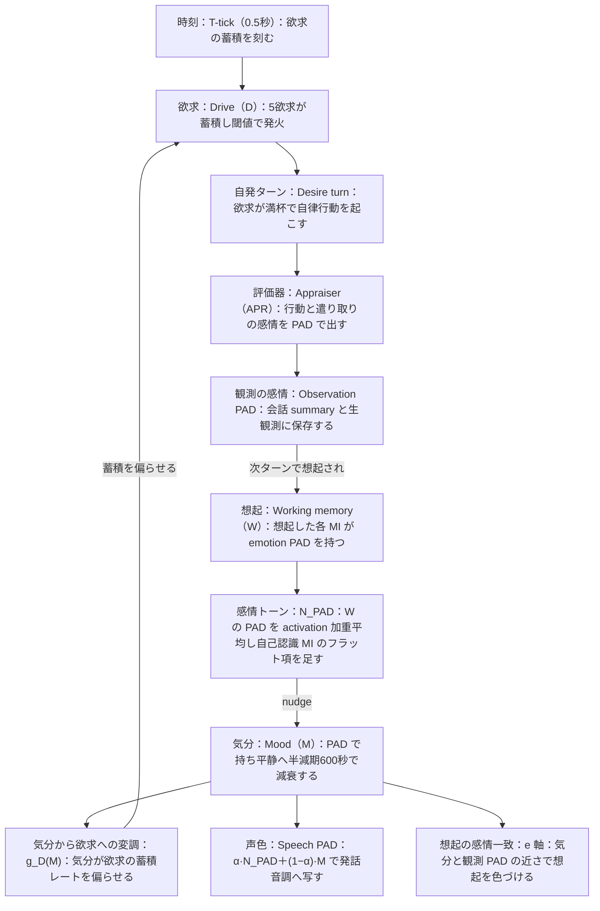

# familiar-ai 感情ループ全体像（v0.5）

## このループの起動源は Drive である

自律の駆動は、ユーザー入力でも評価器でもなく、**Drive（5欲求）の時間蓄積と発火**である。欲求は毎 T-tick（0.5秒）で蓄積し、閾値で発火して自発ターン（自律行動）を起こす。行動が観測を生み、観測の感情が想起を通じて気分を動かし、気分がふたたび欲求の蓄積を偏らせる。この一巡がユーザーの有無に関わらず回り続ける。

**気分 M の最重要の効き先は Drive の変調 `g_D(M)`** である。気分は「どの欲求が募りやすいか」を左右し、それが次に何をするかを決める。声色や想起（e 軸）への効きは、この Drive 変調に次ぐ出口である。

## 全体ループ

核となる自律ループは、時刻が欲求を溜め（`T → D`）、満杯で発火して行動し（`D → FIRE`）、行動の感情を評価器が PAD で出し（`FIRE → EVAL → OBS`）、それが想起されて作業記憶に入り（`OBS → W`）、W の感情トーンが気分を nudge し（`W → NPAD → M`）、気分が欲求の蓄積を偏らせて次の発火を左右する（`M → g_D(M) → D`）という一巡である。

## 各辺の意味

- **`T → D`（蓄積）**：`drive_i ← clip(drive_i + rate·mult_i(t)·learn_i·g_D,i(M)·P_T, 0, 1)`。全欲求共通のレートに、時間帯倍率と学習倍率と気分変調がかかる（発火/mood 別紙 §2.1）。
- **`D → FIRE`（発火）**：`drive_i` が閾値 Θ_fire（≈1）を超えると発火し、放電で drive をほぼ0へ戻す。D が動く原則経路は「発火時の放電」と「M→D 変調」の2つで、I は drive を直接増減しない（§2.4・§2.5）。例外として、間接鎮静（M→D）が現状効いていないため、ターン完了時に軽量LLMが満たされた drive を発火時と同じ全放電で沈静化する明示ルートを実装済み（既定 off・ゲートは drive 値でなく W/MI・E・行動から作る・発火mood §2.5(3)）。
- **`FIRE → EVAL → OBS`（感情の生成）**：評価器（軽量LLM）が現ターンの遣り取りを P/Pn/Dom で評価する。A（喚起）は機械値で、**a0 と同じく seed 種別で作る（内容系＝novelty＝1−近傍K件の類似度平均／カメラ起点＝見え驚き Ŝ）＝keyword ではない**。値踏みゲート A_gate=0.25 未満は評価器を呼ばず P/Pn/Dom を気分 M のまま置く。評価器は W を入力にとらず、気分をベースに現ターンから感情を出すので、記憶が無くても感情は生まれる。
- **`OBS → W`（想起・1ターン遅れ）**：現ターンの感情は記憶として保存され、**次ターン以降に想起されて初めて** W に入り気分に効く。現ターンの感情が同じターンの気分を動かす直接の経路は無い。
- **`W → NPAD → M`（nudge）**：`N_PAD = (Σ a_i·PAD_i + C·self_pad)/(Σ a_i + C)`（C＝自己認識 MI の重み0.5・Config／self_pad＝自己認識 MI の emotion・既定中立で REST 書換可）を作り、`A_M ← max(A_M, A_N)`／`X_M ← X_M + A_N(X_N − X_M)`（X＝P,Pn,Dom）で気分を動かす。覚醒が高いほど強く引かれる。C は旧・activation 上限2.0 の流用をやめ、支配しない薄い錨へ是正（根拠台帳 §12）。
- **`M → g_D(M) → D`（気分による欲求変調）**：`g_D,i(M) = logistic(logit(b_i) + Σ_j C_ij·logit(x_j))`。中立気分では `g = b_i`（中立発火頻度）。気分が充足方向なら当該欲求の蓄積が細り、実質のリークになる（§2.2・§2.3）。
- **`M → VOICE`（声色）**：声色 PAD ＝ α·N_PAD ＋(1−α)·M（α=0.7・N_PAD 寄り）で発話音調へ写す（課題5 v0.19）。
- **`M → RECALL`（e 軸）**：気分と観測 PAD の一致 e を想起スコアへ入れ、気分に近い記憶を上位に寄せる。

## 実装状況

| 辺・要素 | 状態 |
|---|---|
| 評価器の PAD 出力（`FIRE → EVAL → OBS`） | 実装済み（W2b-2） |
| 観測 PAD の保存（OBS） | 実装済み（W1a/W1b/W2a/W2b） |
| W の PAD 露出（`OBS → W`） | 実装済み（mood-b・recall が PAD と activation を返す） |
| N_PAD と nudge の純関数（`W → NPAD → M`） | 実装済み（mood-a） |
| nudge のターン接続（M を実際に動かす・`W → NPAD → M`） | 実装済み（mood-c・`load_current_mood` が実 mood を返す） |
| **`M → g_D(M) → D`（気分による欲求変調）** | **未実装**（`drive_register.py` は器のみ・B-2・dynamics 未着手） |
| Drive の蓄積 dynamics・発火 | 未実装（現在の自律駆動は legacy `DesireSystem`） |
| `M → VOICE`（声色） | 未実装（[D-知覚]・TTS） |
| `M → RECALL`（e 軸をスコアへ） | 実装済み（スライス3・合成をハイブリッド化し `_compute_final_score` が e を加算部の一項として使う） |

気分 M の最重要の効き先である `g_D(M)`（Drive 変調）は未実装のままである。ただしスライス3 で e 軸が繋がったので、M が live に出る先は評価器のベースと想起順の2つになった。声色と Drive 変調が繋がって初めて、気分が振る舞い全体に滲む。

なおこの未実装は設計の遅れではなく順序方針である（段取り v0.24）。起動源＝Drive 発火・dynamics 接続は「大きな挙動変化は後回し」に該当し、意図的に後ろへ置く。**当面 感情ループは受け身のまま**（ユーザー入力に応じて A＝novelty で評価器が起動し mood が動く経路までが生きている）。自律側の起動源は、リファクタリングと土台の後に繋ぐ。

## レガシー（移行期のみ）

- **文字列 mood**（`agent.py` の `_mood`／`_decayed_mood`）と `AffectiveState`：現在は応答プロンプトに出るが、Phase 6 で撤去する（課題8 v0.18）。上図の M はこの文字列 mood を置き換える新表現である。
- **legacy `DesireSystem`（15欲求）**：現在の自律駆動。新5欲求 `AiDrivers` の dynamics が入る段で置き換える。

---

## 更新履歴

> v0.5：実装状況の末尾に、順序方針（段取り v0.24）で起動源＝Drive 発火を意図的に後回しにしていることを明記。当面 感情ループは受け身のまま（大きな挙動変化は後回しとする戦略の代償）。
> v0.4：機械 A の源と自己認識 MI の重み/emotion を実装と設計に合わせて訂正。**A（喚起・機械値）は a0 と同じく seed 種別で作る＝内容系は novelty／カメラは見え驚き Ŝ**（keyword ではない・課題5 v0.25 で明確化）。`W → NPAD → M` の自己認識 MI は、旧・activation 上限2.0 の流用をやめ**重み0.5（Config）＝支配しない薄い錨**へ是正し、その emotion は **agent_state に置き REST が書き換える**（既定中立・W が空のときのデフォルト感情・根拠台帳 §12）。
> v0.3：スライス3（e 軸のスコア接続）を実装済みへ更新。想起スコアが純積からハイブリッド合成へ替わり、`M → RECALL` が繋がった。気分と観測 PAD の一致 e が加算部の一項として効くので、いまの気分に近い感情を持つ記憶が上位へ寄る（気分一致想起）。残る mood の効き先は `g_D(M)`（Drive 変調・未実装）と声色（未実装）である。
> v0.2：mood-c（W→N_PAD→M の nudge のターン接続）を実装済みへ更新。`load_current_mood` が実 mood を返し始めた。残る mood の効き先は `g_D(M)`（Drive 変調・未実装）・声色（未実装）・e 軸（スライス3）。
> v0.1：感情と気分と欲求が閉じる自律ループの全体像を一枚に固定する。起動源は **Drive（欲求）** の時間蓄積と発火であり、W→mood→想起はその下流であることを明記する。個々の機構の詳細は課題5・発火/mood 別紙・MIデータモデルにあるが、それらが**どう一つのループを成すか**の見取り図はここを正本とする。関連コード（mood・drive・評価器・想起）を触る前にこの図で位置づけを確かめる。
