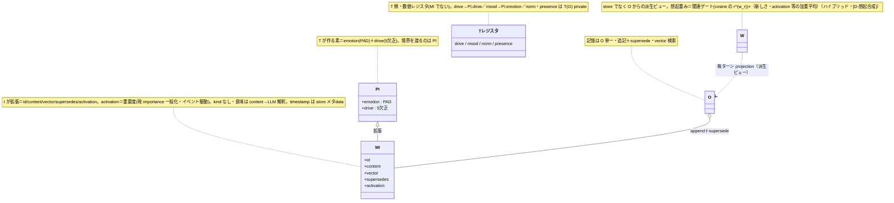
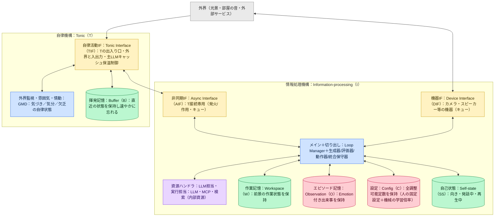
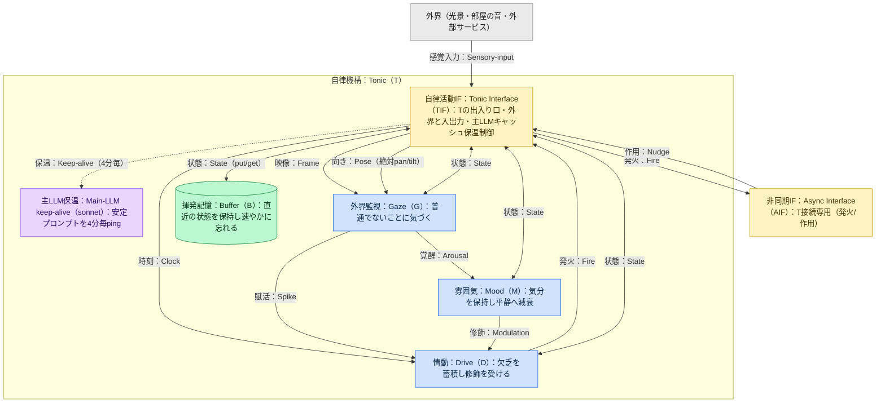
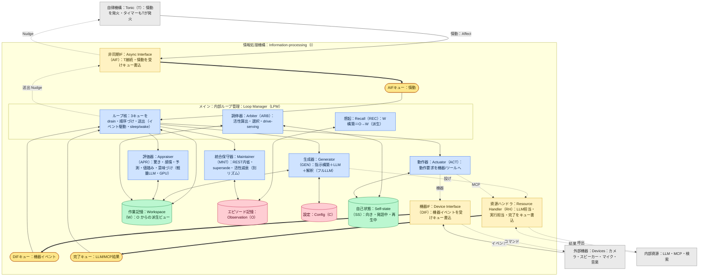
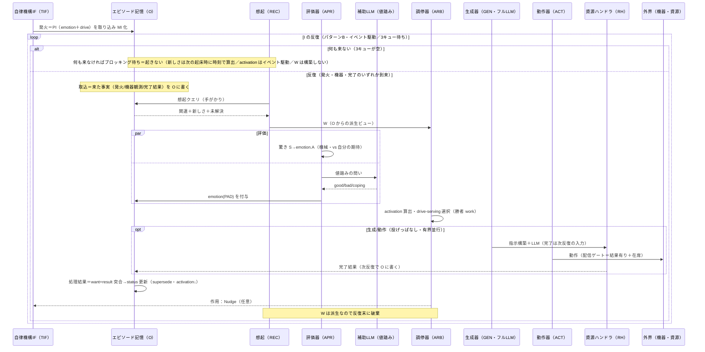

# familiar-ai 設計図（Mermaid一式・v0.38）

> v0.38 改訂（Phase 1 段階C C-1＝観測想起の所有者絞りを situated 相関へ）：所有者絞りでなく situated 相関で観測を読む dumb な層 `_read_observations_by_situated` を新設（第一段・未接続・新規テスト10件）し、`recall_day_summaries` をその層へ付け替えて `observations.person_id` 所有者絞りを撤去（第二段・母集合が在席者相関へ変わる・戻り値の形は不変）。フォールバック二関数は主 situated 経路が0件のときだけ発火するため、同じ situated 相関へ寄せると恒常的に空になるとして C-1 対象から外し、所有者絞りのまま残した（別課題へ申し送り）。既存 day_summary テスト4件を相関の意味論へ更新。「store と I/F」節に反映。

> v0.37 改訂（Phase 1 段階B B-3＝PI 構築と PI→MI 拡張・構築関数のみ）：`tif.py` を新設し、`build_primitive(emotion: MoodPAD, drive: AiDrivers) -> PrimitiveMentalItem`（発火ペイロード構築・emotion←M・drive←D）と `expand_to_mental(pi, ...) -> MentalItem`（PI→MI 拡張）の二つの純関数を置いた。emotion に MoodPAD、drive に AiDrivers を流用し A-1 の器は無変更。実際の発火とループには未接続で外部挙動不変。DB 不使用。新規テスト3件。「store と I/F」節に反映。
> v0.36 改訂（Phase 1 段階B B-2＝drive（5欲求）レジスタの器・器のみ）：`drive_register.py` を新設し、5欲求（SEEKING／REST／BOND／SAFETY／ESTEEM）の器 `AiDrivers`（各軸 [0,1]・静止0.0）、`agent_state`（state_key `drive5`・"desires" とは別キー）への `load_drives`／`save_drives` を置いた。器と永続化のみで蓄積と放電と mood 変調（dynamics）は未実装。生きた15欲求 `DesireSystem` と "desires" キーは無変更で外部挙動不変。新規テスト5件。「store と I/F」節に反映。
> v0.35 改訂（Phase 1 段階B B-1＝mood（PAD）レジスタの器）：`mood_register.py` を新設し、4軸 PAD の器 `MoodPAD`（全軸 [0,1]・中立0.5）、各軸を平静 M_rest=(0.5,0.5,0.5,0.5) へ半減期 HL_M=600秒で収束させる純関数 `decay_to_rest`、`agent_state`（state_key `mood_pad`）への `load_mood`／`save_mood` を置いた。収束先は各軸0.5の中点で time_decay の floor 減衰とは別式。emotion→PAD 写像 φ（課題11k）にも既存 mood にも未接続で外部挙動不変。新規テスト7件。「store と I/F」節に反映。
> v0.34 改訂（Phase 1 段階A A-3-1＝活性の (a0,n) 保存形式）：observations に列 activation_a0（REAL NOT NULL・既定1.0）と activation_n（INTEGER NOT NULL・既定0）を追加（マイグレーション 2026-07-02-021・既存 importance を NULL 防御後に activation_a0 へ簡易移行・importance 列は残す）。memory.py に導出関数 `_derive_activation`（a0 を正規化しロジット→n·step 加算→ロジスティックで [floor,C] へ戻す・既定 floor=0／C=2／ε=0.001／step=0.33＝課題5 確定値）を新設。導出値は想起スコアへ未接続で recall は従来どおり importance を読むため外部挙動は不変。新規テスト7件（純導出5・マイグレーション DB2）。「store と I/F」節に反映。
> v0.33 改訂（課題7 リバイス＝軽量LLM ローカル化の検討を開く）：補助LLM（評価器と調停が使う軽量LLM）の「クラウド維持」を確定から外し、課題7 の再検討項目へ移した。腑分けは、生成器（主LLM＝フルLLM）とシーン VLM はクラウド維持のまま（sonnet 級の本体を GPU に載せると 12GB 不足＝3060 成立の条件は不変）、軽量LLM だけを 4B/8B 級のローカル化候補として実測で判断（結論が出るまで Gemini クラウドのまま）。選定の第一基準はレイテンシ（同期経路＝評価・調停・つなぎに直結）で、コスト削減は付随、レート律速の解消は副次。反映先は課題7 本文の〔音声 I/O ローカル化＝確定〕、[D-知覚] の VRAM 予算、本ノート（旧 v0.19）の3箇所。補助LLM＝Gemini の固有名は置換か併存かが決まるまで保留（検討の詳細は別紙「課題7 軽量LLM ローカル化検討」）。
> v0.31 改訂（Phase 1 読み出し層寄せの締め＝層を複数 kind へ初拡張）：`recent_feelings` を寄せるため層の kind 引数を `str | tuple[str,...]` に拡張（複数値は `kind IN (...)`）。**層自体を変える初の一本**だが str 分岐 SQL はバイト同一で後方互換（既存3本無変更・str 経路の回帰テストで保証・RED でタプル経路の失敗を確認）。追加テスト6件（複数 kind 経路・str 回帰・recent_feelings）＋既存15件＋非回帰97件・全体テスト通過。単純 kind 絞りの読み出しは層に集約＝読み出し層寄せ一区切り。複雑な recall は Phase 2 で「取り出しメソッド＋5軸スコアラ」へ分解（渡し方の骨格＝専用メソッドで構造化値を受ける・LIKE は situated 近傍へ）を確定。
> v0.32 改訂（Phase 1 段階A A-1＝器の導入）：記憶レコードの器をコードに導入。基底クラス `PrimitiveMentalItem`（emotion／drive）と拡張クラス `MentalItem`（＋id／content／vector／supersedes／activation）を `memory.py` に定義（[D-MIモデル] の器の実体）。変換関数 `_row_to_mental_item` を新設し `recall_self_model` で器を組み立てる経路を通す。器は返り値に使わず外部挙動は不変（利用は次の一本）。emotion／drive／vector は未設定で PAD 化・埋め込み取り込みは後続。アクセス層は無変更（器の組み立ては層の外）。用語一覧 v0.21 にクラス名併記。新規3テスト＋既存115件・全体テスト通過。「store と I/F」節に反映。
> v0.30 改訂（Phase 1 3本目＝在席者スコープ経路の実証）：`recall_day_summaries` を `_read_observations_by_kind` 経由へ付け替え。person_id が固定の AGENT_SELF_ID でなく **`self._person_id`（在席者スコープ）**でも**層のコードは無変更**のまま機能（git diff で層ゼロ差分）＝層の再利用性を「AGENT_SELF_ID 固定・emotion 込み・在席者スコープ」の3パターンで実証。外部挙動不変・スキーマ変更なし。追加テスト4件（在席者スコープの分離テストを含む・person_id は persons への FK があるため既存の予約 ID を使用）＋既存97件 非回帰・全体テスト通過。「store と I/F」節に反映。
> v0.29 改訂（Phase 1 次の一本＝emotion 込み経路の実証）：`recall_self_model`（emotion を返す）を `_read_observations_by_kind` 経由へ付け替え。`columns=("content","timestamp","emotion")` を渡すだけで**層のコードは無変更**のまま機能（git diff で層ゼロ差分を確認）＝アクセス層の再利用性を emotion 込み経路で実証。外部挙動不変・スキーマ変更なし。追加テスト4件（emotion の distinct 値 'neutral'/'happy' が変わらず返ることを含む・実スキーマは emotion NOT NULL のため NULL ケースは検証対象外）＋既存97件 非回帰・全体テスト通過。「store と I/F」節に反映。
> v0.28 改訂（設計未決クローズ＝I→T Nudge の PI/MI 化）：境界の型を**発し手基準 T＝PI／I＝MI**に統一し、**情報の処理は受け側**を原則化。Nudge は I が発するので **MI**。合成 MI＝`emotion`←N_PAD（W 感情トーン）／`content`←Nudge 標識＋算出に用いた W 上の MI の id 配列／`drive`・`vector`・`supersedes` 無し・`activation` 無意味・`id` 形式のみ。T は受け側で `emotion` だけフィルタして M 変調に消費し O に残さない（T→I の「PI→MI 拡張＝足す」と I→T の「MI→emotion 抽出＝絞る」は受け側処理として対称）。[D-T境界]・[D-発火] に反映。実装は後続 Phase。設計未決（種類2）はこれで残りなし。
> v0.27 改訂（Phase 1 最初の一本＝読み出しアクセス層の実体化）：課題13c で確定した dumb な共通アクセス層の最初の実体を実装。`memory.py` に `_read_observations_by_kind(kind, person_id, n, columns)` を新設（observations を kind／person_id で絞り新しい順に n 件読む機械的読み出し・採点や想起判断は持たない）し、`recall_curiosities` をこの層経由へ付け替え（生 SQL 除去・外部挙動不変・スキーマ変更なし・新規テスト7件＋既存110件 pass）。「store と I/F」節に実装済みとして記録。他の単純 recall の付け替えは後続の一本。
> v0.26 改訂（課題11k クローズ＝e 軸ガウシアン化）：感情一致 e の関数形を指数型 `exp(−D/σ)` からガウシアン `exp(−D²/(2σ²))` へ変更。**D は0が完全一致・上に開く距離**で、原点平坦のガウシアンが近い感情を寛容に扱い遠い感情を速く 0 へ落とす（指数型は原点で尖り普通の感情同士に過敏）。端クランプ **ε=0.001（activation と共通）**・起点 **σ=1.0**・**λ_i 各1.0**（範囲 σ〔0.3〜3.0〕・λ_i〔0.1〜3.0〕）。観測の値踏みは**評価器(LLM)が PAD を直接出す**（機械写像を作り込まない）。drive↔PAD 変調行列・バイアスは既存仮値のまま据え置き（ロジット線形合成で距離と独立・波及なし）。これで課題11k と課題5 を閉じる。
> v0.25 改訂（課題13c 確定＝dumb な共通アクセス層）：O／C・SS に**薄い共通アクセス層を1枚置く**ことを確定（案1）。層は機械的ストア操作のみ（O の append/supersede/person 引き/situated 近傍、C の取り出し、SS の直接読み）で、5軸採点・trigger 判断・想起ロジックは持たない。ストアの変更（次元・dedup・perspective・中心化）を層内に閉じ波及を抑える（BUG-1・bge-m3 の教訓）。Phase 1 の最小縦はこの層の読み出し側。[D-I内部] の未決(c)・課題13(c) を確定へ。
> v0.24 改訂（W 構築の起動＝trigger/cue の確定・[D-想起起動] 新設）：W 構築を起動する **trigger を3つに集約**（会話入力＝ASR／知覚イベント＝機械驚き A の二段ゲート・A≥0.25 で VLM 意味づけ＋二次 cue／情動発火＝中身なし・既存 O から W で状況づけ）。タイマー＝時刻起因の情動発火、気がかり想起＝独立 trigger 不要（open 意図が a・p で浮く）。入口（手がかりの出どころ）だけ trigger 固有・O に乗った後は共通の流れ（O→activation→W〔5軸採点〕→調停）で1本。trigger が立てた cue は1つの体験 O にまとまり open 意図を持つ。**5軸の重みは trigger ベース**（値は課題5 仮値）。用語に trigger/cue（きっかけ/手がかり）、I 内部設計根拠 v0.2 の段4/5（軽量3分岐・同期二段生成）と整合。
> v0.23 改訂（声色 PAD のブレンド定義・α Config 化）：発話時の声色 PAD を **`α·N_PAD ＋ (1−α)·M`** と定義（N_PAD＝W 活性 MI の emotion 加重平均＝W の感情トーン／M＝Mood／**α＝Config `speech_pad_blend`・起点 0.7**・W が薄いと M へ寄る）。PAD→(style, style_weight) 写像の入力をこの声色 PAD に確定。当面 P・A の2軸で Happy/Sad/Neutral 中心・D（Angry/Fear/Disgust/Surprise）は後回し。weight 係数（w_base/k/w_min/w_max）も Config。課題5・用語に反映。
> v0.22 改訂（TTS 確定＝Style-Bert-VITS2 / jvnv-M2-jp）：実機聴き比べの結果、VOICEVOX/Kokoro は感情表現で劣り不採用、**Style-Bert-VITS2（声＝jvnv-M2-jp）に確定**。style 7種＋style_weight で感情の連続制御。GPU で十分高速（5.8 秒音声を 0.1〜0.8 秒）。**PAD→(style, style_weight) 写像**を [D-知覚] に明記（P/A/D→style 選択・A の大きさ→weight）。GPU 利用時は BERT を float32 で明示ロード。SBV2 は AGPL-3.0・jvnv 利用規約は運用時確認。
> v0.21 改訂（計測5 VRAM 実測・埋め込み bge-m3 確定）：RTX 3060 12GB は大幅に余裕（同時常駐ピーク 1,838MiB・残り 10,450MiB・1プロセス統合で CUDA コンテキスト共有約26%節約・構成A〜D 全て収容）。**埋め込みを bge-m3（1024次元）へ大型化確定**（品質重視・段階的関連の分離改善を狙う・移行＝pgvector 384→1024・全観測再埋め込み・移行後に c_lo/c_hi/min_score 再測定＝課題8）。silero VAD は 512 サンプル@16kHz 単位の入力が必須（VAD/発話バッファの実装条件）。InsightFace は onnxruntime-gpu の CUDA/cuDNN 不一致で実機要解決。これらを根拠台帳 v0.2 に記録。
> v0.20 改訂（課題7 2回目計測の対応＝r を段階的関連へ・埋め込み大型化予定）：平均中心化は成功（窓0.016→0.209）だが、非トートロジーの意味関連が無関係と重なり、ハード veto（c_lo=0.354）が意味関連の約64%を殺すと実測判明。**r を拒否権ゲートから段階的関連係数へ緩め、無関係の最終排除は min_score（合成5軸スコアの床）が担う**よう [D-想起合成] を改訂。c_lo/c_hi は NN ベース暫定（0.354/0.555＝近重複レンジ）。**VRAM 計測（計測5）で余裕を確認し**埋め込みを bge-m3（1024次元）へ大型化確定**（multilingual-e5-small→bge-m3・GPU 5〜6GB で残り6〜7GB・移行＝pgvector 列 384→1024・全観測再埋め込み・移行後に c_lo/c_hi/min_score 再測定＝課題8）。utterance 重複・episodes 未記録は別チケット（課題8 で purge マイグレーション・反復抑止・REST 統合）。
> v0.19 改訂（音声 I/O ローカル化・ローカル ML スタックと VRAM 予算）：ElevenLabs（TTS＋STT）のコスト回避でローカル化を確定（STT＝faster-whisper int8/medium／TTS＝provider 抽象・VOICEVOX/Kokoro/Style-Bert-VITS2・最終は実測／PAD→TTS style 写像／`tools/tts.py`・`tools/stt.py`＋config の provider 抽象で差し替え・voice_guard 不変）。**生成器・評価器・シーン VLM はクラウド維持＝3060 12GB 成立の条件**〔v0.33 訂正：評価器＝補助LLM のクラウド維持は確定から外し、ローカル化を検討中（課題7 再検討項目）へ。生成器とシーン VLM は維持のまま〕。ローカル GPU は知覚＋音声＋埋め込み（e5-small）のみ・軽量＋CPU 退避＋量子化で 12GB 内（概算 GPU 常駐 6〜8GB・CUDA コンテキスト 2〜3GB 込み）。VRAM 実測を計測指示書 v0.4 に追加。
> v0.18 改訂（埋め込み平均中心化＝想起 r 前処理・課題7 1回目計測の対応）：実測で生コサインが異方性により高位圧縮（無関係 mean≈0.88・窓0.016）だったため、**r/p/声紋のコサイン前に埋め込み平均中心化（共通成分除去→L2）を導入**（[D-想起合成]・[D-在席相関]・[D-知覚] に反映・平均ベクトルは固定保存/低頻度再推定）。c_lo/c_hi は平均中心化後＋意味ラベル関連ペアで再測定して確定（生値 0.931/0.947 破棄）。**whitening（ZCA/PCA）は今後の改善案**として記載。計測指示書を v0.3 に改訂（再測定手順）。
> v0.17 改訂（声紋＝話者帰属の第2モダリティ追加）：[D-知覚] に声紋話者同定を追加（**SpeechBrain ECAPA-TDNN**・resemblyzer フォールバック／VAD silero エンドポインティング＋発話バッファ→STT/話者同定へ分配／**話者同定のみ・ダイアライゼーション不採用**／顔×声＝融B〔在席=顔・話者帰属=声・不一致は在席顔優先/発話帰属声優先・低信頼 unknown〕／enrollment 5〜10秒・顔登録と同時）。[D-在席相関] の「誰からの問いか」へ声の話者帰属を供給。課題7 行に声紋前提・重みライセンス・実測項目（照合コサイン閾値・VAD パラメータ）を追加。用語・計測指示書も更新。
> v0.16 改訂（課題7 (A) コード確認＝確定／(B) 計測方針）：課題7 のコード確認部を確定（検索 MCP＝有／書込・materialize・埋め込み＝流用可／recall スコア＝5軸へ書き換え／GlobalWorkspace＝W 不可・調停/発火へ／pending_store＝O open 意図へ／旧系統＝段階移行・recall 一本化後に切替）。(B) 実測（c_lo/c_hi・min_score・MaxConc）は計測方針を明記し値は実機待ち（実測指示書を別途発行）。gap 文書を v0.2 に上げ GlobalWorkspace 行を精緻化（→ 調停・発火）。
> v0.15 改訂（課題6 gap クローズ）：未マップ store 5件の確定と確定済み対応を承認用 gap 文書 `familiar-ai_gap分析_移行設計_v0_1.md`（旧 DB 22 テーブル＋実行時状態クラス → 新構成 対応表）へ集約し、**課題6 gap 文書化をクローズ**。課題6 行ヘッダに完了マーカー。これで課題8 の前提のうち課題6 gap が満たされる（残る前提＝課題7）。
> v0.14 改訂（課題6 gap 未マップ store の確定＝完了）：**relationship_state＝廃止＋移管**を確定（関係内容→O の MI〔相手 person_id・相関サブテーブル想起〕／trust・intimacy は保存せず在席者相関＋感情想起で W に集まる関係記憶から評価器/フルLLM が都度導出〔案A〕／social ゲート→[D-値踏み]・配信ゲート・自己認識 MI policy／REST が per-person 関係サマリ蒸留）。これで未マップ5件（tape・memory_links・exploration_state・self_narrative_log・relationship_state）すべて確定。次は承認用 gap・移行ドキュメントへ集約。
> v0.13 改訂（在席者相関＝W 想起の第5軸・課題6 gap 続き）：W 想起に **在席者相関 p を独立第5軸**として追加（候補集合と score の両方に効かせる・複数在席者は noisy-OR で束ね [0,1]・自分除外・基底 (w_r,w_t,w_e,w_a,w_p)=(1,1,1,1.5,1.0)・在席者ゼロは p を外す）＝**[D-在席相関] 新設**。**person_id は所有者フィルタを廃し相関サブテーブル（視点）へ一本化**。**発話ゲート**＝在席者を認識できない/いないなら音声発話せず独り言はテキスト。**在席認識**＝常に在席者を把握（[D-知覚]）。**self_narrative_log＝廃止**（自伝は O・全 O が自己体験／自己認識 MI に「自己エピソード部分」を設け **REST が日付で O を読み返し supersede 更新**・meta_monitor→REST 内省）。**exploration_state＝廃止＋機能移管**（探索履歴＝③見た定点の印・novelty＝取込時算出・動機＝SEEKING・カメラ位置＝SS/DIF）。用語へ在席者相関ほかを追記。残る未マップ＝relationship_state。
> v0.12 改訂（課題6 gap 未マップ store の確定・進行中）：旧ストアの新構成対応を一項目ずつ確定中。**tape＝廃止**（事前多段プラン＋replan は [D-反復出力]「1反復1出力」で置換・専用プランレイヤ新設なし）。**memory_links＝廃止**（明示リンクの読み側は既存で未結線＝現挙動不変）、**代替＝[D-WR拡散想起] を新設**（WR＝W の記録からの拡散想起・用語 WR/WRDB/想起MIリスト/想起MI/想起MI更新フラグ を用語一覧へ追記）。残る未マップ＝exploration_state／self_narrative_log／relationship_state。実装（撤去・WRDB マイグレーション・テスト）は課題8。
> v0.11 改訂（課題2 項目4 クローズ）：項目4（W 構築／消費）を確定先明記で閉じ、課題2 を**項目1〜4 全確定**に更新。W 構築＝[D-想起合成]＋[D-プロファイル調整]／消費（want+result）＝[D-単一想起]（充足/不足/失敗→フルLLM が解決宣言・毎ターン破棄して O から再構築）／退避・eviction・fade なし＝[D-記憶単一化]。残る値は課題5 D・課題7（c_lo/c_hi）・11(k)（e/σ/λ）。これで課題8 の前提のうち課題2 が満たされる（残る前提＝課題6 gap・課題7）。
> v0.10 改訂（課題3 クローズ）：課題3（W の中身・意味づけ）を**機構確定**で閉じる。論点2（③定点の印）／論点3（③作業文脈・社会的文脈）／cue（seed 別手がかり）／未解決の粒度／④（直近記録曲）は既決事項の確定先を明記。**感情フレームの MI 表現を確定**＝退避（suspended）store なし、(1) 各 MI の emotion(PAD)＋(2) M（地の気分）＋(3) 持続する気がかり＝O の open 意図 MI（emotion(PAD)＋salience）で表す。残る値は課題5（PAD 写像値は11(k)・気がかり統合実装は11(j)/8）。これで課題2 項目4（W 更新方法）の前提が揃う。
> v0.09 改訂（課題6 (3)(4) 反映）：(3) 関係的承認→P を確定（[D-値踏み] 値踏み指針「承認の書き分け」に追記・**機械式新設なし**・担い手＝I 側の値踏み）。(4) 失敗（agency_error）→情動を**経路確定**（失敗→mood Pn↑/Dom↓→ESTEEM 変調・**T 側の間接経路**・別紙 §7）・**PAD 写像値は課題11(k) 据え置き**（完全クローズではない）。(3)(4) は担い手が異なる（(3)＝I 値踏み／(4)＝T mood 変調）。課題6 の独自未決 (3)(4) は解消、残る (1)(5)＝PAD 化 φ は課題11(k) と共同。課題5 への新規パラメータ追加なし。
> v0.08 改訂（課題6-1 E 合成 確定）：観測 MI の emotion 合成を確定。**A←機械驚き**、**A<0.25 は M そのまま・軽量LLM 不起動**、**A≥0.25 は評価器が W・M・D・A を見て P/Pn/Dom を直接出力**（**機械シグモイド混合・傾き $k$ は廃案**＝束ねはプロンプトへ委ねる）。評価器プロンプト（自己認識 MI に含む）に **A・S 字混合の考え方・M がベース・分布指針**を渡す＝**評価器にとって自己認識 MI が最重要**。自己認識 MI＝**フルLLM と評価器 双方のシステムプロンプト**へ拡張。新パラメータ $A_{gate}=0.25$（課題5・Config）。残る課題6 は (3)(4)。

> v7 改訂（課題6-2 確定）：旧15欲求→5欲求の集約マッピングを確定（コード `desires.py` `DEFAULT_DESIRES` 全15件・grep 網羅・未割当0）。SEEKING4／REST3／BOND7／SAFETY1／**ESTEEM0＝出所なしの新規軸（gap）**。**用途限定＝旧 `desire_prompt_*` の行動指定を新プロンプトへ流用しない**（[D-行動選択]）。③ の `look_around`/`explore`→SEEKING へ整合。課題6 の〔未決〕(2) を確定済みに更新。残る課題6 は (1)(3)(4)(5)＝PAD 化系。

> v6 改訂（H deferred の設計判断を波及）：**[D-検索]**に deferred バッチ投入・$L_{search}$・結果2値・join・1つの O を追記。**[D-反復出力]**に背景バッチ投入を1出力の例外として追記。**[D-外部安定]**に $MaxConc$＝外部 API レート制限の安全弁・$MaxPend$ 横統合・**失敗理由を峻別せず機械リトライなし**を明記。**[D-O書込]／[D-単一想起]**に search+fetch 束は**フルLLM が1つの O に整理**（前景整理の例外）を追記。値は課題5 v0.13 H 章。

> v5 改訂（I 起動＝純イベント駆動へ）：[D-周期] を全面改訂。**I は周期駆動をやめ純イベント駆動**＝3キュー（AIF/DIF/完了）でブロッキング待ち・来たとき1反復＝1出力・空回りなし・$P_I$ 廃止。「I-tick」の語を廃し「**I の反復**」へ（tick は周期を持つ T 専用）。時間の用事（タイマー due・自発）は T が発火で I のキューに入れる。新しさは起床時に時刻で計算。④図・[D-検索]・課題9 も整合。T-tick・G/M/D は周期駆動のまま不変。

> v4 改訂（想起合成のハイブリッド化）：[D-想起合成] の合成を純積からハイブリッドへ。`recall_score = r^(w_r) × M`（M＝(w_t·t+w_e·e+w_a·a)/(w_t+w_e+w_a)・加算部全0で M=1）。関連 r^(w_r) は**段階的関連係数**（実測でハード拒否権ゲートは過剰＝意味関連の約64%を殺すと判明・r=0 で score を消さず min_score で切る・w_r=0 で無効化）、t/e/a は加重平均で補償的に束ねる。base (1,1,1,1.5)→r·(t+e+1.5a)/3.5／古い話 (1,0,0,1)→r·a／嬉しい話 (0,1,2,1)→(t+2e+a)/4。w_a=1.5 は加算部係数。min_score=0.05 は関連×顕在度の soft 床。狙い＝古い関連・重要記憶が年齢だけで切れないようにしつつ関連の拒否権を温存（詳細・値は課題5 v9）。

> v3 改訂：PAD 全軸0.5中立化を反映（[D-値踏み] rest／[D-B分離] 漸近先／[D-発火] 平静化／[D-想起合成] 逆写像の全軸ロジット統一）。課題6 の PAD 理論記述を「全軸0.5化で定義域問題解消」に改訂。発火・mood 機構と変調行列/バイアスの値表は別紙「設計詳細_発火・mood」。

身体性AIエージェント「パジュ」の記憶・感情・Drive 再設計。**自律機構 Tonic（T）** と **情報処理機構 Information-processing（I）** の対称構造。

## 規約

- **構造**：TD固定（LR禁止）。コンポーネント名＝「日本語：英語（頭字）：機能説明」。
- **2機構**：
  - **T（自律・常時動く背景）**＝ TIF（出入り口）＋ G/M/D（処理）＋ B（揮発記憶）。
  - **I（発火で呼ばれる前景）**＝ AIF（T 接続）＋ DIF（機器）＋ メイン（内部ループ管理：調停・想起を内包）＋ 生成器/評価器/動作器/統合保守器 ＋ 資源ハンドラ（LLM担当・実行担当）＋ W/O/C ＋ 自己状態 SS（[D-I内部]）。図は ③。
- **LLM（I のコア）**：主LLM＝sonnet（**生成器**がフルLLMとして使う）／補助LLM＝Gemini flash-lite（**評価器**が軽量LLMとして使う）。どちらも **LLM担当（資源ハンドラ）経由・内部資源**（[D-I内部]）。想起は e5 埋め込み、驚き・感情は機械計算。**LLMは生成器・評価器が LLM担当経由で使う**（主LLM・補助LLM＝I内、主LLM保温（MLK）＝T内）。
- **store と I/F**：記憶は **O に一元化**（append＋supersede）。**W は O からの派生ビュー**（store でなく毎ターン想起で構築・[D-記憶単一化]）。T 側は**数値レジスタ**（B 解体・drive/mood/norm/presence・[D-B分離]）を TIF 経由で更新。**O／C・SS には dumb な共通アクセス層を1枚置く（課題13c 確定）**＝全機構はこの層経由で触る。層が持つのは**機械的なストア操作だけ**（O＝append／supersede／person 引き／situated 近傍／kind 絞り、C＝完了結果の取り出し、SS＝Pose/発話中/MPRIS の直接読み）で、**5軸採点・trigger 判断・想起ロジックは持たない（薄さを保つ）**。狙い＝ストアの実体（pgvector・BYTEA・レジスタ・次元・中心化）を機構から隠し、ストアの変更（次元変更・dedup 一元化・perspective 作り直し等）を層の内側に閉じて波及を抑える（BUG-1 の冪等化一元化・bge-m3 次元変更の教訓）。Phase 1 の最小縦（O を MI として読む薄い層）はこの層の読み出し側。詳細は確定事項 [D-データモデル]／[D-MIモデル]。**【実装済み・Phase 1 最初の一本】**この読み出し層の最初の実体として、`memory.py` に `_read_observations_by_kind(kind, person_id, n, columns)` を新設（observations を kind と person_id で絞り新しい順に n 件読む dumb な読み出し・採点や想起判断は持たない）。既存の `recall_curiosities` をこの層経由へ付け替え（生 SQL を除去・外部挙動不変・スキーマ変更なし）。**次の一本【実装済み】**：emotion を含む `recall_self_model` も同じ層へ寄せ、`columns=("content","timestamp","emotion")` を渡すだけで層のコード無変更のまま emotion 込み経路が機能することを実証（層の再利用性を1本広げた）。**3本目【実装済み】**：`recall_day_summaries` も層へ寄せ、person_id が固定の AGENT_SELF_ID でなく **`self._person_id`（在席者スコープ・実行時に決まる値）**でも層が無変更のまま機能することを実証。これで層の再利用性は「AGENT_SELF_ID 固定・emotion 込み・在席者スコープ」の3パターンで確認。**4本目【実装済み・層自体を初拡張】**：`recent_feelings`（`kind IN ('feeling','conversation')`）を寄せるため、層の kind 引数を **`str | tuple[str,...]`** に拡張（複数値は `kind IN (...)`）。str 分岐の SQL は従来とバイト同一で**後方互換**（既存3本は無変更・回帰テストで保証）。これで単純な kind 絞りの読み出しは層に集約され、**Phase 1 の読み出し層寄せは一区切り**。残る複雑な recall（別テーブル＝semantic_facts／behavior_policies／memory_revisions・日付演算＝on_this_day 等）は層に寄せず、**Phase 2 で「層の取り出しメソッド＋5軸スコアラ」に分解**（層は生 SQL/WHERE/LIKE を受けず、取り出しパターンごとの専用メソッドで構造化値を受ける・LIKE は situated 近傍＝r 軸に置き換わる見込み）。**【実装済み・段階A A-1＝器の導入】**記憶レコードの器をコードに導入。基底クラス `PrimitiveMentalItem`（`emotion`／`drive`）と拡張クラス `MentalItem`（＋`id`／`content`／`vector`／`supersedes`／`activation`）を `memory.py` に定義（[D-MIモデル] の器の実体）。観測行から器を組み立てる変換関数 `_row_to_mental_item` を新設し、`recall_self_model` で器を組み立てる経路を通す。**器は返り値に使わず外部挙動は不変**（利用は次の一本）。`emotion`／`drive`／`vector` は未設定（`None`）で、感情の PAD 化と埋め込み取り込みは後続の段階（B 以降）。アクセス層 `_read_observations_by_kind` は無変更（薄さを保ち、器の組み立ては層の外に置く）。**【実装済み・段階A A-3-1＝活性の (a0,n) 保存形式】**活性の保存形式と導出をコードに入れる。マイグレーション（2026-07-02-021）で observations に `activation_a0`（REAL NOT NULL・既定1.0）と `activation_n`（INTEGER NOT NULL・既定0）を追加し、既存 `importance` を NULL 防御（1.0）してから `activation_a0 = importance` で簡易移行（`importance` 列は削除せず残す）。`memory.py` に導出関数 `_derive_activation(a0, n, *, floor=0.0, c=2.0, epsilon=0.001, step=0.33)` を新設（a0 を [floor,c] で正規化し ε で両端へ寄せてロジットで無限区間へ写し、n·step を足してロジスティックで [floor,c] へ戻す・n=0 で a=a0）。定数 step の既定は課題5 で確定した 0.33（取込 a0=0.75 から評価5回で実用上限1.5 に達する効き幅・Config 差し替え可）。**導出値は想起スコアへ未接続**で、`recall` は従来どおり `cosine × time_score × importance` で `importance` を読む（`_derive_activation` の呼び出しは定義とテストのみ）。よって **`importance` 列も残し外部挙動は不変**。段2 の評価による `n` の増減と想起スコアへの接続は後続（Phase 2）。テストは `tests/test_activation_derive.py` の新規7件（純導出5＝n=0 恒等・n 単調・両端 floor/C 漸近・±1 対称・a0=0.75 で5回1.5到達／マイグレーション DB2＝列追加確認・importance→activation_a0 移行確認）。**【実装済み・段階B B-1＝mood（PAD）レジスタの器】**mood の PAD レジスタと平静収束と永続化をコードに入れる（未接続の薄い縦切り）。`mood_register.py` を新設し、4軸 PAD の器 `MoodPAD`（`p`／`pn`／`a`／`dom`・全軸 [0,1]・中立0.5・`clipped`／`to_json_dict`／`from_json_dict`）、各軸を平静 M_rest=(0.5,0.5,0.5,0.5) へ半減期 HL_M=600秒で収束させる純関数 `decay_to_rest`（`rest+(x−rest)·2^(−経過/HL_M)`・DB 非依存）、`agent_state` への読み書き `load_mood`／`save_mood`（state_key `mood_pad`・self_state と同じ upsert・行が無ければ中立を返す）を置く。**収束先は各軸0.5（中点）で time_decay の floor 減衰とは別式**。**emotion 文字列→PAD 写像 φ（課題11k・写像値未確定）にも既存 mood にも未接続**で、agent.py の `_mood`／`_decayed_mood` と `AffectiveState` と mental_state_log は無変更＝外部挙動は不変。新規マイグレーションなし（`agent_state` の新キー1つ・DDL なし）。テストは `tests/test_mood_register.py` の新規7件（収束を上からと下からの両側・両軸独立漸近・範囲クリップ・agent_state 保存/読み出し往復・キー不在時の中立既定）。φ 接続と発火時の PI.emotion への surface は後続（Phase 2 以降）。**【実装済み・段階B B-2＝drive（5欲求）レジスタの器・器のみ】**新5欲求の保存形式をコードに入れる（未接続の薄い縦切り・器のみ）。`drive_register.py` を新設し、5欲求（SEEKING／REST／BOND／SAFETY／ESTEEM・集約は課題6-2 確定）の器 `AiDrivers`（`seeking`／`rest`／`bond`／`safety`／`esteem`・各軸 [0,1]・静止（既定）0.0・`clipped`／`to_json_dict`／`from_json_dict`）、`agent_state` への読み書き `load_drives`／`save_drives`（state_key `drive5`・"desires" とは別キー・self_state と同じ upsert・行が無ければ全0.0）を置く。**器と永続化だけ**で、蓄積（[D-活性]）と全放電と mood 変調 g_{D,i}(M) は未実装。**既存の生きた15欲求 `DesireSystem`（agent_state["desires"]）にも `as_coalition` 経路にも未接続**で、desires.py と "desires" キーは無変更＝外部挙動は不変。旧15→新5 のデータ移行はしない（マッピングは課題6-2 記録済み・移行は挙動切替の段）。新規マイグレーションなし（`agent_state` の新キー1つ・DDL なし）。テストは `tests/test_drive_register.py` の新規5件（静止既定＝全0.0・範囲クリップ・JSON 往復・agent_state 保存/読み出し往復・キー不在時の全0.0 既定）。蓄積 dynamics と PI.drive への surface は後続（発火と mood 値が要る段）。**【実装済み・段階B B-3＝PI 構築と PI→MI 拡張・構築関数のみ】**境界を渡る PI の構築と I 取り込みでの MI 拡張をコードに入れる（未接続の薄い縦切り）。`tif.py` を新設し、`build_primitive(emotion: MoodPAD, drive: AiDrivers) -> PrimitiveMentalItem`（発火ペイロード構築・emotion←M・drive←D）と `expand_to_mental(pi, *, id, content, vector, supersedes, activation) -> MentalItem`（PI→MI 拡張・pi の emotion と drive を引き継ぎ I 側属性を付与）の二つの純関数を置く。emotion に B-1 の `MoodPAD`、drive に B-2 の `AiDrivers` を値として流用し、A-1 の器（`PrimitiveMentalItem`／`MentalItem`／`_row_to_mental_item`）は無変更（注釈 `object | None` のまま）。**実際の発火とループには未接続**で、両関数は稼働経路から呼ばれない＝外部挙動は不変。DB 不使用の純関数（マイグレーションなし）。テストは `tests/test_tif.py` の新規3件（M と D を運ぶ・拡張の引き継ぎと付与・サブクラス関係）。I→T Nudge と N_PAD、発火とループへの接続は後続（Phase 2 以降）。**【実装済み・C-1 第一段＝situated 相関の読み出し層】**所有者絞りでなく situated 相関で観測を読む dumb な層 `_read_observations_by_situated(person_id, n, columns, *, kind=None, keywords=())` を `memory.py` に新設。`situated_embeddings s` を `observations o` に JOIN し `s.person_id` で紐づける（母集合はその person の視点で状況化された観測で所有者に依らない）。順序は `timestamp DESC` でベクトル類似度は使わず、`kind`（単一）と `keywords`（`content LIKE` の OR）は任意、`superseded_by IS NULL` を課す。第一段では未接続。テストは `tests/test_situated_access_layer.py` の新規10件（新しさ順・件数制限・非所有者を相関で含む／相関行が無ければ所有していても除外・kind 絞り・keywords 絞りと空 keywords 全件・emotion 列通過・superseded 除外・該当なしで空）。**【実装済み・C-1 第二段＝`recall_day_summaries` の付け替え】**`recall_day_summaries` を `_read_observations_by_kind`（所有者絞り）から `_read_observations_by_situated`（situated 相関・`kind="day_summary"`）へ付け替え、`observations.person_id` による所有者絞りを撤去。母集合が所有者から在席者相関へ変わる（戻り値の形は不変）。フォールバック二関数 `_recall_keyword_fallback`／`_recall_recency_fallback` は C-1 の対象から外した（主 situated 経路が0件のときにだけ発火するため、同じ situated 相関へ寄せると発火条件と母集合が一致し恒常的に空になる。所有者絞りのまま「situated 行を持たない観測」を拾う役目を残す）。「situated 行を持たない観測をフォールバックがどう扱うか」は C-1 と別課題として申し送り。テストは `tests/test_observation_access_layer.py` の day_summary 4件を situated 相関の意味論へ更新（所有者スコープ主張を「非所有者でも相関で含む／相関が無ければ除外」の相関テストへ置換・他3件に situated 行を追加）。
- **色**：黄＝出入り口（TIF・AIF・DIF）／青＝処理（G・M・D・メイン・生成器・評価器・動作器・統合保守器）／緑＝揮発記憶（B・W）／桃＝エピソード記憶（O）／紫＝LLM・資源ハンドラ（主・補助LLM・LLM担当・実行担当）／自己状態 SS／灰＝外界。
- **線種（詳細図のみ）**：
  - 実線＝データが手元に届く／書き込まれて残るもの（感覚入力・検索結果・記憶・記録・状態の書込読出・応答・内部受け渡し）。
  - 点線＝外（外界・ストア・LLM）へ投げる要求・働きかけで、その線上に結果が返ってこないもの（発話・首振り・検索／問い合わせ／LLMへの文脈／保温ping）。
- **全体図**：俯瞰のため線種・ラベルを省き、つながりのみ。双方向は ↔、一方向は →。GMD・CORE は束ね、詳細図で展開する。
- **矢印ラベル**＝流れる情報「日本語：英語」。関数の返り値の逆流は独立した矢印にする。

## 確定事項（DECISION）

- **[D-感情] 感情（PAD）の付与（観測 MI の emotion・評価器が担う）**：emotion の **A（覚醒）←驚き＝機械算出**（result/観測 vs O・LLM 不使用・[D-値踏み]）。**A をゲートに E を作る**：**A<0.25** なら値踏みを起こさず **P/Pn/Dom＝M（地の気分）そのまま**（軽量LLM 不起動・A 軸のみ機械 A）。**A≥0.25** なら **評価器（軽量LLM）が W・M・D・A を見て P/Pn/Dom を直接出力**（**機械混合は廃止**＝旧シグモイド $(1-w)M+wV$・傾き $k$ は廃案・束ねはプロンプトへ）。混合の度合い（**A 高→今の出来事を重視／低→M 寄り**という S 字の感覚）と **M が地の気分のベースである旨**は **自己認識 MI（システムプロンプト）で評価器に渡す**＝**評価器にとって自己認識 MI が最重要**（E・意味づけ・重み決定はこれに従う）。評価器は E 以外（驚き・予測・意味づけ・重みプロファイル）も同じ呼び出しで出すため入力に **W・M・D** を要する。$A_{gate}=0.25$ は課題5（Config）。
- **[D-検索] 検索の同期/非同期**：非同期（deferred）既定・同期（blocking）は限定例外（現状踏襲）。deferred 結果の再入は I 内で完結（投げたら解放、完了は完了キューへ・待ち作業から LLM が選択）。 **deferred は search/fetch ともバッチ投入**（1反復で複数クエリ/URL を一括＝前景1出力の例外・[D-反復出力]）。**1調査＝1つの開いた意図**で、search と紐づく fetch を**1束**として扱う（**Search ループ上限 $L_{search}$＝縦の連鎖上限／Fetch・1バッチ本数＝横は上限なし**で容量＝$MaxConc$/$MaxPend$ が頭打ち・課題5 H）。**タスク状態は結果あり/なしの2値のみ**（失敗理由を峻別しない・[D-外部安定]）。完了束は生のまま O に積まず、**フルLLM が整理して1つの O** に畳み open 意図を解決（$L_{search}$ 到達・全確定で best-effort 終了・[D-O書込]）。
- **[D-発火] 発火/作用と競合（改訂）**：発火は非同期（T は背景並行・ブロックしない・**I の状態を知らず一方向に投げるだけ**）。前景は直列・1ターン＝1シーケンス（物理的に同時行動不可）。優先順位＝ユーザー＞deferred結果＞発火。**発火時に当該 D を放電する（閾値以下へ下げる・T 内・I 非関与）＝これで再発火の連射を防ぎ、不応期（per-drive interval／全体 cooldown）は置かない**。再発火の間隔は放電量と蓄積レートで決まる（課題5/10）。複数 D が同時に高くても各1回発火して放電し、I の直列処理で順に捌く。**中断（プリエンプション）は境界でのみ・I ローカル判定**：W に上がった発火（O の意図 MI・由来は PI）の score が、進行中活動の継続優先度（＋ヒステリシス／継続ボーナス）を上回るときだけ、tick/反復の境界で中断。下回る・古い発火は O に残り、`activation` が下がれば W に上がらないだけ（W は派生・待ち行列を持たない）。**行動途中のハードcancel はしない**。中断された活動も未達の意図も **O に開いた意図（open）として残す**（退避 store は持たない・W 派生）。再開は次ターンの W 構築で関連＋未解決により再会。**I→T は独立した作用（図では 作用：Nudge）**で、特定の発火への返事ではない。G の知覚と同列の T への入力として **T の M（気分）のみを変調する**（**D には直接触れない**）。**Nudge の中身＝I が1ループ動いたとき W に乗った全 MI の感情（PAD）を activation 加重平均した「W の感情トーン」**：N_PAD＝(Σ a_i・M_i)/(Σ a_i)（M_i＝各 MI の emotion・a_i＝activation＝重要さ）。**重要な記憶の感情ほど気分を強く色づける**。**現在/過去で重み付けない**（想起＝W 構築の時点で「何を心に浮かべるか」は終わり、W に乗ったら現在も過去も同列の"今の心の中身"）。**recall_score は W 入りの判定に使い、気分の重みには使わない**。**自己認識 MI（pinned）の emotion も含める**が Config で設定し**基本フラット（中立の錨）**（[D-自己認識分離]）。**Nudge は MI として発する**（[D-T境界]・発し手基準 T＝PI／I＝MI・処理は受け側）：I が N_PAD を `emotion` に持つ合成 MI を1つ構築（`content`＝Nudge 標識＋算出に用いた W 上の MI の id 配列・`drive`/`vector`/`supersedes` 無し・`activation` 無意味）し AIF へ。T は受け側で `emotion` だけフィルタして M 変調に使い、他は無視・O に残さない。**N_PAD で M を動かす規則**＝push でない：**A（覚醒）は max**（A_M←max(A_M, A_N)＝強い覚醒は新たな強覚醒でしか上がらず、冷めるのは平静化のみ）／**P・Pn・Dom は A_N で N_PAD へ漸近**（X_M←X_M+A_N・(X_N−X_M)＝覚醒が高いほど気分が W トーンへ強く引かれる・**Dom も含む**＝Dom も Nudge で動くが push でなく漸近なので意味が壊れない）。毎 T-tick の平静化で全軸（P/Pn/A/Dom）→0.5（M_rest）へ戻る。ゲイン/HL_M は課題5。**D が動くのは (1) 発火時の放電（連射防止・T 内）と (2) M→D 変調（mood が drive 蓄積を変える・間接）の2つだけ**＝I は drive を直接増減できない。充足は D を直接下げるのでなく、値踏み→M が良い方向→当該 drive の蓄積が緩む、という間接経路で鎮まる（[D-発火]「活動完了で D を下げない」と整合）。**発火は要求でなく一方向の T 内事象で、I は発火に責任を持たない**（活動完了で D を下げるのではない）。**発火そのものが当該 D を放電して下げる**。それ以外の D・M の増減は **T のダイナミクスが G・I の刺激に反応して**決まり、どの刺激も特定の発火に紐づかない。

- **[D-想起起動] W 構築の起動（trigger）と手がかり（cue）**：W 構築を起動する出来事を**きっかけ（trigger）**、trigger から取り出す想起の素を**手がかり（cue）**と呼ぶ（「seed」の語は廃止）。**trigger は3つに集約**：(1) **会話入力**＝在席者の発話（ASR テキスト）で起動・cue＝発話＋在席者＋mood、(2) **知覚イベント**＝機器イベント(DIF)で起動・**機械的驚き A の二段ゲート**〔A<0.25 は「見た印」を O に書くだけ・軽量LLM/VLM 不起動・W 組まない／A≥0.25 で評価器(VLM)が意味づけし観測 MI＋二次 cue（深掘り/報告/人なら会話へ）〕、(3) **情動発火**＝T の drive/mood が PI で起動・**中身を持たない**ので O を書かず**既存 O を手がかり（M congruence・新しさ・自己認識 MI pinned）に W を組ませて状況づけ**てから評価。**タイマー＝時刻 due の情動発火**（T 起因・I は時計を持たない・課題9）。**気がかり想起は独立 trigger でなく**、open 意図（高 activation）の O が他 trigger の W 構築で a・p により浮く（自発時の入口も情動発火）。**共通構造**：入口（手がかりの出どころ＝ASR／条件付き VLM／内部状態）だけが trigger 固有で、**O に乗った後は共通の流れ（O→activation→W 構築〔O→W・5軸採点〕→調停）で1本**。trigger が立てた cue は1つの体験 O にまとまり（会話＝発話＋在席者＋mood／知覚＝知覚内容＋在席者＋mood）、未解決なら open 意図、派生関心は新しい O（[D-単一想起]）。**5軸の重みは trigger 種別で決める（trigger ベース）**＝cue の強さでの微調整は当面持たない・trigger 別の軸重み傾向は課題5 の仮値（実挙動で調整）。
- **[D-周期] T は周期駆動・I は純イベント駆動**：T のみ周期ループ（T-tick・$P_T$）。**I は時計を持たず、3キュー（AIF＝発火／DIF＝機器／完了＝LLM・MCP結果）でブロッキング待ち**し、来たとき**1反復＝1出力**で処理して再び待つ（空回り・$P_I$ なし）。**粒度は 1反復＝1出力（[D-反復出力]）で、境界が中断点**（[D-発火] の中断はこの境界で判定）。発火を消費した反復で評価（同期・案A）を一度だけ回し、以降の反復で1ステップずつ進め、完了で O 記録。時間で発生する用事（タイマー due・自発立ち上がり）は **T が発火として I のキューに入れる**。**新しさ（time_score）の「残るが薄れる」は時刻基準の指数減衰で、起床時に算出**（先回り更新は不要）＝T レジスタが T-tick ごとに薄れるのと同型。activation は time では薄れずイベントで増減（[D-想起合成]）。非対称：T-tick は常に知覚して忙しい／I は要求駆動で暇（揃うのは「来たとき動く」点であって暇さではない）。
- **[D-反復出力] 1反復＝1出力・ターン内多段なし・フルLLM は限定（案A）**：I ループの1反復は **1つの出力**（発話／動作／検索発火）で閉じる。複合動作（見る＋言う／移動＋観察）は**反復に分割**し、各行動の結果（観察＝機器イベント／完了＝完了キュー／状態変化）が**次の刺激**となって次反復を起こす（**ターン内多段は持たない**＝現行実装の主LLM↔ツール ループからの転換・課題8）。**フルLLM（生成器）を起こすのは言語生成・複雑な行動の組み立てのときだけ**。**フルLLM 起動の手前に在席者確認ゲート（軽量LLM＋機械）を置く**：発話を伴うフルLLM を起こす前に「**在席か・誰が在席か**」を確認＝**W にその情報があれば探さない／なければ DIF（InsightFace 人物判定）を要求**（定型動作＝軽量LLM の調停・この反復はフルLLM を起こさず閉じ、結果が来た次反復でフルLLM）。**不在なら発話を生成せず**（フルLLM を起こさず）「言いたい」を open 意図（在席待ち・種別2）に保留＝①A の枠組みに合流（生成してから配信ゲートで捨てる無駄をなくす）。「**誰かがいる**」発火源（人影等）が来たときも同様に在席者を確認（W になければ DIF）。**定型動作（見る・移動・再生・候補からの選択）は機械の点数づけ＋軽量LLM の調停＋動作器でフルLLM を起こさず閉じる**（速さは「フルLLM を通すのは言語生成時のみ」に圧縮）。**調停は軽量LLM（評価器側）が担う**（出力＝候補からの選択＝構造化・非対話）。**調停の出力は常に1つの work（の第1動作）**：並立は逐次（片方は外界/機材が継続）／複合は反復分割／競合は1つに絞り**残りは open 意図として W に残り次反復で再浮上**。待たない（投げっぱなし）のは **deferred 外部呼び出し（検索/取得）だけ**で、その結果が完了キュー経由で次反復を起こす。**背景 deferred のバッチ投入は1出力の例外**：search/fetch は1反復で複数まとめて投げてよい（前景の確定＝発話・動作には1出力を課す・容量は $MaxConc$/$MaxPend$＝[D-外部安定]・課題5 H）。
- **[D-T同期] T 内の同期/逐次**：T-tick は**単一の逐次パス**。各 tick の先頭で入力を取り込み（現在フレーム・向き・時刻を読む＝同期ポーリング、I からの作用が来ていれば取り込む）→ **G → M → D の順で1回ずつ compute（境界：G→M→D・固定順**。M←G の覚醒、D←G の賦活＋M の修飾、というデータ依存で順序が決まる）→ D が閾値超えなら発火を I 側へ。各機構は自分の**数値レジスタ**を TIF 経由で get（compute 前）・put（compute 後）する（**境界：GMD↔レジスタ・同期・定点更新**。B 解体・[D-B分離]・プロセス内・I/O 待ちなし）。tick 内は単一スレッド逐次なので**状態競合なし**。T レジスタの内訳（drive・mood・norm・presence）と更新規則は別紙「設計詳細_活性・O書込・知覚在席」。**非同期は T→I の発火だけ**（一方向・[D-発火]）で、**I からの作用（値踏み刺激・図では 作用：Nudge）は次の T-tick 先頭で取り込む**（届いた瞬間に G→M→D へ割り込ませない）。これで T 内の状態変更は全て tick 内逐次に乗り、作用と compute が競合しない。発火の受け渡し＝**PI（`emotion`＋`drive`）を I 側へ**（I が取り込みで O に MI 化・[D-T境界]）。ペイロードは [D-発火ペイロード]。
- **[D-キャッシュ] プロンプトキャッシュ保温の制御は T（TIF）が持つ**。理由：保温は4分間隔・24/7 の自律背景タスクで、発火で動く前景 I の性質と合わない。I は温まったキャッシュを利用するだけ。対象は主LLM（sonnet）の安定システムプロンプトのみ。補助LLM（Gemini）は対象外（共有プレフィックス無し・安価で効果なし）。コストは保温自体が約$16/月（24/7・安定ブロック5k仮）で新旧共通。必要なら「在宅時のみ保温」最適化は T 側の検討事項。
- **[D-向き] 自己運動と向きの取得（efference）**：実機確認で、カメラ（Tapo）が ONVIF `GetStatus` により絶対 pan/tilt を返すこと（`AbsolutePanTilt=True`・移動で値が変化）を確認済み。→ **G（T側）はカメラから現在の絶対向きを直接読む**。「視覚の普通」は向き（絶対 pan/tilt）で条件づけて B に保存・比較し、自己運動では驚かず外界の変化のみ驚く。**I→T の向き伝達は不要**。なお `MoveStatus=UNKNOWN` で「移動中」はカメラから取れないため、首振り途中フレームの除外（振動中ゲート）は**案A**＝T側で連続 `GetStatus` の Position 差分が動いていれば「動作中」とみなし、その間は驚き計算をスキップする（T内で完結・I→T不要）。
- **[D-発火ペイロード] TIF→AIF が発火時に渡す＝PI**：渡すのは **PI**（[D-T境界]）。(1) **発火源カテゴリ**＝`G覚醒`／`M更新`／`純粋欠乏` の3種（TIF が識別。「驚いた」等の事実のみ・変化内容は持たない）→ **I が取り込みで `content` に記述**、(2) **M の全状態**（気分の値＋強度）→ **`PI.emotion`(PAD)**、(3) **D の全状態**（5欠乏ベクトル。dominant はここから導出可）→ **`PI.drive`**、(4) **時刻** → **store `timestamp`**（O 記録・time-decay 整合）。**載せないもの**＝G の変化内容・知覚ラベル・フレーム・「普通（Per-pose-norm）」情報。観測内容を渡さないため、**I は起床後に自分で現在を観てから** 想起→評価 を回す（境界：AIF↔メイン＝同期・案A）。契機が一瞬で消えていた場合は I が素早く「特に無し」で畳む。カメラ判定による驚き量（評価器）は I 側で計算し直す（G の覚醒をそのまま流用しない）。**`source`/`meta` は使わない**（源カテゴリは content、感じ＝`emotion`、欲＝`drive` に構造で載る）。**失敗（agency_error＝自分の行動が予測どおり達成されなかった）は I の activation でなく T 側の領分**：失敗は生存リスクに直結する価値判断なので、I が検出し T に渡して**情動反応（不快 Pn↑・支配 Dom↓・SAFETY↑ 等）**として現れる（カメラ判定による驚き量＝普通からの中立的なズレとは別物。具体の PAD/drive 写像は課題11(k)/課題6）。
- **[D-行動選択] 発火→行動の決まり方**：発火は「どの欠乏が高いか」の一般信号で、**具体行動は指定しない**（5欠乏ベクトル＋発火源カテゴリのみ）。I は起床後、想起で O の傾向（例：見回る癖／朝はニュース）を引き、文脈で**行動を選ぶ**：**候補からの選択は軽量LLM の調停**（構造化・非対話）、**言語生成・複雑な行動の組み立てはフルLLM（生成器）**（[D-反復出力]）。**旧コードの drive=behavior 固定（`look_around`／`explore` 等が行動名そのもの）からの転換**。⑤②③ 共通の前提。
- **[D-内外境界] 内部／外部の線引き**：変換器（カメラ・スピーカー・マイク・音楽再生）と自己状態（向き・発話中・再生中）は**内部**。外部は内容のみ＝入力（光景・部屋の音）／出力（スピーカーの音）／web 等の外部情報（検索結果の中身）。**通り道（LLM・MCP・検索ツール＝資源ハンドラ）は内部資源**（[D-I内部]）。機器は DIF・自己状態は SS。**音楽は発話と同型の出力**（外部はスピーカーの音だけ）。**首振りは自己運動（efference・内部）**で外部内容を持たない。自己状態の読みは efference（内部）で外界センスとしない。
- **[D-自己状態] 自己状態の取得**：自己状態（向き・発話中・再生中 等）は **自己状態 SS（Self-state）** として持ち、**読む側（生成器が文脈に・調停/動作器が参照）**が読む（**AIF は T 専用なので関与しない**・[D-I内部]）。**W（意味的作業記憶）とは別チャネル**で、文字として溜めない（自己状態は記憶でなく常時更新の現在値＝proprioception）。感情：Emotion と同様、W を介さない現在状態の入力。実体＝Pose（向き）／発話中フラグ／MPRIS（音楽の再生中）の直接読み。**H は DIF＋SS に分解**（旧「機材 H」は廃止）。
- **[D-会話減音] 会話中は音楽を自動で絞る**：発話と音楽は同一スピーカーに混ざる（[D-内外境界]）。そこで**会話中は音楽の実効音量を自動で下げる DIF 側の機械的反射**を置く（常時・主LLM 非経由。T 側の振動中ゲートと同列の反射）。**基準音量はユーザー指示でのみ変わる固定値**で反射は触らず、会話中だけ `実効音量＝基準音量×減音率` にし、会話終了で基準へ戻す。**会話中＝発話開始で ON・無発話が一定時間続いたら OFF**（一定時間・減音率は暫定値＝課題5）。判定材料（発話中フラグ・最後の発話時刻）は SS が持つ。これ以外の音量変更（増減）は行わない（音量調節はユーザー指示のみ）。
- **[D-データモデル] MI 構造（最小・改訂）**：記憶は **O に一元化**（append＋supersede・[D-記憶単一化]）。**基底 `PI`＝`emotion`(PAD)/`drive`(5欠乏)、`MI`＝`PI`＋`id`/`content`/`vector`/`supersedes`/`activation`**（[D-MIモデル]・別紙 MIデータモデル v2）。**`timestamp` は store メタdata**。**MI は `kind` を持たず、意味は `content` に置き LLM が解釈**（旧「分類は格納先 B/W/O」「`state_type`/`source`/`status`/`actionable_when`/`target`/`persist`/`pose`/`meta`/`urgency`/`novelty`」は廃止＝[D-MIモデル]／案A 移行表）。**W は store でなく O からの派生ビュー**（put/get しない・毎ターン想起で構築）。**B は解体し T の数値レジスタへ**（drive→`PI.drive`／mood→`PI.emotion`／norm・presence は T(G) private・[D-B分離]）。保留・actionable 判定は**調停が毎ターン W から行う**（field でなくロジック）。タイマーは課題9。**活性の時間変化は産出機構が持つ**（drive＝蓄積↑／mood＝減衰↓／**MI.activation＝重要度・イベント駆動**で time では減らさず、新しさ（time_score）が時間減衰を担う・[D-想起合成]）。
- **[D-活性] 活性 activation の更新則（課題2 項目1）**：dynamics は産出機構が持ち格納先・種別ごと。**D（毎T-tick）**＝`丸め(activation＋蓄積[実効レート×Δt]＋賦活[Spike を M で乗算修飾], 下限, 上限)`、発火時のみ `−放電量`。**M（毎T-tick）**＝平静(baseline)へ指数減衰＋覚醒(Arousal)入力。**MI.activation＝重要度（現 `importance` の一般化・イベント駆動）**＝取込時に surprise+novelty+relevance で初期値、想起で微増、open/pinned で高く、評価器の充足/失敗判断で落とす（解決）。**supersede は使わない（版履歴専用）**。**time では減らさない**（時間減衰は新しさ項＝time_score・[D-想起合成]）。**mood 修飾＝乗算ゲイン／放電＝放電量を引く**（再発火間隔＝放電量÷蓄積レートで創発・[D-発火] 整合）／**想起 score は [D-想起合成]＝関連ゲート r^(w_r) ×（新しさ・感情・activation の加重平均 M）＝ハイブリッド（旧・純積から改訂）**。必要定数は全列挙し**すべて Config（C）に保管**（詳細・定数表・現状所在は別紙「設計詳細_活性・O書込・知覚在席」）。
- **[D-想起合成] W 構築の想起スコア＝ハイブリッド（関連ゲート×加重平均・freshness 不変・activation で一元表現）**：`recall_score ＝ r^(w_r) × M`（**M＝(w_t·t + w_e·e + w_a·a + w_p·p)/(w_t+w_e+w_a+w_p)＝加重平均・加算部が全0なら M=1**。**p＝在席者相関（第5軸・在席他者との situated 結びつき・自分除外・noisy-OR で [0,1] に束ね・在席者ゼロなら w_p 項を分母ごと外す）＝[D-在席相関]**。関連 r^(w_r) は乗算ゲート＝拒否権つき・w_r=0 で無効化、t/e/a は加重平均 M で補償的に束ねる。新設計の**基底プロファイル** (w_r,w_t,w_e,w_a,w_p)=**(1,1,1,1.5,1.0)**（w_p＝在席者相関係数・在席者がいる間は base＝r·(t+e+1.5a+1.0p)/4.5、在席者ゼロは p を外し r·(t+e+1.5a)/3.5・[D-在席相関]）（**現 `_compute_final_score`=(1,1,0,1) とは非一致**）。$w_a$ は加算部係数＝重要度が新しさを上回れる最小の傾き・Config）。素点＝**r 関連**＝`r = clip((cos − c_lo)/(c_hi − c_lo), 0, 1)`（**固定係数 min-max 伸長**＝seed・候補数に非依存。`c_lo`〔下端〕・`c_hi`〔上端〕は **Config 調整可**＝[D-自己認識分離]。**r は段階的関連係数であって拒否権ゲートではない**〔課題7 実測：平均中心化で窓は 0.016→0.209 と健全化したが、非トートロジーの意味関連は無関係と大きく重なり〔意味関連 中央値0.27・c_lo=0.354 だと意味関連の約64%を veto〕、ハード veto では関連記憶を大量に殺す。よって c_lo 未満でも r=0 にせず連続の down-weight に留め、明らかな反相関〔中心化後コサインが無関係中央値≈0 を下回る域〕だけ低 r とし、**実際の足切りは合成5軸スコアの `min_score`** が担う〕。生コサインは無関係でも正に偏るため他項と揃う分布へ引き直す。**前処理＝埋め込みの平均中心化**：実測で生コサインが無関係でも高位に圧縮（異方性・cone 効果＝無関係 mean≈0.88・関連と窓0.016）したため、**コサインを取る前に全埋め込みから共通成分（平均ベクトル）を引いて L2 正規化**し、異方性を除いてから min-max 伸長する。平均ベクトルは学習データから推定し固定保存・推論時は固定適用（クエリ・候補数非依存／REST 等の低頻度で再推定可・毎回再計算しない）。**同じ前処理を在席者相関 p（[D-在席相関]）・声紋話者照合（[D-知覚]）にも適用**。**whitening（次元無相関化・ZCA/PCA）は今後の改善案**（平均中心化で窓が不足なら昇格・行列推定にデータ量と過適合注意・別紙/計測指示書に記載）。係数初期値は**平均中心化後の実分布**＝課題7（実測：NN ベース暫定 c_lo≈0.354／c_hi≈0.555〔近重複レンジの校正であり関連一般の校正ではない〕・min_score が主たる選別・**VRAM 計測後に埋め込みを大型化予定**〔multilingual-e5-small→e5-large/bge-m3 等・段階的関連の分離向上と窓健全化を見込む・大型化後に再測定〕）／**t 新しさ**（`time_decay` の時刻基準 freshness・**不変・想起では触らない**）／**e 感情一致**＝`e = exp(−D²/(2σ²))`（**ガウシアン**＝距離 D の二乗を 2σ² で割る。原点平坦＝近い感情を寛容に・遠い感情は速く 0 へ＝指数型 exp(−D/σ) は原点で尖り普通の感情同士に過敏なため変更〔課題11k 確定〕。**全軸ロジットで畳み込み前へ戻した軸重み付き PAD 距離 D**：全軸 `logit(x)=ln(x/(1−x))`（感情値は全軸 [0,1]・中立0.5・端クランプ ε=0.001＝activation と共通）で戻し、`D=√(Σ λ_i·Δ_i²)`。**σ〔起点 1.0・範囲 0.3〜3.0〕・軸重み λ_i〔起点 各1.0・範囲 0.1〜3.0・完全には消せない〕は Config 調整可**＝[D-自己認識分離]。**d_max は廃止**。距離 L2・畳み込み（logit）・端クランプ ε=0.001・関数形（ガウシアン）は課題11k 確定。）**基準感情は seed が決める**＝情動発火は自分の M／感情を問う発話は指定感情を評価器が抽出／**a activation**（現 `importance` の一般化＝**イベント駆動の重要度**＝開いている度＋想起痕跡）。**重みプロファイル (w_r,w_t,w_e,w_a,w_p) は seed が運ぶ**：**w_r は関連ゲートの指数**（w_r=1 そのまま・w_r=0 でゲート無効化）、**w_t,w_e,w_a,w_p は加算部 M の加重平均係数**（w=0 で当該項を M から外す・w>1 で加重を増す）（例＝「古い話を」→ w_t=w_e=0 で M=a＝古い記憶も沈まない／「嬉しかったこと」→ w_e を上げ基準＝指定感情・w_p は在席者相関＝[D-在席相関]）。**既定は基底プロファイル**、機器イベントでは**評価器（軽量LLM）が必要時に重みを差し替える**（構造化出力・[D-反復出力]・調整は[D-プロファイル調整]）。**前提＝各素点の正規化**（おおむね 0〜1）。関連ゲートは段階化（r が低くても score は消さない・無関係の最終排除は **min_score**＝合成5軸スコアの床が担う）・加算部は 0^0 が生じない・各重み値・正規化規約は課題5。**activation（重要度）は2段で動く**。**段1＝機械（解釈なし）**：取込時に **seed 種別で項を出し分け**（seed は1つ＝足さない）＝カメラ起点 `a0 = clip(w_s·Ŝ, 0, C)`／内容系起点 `a0 = clip(w_n·novelty, 0, C)`（**relevance 廃止**。`Ŝ`＝カメラ判定による驚き量〔0〜1 正規化済み・在席系統と景色系統の max〕。カメラ起点は機械テキスト〔Y-2・部屋レベル・定点非記載〕で novelty 形骸化のため Ŝ 項のみ・取込時に drive/mood を seed 同梱。**agency_error＝失敗は activation に入れない＝T 側の領分**）。**機械想起（W 候補化）では activation も freshness も触らない**（候補に上がる＝「思い出した」ではない）。**段2＝フルLLM が実際に参照した MI だけ**：フルLLM が W を使って考え、**参照した MI を申告**（案2）→ その MI だけ **activation を再評価／使った MI は freshness を更新（強化B＝若返り）**。**activation は値 a を保存せず `(a0, n)` を保存して a を導出**（n＝正味デルタ回数＝大事+1／不要−1）：`x0=(a0−floor)/(C−floor)` を **ε クランプ（x0∈[ε,1−ε]・ε=0.001＝感情距離と共通）してロジットで無限空間へ→ n·s を加算→ ロジスティックで [floor,C] へ戻す**（floor=0・C=2・取込上限 a=1.5〔a_norm≤0.75・w_s=w_n=1.5・Config〕＝上半分のうち 1.5〜2 は使用で育つ専用。**novelty=1−近傍 K 件の類似度平均**＝W サイズ K と共通・既定値 0.5〔Config〕）。これで **(あ) 可逆**（+1して−1で厳密に元へ）・**(い) +1/−1 が対称**・**(う) 両端 C/floor へ漸近**（clip 不要）・**(え) 使用/評価の回数 n がそのまま a を高める**。**評価（大事/不要）は n を±1**、**内容を実際に使ったときだけ freshness 若返り**（a の n とは別条件）。**解決（クローズ）したら a0 を novelty で再測定（自分を除く近傍 K 件）し n は保持**（「繰り返されると特別さが薄れる」を表現・何度も開かれ使われた事実は n に残る）。自分除外・再検索の実装は課題8。**解決（充足/失敗）もフルLLM が宣言**して activation を落とす（supersede は版履歴専用で解決には使わない）。**open 意図・pinned は高く保つ**（open は案1＝open の間だけ導出値に下限 a_open を課す $a=\max(導出,a\_open)$）。**activation は time では減らさない**（時間減衰は新しさ項）。**stale な open は新しさ減衰で W から出にくくなる**（自動 closed 閾値は置かない）。**open 意図の寿命管理は REST で行う**：通常ターンでは $a_{open}$ で保持し続け自動減衰させず、**REST 内省でフルLLM が open を棚卸しして畳む/残すを判断**する（放置 open 対策を $a_{open}$ 引き下げでなく REST に寄せる＝$a_{open}$ は高めのままでよい）。**open 意図の解消は3経路**：(a) 処理の充足/失敗をフルLLM が解決宣言／(b) **会話を通じた解消**＝ユーザー発話（新着）→想起で関連 open が W に乗る→**フルLLM が今の会話で満たされた/不要になった open を解決宣言**（自己認識 MI で指示・[D-自己認識分離]）／(c) REST 棚卸しでフルLLM が「もう不要」と判断して畳む。**REST 健全性チェック（孤児検出）は別物**：REST 内省で**滞留時間が閾値超えの未解決 open（放置＝対応イベントが来ていない孤児候補）を検出して Warn ログに上げる**（案い・滞留時間ベース）。**Warn は検出・通知のみで open を消さない**（消してよい根拠ではない＝人間が確認するための警告）。**畳み方・REST 周期との関係（寿命上限）・滞留閾値は REST 詳細＝課題10 で詰める**。**参照申告・再評価・解決宣言の指示は自己認識 MI＝システムプロンプトで与える**。値（初期値・微増幅・open 保持値・floor・上限・min_score ゲート）は課題5。**3 起動源（情動／機器／完了）で同じ関数**を使い、seed が項の効きを切り替える（情動＝中身なし→新しさ＋感情一致が主／機器＝中身→関連が主／完了＝結果→関連＋activation で open 意図に再会）。**感情一致**は別項として M(PAD)↔MI.emotion 距離で効かせる（[D-想起手がかり]・emotion の PAD 化＝課題11(k) 依存）。**自己認識 MI（能力＋方針＝policy）＝フルLLM のシステムプロンプト**で、候補集合・score の外で常に効く（**pinned の実体**）。これによりフルLLM に能力・方針＋「参照した記憶の申告・再評価・解決宣言（**会話で満たされた/不要になった open の解決宣言を含む**）」を指示する。これで純粋欠乏でも候補が立ち調停が drive-serving を選べる（個別 anchor・policy 専用レイヤは作らない）。自己認識 MI は O に持ち REST 内省で supersede 更新。**候補集合＝多軸 union 一次絞り（SQL・各軸インデックス必須）**：W に載せる候補は、**重みプロファイルで重み>0 の各軸**で `ORDER BY … LIMIT N` を出し **UNION** して集め、その和集合に対してアプリが積 score を再計算する（プロファイルが使う軸だけ union＝w=0 の軸は集めない）。**各軸はインデックス必須**（無い軸は一次絞り軸に使わない＝全件スキャン禁止）：関連＝`situated_embeddings.vector` に**近似最近傍インデックス（HNSW 等）**／新しさ＝`observations.timestamp` に B-tree／activation＝`observations.importance` に B-tree／感情＝emotion の **PAD 化（課題11(k)）後**に PAD 距離へインデックス／**在席者相関（p）＝在席者がいる間だけ一次絞り軸に加える**（在席者の `situated_embeddings.vector` 近傍・`s.person_id` 複合インデックスで `LIMIT N`／在席者ゼロのターンは p 軸を使わず base 4軸のみ・[D-在席相関]）。共通フィルタ `superseded_by IS NULL`・`person_id` も複合インデックス対象。各軸 `LIMIT N`（N は課題5）。**インデックスの存在は設計要件（必須）で課題5 の暫定値ではない**。**W へ載せるのは min_score を超えた候補の上位・最大 K 件**（min_score 超が K 未満ならそれでよい＝無関係を詰めない・K はフルLLM へ渡すトークン量に直結）。**pinned（自己認識 MI）は union の外・K 枠の外で常に W へ足す**（一次絞りに依存せず必ず W・確定）。K・N は Config（K≦N・[D-自己認識分離]）。感情軸は PAD 化前は使えないため、感情主プロファイルは暫定で新しさ/activation 軸 union に倒す。
- **[D-自己認識分離] 自己認識 MI を核（不変）と Config（可変スロット）に分離**：自己認識 MI＝フルLLM のシステムプロンプトは2区画。**核（不変部）**＝能力・基本方針・同一性の軸＝**LLM 書き換え不可（読み取り専用）・人間（設計者）のみ更新**。**Config（可変部）**＝想起の重みプロファイル恒久調整値、**感情一致の σ〔0.3〜3.0〕・軸重み λ_P/λ_Pn/λ_A/λ_Dom〔各 0.1〜3.0・下限>0 で軸を完全には消せない〕・関連の c_lo〔0〜0.7〕/c_hi〔0.5〜1.0・c_lo<c_hi〕・下限ゲート min_score〔0〜1〕・W 載せ上限 K〔3〜20・K≦N〕/一次絞り件数 N〔軸あたり〕・activation のステップ幅 s〔0.1〜2.0〕/open 保持 a_open〔0.5〜2.0〕/初期化係数 w_n〔0.1〜2.0〕・新しさ半減期 HL〔1〜30日〕**（[D-想起合成]）など**型・範囲の決まった数値スロット**（自由文でない）＝**REST のときだけ範囲内で更新可**（内省フルLLM が出した値は機械的に範囲へ clip＝クランプし範囲外は捨てる）。これで「設定値を自己認識 MI に持たせつつ、LLM 書き換えで核が壊れない」を構造で担保。Config 更新は supersede（版履歴）で記録。
- **[D-プロファイル調整] 重みプロファイルは3層で調整（既定 ▷ Config ▷ 1ターン）**：有効プロファイル＝**層3（1ターン上書き）▷ 層2（Config）▷ 層1（システム既定＝基底 (1,1,1,1.5)）**。**層1**＝コード定数（不変）。**層2 Config**＝自己認識 MI の Config 区画（[D-自己認識分離]）＝**REST のときだけ範囲内更新**＝ふだんの効き方を内省で恒久調整。**層3 1ターン変更**＝問い（「古い話を」「嬉しかったこと」等）に応じてフルLLM/評価器が一時上書き。**同ターンには効かない（想起が先に動く）**ので、フルLLM は動作の最後に**再想起要求**（プロファイルを変えて W を組み直す自己発の内部刺激・**完了キューと同型**＝投げて次ターンで受ける）を発行し、**次の1ターンの想起から層3 が適用される**（その次は自動で消える）。**再想起の連鎖には回数上限を置く**（暴走防止・値は課題5）。**継続するかはフルLLM が毎ターン判断**（持ち越さない・続けたければ再指定）。層3 は Config を永続書き換えしない（一時上書き）。調整ルール（初期内容・〔仮〕）＝基底から始め手がかり軸だけ動かす：時期『古い/昔/子供の頃』→ w_t=0／『最近』→ w_t↑／感情指定『嬉しかった/怖かった』→ w_e↑かつ w_t=0・e 基準=指定感情／話題明確→ w_r↑／『大事/覚えてる?』→ w_a↑。邪魔な軸は0・強調2〜3/抑制0〜0.5・複数手がかりは合成。具体の指数値は課題5。
- **[D-B定点] B シングルトンと定点更新（課題2 項目3）**：B＝**drive（1・5欠乏ベクトル）／mood（1・値+強度）／norm（N・定点別）／在席（定点別 presence・identity は持たない）**。各は固定 id の **upsert で定点更新**（現状 `agent_state` の state_key パターン）。drive/mood は毎 T-tick（[D-活性]）、norm/在席は G が観測時（振動中は除外・[D-向き]）。mood は新規永続化（現状は再計算）、drive は agent_state["desires"] 流用。
- **[D-知覚] 知覚・在席パイプライン（二層・課題2 項目3）**：**在/不在＝G（T側・連続）が RTSP 永続ストリームを YOLO(person・GPU) で監視**し、現在 pan/tilt を付与して**定点別 presence を T(G) レジスタへ**。**見えの普通/変化＝定点別 DINOv2(ViT-S/B) 埋め込み EMA との距離**を驚き(S)に（CLIP 不採用＝テキスト不要・見えの構造変化に敏感・Apache-2.0）。**人物判定（誰か）＝InsightFace(buffalo_l・GPU・1:N・person_id↔ArcFace 埋め込み) を I 側の内部ツール**として必要時に（識別は I）。**意味づけ＝VLM(scene.py) を I 側**で驚いた時のみ。**在席は pose 条件付き**＝定点別 presence マップ＋滞留窓集約（単一フレームで「空」に倒さない）。pose ビニング＝**③見回りの定点（N 個の絶対 pan/tilt）で norm・在席・見回りを共有**。**DeepFace 廃止**。**音声（話者帰属）＝声紋話者同定を第2モダリティとして追加**：マイク→**VAD（silero 等・エンドポインティング＝語間/息継ぎの短い無音で切らず一定無音で終端確定・`min_silence`〜500ms/`speech_pad`〜200ms/`min_speech`〜250ms は実測調整）→発話バッファ（終端確定で1発話を確定）→STT（書き起こし）と ECAPA-TDNN 話者同定（誰の発話か）へ分配**。話者同定は **SpeechBrain ECAPA-TDNN（`spkrec-ecapa-voxceleb`）**＝声埋め込み×enrolled のコサイン照合（open-set・閾値未満は unknown・**コサイン前に埋め込み平均中心化を適用**＝[D-想起合成] と共通・閾値は実測＝課題7）、resemblyzer はフォールバック。**順番に話す前提＝話者同定のみ・ダイアライゼーション（同時発話の混信分離）は不採用**。**顔と声の融合＝融B**：在席（その場に誰がいるか）は顔（InsightFace）で確定、話者帰属（いま話しているのは誰か）は声で付与、不一致時は在席＝顔優先・発話帰属＝声優先で低信頼は unknown。**enrollment＝5〜10秒のクリーン発話で声を登録（顔登録と同時）**。話者帰属は [D-在席相関] の相関サブテーブル「誰からの問いか」へ供給。STT（音声→テキスト）は声紋と別系統の対話入力。**音声入出力をローカル化（ElevenLabs コスト回避）**：**STT＝faster-whisper（int8 か medium・VAD ストリーミングで準リアルタイム）**、**TTS＝**Style-Bert-VITS2（jvnv-M2-jp）に確定**（ローカル・GPU で 5.8 秒音声を 0.1〜0.8 秒合成＝十分高速・VOICEVOX/Kokoro は感情表現で劣り不採用）。style 7種（Neutral/Happy/Sad/Angry/Disgust/Fear/Surprise）＋ style_weight で強度を連続制御。差し替えは provider 抽象（`tools/tts.py`）で実装**。**感情は PAD を TTS の style/表情パラメータへ直接写像**（eleven_v3 のタグ挿入に頼らない・**声色 PAD＝発話時の感情＝`α·N_PAD ＋ (1−α)·M`**〔N_PAD＝W 活性 MI の emotion を activation 加重平均した「W の感情トーン」・[D-感情表現]／M＝Mood 地の気分・T レジスタ／**α は Config `speech_pad_blend`・起点 0.7・N_PAD 寄り**・W に活性 MI が薄いと N_PAD が小さく自然に M へ寄る〕。この声色 PAD を **PAD→(style, style_weight) 写像**へ与える＝P/A/D から style を選び A の大きさで weight を決める：高P高A→Happy／低P低A→Sad／低P高A高D→Angry／低P高A低D→Fear／中P高A→Surprise／低P→Disgust 寄り／中庸→Neutral・weight は中立からの距離〔覚醒 A〕に比例して 1→5 程度〔`w_base/k/w_min/w_max` は Config〕・ささやきは低A＋Neutral寄り＋音量↓。**当面は P・A の2軸で選び D は後回し（Happy/Sad/Neutral 中心・Angry/Fear/Disgust/Surprise は出し分け確認後に投入）**。最終調整は実機の聴感で）。SBV2 本体は AGPL-3.0（個人運用可・配布時 copyleft 注意）・jvnv モデルの利用規約は運用時確認。GPU 利用時は BERT を float32 で明示ロード（Half/float 混在回避）。差し替えは `tools/tts.py`／`tools/stt.py`＋config の provider 抽象で完結、`voice_guard`（自分の発話の聞き返し防止）は不変。実機＝**RTX 3060 12GB**（YOLO＋InsightFace＋DINOv2 で 2〜4GB＋α・ECAPA-TDNN は軽量で余裕）。**ローカル ML スタックと VRAM 予算（RTX 3060 12GB）**：**生成器（主LLM＝フルLLM）とシーン VLM はクラウド API 維持**（sonnet 級のフルLLM 本体やシーン VLM を GPU に載せると 12GB 不足＝3060 成立の条件）。**評価器と調停が使う補助LLM（軽量LLM）はローカル化を検討中**（課題7 の再検討項目・4B/8B 級を計測5 の余裕内へ収める可否を実測で判断・結論が出るまで Gemini クラウドのまま・第一基準はレイテンシ）。現状ローカル GPU が抱えるのは知覚＋音声＋埋め込みのみ＝YOLO（在席）／InsightFace（人物）／DINOv2（視覚・ViT-S/B 推奨で L 回避）／silero VAD／faster-whisper（int8/medium）／ECAPA-TDNN（声紋）／TTS（軽量起点）／multilingual-e5-small（埋め込み）。**収める方針**：レイテンシに効かない軽いものは CPU へ退避（e5-small・silero VAD・必要なら SBV2 の TTS 合成）、Whisper は int8/medium・DINOv2 は S/B、各ランタイムの CUDA コンテキスト（×0.3〜0.6GB が5〜6個＝2〜3GB 固定）も勘定に入れる。中庸構成で GPU 常駐 6〜8GB＋発話バーストで 12GB 内に頭が残る（**計測5 実測＝同時常駐ピーク 1,838 MiB・残り 10,450 MiB・1プロセス統合で CUDA コンテキスト共有約26%節約**・構成A〜D 全て収容・最大品質でも約4.2GB＝大幅に余裕）。推奨構成＝DINOv2-B＋Whisper（medium〜large-v3 int8）＋ECAPA＋TTS（VOICEVOX 別プロセス GPU0／Kokoro 約300MiB）＋**埋め込み bge-m3（1024次元・確定）**（e5/VAD は CPU 退避可）。**silero VAD は 512 サンプル@16kHz（32ms）単位で入力**（1秒丸投げ不可＝VAD/発話バッファの実装条件）。**InsightFace は onnxruntime-gpu の CUDA/cuDNN 不一致で実機要解決**（VRAM 文献値 400〜600MiB 想定）。詳細は別紙「設計詳細_活性・O書込・知覚在席」。ライセンス：InsightFace モデルは非商用研究用途のみ／DINOv2 は Apache-2.0／SpeechBrain・silero-vad 本体は Apache-2.0・MIT だが**話者モデルの事前学習重みは VoxCeleb 由来（研究用途前提）で商用時は重みのライセンス確認を要する**。
- **[D-設定] Config（C）は全調整可能定数**：C は **Dのレートに限らず全ての調整可能定数（人の固定設定＋機械の学習倍率）** を保持する。**機械が更新するのは学習倍率のみ**、残りは人の固定設定。既存 `config.py` を拡張/包含し、`time_decay.py`（指数減衰エンジン）は計算エンジンとして温存（half-life 値を C に出す）。定数の全列挙は別紙「設計詳細_活性・O書込・知覚在席」。
- **[D-O書込] O（Observation）の書き込み規則（課題2 項目2）**：O は**追記**（イベントログ＋投影）、修正は**上書きせず supersede**（観測は不変・新版で旧版を無効化）。書込は **I が起きている tick のみ**（[D-周期]・専用ポーリングなし・取りこぼし許容＝O は「気づいた出来事」）。重複判定は**二層**＝完全一致は書込時 **dedupe_key** で冪等、近傍重複は埋め込み距離。**near-dup の統合は前景でなく REST 内省（日次）でまとめて supersede**（案B・専用ポーリングを増やさない）。**観測→意味/方針への昇格は O の外に分離し O は出来事のみ**（案A）。emotion は E の **PAD** を載せる（文字列→PAD 移行は課題6）。**④音楽**＝プレイリスト出来事は必ず追記／曲は変化時のみ（W の直近記録曲と H の現在曲を I 起床 tick で照合・dedupe_key に曲識別）。現状は既に dedupe_key＋materialize＋supersede＋near-dup 検出を持つ（memory.py）。詳細・現状所在は別紙「設計詳細_活性・O書込・知覚在席」。**例外＝search/fetch 束の前景整理**：deferred の調査束は機械が生で O に積まず、**フルLLM が束を整理して1つの consolidated O** に畳む（中間結果は完了キュー留め・[D-検索]・課題5 H）。これは「完了結果を生のまま O に書く」既定に対する**前景整理の例外**で、背景の near-dup 統合（REST 内省）とは別物。
- **[D-I内部] I 内部の再設計（境界・内部ループ・コンポーネント）**：I の出入り口を2つに分離。**AIF＝T 接続専用**（**情動**を受け・Nudge を送る・**キュー書込**）。**DIF（機器IF：Device Interface）＝外部物理機器専用**（カメラ・スピーカー・マイク・音楽の入出力・**キュー保持**）。**LLM・MCP・検索は内部資源**として扱い（外部＝身体が接する物理世界だけ）、DIF を通さず**資源ハンドラ**（**LLM担当**＝主/補助LLM／**実行担当**＝MCP・検索・ツール）が呼ぶ。カメラは**案ア**＝T が自前で直接読み、I は DIF 経由（RTSP は両者購読）。中核は**メイン＝内部ループ管理（Loop Manager）**：**3キュー（AIFキュー＝情動／DIFキュー＝機器／完了キュー＝LLM・MCP結果）を イベント駆動で drain**・順序づけ・**未解決（O の open 意図）確認**・送出を担い（**I は時計を見ない／タイマーは T が due で情動を発火**）、**調停器（Arbiter）と想起（Recall・取り込み時に O→W）を内包**。メインから**4コンポーネントを切り出す**：**生成器**（指示構築＋LLM＋解釈・フルLLM）／**評価器**（驚き・感情・予測＋値踏み・意味づけ・要約＝**軽量LLM・GPU**）／**動作器**（動作要求を機器 DIF・ツール 実行担当へ）／**統合保守器**（REST 内省＝near-dup 統合・supersede・活性減衰＝**ループと別リズム**）。**フルLLM＝生成器・軽量LLM＝評価器**に分離（**調停も軽量LLM 側**＝候補選択は構造化・非対話。**フルLLM は言語生成・複雑な行動の組み立てのときだけ**起こす・[D-反復出力]）。重い処理（外部・LLM・GPU）はキュー／投げっぱなしで**非同期**、安価操作（活性算出・調停・解釈）は**ループ内同期**。MI 操作の持ち主・資源プロファイル（外部接続＝DIF のみ／**I 外接続＝T（情動）のみ・T レジスタには繋がらない**）は別紙「I内部設計根拠_ループ・操作・資源」。**旧 ③/④ の R/S/V/E 表現は本決定に置換**（R→想起、S/V/E→評価器、主LLM→生成器＋LLM担当）。**内部非同期＝案Q**：資源ハンドラ（LLM担当・実行担当）が結果を**完了キュー**に積み、**取り込みで O に書く**。完了は**関連＋未解決で O の open 意図を想起で再会**（相関ID なし・[D-単一想起]）。**想起は取り込み時**（情動は中身を持たないため、情動・機器イベントを手がかりに O→W で状況づけてから評価）。**T レジスタには触れない**（drive/mood は PI で受け、norm/presence は T(G) private・[D-B分離]。評価の驚きは現在の見え vs 自分の期待で、T の per-pose-norm ではない）。
- **[D-記憶単一化] 記憶は O に一元化・W は毎ターン作り直す派生ビュー**：全記憶（観測・意図・状態・未解決 pending・作業文脈）は **O に残す**（append＋supersede）。**W に「書く」ことはせず、毎ターン O（＋現在の入力）から projection で作り直す**（ephemeral・ターン終了で破棄）。書き込みは全て **O へ**、W は読み（構築）専用＝**store でなく派生ビュー**。activation／salience は構築時に O から算出（stored decay なし＝on-read 思想と一致）。これで **W の爆発・eviction・退避・刈り込みという概念自体が消える**。「想起」も「指示構築」もこの **O→W 構築**に一本化。**W 構築の詳細（O のどの範囲をどう projection するか＝関連・新しさ・未解決の選び方）は未決・次に詰める**。本決定により **W を store 扱いする既存記述は全面改訂が要る（課題11）**。
- **[D-外部安定] 外部呼び出しの安定化（有界並行・コア統一IF）**：LLM／MCP の非同期呼び出しは **有界並行（in-flight 上限・バックプレッシャ）**で頭打ちにし、**構造（容量）で安定**させる（**時間閾値＝期限ウォッチドッグは置かない**＝期限依存の爆発を避ける）。安定化制御は **コア側の統一インターフェース**が一律に持ち（**ハンドラは薄い契約＝叩いて結果を1回 完了キューに post するだけ**）、**スロット配分は調停＝優先度**、**緊急時のみプリエンプト（cancel）で席を確保**。満杯時は新規生成を出さない（情動は取り込み・評価され、値打ちあれば O に記録されるので失われない）。**統合保守（MNT）は W が空＝アイドル（actionable な work が無い）ときだけ**起きる。**容量パラメータは2つ**＝$MaxConc$（同時実行・**自前資源でなく外部 API レート制限の安全弁**＝deferred は I/O 待ちで自前負荷ほぼ無し・初期値は課題7）／$MaxPend$（保留・**横上限＝1バッチ本数はこれに統合**・超過は積まず「結果なし」で返す）。**失敗理由（404/429/未投入）は峻別せず結果あり/なしの2値のみ**（外部の整合性に期待を置かない）。**機械的リトライ・バックオフ・恒久一時分類は持たない**（再試行＝フルLLM が次ラウンドで同じ Search を選び直すこと・$L_{search}$ で律速・課題5 H）。
- **[D-単一想起] W 構築＝感情タグ付き O への重み付き想起（単一機構）**（[D-記憶単一化] の具体化）：W は毎ターン **O への重み付き想起**で作る。重み＝〔**関連**（引き金への近さ）＋**新しさ**＋**未解決**〕（合成・値は課題5/次段）。引き金は3種で **seed** が違うが、その後は同じ想起：**情動**＝drive(M/D)＋いまの知覚文脈／**機器イベント**＝中身＋登場物／**完了**＝結果（失敗時は問いの echo）。**認知層に相関ID を置かない**：完了は「中身を持つ引き金」として、関連＋未解決で**起点（O の open 意図）を想起で再会**させる。**open 意図と完了結果の両端に話題 X を持たせ**（完了結果は元クエリを同梱・実装確認済み）、seed＝結果＋X で関連を確実に立てる（activation だけに頼らない）。**open 意図の種別は (1) 外部結果待ち〔完了キュー〕／(2) 在席・配信機会待ち〔機器イベント・来なければ自然死・許容〕／(4) 条件・時刻待ち〔T 発火・課題9〕**（「自分の次の行動待ち」は独立種別でない＝ターン内多段なし・[D-反復出力]）。**起動源には別途〔再想起要求〕**（フルLLM 自己発・完了キュー同型・層3 プロファイルで次ターンの想起を組み直す・[D-プロファイル調整]）があり、I が自分で次ターンを起こす唯一の限定経路（連鎖上限は課題5）。stale＝closed が浮かばないので自然に無視・スロットはカウントのみ・**取り違えは関連＋LLM 解釈で吸収し機械的厳密さが要る所は課題13**。**ループ粒度＝パターンB**：2–7 を毎ターン（起床→取り込み〔**来た事実を O に書く**：機器観測・完了結果・情動の到来〕→W 構築→評価→調停→生成/動作〔**生成（フルLLM）は同期・投げっぱなしは deferred 外部のみ**・完了は次反復の入力〕→**処理結果を O へ**→W 破棄）。**want+result の消費**：生成器が W を読み、解釈→〔**充足**＝使って閉じる／**不足**＝追問・再試行で開いたまま／**失敗**＝失敗で閉じる〕→ **フルLLM が充足/失敗を宣言**して解決（activation を落とす・supersede は版履歴専用）。**want と result の同居が再検索を防ぎ**、result は resolve まで O に残るので自己修正的。 **発火 MI（事実の履歴）と open 意図（やること）を切り分ける**：発火（純粋欠乏など）は**ステップ1（取り込み）で O に記録し履歴として残す**（重複統合しない＝「いつ・何度発火したか」は事実の履歴で、繰り返し発火＝さみしくて何度も発火した夜、もそのまま残る・ノイズでない）。一方、**処理結果として書く open 意図（ステップ6）は、同種の既存 open があれば新規作成せず既存を更新（near-dup 統合・待つほど強化）**＝同じ「やること」を重複させない（不在中に発火を繰り返しても open 意図は1個）。同種判定（near-dup 閾値）の実装は課題8/13。**search/fetch 束の完了は1束1完了**（全件 結果あり/なし確定 or TTL）で、**フルLLM が1つの consolidated O に整理**して open 意図を解決（[D-検索]／[D-O書込]・課題5 H）。
- **[D-値踏み] 感情の付与（[D-感情] の確定）**：**定義域＝P/Pn/A/Dom ∈[0,1]・全軸 rest=0.5・両側**（0＝皆無／0.5＝普通／1＝最大）、**P/Pn は両価独立**。**A←驚き＝result/観測 vs O の機械算出**（カメラ判定による驚き量を流用・LLM 不使用）。**P/Pn・Dom←値踏み＝補助LLM の汎用1プロンプト**（特定結果用は作らない）。**result は中立で入り、appraisal で感情が付く**。want+result では **A は want 非依存**（O との驚き）、**P/Pn・Dom は want の stake を枠に値踏み**、**source emotion はコピーせず基準**（緊張の解け方）、**want の salience（decay）が感情の濃さを変調**。**P/Pn・Dom←評価器（軽量LLM）が直接出力**（good/bad/coping を出して機械 φ で束ねる旧案は**廃止**＝束ねはプロンプトへ委ねる）。**A ゲート**：A<0.25 は値踏み省略で **P/Pn/Dom＝M そのまま**、A≥0.25 で評価器が **W・M・D・A** を見て E を直接出す（**機械混合・シグモイド $k$ は廃案**）。評価器プロンプト（＝**自己認識 MI に含む**）には **A の値**・**S 字の混合の考え方（A 高→今重視／低→M 寄り）**・**M がベースである旨**・**分布指針**（中立0.5・両価独立・極端は稀・典型は中央寄り・言葉中心）を渡す。入力素材＝〔いま起きたこと＝観測 content／気がかり＝open 意図 content with intensity／関連既往＝W／気分＝M〕。値踏みの効かせ方（プロンプト指針）：want+result では **A は want 非依存**（O との驚き）、**P/Pn・Dom は want の stake を枠に**、**source emotion はコピーせず基準**、**want の salience が感情の濃さを変調**。**承認の書き分け**：相手に認められた・意味ある存在として扱われた等の関係的承認は P を上げる（否定・無視は P 低・Pn 高）／他者より優れた・うまくやれた・達成等の競争的承認・自己有能感は Dom を上げる（両者を混同しない＝関係的承認は P・競争的承認は Dom）。**現行 appraisal.py のキーワード値踏み→LLM 値踏み・単一 valence[-1,1]→両価 P/Pn[0,1] へ改善**（課題11(k)）。
- **[D-気がかり統合] concern を O の open 意図へ統合**：別ストアの **concern_engine（最大5・自前 decay）を廃し、気がかり/want＝O の open 意図（`status=open`）**として持つ。**intensity→salience/activation**（[D-活性] の指数減衰・on-read）。これが **want の持続**（result に間に合うか）と **感情の stake**（result の感情の濃さ）を兼ねる。max5→**salience 上位が W に上がるソフト絞り**、表出クールダウンは別レイヤ（配信ゲート・social policy）。既存 `concern_engine.py` は課題11 で改訂。
- **[D-MIモデル] MI＝単一クラス・最小属性**（詳細＝別紙 MIデータモデル v2）：LLM を解釈基盤とするので、**I 内部の意味（意図／未応答／由来／動作）は属性にせず `content` に置き LLM が解釈**。属性は **T 信号＋機械必須のみ**。**基底 `PI`（Primitive MI）＝`emotion`(PAD)／`drive`(5欠乏)**（T が作る「感じ＋欲」だけ）、**`MI`＝`PI`＋`id`／`content`／`vector`（I 取り込みで計算）／`supersedes`／`activation`（I の salience）**（content・vector は T に無く I が足す）。**`timestamp` は store メタdata**（属性に数えない・減衰/新しさに使用）。**`status` は `activation` に吸収**（開=高／解決=落とす）。`pose` 廃止（位置は content・定点は T 内部のみ）。`source`/`target`/`source_emotion`/`participants`/`scope`/`urgency`/`novelty`/`meta`/`state_type`/`state_value`/`timestamp`(属性として) 廃止。`drive_tag`→`drive`（PI 昇格）。**想起の重み＝[D-想起合成]＝関連ゲート(`vector` の r^(w_r))×（新しさ time_score・感情・`activation` の加重平均）（ハイブリッド・全機械・W 構築に LLM 不要）**。`activation`＝**重要度（現 `importance` の一般化・イベント駆動）**：取込時 surprise+novelty+relevance で初期値／想起で微増／open・pinned で高く／充足・失敗で落とす（解決・**supersede は版履歴専用**）。**time では減らさない**（時間減衰は新しさ項）。MI再設計_案A の §1-6 は全面改訂（課題11(l)）。
- **[D-B分離] B を解体し T の数値レジスタへ（MI でない）**：**drive→`PI.drive`に昇格**（発火＝発火欲・D→調停が構造で読む）／**mood→`PI.emotion`に昇格**（M レジスタが populate・平静 (0.5,0.5,0.5,0.5) へ漸近）／**norm→T(G) private**（定点別 EMA＋確率＝**カメラ判定による驚き量／異常の基準**：現在の見え vs norm→驚き→`emotion.A`・③見回りの異常検知。在席系統と景色系統の2系統。I は想起しない）／**presence→T(G) private**（定点別 在席＝**H 相当・知覚/機材レベル**。I は想起しない）。**I は norm/presence に触れず、M/D は PI の emotion/drive で受ける**。旧「B/W/O 共通 MI」を簡素化（[D-データモデル]/[D-B定点] 改訂・課題11(l)）。
- **[D-T境界] T↔I 境界＝PI（TIF が構築）→ I で MI に拡張**：発火時 TIF が **PI＝{`emotion`←M(PAD), `drive`←D(5欠乏)}** を構築（drive は構造で載るので content シリアライズ不要）。I の取り込みで MI に拡張＝`id`・`content`（発火源カテゴリの記述）・`vector`（埋め込み）・`supersedes`・`activation`（取込 salience）を足す。**`timestamp` は store が書込時に付与**。知覚は DIF→I。**I→T Nudge は MI として発する（確定）**：境界の型は**発し手基準**で **T＝PI／I＝MI** に統一し、**情報の処理は受け側が行う**（原則）。T→I は受け側の I が PI を MI に拡張（情報を足す）／I→T は受け側の T が MI から `emotion`(PAD) だけをフィルタ（情報を絞る）＝どちらも受け側処理で対称。**Nudge の合成 MI**＝`emotion`←N_PAD（[D-発火] の W 感情トーン・確定式）／`content`←固定記述（Nudge 標識＋N_PAD 算出に用いた W 上の MI の id 配列＝自己認識 MI 含む算出集合と同一）／`drive`＝空（D に触れない）／`supersedes`＝無し／`vector`＝無し（O 非記録・想起なし）／`activation`＝無意味（T 不使用）／`id`＝形式付与のみ。T は `emotion` だけ読み他は無視し、Nudge を O に残さない（M 変調に消費）。実装フェーズは後続（T レジスタ・発火が動く Phase 以降）。
- **[D-想起手がかり] 引き金別 seed と D の扱い**：①情動（中身なし）→ recall は **M(PAD) congruence＋起床後の観測＋未解決**。**D は recall を seed せず、W 内に在って調停で drive-serving を選ばせる（D→調停）**。drive を語に写す semantic 引きは廃案。②機器イベント＝中身で直接引く（**ユーザー発話はここ**）。③完了＝結果（失敗時は問いの echo）で関連＋未解決から起点を再会。**感情想起は M↔O の `emotion`(PAD) 距離**で行う（D は emotion 空間でないので recall に直接乗せない）。
- **[D-WR拡散想起] WR（W の記録）からの拡散想起（memory_links 廃止の代替）**：明示リンク（memory_links）を廃し、連想は **WR＝W スナップショットの共起履歴**から拡散的に立てる（相関ID なし・[D-単一想起] と整合）。既存 DefaultModeProcessor は作り直さない（自発活性は T 発火が担う）。**用語**：WR＝1サイクルの W の要素 MI 集合のスナップショット／WRDB＝WR 格納 DB／想起MIリスト＝抽出 WR 群の要素 MI 全列挙／想起MI＝seed の Vector から最遠（相関最低）の MI（1サイクル最大1個）／想起MI更新フラグ＝Config 真偽（既定 False）。**登録**：毎サイクル WRDB へその回の W を記録（T 発火時も登録）。**発動条件**＝**W に空きあり かつ T 発火以外**（アイドル限定でない＝機器/完了でも空きがあれば走る・T 発火のみ非発動）。**seed＝その回の W 構築 cue（機器 seed/完了 seed）**で別途選ばない（情動 seed＝T 発火は非発動なので入らない＝Vector なし seed は拡散経路に入らない）。埋め込み未生成（`is_embedding_ready()`=False）ならその回スキップ。**アルゴリズム**：(1) 現在 W の要素（**自己認識 MI 除外**）を照合キーに、(2) WRDB から **要素が2つ以上 現在 W と重複する WR** を取り、(3) その要素 MI を全列挙（**自己認識 MI 除外**）＝想起MIリスト、(4) **seed の Vector から最遠の MI**＝想起MI、(5) 近ければ足切り（距離閾値は課題5）・十分遠ければ **a0=0（重要度0）で W に1個だけ追加**（空き2以上でも1個）。**フラグ挙動**（想起MI 以外は True/False とも常に従来通り＝a/t 更新あり・WR に記録）：**False（既定）**＝WRDB には **想起MI を外した W** を記録、想起MI の **a/t 更新はしない**（その場かぎり・痕跡を残さない）／**True**＝元 MI は据え置き（触らない）、**a=0 の複製を O に構築し その複製を WRDB の WR に記録**（低重要度の別痕跡）。**整合**：W は派生・退避なし（[D-記憶単一化]）のまま、永続するのは WRDB（W の記録）であって W ストアではない。memory_links は廃止（読み側が未結線で現挙動不変）。**実装は課題8**（memory_links と DefaultModeProcessor の撤去・WRDB マイグレーション＋テスト）・**距離閾値は課題5**。
- **[D-在席相関] 在席者相関（W 想起の第5軸）＋person_id 役割＋発話ゲート＋自己エピソード**：**person_id は所有者フィルタを廃し、在席他者への相関（視点）に一本化**する（旧 observations.person_id の所有者絞りは想起の主軸にしない）。**相関サブテーブル**＝MI×person の situated 結びつき（現 `situated_embeddings`＝1観測×人数ぶんの vector がこの先行形・[D-知覚]）。**自分（AGENT_SELF_ID）への相関は持たない**（常に居て一様＝識別力ゼロ）。会話・検索などで「誰からの問いか」等の関与は相関サブテーブルに記録（**話者帰属＝声 ECAPA-TDNN・[D-知覚]**／在席＝顔 InsightFace）。**在席認識**：I はその場に誰がいるかを常に認識する（[D-知覚]＝I 自前 InsightFace＋T(G) presence・[D-B定点]）。**発話ゲート（強いルール）**：誰も認識できない／誰もいないと認識しているときは**音声発話しない・独り言はテキストで行う**（配信ゲート／social policy 層・[D-値踏み]）。**第5軸 p の素点**＝各在席者の situated コサインを min-max 伸長 `r_p=clip((cos_p−c_lo)/(c_hi−c_lo),0,1)`（自分除く・c_lo/c_hi は Config・初期値は課題7・**コサイン前に埋め込み平均中心化を適用**＝[D-想起合成]）し、**複数人は noisy-OR で束ねる** `p = 1 − Π_q (1 − r_{p,q})`（[0,1]・1人でも完全一致なら最大・在席者が増えるほど上がり上限1で飽和＝人数で青天井に伸びない）。**候補集合（一次絞り）にも score（加重平均項）にも効かせる**（[D-想起合成]・基底 w_p=1.0）。在席者ゼロなら p 軸・w_p 項を外す（base 4軸）。**自己エピソード**：I が体験・対話・行動したことだけを O に書くので、**その日の O はすべて自己の体験**（自己エピソードでない O は存在しない）。よって person_id で自己を絞る必要はなく、**REST 内省でその日の O を日付で読み返し**、フルLLM が一人称の自己エピソード要約へ蒸留して**自己認識 MI の「自己エピソード部分」を supersede 更新**（自己認識 MI＝能力＋方針＋自己エピソード部分・pinned）。旧 self_narrative_log は廃止、meta_monitor の自己一貫性チェックも REST 内省へ。**実装は課題8**（相関サブテーブル＝situated の整理・person_id 所有者絞りの撤去・self_narrative/meta_monitor 置換）／**値（c_lo/c_hi・w_p・noisy-OR の最終確認）は課題5/7**。
- **[D-発話] ユーザー発話＝②機器イベント**（mic→ASR→DIF・中身あり）：専用ルールなしで、**社会的値踏み＋social drive（D→調停）＋未解決＋緊急プリエンプト**により前に出る。**未応答は `activation` 高＋未解決で毎ターン W に残り**、応答で `activation` を落とす（supersede）＝無視して消えない。

---

## ① 全体図

注：LLM・MCP・検索は内部資源（資源ハンドラ）。主LLM＝生成器（フルLLM）／補助LLM＝評価器（軽量LLM）。外界は TIF（カメラ直読）と DIF（機器）経由で、AIF は T 専用。保温制御は T（TIF）が主LLMに対して持つ（③参照）。

---

## ② T（自律機構）詳細図

T内は全て実線（外界への働きかけはAIF側）。例外は `TIF→MLK 保温`（外へ投げる要求＝点線）。**主LLM保温（MLK）を T 内に置き**、保温制御を T が持つことを明記。

**store は IF 経由**（[D-データモデル]）：**T の数値レジスタ**（B 解体・[D-B分離]）は TIF とだけ接続し、G/M/D は自分の状態を **TIF との `状態：State` で put/get** する（TIF が永続）。旧 `放出：Release`／`気分更新：MoodUpdate` は廃し、**`AIF→TIF 作用：Nudge`**（I の値踏み結果＝独立刺激）を TIF が受けて M・D の変調として反映しレジスタに put する（特定の発火への返事ではなく、G の知覚と同列の T への入力）。

向きについて：G は TIF 経由でカメラから現在の絶対 pan/tilt（Pose）を読み、「向き別の普通（Per-pose-norm）」を（TIF 経由で **T(G) の norm レジスタ**から get して）突き合わせる。これにより自己運動では驚かず、外界の変化だけが驚きになる（I→T の向き伝達は不要）。**振動中ゲート（案A）**：カメラは移動中フラグを報告しない（`MoveStatus=UNKNOWN`）ため、G は連続フレームの Pose 差分が動いていれば「動作中」とみなし、その間は驚き計算をスキップする（T内で完結）。

T 内の時系列は **[D-T同期]** のとおり（単一逐次パス・G→M→D 固定順・B 同期 put/get・非同期は発火と作用のみ）。

---

## ③ I（情報処理機構）詳細図（[D-I内部]）

旧 R/S/V/E は **[D-I内部]** で再編。**I は純イベント駆動**（時計を見ない）。入口は **3つのキュー**——**AIFキュー（T からの情動）／DIFキュー（機器イベント）／完了キュー（LLM・MCP の非同期結果）**。これらに書き込む **3機構（AIF・DIF・資源ハンドラ＝同色）**が同期非同期を変換し、**ループ核（LPM）が3キューを drain して回す**（調停・想起を内包、生成器・評価器・動作器・統合保守器を切り出す）。**T レジスタには触れない**（I が受けるのは情動・[D-B分離]）。LLM・MCP は内部資源。

**3つのキュー書込機構（AIF・DIF・資源ハンドラ）は同色**＝同期非同期の変換口。ループ核は **3キューの union を待ち、来たどれでも起きる**（時計は見ない）。生成器／動作器が投げた LLM・MCP は**完了キューで戻り、O に書く**（完了は関連＋未解決で O の open 意図を想起で再会・相関ID なし・[D-単一想起]）。**情動は中身を持たないので取り込み時に想起（O→W）で状況づける**。**タイマーは T が due で情動を発火**（I は時計を持たない）。外部接続は **DIF（機器）だけ**、I 外接続は **T（情動 via AIF）のみ**（T レジスタには繋がらない）。資源ハンドラ＝LLM担当・実行担当の総称。

---

## ④ シーケンス図（I の反復・イベント駆動・パターンB／[D-I内部] 整合）

I は **3キュー待ちで回り（純イベント駆動）**。発火は **O に書かれ（PI→MI）、想起で W に上がり**、**キュー到来の反復だけ**評価（同期・案A）→ステップ実行→完了、と進む。**1反復＝1ステップ**で境界が中断点（[D-周期]／[D-発火]）。

---

## 残課題（番号＝固定ID・並びはユーザー影響順）

並びは**ユーザー影響の大きい順＝着手順**。番号は**固定ID**で、完了しても詰めない（他資料が課題1/2/3/5/6/7/10 等を参照するため）。**課題4（ユースケース再構築）は完了**したため欠番。新規ユースケースは資料を別途追加する。**課題1（T 内の同期/逐次の明文化）は完了**（内容は確定事項 [D-T同期] と用語一覧「境界」節に明文化済み）。課題1 は課題2 が前提として引くため、欠番にせず第1群に【完了】表示で残置する。

### 第1群：体感の核（記憶・在席・気分・自発挙動・テンポ）── 影響：高
記憶の残り方・忘れ方、在席→発話/配信、気分、自発挙動、テンポが決まる土台。ここが固まると O/B/W が実装可能な粒度になる。

- **課題1（T 内の同期/逐次の明文化）【完了】**：T-tick は単一の逐次パスとして明文化済み＝〔① tick の先頭で入力を取り込む（現在フレーム・向き・時刻の同期ポーリング＋ **I からの作用：Nudge** が届いていれば取り込む。tick 途中＝G→M→D の計算中には割り込ませない）→ ② G→M→D を順に1回ずつ更新（固定順。各機構は自分の数値レジスタを TIF 経由で同期 put/get＝定点更新）→ ③ D が閾値超えなら発火を I へ〕。本体は確定事項 [D-T同期]、境界の名前定義（境界：GMD↔レジスタ＝同期・定点更新／境界：G→M→D＝tick 内逐次・固定順）は用語一覧「境界」節。**課題2 の T レジスタ側（在席・norm・mood/drive）はこの前提（[D-T同期]）を引く。**
- **課題2（O・T レジスタ・W の更新方法の明確化）【項目1〜4 全確定／値は課題5・c_lo/c_hi は課題7・e/σ/λ は11(k)】**：確定分の詳細は別紙「設計詳細_活性・O書込・知覚在席」＋確定事項 [D-活性]／[D-O書込]／[D-B定点]／[D-知覚]／[D-設定]／[D-想起合成]／[D-プロファイル調整]／[D-単一想起]／[D-記憶単一化]。
  - **【項目1 確定】** activation の更新則と時定数（D＝蓄積↑／M＝減衰↓／salience・W＝減衰↓ の具体式）→ [D-活性]。減衰＝指数（時定数 τ）、M 修飾＝乗算ゲイン、放電＝放電量を引く、score＝重み付き和。必要定数を全列挙し**すべて C へ集約**（[D-設定]・#2）。現状所在マッピング（事実）も別紙に記載。
  - **【項目3 確定】** B のシングルトン定点更新規則（drive 1・mood 1・norm N・在席 定点別の upsert）→ [D-B定点]。在席（相手がいるか・G 由来）を B が保持し配信ゲートへ供する（**③論点3 の要求**）→ **pose 条件付き在席＋知覚二層**（YOLO 在/不在・DINOv2 見えの変化・InsightFace 人物判定・VLM 意味づけ。DeepFace 廃止・RTX 3060）＝ [D-知覚]。
  - **【項目2 確定】** O の書き込み規則 → [D-O書込]。O は追記＋投影、修正は supersede（上書きしない）。書込は I 起床 tick のみ（[D-周期]・取りこぼし許容）。重複は二層＝完全一致 dedupe_key／近傍は埋め込み。**near-dup 統合は前景でなく REST 内省で supersede（案B）**、**観測→意味/方針の昇格は O の外に分離・O は出来事のみ（案A）**。emotion は PAD。**④音楽**：プレイリスト出来事は必ず追記／曲は変化時のみ（W 直近記録曲と H 照合・dedupe_key に曲識別）。
  - **【項目4 確定】** W 構築（想起重み）＝[D-想起合成]（合成式 score=r^(w_r)×M・基底プロファイル (1,1,1,1.5)・候補集合＝多軸 union 一次絞り・min_score soft 床・K 件上限・pinned 別枠）＋[D-プロファイル調整]（3層＝既定▷Config▷1ターン上書き）。W 消費（want+result）＝[D-単一想起]（生成器が W を読み 充足＝使って閉じる／不足＝開いたまま追問・再試行／失敗＝失敗で閉じる→フルLLM が充足/失敗を宣言して解決＝activation を落とす・supersede は版履歴専用。want と result 同居で再検索を防ぎ result は解決まで O に残る）。粒度＝1反復1出力・毎ターン W を破棄して O から再構築（[D-反復出力]／[D-周期]）。W 派生＝[D-記憶単一化]（退避/eviction/fade なし・持続は O の open 意図）。**残る値**＝重み・正規化規約（課題5 D）・c_lo/c_hi 初期値（課題7）・e/σ/λ（課題11(k)）。
- **課題3（W の中身・意味づけの確定）【機構確定／値は課題5・PAD 写像値は11(k)・気がかり統合実装は11(j)/8】**：W は O への重み付き想起で作る派生ビュー（[D-記憶単一化]／[D-想起合成]）。各論点の確定先＝**論点2（③見た定点の印・最も薄れた定点を選ぶ）**＝見た印は O の MI・activation on-read 減衰・W 構築で薄れた順に上がる（③〔確定（機構）〕・[D-記憶単一化]）／**論点3（③作業文脈・社会的文脈）**＝作業文脈は O→W 構築、社会的文脈の在席は I 自前 InsightFace 判定＋O→W・T(G) presence は private の二層（②〔確定（整理済み）〕・[D-知覚]）／**cue（引き金別手がかり）**＝seed 3種（情動／機器／完了）、感情想起は M↔O の emotion(PAD) 距離・基準感情は seed が決める（[D-想起手がかり]）／**未解決の粒度**＝open 意図は「やること」単位・同種は near-dup 統合で1個・発火履歴（事実）は別に残す（[D-単一想起]・near-dup 閾値の実装は課題8/13）／**④音楽（確定・案1）**＝直近記録曲を W 構築で持ち現在曲（Hardware（H））と照合・曲単位の変化時のみ O 追記（[D-O書込]）。**感情フレームの MI 表現（確定）**＝専用の退避（suspended は廃止＝退避しない）を持たず三層で表す：(1) 各 MI の emotion(PAD)（PI の一部・[D-MIモデル]）が想起された記憶の感情の色を運ぶ、(2) M（地の気分・T レジスタ・情動 seed のときの基準感情・[D-想起手がかり]）が W 全体の地のトーン、(3) 持続する感情的構え＝O の open 意図 MI が emotion(PAD)＋salience（気がかりの強さ）を担い、open の間は毎ターン想起で W に再会する（退避でなく「開いたまま再会」で持続を表す）。以前「少し違う」とした点＝感情フレームは退避（suspended）でなく open 意図＋emotion タグである、と確定。emotion の PAD 写像値は課題11(k)、salience decay を持つ気がかりの O 統合（concern_engine→O・[D-気がかり統合]）の実装は課題11(j)/8。
- **課題5（パラメータ暫定値の確定）**：T-tick 周期（I はイベント駆動で周期なし）、各閾値（発火 TRIGGER・ignition）、減衰時定数（M・W・salience）、ヒステリシス／継続ボーナス幅、重要度係数、spike 重み、放電量、deferred TTL 等。＊体感（頻度・おしゃべり加減・忘却速度・反応速度）を最も左右するが、課題2/3 の構造が要るためこの位置。

### 第2群：体感の大きい機能 ── 影響：高〜中
課題2/3 の後なら独立に進む。

- **課題9（タイマー・ネイティブ）**：期限付きの意図 MI（O・due は content の時刻）として実装。設定＝主LLM のツール `set_timer(due, payload)`→AIF が due を絶対時刻へ解決して **O に書く**（外部に出ない内部書き込み）。**T が `now>=due` を確認して発火**し（I は時計を持たない・[D-周期]）、**想起で W に上げる**。取り消し/変更＝supersede、繰り返し＝発火時に次回 due で re-arm。精度＝T-tick 周期（課題5）。外部タイマー MCP は基本不要。＊ユーザーが直接使う新機能で**比較的独立**＝希望なら前倒し可。
- **課題10（D レートの外部化＋自己調整）**：各 D の蓄積レートを `実効レート＝基準値×時間帯倍率×学習倍率`（各 D 個別・上限下限で丸め）で構成し、**設定：Config（C）**（I 内・O と同層の永続 store。**C は全調整可能定数の store**＝[D-設定]）に持つ。**基準値・時間帯倍率・上限下限・調整頻度は人が持つ固定設定**、**学習倍率だけを機械が更新**。更新は主LLM のツール（例 `adjust_drive(drive, factor)`）→ コードが項目・範囲を検証して C に書く（**人の設定ファイルの定義・形式は不変**）。発火契機＝**REST の純粋欠乏発火による内省**（おおむね日次）。**REST 内省では open 意図の棚卸しも行う**（フルLLM が畳む/残すを判断・[D-想起合成]）＝**open 意図の寿命上限は次の REST まで**。**健全性チェック**＝滞留時間が閾値超えの未解決 open（孤児候補）を **Warn ログに上げる（検出・通知のみ・消さない）**。畳み方・寿命と REST 周期の関係・**滞留閾値**は本課題で詰める。**昼夜は「時間帯倍率」の層で表す**（各 D 個別・system-wide・「夜は控えめ」は SEEKING の夜倍率<1 等で達成、社会的遠慮は出口側の発話抑制で別途）。新規部品＝C の永続役・検証役・調整ツールの3つ＋既存（config・desires・REST 内省）への小追加。旧欲求名→新5欲求名の対応は課題6。暫定値（時間帯区切り・各 D 倍率・上限下限・頻度・調整の根拠）は後で決める（課題2/5）。

### 第3群：移行・実装の土台 ── 影響：低（不可視・出荷のための土台）
- **課題6（gap 分析・移行設計）【gap 文書化 完了＝`familiar-ai_gap分析_移行設計_v0_1.md`／(3)(4) 確定済み・写像値の一部は11(k)】**：現行→新設計の gap 分析（旧 ~20 ストア＋旧感情系 → 新 G/M/D/B＋W＋O＋共通 MI）と移行設計（承認用ドキュメント）。**〔確定〕5欲求＝SEEKING（探索・A高・自己実現）／REST（休息・A低・生理）／BOND（つながり＝一緒にいたい＋関係的承認・P・所属と愛）／SAFETY（安全・Pn・安全欲求）／ESTEEM（承認・自尊＝競争的承認＋自己有能感・Dom・承認欲求）**＝**PAD 4軸（A は SEEKING/REST の両極）とマズロー5段階に対応**。旧15欲求→5欲求への集約マッピングは本課題で確定（**6-2 完了・下記**／蓄積レート等の値は課題5 B）。**【6-2 確定マッピング（`desires.py` `DEFAULT_DESIRES` 全15件・grep 網羅・未割当0）】**：SEEKING＝look_around・explore・browse_curiosity・curiosity／REST＝rest・reflect・consolidate（休息・内省・統合）／BOND＝greet_companion・attachment・share_memory・care・worry_companion・repair・play（相手志向＝social）／SAFETY＝self_protect／**ESTEEM＝該当なし（旧システムに出所がない＝新規追加軸・移行でなく新設計・gap）**。`share_search_result` は DEFAULT_DESIRES 外（検索結果配送）で15に含めず。**用途限定**：本マッピングは旧→新の対応記録に限り、**旧 `desire_prompt_*` の行動指定文を新5欲求のプロンプト・行動指定へ流用しない**（[D-行動選択]＝発火は行動を指定せず行動は O 傾向＋文脈から選ぶ、に反するため）。**look_around/explore のコード上の意図は好奇心＝SEEKING**（③ の『SEEKING/SAFETY』のうち SAFETY＝見回りの警戒側は欲求でなく [D-行動選択] の領分・SAFETY の実体は self_protect）。emotion 文字列→PAD 化（畳み込み関数 φ）も本課題。**PAD 理論との対応（mood→drive 変調の前提・今後参照）**：Mehrabian & Russell の原典 PAD は P/A/D とも双極（中立0・両側）（不快↔快・鎮静↔興奮・服従↔支配）。本設計は **PAD 全軸（P/Pn/A/Dom）を [0,1]・中立0.5・両側**とし（0＝皆無／0.5＝普通／1＝最大）、理論の**双極 P を P（快）と Pn（不快）の2軸に分離**（両価独立・両方高い両価も表せる）。**全軸0.5中立化により、旧定義（P/Pn/A 中立0・片側）の定義域制約は解消**：どの軸も0.5を挟んで両側へ動けるため、**正係数＝高いと募る／負係数＝低いと募る**を符号でそのまま表せる（例：BOND の「寂しい」＝P 負係数で「P が低いと募る」を直接表現）。**A（覚醒）も0.5両側**になり、理論の鎮静側（A<0.5）を表せる＝**REST の「A 低で募る」は A 負係数で表せる**（旧課題「A の両価化 or 別駆動」は解消・REST は P/Pn/A すべて負係数）。感情値は変調行列・感情距離とも **全軸ロジット $\mathrm{logit}(x)=\ln(x/(1-x))$**（中立0.5→0・両端へ対称発散）で畳み込み前へ戻して扱う（引き算不要）。変調行列 $C_{ij}$ の具体仮値・各欲求の性格・発火レンジは別紙「設計詳細_発火・mood」（係数の符号設計は課題5 B）。**〔未決・全軸0.5化と独立に残る写像〕（確定まとめ 1.4）**：(1) emotion 文字列→PAD 化（畳み込み関数 φ）／(2) 旧15欲求→5欲求の集約マッピング【6-2 確定済み・上記】／(3) 関係的承認の P 軸写像【確定済み＝[D-値踏み] 値踏み指針「承認の書き分け」に記載・担い手＝I 側の値踏み・機械式新設なし】／(4) 失敗（agency_error）→情動写像【経路確定＝失敗→mood Pn↑/Dom↓→ESTEEM 変調・担い手＝T 側の mood 変調・間接経路（別紙 §7）／PAD 写像値は課題11(k) 据え置き＝完全クローズではない】／(5) [D-値踏み] の good/bad/coping→PAD 機械束ねの全軸0.5中立への対応（課題11(k) と共同）。全軸0.5化では解決せず本課題（一部 11(k)）で確定する。**〔gap 未マップ store の確定・進行中〕**：旧 ~20 ストア（DB テーブル22個＝実体）の新構成対応を一項目ずつ確定中。**tape＝廃止**（[D-反復出力] で置換）／**memory_links＝廃止・代替＝[D-WR拡散想起]**（読み側未結線で現挙動不変）／**exploration_state＝廃止＋機能移管**（③見た定点の印・取込時 novelty・SEEKING・SS/DIF・[D-知覚]）／**self_narrative_log＝廃止**（自伝は O・全 O が自己体験／自己認識 MI の自己エピソード部分を REST が日付で読み返し supersede 更新・[D-在席相関]）／**person_id＝所有者フィルタ廃し相関サブテーブル（視点）へ一本化**（[D-在席相関]）／**relationship_state＝廃止＋移管**（関係内容＝O の MI〔相手の person_id・相関サブテーブルで在席時に想起〕／trust・intimacy は専用スカラを持たず**在席者相関＋感情想起で W に集まる関係記憶から評価器/フルLLM が都度導出**／social ゲート〔言及可否・関係記憶想起・積極度〕＝[D-値踏み]・配信ゲート・自己認識 MI policy／REST が per-person 関係サマリを蒸留）。**〔未マップ store の確定＝完了〕**（tape・memory_links・exploration_state・self_narrative_log・relationship_state の5件すべて確定）。次は確定済み対応とあわせ承認用 **gap・移行ドキュメント**へ集約（実装・撤去・マイグレーションは課題8）。**〔課題6 gap＝クローズ〕成果物＝別ファイル `familiar-ai_gap分析_移行設計_v0_1.md`**（旧 DB 22 テーブル＋実行時状態クラス → 新構成 対応表・確定先 [D-…] つき・廃止/移管5件・旧フィールド/kind・感情系→PAD・欲求→5・person_id 保持メモ・課題8 申し送り）。これで課題8 の前提のうち課題6 gap が満たされる（残る前提＝課題7）。確定済み対応・gap 一覧は最後に承認用 gap 文書へ集約（実装・撤去・マイグレーションは課題8）。
- **課題7（実機・実装前提の確認）【(A) コード確認＝確定／(B) 実測＝計測方針あり・値は実機待ち】**：検索 MCP 接続（**確定＝有・`mcp_client.py`＋`tools/deferred_search.py`**）、視覚エンコーダ DINO 有無（**確定＝現状無し→ DINOv2 を新規採用**・[D-知覚]）、人物認識の前提（**確定＝DeepFace 廃止→ InsightFace 採用**・ライセンス非商用注意）、在席検出の前提（**確定＝YOLO 新規・RTSP 永続ストリーム・RTX 3060**）。**声紋（話者帰属）の前提〔確定〕**：第2モダリティとして話者同定を追加＝**SpeechBrain ECAPA-TDNN（`spkrec-ecapa-voxceleb`）**（resemblyzer フォールバック）・VAD（silero・エンドポインティング）＋発話バッファ→STT/話者同定へ分配・**話者同定のみ（ダイアライゼーション不採用）**・顔×声＝融B・enrollment 5〜10秒（[D-知覚]）。**重みは VoxCeleb 由来＝商用時ライセンス確認要**。**実測項目に追加**＝話者照合コサイン分布→同定閾値・unknown 境界／VAD エンドポインティングのパラメータ（語間で切れず発話で切れる min_silence/speech_pad）。**(A) 流用可否・衝突〔確定〕**：Observation 書込/materialize/埋め込み層（observations／materialize_event／obs_embeddings／situated_embeddings）＝**流用可**／recall スコア（既存 `cosine×time_score×importance` 純積）＝**流用不可・課題8 で5軸ハイブリッドへ書き換え**・kind 別 recall は O/自己認識 MI へ統合／`GlobalWorkspace`＝**W へ転用不可**（記憶ストアでなく coalition 競合＋ignition 機構＝Baars/Dehaene→新設計の調停・発火へ部分流用・[D-I内部]）／`pending_store`（PendingSpeechStore）＝**O の open 意図へ移管**（専用 store 廃止）／旧系統（social_policy 35・prediction 18・interoception 16・appraisal 5・attention_schema 5・concern_engine 1 箇所＝深い結線）＝**段階移行**（recall 経路を一本化してから切替・旧 cosine 純積と新5軸を並走させない）。**(B) 実測〔計測方針あり・値は実機待ち〕**：c_lo/c_hi＝situated コサイン分布を無関係/関連ペアに分けて収集し無関係上側（〜95 パーセンタイル）→c_lo・関連下側→c_hi（p の r_p も共用）／min_score＝5軸 score 分布から微調整（0.05 起点）／MaxConc＝外部 API レート上限から（3 起点）。実測指示書を別途発行（Claude Code 用）。**〔1回目計測の結果と対応・確定〕**：生コサインが無関係でも高位に圧縮（異方性・cone 効果＝無関係 mean≈0.88・関連 p25≈0.947 で窓0.016・順位分離 P(rel>unrel)≈0.988 は良好）。対応＝**r/p/声紋のコサイン前に埋め込み平均中心化を導入**（[D-想起合成]）し、**平均中心化後の分布＋意味ラベル関連ペアで再測定**して c_lo/c_hi を確定（生値 0.931/0.947 は破棄）。**whitening は今後の改善案**（平均中心化で不足時に昇格）。再測定は計測指示書 v0.3。**〔音声 I/O ローカル化＝確定〕**：ElevenLabs（TTS＋STT）のコスト回避でローカル化。STT＝faster-whisper（int8/medium）・TTS＝provider 抽象（VOICEVOX/Kokoro/Style-Bert-VITS2・最終は実測）・PAD→TTS style 写像・フルLLM（生成器）とシーン VLM はクラウド維持、補助LLM（評価器と調停の軽量LLM）はローカル化を検討中（本課題の再検討項目）。**実測項目に追加＝ローカル ML スタックの VRAM 実測**（DINOv2・Whisper のサイズ・TTS エンジンを実 VRAM と品質で最終決定）。**〔2回目計測（v0.3）の結果と対応〕**：平均中心化は成功（|mu|≈0.94・窓0.016→0.209・約12.7倍）。だが非トートロジーの意味関連が無関係と大きく重なり〔意味関連 中央値0.27〕、ハード veto では c_lo=0.354 で意味関連の約64%を殺すと判明。対応＝**r を拒否権ゲートから段階的関連係数へ緩め、足切りは min_score へ**（[D-想起合成] 改訂）。c_lo/c_hi は NN ベース暫定（0.354/0.555＝近重複レンジ）。**VRAM 計測（計測5）で 12GB に大幅な余裕を確認（同時常駐 1,838MiB・残り10,450MiB）。**埋め込みを bge-m3（1024次元）へ大型化確定**（品質重視・e5-large 却下）・大型化後に c_lo/c_hi/min_score 再測定。**バグは別チケット**（utterance 重複・episodes 未記録＝報告 BUG-1/2・課題8 の purge マイグレーション/反復抑止/REST 統合で恒久対応）。声紋は enrollment 無しでスキップ・VRAM（計測5）は別途。
- **課題8（段階的 TDD 改造方針）**：承認後（課題6・仕様確定の後）。**明示的に解決すべき課題＝プロンプト設計と行動選択の検証**：seed→W（drive＋mood＋想起記憶群）を見せられた LLM が**意図した行動を選べるか**、それを**コントロールするプロンプトをどう用意するか**を扱う。含む：(1) 軽量LLM（調停＝候補選択・構造化）／フルLLM（生成・複雑な組み立て）の**プロンプト雛形**（W の提示形式・出力フォーマット・例示）、(2) **用例ベースの検証**（①A は挨拶意図保留／①B は確認→分岐／⑤は付随 BOND/ESTEEM でニュース検索／③は最も薄れた定点の見回り、等の W を入力して意図した行動が選ばれるか）、(3) **コントロール手段**（自己認識 MI の方針記述で行動傾向を導く）。これは「設計どおりの行動が実際に LLM から引き出せるか」の妥当性検証でもある。**調停点数の式・レンジの確定もここで行う**＝これに依存する**中断境界パラメータ（継続ボーナス $\beta$・ヒステリシス幅 $h$）を本課題で解決**（$\beta$ は式確定後にレンジへ合わせて確定／$h$ は全放電前提での要否・部分放電再検討を最終確認・課題5 B-5）。
- **課題11（W 派生化・新モデルに伴う既存記述の棚卸し・[D-記憶単一化]）【ドキュメント棚卸し 完了】**：W を「書き込む store」とした箇所・B 共通 MI・相関ID・旧フィールドを全て新モデルへ改訂済み。完了内訳＝**(a) 用例②③④⑤**（パターンB 図・O 書込／W 構築・送り状態付き）、**(b) [D-発火]／[D-発火ペイロード]**（W 退避→O open／発火＝PI）、**(c) [D-I内部]／③④図／別紙**（相関ID 廃止・想起 O→W・eviction→supersede・④図パターンB 描き直し）、**(d) 用語**（旧フィールド廃止注記・境界改名）、**(e) 課題3 記述**（W 載せ→O・W 構築）、**(f) MI再設計_案A**（v2 へ吸収・移行表化）、**(g) 課題2**（→別紙「設計詳細」へ改名・スリム化）、**(h) [D-データモデル]／classDiagram**（B/W/O 共通 store→PI/MI・O 単一・W 派生・T レジスタ）、**(i) 相関ID 廃止**、**(l) MI 最小化**（PI＝emotion/drive・MI＝＋id/content/vector/supersedes/activation・timestamp は store・B 解体）。**残り＝コード改造（課題8 で実施）**＝**(j) concern_engine.py 統合**（別ストア→O の open 意図＋salience decay・[D-気がかり統合]）、**(k) appraisal.py 改善**（キーワード値踏み→LLM 汎用値踏み・単一 valence[-1,1]→両価 P/Pn[0,1]・[D-値踏み]。**good/bad/coping→PAD 機械束ねの全軸0.5中立への対応**＝中立0.5・両側を満たす束ね方／**失敗（agency_error）→情動写像**＝Pn↑・Dom↓ で ESTEEM/Dom へ・課題6 と共同・確定まとめ 1.4）。**別途＝MIデータモデル v1 の削除（v2 へ全面差し替え済み）**。**W 構築の合成は確定**（[D-想起合成]＝**ハイブリッド**：関連ゲート r^(w_r)×加重平均 M・重みプロファイル・基底プロファイル）、**残るは値**（各重み・正規化規約・floor/上限／課題5）。
- **課題12（外部サービスの自発 push）**：MCP 通知・購読・webhook 等、要求応答でない外部イベントの入口。現用途（②④⑤＝内部駆動＋知覚で、外部は「自分が投げた結果」か「物理知覚＝DIF」だけ）では**自発 push は存在せず不要のため保留**。将来カレンダー通知・メッセージ着信等の外部購読を足すなら、専用の入口（外部イベント源 or 実行担当が相関なしで完了キューに積む拡張）を設計する。

- **課題13（実装インターフェース・内部契約の未決）**：体感に直接出ない実装の継ぎ目を明文化する。**(c) ストアアクセス層の有無**＝**確定（案1・dumb な共通アクセス層を1枚置く）**：O／C・SS への機械的操作だけを持つ薄い層を全機構が経由し、5軸採点・trigger 判断は持たない。ストア変更を層内に閉じる（[D-I内部]）。**in-flight cancel 詳細**＝有界並行（[D-外部安定]）でプリエンプト／中断時に投げ済み外部呼び出しをどう扱うか（キャンセル可否・結果破棄・冪等）。**コンポーネント内部契約（G3）**＝生成器／評価器／動作器／想起／調停／統合保守器／資源ハンドラの入出力契約の明文化。**SS 構造（G4）**＝自己状態（Self-State＝発話中フラグ・最後の発話時刻・現在曲等、H からの即時読み）の保持構造と参照規約。第3群（移行・実装の土台・不可視）。
