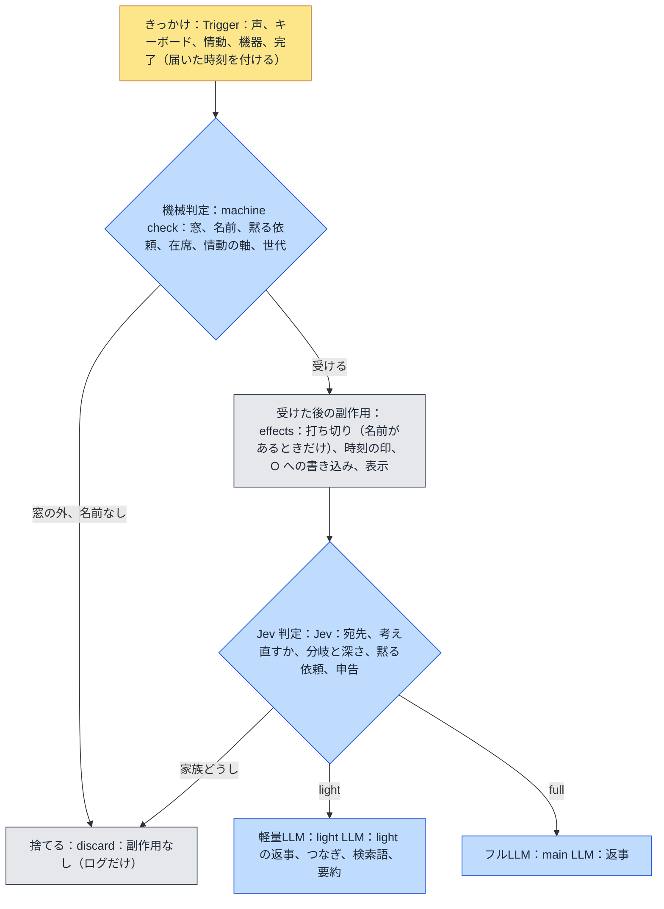

# familiar-ai 設計方針：判定の段（v0.1）

届いたきっかけ（声、キーボード、情動、機器、完了）をどう扱うかを、**判定の段**に分けて決める。段は安い順に
**機械判定、Jev 判定、軽量LLM、フルLLM** の 4 つで、前の段で決まったことは後ろの段へ渡さない。課題は `課題8` の
出-au。環-w（軽量LLM の判定を Jev へ移す）は、この文書の Jev 判定の段に取り込む。決まりは本人が 2026-09-26 に
1 問ずつ決めた。

## 1. 目的

2026-09-26 の見直しで、**声が「話していいか」の門より前に副作用を起こしている**ことが分かった。門で捨てる声（テレビ、
窓の外の家族の話）でも、次のことが起きていた。

- **打ち切り**：調べもの、考えている途中の主LLM、情動の求め、タイマーの知らせを考えている求め、人の出入りの記録の
  書き込みを、すべて取り消していた（`push_utterance` が入口の門より前に `_abort_lookups` を呼ぶ）。
- **話しかけられた時刻の印**：テレビの声で「ひとりの回数」が 0 に戻っていた。
- **画面の表示**：捨てた声も会話ログに出ていた。

ほかに、窓を届いた時刻でなく取り出した時刻で判定していること、`_finish` に世代の確認が無いこと、窓の中の家族どうしの
話にも返事をしてしまうことが見つかった。どれも「どの段で何を決めるか」が決まっていないことから来ている。

## 2. 判定の段

原則は 3 つある。

1. **各段は、その段で決まることだけを決める。** 決まらなければ次の段へ渡す。
2. **副作用は、機械判定で受けると決まった入力にだけ起こす。** 打ち切り、話しかけられた時刻の印、O への書き込み、
   画面の表示がこれに当たる。
3. **判定は届いた時刻で行う。** 駆動体が別の反復を回していても、窓の判定は届いた時刻に対して行う。

### 2.1 機械判定

| 決めること | 決まり |
|---|---|
| 窓 | **30 秒**（v0.3 の 1 分から変える）。**声もキーボードも**、名前（`ME.md`、1 字違いまで）で開き、窓の中の入力で 30 秒へ延ばす。窓の外の入力は捨て、副作用を起こさない |
| 打ち切り | **名前がある入力でだけ**起こす。名前の無い入力は、途中の求めを打ち切らない（§2.4） |
| タイマー | 止める、一時停止、再開も**名前が要る**（「パジュ、止めて」で止まる。「止めて」だけでは止まらない） |
| 黙る依頼 | いまのまま（`設計方針_話していいかの決まり` §2.5）。解くのは名前と「話していいよ」が同じ発話にあるとき |
| 在席、情動の軸 | いまのまま（同 §2.1） |
| 世代 | 打ち切られた求めの反復は、声にする前と記録を書く前（`_finish`）の両方で畳む |

### 2.2 Jev 判定

いま軽量LLM がしている**判定の役目は、すべて Jev へ移す**。軽量LLM に残るのは文章を書く仕事だけになる。

| 判定 | 型 | いまの担い手 |
|---|---|---|
| 窓の中の名前の無い声の宛先（パジュ宛て／家族どうし／分からない）。家族どうしは受けない | Choice | 無し（新しく足す） |
| 主LLM が考えている最中に届いた声を、考え直すか、返事をそのまま出して別の求めにするか（§2.4） | Choice | 無し（新しく足す） |
| 調停の分岐（light／full／action）と深さ（effort） | Choice | 調停 |
| 黙る依頼か、解く依頼か、何分か | Choice、Score | 調停 |
| 続き先 | Choice | 軽量LLM |
| 発話前の検査 | Choice | 軽量LLM |
| 感情の評価、気分の見立て | Score | 軽量LLM |
| 記憶の申告 | Choice | 軽量LLM |
| 時期の指定（「去年の夏の話」） | 未定 | 調停 |

Jev に送る文（`state`）は、その判定に要るものだけに絞る。Jev 1.13 は、判定と関係の無い文が増えるほど精度が落ちると
自ら挙げている。時期の指定は、Jev が弱いと挙げている「日付を順序として比べる」に当たるので、測ってから移すかを決める。

**移す前に 1 つずつ精度を測る**（環-w の順を引き継ぐ）。Jev が使えないとき（鍵が無い、失敗、時間切れ）は、判定ごとに
決めた既定へ倒す。§2.4 の判定の既定は「そのまま出す」である。

### 2.3 つなぎで窓を保つ

調べものと主LLM のどちらでも、**待たせている時間が 5 秒を超えたら 1 回、その後は 20 秒ごとに**つなぎを出し、窓を
延ばす。いまは調べものが 5 秒を超えたときの 1 回だけで、主LLM の待ちには付いていない。窓が 30 秒になるので、
30 秒を超える調べものの答えが窓の外になって独り言になるのを防ぐ。`設計方針_話していいかの決まり` v0.3 §2.3 の
「窓を保つための能動的なつなぎは作らない」は、この決定で改める。

### 2.4 名前の無い入力が途中の求めに届いたとき

名前の無い入力は打ち切らず、**前の求めに添える**。

| 途中の状態 | 扱い |
|---|---|
| 調べもの中 | 結果が届いた後の決める反復で W に載せる |
| 主LLM が考えている最中 | 返りが来たら、返りと届いた入力を組にして Jev で判定する。**考え直す**（返りと入力を材料に主LLM をもう一度呼ぶ）か、**そのまま出す**（返りを声にし、入力は別の新しい求めにする）。Jev が使えなければ「そのまま出す」 |

## 3. 前の決定と入れ替わるもの

| 文書 | 前の決定 | 改めた決定 |
|---|---|---|
| `話していいかの決まり` v0.3 §2.3 | 窓は 1 分 | 30 秒 |
| 同 §2.3 | キーボードはいつでも受けて窓を開ける | 声と同じく名前で開く |
| 同 §2.3 | 窓を保つための能動的なつなぎは作らない | 5 秒、その後 20 秒ごとにつなぐ |
| 同 §2.4 | タイマーの操作の言葉は名前が無くても通す | 名前が要る |
| `課題8` 環-w | 3 つの判定で測ってから広げる | 判定はすべて Jev へ移す（測る順は残す） |

## 4. 未決〔仮〕

- 各判定で Jev が使えないときの既定（§2.4 以外）。
- 名前の聞き違い（「はじゅ」「パチュー」）は、実機で続けて直す。
- 時期の指定を Jev へ移すか。

## 更新履歴

> v0.1：新規作成（2026-09-26）。判定の段（機械判定、Jev 判定、軽量LLM、フルLLM）、副作用は受けた入力にだけ起こす、
> 窓 30 秒と名前で開くキーボード、打ち切りとタイマーの操作に名前が要る、つなぎで窓を保つ、名前の無い入力は前の求めに
> 添える、軽量LLM の判定をすべて Jev へ移す、を決めた。
