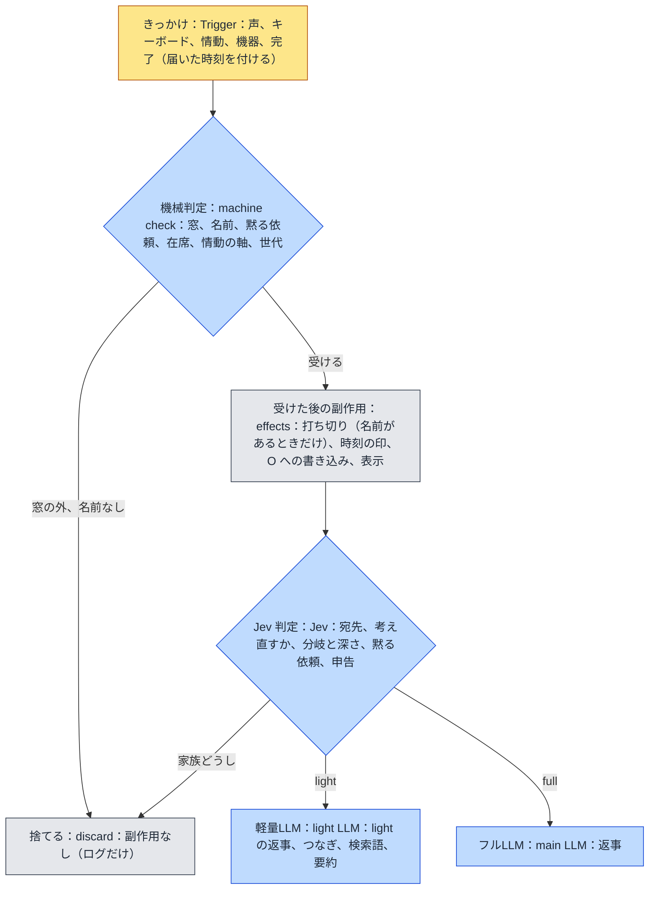

# familiar-ai 設計方針：判定の段（v0.3）

届いたきっかけ（声、キーボード、情動、機器、完了）をどう扱うかを、**判定の段**に分けて決める。段は安い順に
**機械判定、Jev 判定、軽量LLM、フルLLM** の 4 つで、前の段で決まったことは後ろの段へ渡さない。課題は `課題8` の
出-au。環-w（軽量LLM の判定を Jev へ移す）は、この文書の Jev 判定の段に取り込む。決まりは本人が 2026-09-26 に
1 問ずつ決めた。

## 1. 目的

2026-09-26 の見直しで、**声が「話していいか」の門より前に副作用を起こしている**ことが分かった。門で捨てる声（テレビ、
窓の外の家族の話）でも、次のことが起きていた。

- **打ち切り**：調べもの、考えている途中の主LLM、情動の求め、タイマーの知らせを考えている求め、人の出入りの記録の
  書き込みを、すべて取り消していた（`push_utterance` が入口の門より前に `_abort_lookups` を呼ぶ）。
- **話しかけられた時刻の印**：テレビの声で「ひとりの回数」が 0 に戻っていた。
- **画面の表示**：捨てた声も会話ログに出ていた。

ほかに、窓を届いた時刻でなく取り出した時刻で判定していること、`_finish` に世代の確認が無いこと、窓の中の家族どうしの
話にも返事をしてしまうことが見つかった。どれも「どの段で何を決めるか」が決まっていないことから来ている。

## 2. 判定の段

原則は 3 つある。

1. **各段は、その段で決まることだけを決める。** 決まらなければ次の段へ渡す。
2. **副作用は、機械判定で受けると決まった入力にだけ起こす。** 打ち切り、話しかけられた時刻の印、O への書き込み、
   画面の表示がこれに当たる。
3. **判定は届いた時刻で行う。** 駆動体が別の反復を回していても、窓の判定は届いた時刻に対して行う。

### 2.1 機械判定

| 決めること | 決まり |
|---|---|
| 窓 | **30 秒**（v0.3 の 1 分から変える）。**声もキーボードも**、名前（`ME.md`、1 字違いまで）で開き、窓の中の入力で 30 秒へ延ばす。窓の外の入力は捨て、副作用を起こさない |
| 打ち切り | **名前がある入力でだけ**起こす。名前の無い入力は、途中の求めを打ち切らない（§2.4） |
| タイマー | 止める、一時停止、再開も**名前が要る**（「パジュ、止めて」で止まる。「止めて」だけでは止まらない） |
| 黙る依頼 | いまのまま（`設計方針_話していいかの決まり` §2.5）。解くのは名前と「話していいよ」が同じ発話にあるとき |
| 在席、情動の軸 | いまのまま（同 §2.1） |
| 世代 | 打ち切られた求めの反復は、声にする前と記録を書く前（`_finish`）の両方で畳む |

### 2.2 Jev 判定

いま軽量LLM がしている**判定の役目は、すべて Jev へ移す**。軽量LLM に残るのは文章を書く仕事（light の返事、つなぎ、
動作の中身、日付、要約、自己像など）だけになる。決めたのは本人で、2026-09-27 に 1 問ずつ詰めた。過去のログで精度を
測る実験は、入力そのもの（門が無かったころのテレビの声や聞き違い）が崩れていたので途中でやめ、測らずに置き換える。

#### 2.2.1 どの判定でも同じ決まり

- **Jev が使えないとき**（鍵が無い、時間切れ、429、529、形の誤り）は、判定ごとの**機械の既定へ倒す**。軽量LLM の判定の口は
  外す（判定の作りを 1 通りにする）。
- **確信度が 0.6〔仮〕より低ければ**、判定ごとの**倒し先**へ倒す。倒し先は「迷ったときに害が小さい側」で、下の表に書く。
- はい／いいえの質問（Noul）は確信度を持たないので、はいの確率が 0.5 以上なら「はい」とする。
- 感情の評価と気分の見立ては、確信度で倒さずにそのまま使う（Score は段の確率で重みづけた値なので、迷いは値が真ん中に寄る形で表れる）。

#### 2.2.2 調停

Jev に **1 回で**次の質問をまとめて送る。送る文（`state`）は、いま軽量LLM に渡している W 全部とその場の言葉（本人の決定 イ）。

| 質問 | 型 | 選択肢 | 使うとき |
|---|---|---|---|
| 分岐 | Choice | light（何も動かさず短く答える）、full（何も動かさず、記憶を踏まえた言葉や説明で答える）、action（先に何かを動かす） | いつも |
| 深さ | Choice | low（ふつう）、medium（複雑な気持ち、4 つ以上の記憶、調べた結果をまとめる）、high（よく考えるよう明示された） | 分岐が full のとき |
| 動作 | Choice | そのとき使える動作だけを並べる（見る、首を向ける、タイマー、止める、一時停止、再開、ストップウォッチ、アラーム、予定、家の決まり、日次記録、メモを探す、記録を聞く、記憶を探す、インターネット、確認待ちへの「いい」） | 分岐が action のとき |
| 時期を指しているか | Noul | 特定の過去の時期（去年の夏、先週など）を指している | いつも |
| 黙る依頼か | Noul | 黙っていてと頼んでいる | いつも |
| 黙る長さ | Choice | 指定なし（既定 30 分）、5 分、10 分、15 分、30 分、60 分 | 黙る依頼のとき |

そのあと、**文章が要るときだけ**軽量LLM を 1 回呼ぶ。

| Jev の答え | 軽量LLM が書くもの |
|---|---|
| light | 返事 |
| full で深さが low でない | つなぎ |
| action | 動作の中身（分数、時刻、番号、探す語など）とつなぎを 1 回で（本人の決定 ア） |
| 時期を指している | 日付（本人の決定 ア。日付は Jev の弱点なので書かせない） |

つなぎは、決まった言い回しから選ばず、軽量LLM が書く（本人の決定 ア）。

| 場合 | 倒し先・既定 |
|---|---|
| Jev が使えない | 分岐 full、深さ low、時期は指していない、黙る依頼は無し |
| 分岐・動作の確信度が低い | full（主LLM に任せる。違う動作をするより害が小さい） |

#### 2.2.3 残りの判定

| 判定 | Jev に送る文 | 聞くこと（型） | 使えないとき・確信度が低いとき |
|---|---|---|---|
| 続き先 | W 全部、その場の言葉 | この言葉は W のどの行の続きか。W の行の id と「どれの続きでもない」を選択肢に（Choice・255 個まで） | どれの続きでもない（間違った続きは次の想起を汚す） |
| 発話前の検査 | 返事の文、その場の言葉、在席、W | この返事が破っている決まりはどれか。決まりの一覧と「破っていない」を選択肢に（Choice） | 破っていない（迷っただけで主LLM を呼び直さない） |
| 感情の評価 | そのターンの言葉と返事 | 快、不快、支配を **5 段**ずつ（Score ×3・本人の決定 ア） | 測らない（いまも測れないときは使わない） |
| 気分の見立て | 相手の言葉 | 相手の気分を、いまの見立ての名前から選ぶ（Choice） | 見立てない |
| 記憶の申告 | 返事の文、W に載った記憶 | 記憶ごとに、返事に使った／大事だった／使わなかった（Choice を記憶の数だけ 1 回で） | その記憶は申告しない（間違った「大事」は根づきを誤って動かす） |
| 宛先（新） | 窓の中の名前の無い言葉、直近のやりとり、在席 | パジュ宛て／家族どうし／分からない（Choice）。家族どうしは受けない | 受ける（無視されたと感じさせるより害が小さい） |
| 考え直すか（新・§2.4） | 元の問い、主LLM の返事、考えているあいだに言い足された言葉 | 考え直す／そのまま出す（Choice） | そのまま出す |

#### 2.2.4 移す順

1 つずつ移し、そのたびに試験を通す。小さく新しいものから始め、組み替えの大きい調停を最後にする。

1. 考え直すか（新）
2. 宛先（新）
3. 発話前の検査
4. 続き先
5. 記憶の申告
6. 感情の評価と気分の見立て
7. 調停

### 2.3 つなぎで窓を保つ

調べものと主LLM のどちらでも、**待たせている時間が 5 秒を超えたら 1 回、その後は 20 秒ごとに**つなぎを出し、窓を
延ばす。いまは調べものが 5 秒を超えたときの 1 回だけで、主LLM の待ちには付いていない。窓が 30 秒になるので、
30 秒を超える調べものの答えが窓の外になって独り言になるのを防ぐ。`設計方針_話していいかの決まり` v0.3 §2.3 の
「窓を保つための能動的なつなぎは作らない」は、この決定で改める。

### 2.4 名前の無い入力が途中の求めに届いたとき

名前の無い入力は打ち切らず、**前の求めに添える**。

| 途中の状態 | 扱い |
|---|---|
| 調べもの中 | 結果が届いた後の決める反復で W に載せる |
| 主LLM が考えている最中 | 返りが来たら、返りと届いた入力を組にして Jev で判定する。**考え直す**（返りと入力を材料に主LLM をもう一度呼ぶ）か、**そのまま出す**（返りを声にし、入力は別の新しい求めにする）。Jev が使えなければ「そのまま出す」 |

## 3. 前の決定と入れ替わるもの

| 文書 | 前の決定 | 改めた決定 |
|---|---|---|
| `話していいかの決まり` v0.3 §2.3 | 窓は 1 分 | 30 秒 |
| 同 §2.3 | キーボードはいつでも受けて窓を開ける | 声と同じく名前で開く |
| 同 §2.3 | 窓を保つための能動的なつなぎは作らない | 5 秒、その後 20 秒ごとにつなぐ |
| 同 §2.4 | タイマーの操作の言葉は名前が無くても通す | 名前が要る |
| `課題8` 環-w | 3 つの判定で測ってから広げる | 判定はすべて Jev へ移す（測る順は残す） |

## 3b. 実装の進み（v0.3・2026-09-27）

| 段 | 中身 | コミット |
|---|---|---|
| 1-1 | 入力に届いた時刻と出どころを付ける（`core/wake_window.InputText`・`VoiceText`・`KeyText`・`arrived_at`）。積む口 4 か所（声の書き起こし、画面、TUI の打鍵と録音、CUI）で包み、`agent.run` は名前の札を外す前に読む | `eb359a8` |
| 1-2、1-3 | 門を `push_utterance` の中で届いた時刻で判定する。窓の外の入力は打ち切りも時刻の印も付けない。打ち切りは名前があるときだけ（`Trigger.named`）。窓 30 秒、キーボードも名前で開く、タイマーの操作にも名前が要る（`lifts` も）。名前の無い入力は飛行中の調べものがある間は保留箱で待つ（`_take_trigger`） | `79ac518` |
| 1-5 | 打ち切られた求めの `_finish` は、声になった事実だけを書き、次の求めの状態に触らない | `6c206d9` |
| 1-4 | 会話ログは門が受けた入力だけ（`set_heard_listener`）。捨てた入力は状態の行に「聞いていない」を次の表示まで（画面、TUI）。コマンドは `agent.run` が知らせる | `4ba020e` |
| 2 | 会話の求めで待たせている間は、つなぎを 5 秒、その後 20 秒ごと（`wait_filler_repeat_seconds`）に繰り返す。主LLM の待ちも見張る。見張りは求めごとに 1 本（`_watch_waiting`）。「進捗」の反復は上限に数えない。本物の結果と「進捗」が一緒なら結果に答える | `9bcdb8e` |
| 3 | 名前の無い入力は、調べもの中なら前の求めに添える（`_attach_to_request`・役割「添え」・W の「言い足したこと」の枠）。主LLM の待ち中は返りで判定の口（`_rethink_or_speak`）を通す（段 5 までは常に「そのまま出す」） | `d5b1e72` |
| 4 | Jev を呼ぶ口（`backends/jev.py`）と、退避ログの判定に Jev を当てる実験の道具（`scripts/experiment_jev.py`）。調停の分岐で一致 62.5%（293 件）。入力が崩れていた（門の前のテレビの声や聞き違い）ので、測るのはやめた | `2866ea2`、`9da6efd`〜`4dcb402` |

試験では、ループの仕組みを確かめる試験が名前の無い素の文を渡すので、`conftest` が窓を開けて通す。門そのものを確かめる試験は `real_window` の印で本物の判定を使う。

## 4. 未決〔仮〕

- 確信度のしきい値 0.6 は仮の値。実機で倒れ方を見て直す。
- 名前の聞き違い（「はじゅ」「パチュー」）は、実機で続けて直す。

## 更新履歴

> v0.3：§2.2 を詳しくした（2026-09-27・本人）。Jev が使えないときは機械の既定、確信度 0.6〔仮〕未満は倒し先へ、調停は Jev に 1 回で聞いてから文章が要るときだけ軽量LLM、時期は Noul で聞いて日付は軽量LLM、動作の中身とつなぎは軽量LLM が 1 回で、送る文は W 全部、感情は 5 段、移す順。§3b に段 2〜4 を足した。
> v0.2：段 1（機械判定）を実装した（§3b・2026-09-27）。
> v0.1：新規作成（2026-09-26）。判定の段（機械判定、Jev 判定、軽量LLM、フルLLM）、副作用は受けた入力にだけ起こす、
> 窓 30 秒と名前で開くキーボード、打ち切りとタイマーの操作に名前が要る、つなぎで窓を保つ、名前の無い入力は前の求めに
> 添える、軽量LLM の判定をすべて Jev へ移す、を決めた。
