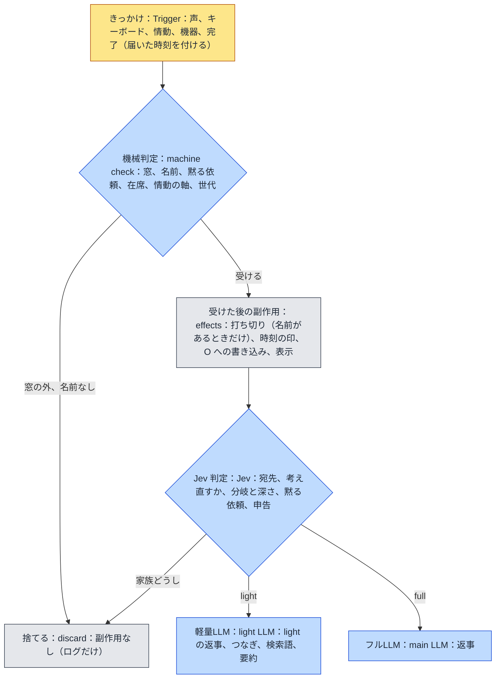

# familiar-ai 設計方針：判定の段（v0.30）

届いたきっかけ（声、キーボード、情動、機器、完了）をどう扱うかを、**判定の段**に分けて決める。段は安い順に
**機械判定、Jev 判定、軽量LLM、フルLLM** の 4 つで、前の段で決まったことは後ろの段へ渡さない。課題は `課題8` の
出-au。環-w（軽量LLM の判定を Jev へ移す）は、この文書の Jev 判定の段に取り込む。決まりは本人が 2026-09-26 に
1 問ずつ決めた。

## 1. 目的

2026-09-26 の見直しで、**声が「話していいか」の門より前に副作用を起こしている**ことが分かった。門で捨てる声（テレビ、
窓の外の家族の話）でも、次のことが起きていた。

- **打ち切り**：調べもの、考えている途中の主LLM、情動の求め、タイマーの知らせを考えている求め、人の出入りの記録の
  書き込みを、すべて取り消していた（`push_utterance` が入口の門より前に `_abort_lookups` を呼ぶ）。
- **話しかけられた時刻の印**：テレビの声で「ひとりの回数」が 0 に戻っていた。
- **画面の表示**：捨てた声も会話ログに出ていた。

ほかに、窓を届いた時刻でなく取り出した時刻で判定していること、`_finish` に世代の確認が無いこと、窓の中の家族どうしの
話にも返事をしてしまうことが見つかった。どれも「どの段で何を決めるか」が決まっていないことから来ている。

## 2. 判定の段

原則は 3 つある。

1. **各段は、その段で決まることだけを決める。** 決まらなければ次の段へ渡す。
2. **副作用は、機械判定で受けると決まった入力にだけ起こす。** 打ち切り、話しかけられた時刻の印、O への書き込み、
   画面の表示がこれに当たる。
3. **判定は届いた時刻で行う。** 駆動体が別の反復を回していても、窓の判定は届いた時刻に対して行う。
   **声の届いた時刻は、話し始めた時刻**（v0.14・出-bb・2026-10-08・本人の決定ア）。書き起こしが VAD の区切りの始まりを覚えて `VoiceText.at` に渡し、中継（`realtime_stt_session`）は打ち直さず引き継ぐ。持ち越した短い断片に続けて話したら、最初の断片の話し始め。書き起こしが済んだ時刻で打つと、声が長いほど窓が実質短くなる（実機 18:19「週末の天気は」：話し始めは窓の 1.5 秒後、届いた時刻は 5.8 秒後）。話し始めの分からない書き起こし（ElevenLabs）は届いた時刻のまま。

### 2.1 機械判定

| 決めること | 決まり |
|---|---|
| 窓 | **10 秒**（v0.3 の 1 分 → v0.1 で 30 秒 → v0.10・2026-10-07 本人の決定で 10 秒）。**声もキーボードも**、名前（`ME.md`、1 字違いまで）で開き、窓の中の入力で 10 秒へ延ばす。会話の求めを待たせているあいだは閉じない（§2.3）。窓の外の入力は捨て、副作用を起こさない |
| 打ち切り | **名前がある入力でだけ**起こす。名前の無い入力は、途中の求めを打ち切らない（§2.4） |
| タイマー | 止める、一時停止、再開も**名前が要る**（「パジュ、止めて」で止まる。「止めて」だけでは止まらない） |
| 黙る依頼 | いまのまま（`設計方針_話していいかの決まり` §2.5）。解くのは名前と「話していいよ」が同じ発話にあるとき |
| 在席、情動の軸 | いまのまま（同 §2.1） |
| 世代 | 打ち切られた求めの反復は、声にする前と記録を書く前（`_finish`）の両方で畳む |

### 2.2 Jev 判定

いま軽量LLM がしている**判定の役目は、すべて Jev へ移す**。軽量LLM に残るのは文章を書く仕事（light の返事、つなぎ、
動作の中身、日付、要約、自己像など）だけになる。決めたのは本人で、2026-09-27 に 1 問ずつ詰めた。過去のログで精度を
測る実験は、入力そのもの（門が無かったころのテレビの声や聞き違い）が崩れていたので途中でやめ、測らずに置き換える。

#### 2.2.1 どの判定でも同じ決まり

- **Jev が使えないとき**（鍵が無い、時間切れ、429、529、形の誤り）は、判定ごとの**機械の既定へ倒す**。軽量LLM の判定の口は
  外す（判定の作りを 1 通りにする）。
- **確信度が 0.6〔仮〕より低ければ**、判定ごとの**倒し先**へ倒す。倒し先は「迷ったときに害が小さい側」で、下の表に書く。
- はい／いいえの質問（Noul）は確信度を持たないので、はいの確率が 0.5 以上なら「はい」とする。
- 感情の評価と気分の見立ては、確信度で倒さずにそのまま使う（Score は段の確率で重みづけた値なので、迷いは値が真ん中に寄る形で表れる）。
- **調停が倒れたら、理由を残す**（v0.11・出-ay・2026-10-07）。「調停を決められなかったのでフルへ倒す（判定=なし・理由）」の理由は、Jev が答えなかった（と、その誤り）・分岐か動作の確信度（と、1 番・2 番の選択肢と確率）・候補に無い動作、のどれか（`Arbiter._why`）。本文は出さない。10/6〜10/7 の実機で調停 119 回のうち 79 回が倒れ、理由がログに無かった。
- **調停の判定を毎回残す**（v0.12・出-ay 段 2・2026-10-08）。Jev が答えたら、倒れても倒れなくても「調停の判定：分岐 X（確信度・1 番・2 番）・動作 Y（確信度・1 番・2 番）」を 1 行残す（`_judgement_line`）。動作は分岐と同じ 1 回の問いで聞いているが、分岐で倒れると読まずに捨てていた。10/7 20:31〜10/8 朝の倒れ 40 回（調停 61 回中・すべて分岐の確信度が 0.6 未満）のうち、action が 1 番の 16 回で、どの動作を選んでいたかが分からなかった。
- **調停ごとに、Jev に渡したそのままと答えを残す**（v0.16・出-ay 段 3・2026-10-08・本人の決定）。表 `arbiter_records`（074）に、時刻・起点・その場の言葉・Jev に渡した文（`state`・W を含む）・問い（`questions`）・答え（`answer`）・結末（`outcome`：決めた分岐と動作、または「倒れ：理由」）を 1 行ずつ残す（`Arbiter._record`・`store/arbiter_records.record`）。別スレッドで書き、失敗しても調停は止めない。消さない。正解の集まり（`JEV_正解.md`・リポジトリ直下・版管理の外・毎晩の退避に入る）の時刻から `near` で引き、前提を足して投げ直し、Jev のプロンプトを直すのに使う。W は DEBUG のログにしか無く、後から組み直すと想起の点数が変わって同じにならないため。記-o（W に何が載っていたか）もこれで見る。

#### 2.2.2 調停

Jev に **1 回で**次の質問をまとめて送る。送る文（`state`）は、W 全部とその場の言葉（本人の決定 イ）に、起点ごとの先導文、
判断の目安（分岐の決め方。見る動作が使えるときは、写真の読み取りの記録で答えてよいか、首を向けた帰りに向け直さないか、も）、
反復の上限と回数の但し書き、いまの時刻、顔ぶれを添えたものである。人格と家族は送らない。

| 質問 | 型 | 選択肢 | 使うとき |
|---|---|---|---|
| 分岐 | Choice | light（何も動かさず短く答える）、full（何も動かさず、記憶を踏まえた言葉や説明で答える）、action（先に何かを動かす） | いつも |
| 深さ | Choice | low（ふつう）、medium（複雑な気持ち、4 つ以上の記憶、調べた結果をまとめる）、high（よく考えるよう明示された） | 分岐が full のとき |
| 動作 | Choice | そのとき使える動作だけを並べる（見る、首を向ける、タイマー、止める、一時停止、再開、ストップウォッチ、アラーム、予定、家の決まり、日次記録、メモを探す、記録を聞く、記憶を探す、インターネット、確認待ちへの「いい」） | 分岐が action のとき |
| 時期を指しているか | Noul | 特定の過去の時期（去年の夏、先週など）を指している | いつも |
| 黙る依頼か | Noul | いまは話しかけないでほしいと頼んでいる（名前は問わない。名前は入口の窓で見る。「待って」は当たらない） | 道具の帰りでないとき |
| 黙る長さ | Choice | 指定なし（既定 30 分）、5 分、10 分、15 分、30 分、60 分 | 黙る依頼のとき |
| 解く依頼か | Noul | 黙っているところへ、もう話していいと解いた | 黙っているとき（機械の判定 `is_release` と並べる） |
| 名乗ったか | Noul | 自分の名前を名乗った（「〜だよ」「〜です」） | 道具の帰りでないとき |
| 誰を名乗ったか | Choice | `FAMILY.md` の呼び方と「家族以外・分からない」 | 名乗ったとき（家族以外は話者に付けない・いまと同じ） |
| 打ち消したか | Noul | いまの呼び方の人ではないと打ち消した（「〜じゃないよ」「ちがう」） | 道具の帰りでないとき |
| どの呼び方を打ち消したか | Choice | 家族の呼び方と、いまの話者 | 打ち消したとき |

確信度で倒すのは分岐と動作だけである。深さ、黙る長さ、名乗った名前、打ち消した呼び方は、いちばん確率の高い選択肢をそのまま採る。
道具の帰りの反復では、黙る依頼、名乗り、打ち消しを問わず、答えに混じっていても読まない。道具の返りの文（「その間は黙って待ちます」など）を
人の頼みとして読まないための機械の守りである。

そのあと、**文章が要るときだけ**軽量LLM を 1 回呼ぶ。何も要らなければ呼ばない。

| Jev の答え | 軽量LLM が書くもの |
|---|---|
| light | 返事 |
| full | 何も書かない（呼ばない） |
| action | 動作の中身（分数、時刻、番号、探す語など）だけ。行き先の決まった動作（家の決まりなど）は探す語も書かない |
| （待ちの知らせ・分岐は判定しない） | つなぎと、言いたいことの捨て場（`trash`）。§2.3 |
| 時期を指している | 日付（本人の決定 ア。日付は Jev の弱点なので書かせない） |

つなぎは、決まった言い回しから選ばず、軽量LLM が書く（本人の決定 ア）。捨て場は読み捨てる欄で、置かないとつなぎが用件を言い切る
（`課題8` 出-aj）。軽量LLM には、人格と家族をシステム文で、口調の決まり（丁寧さを混ぜない、すでに伝えた一言があれば言い直さずに
続けて短く）と、決まった分岐をプロンプトで渡す。軽量LLM はもう選ばないので、先導文の「次のどれかを選ぶ」は「決まったことに要る言葉を
書く」に替えて渡す。

Jev の答えと軽量LLM の文章を合わせて決定に組み立てるとき、前の調停の機械の守りをそのまま通す（見る動作はカメラがあるときだけ、
使えない動作は倒す、など）。組み立てた決定が light でも、人の言葉が道具の要る頼み（タイマー、アラーム、測る、止める）か、
動いているタイマーへの操作の言葉なら、full（深さ low）へ倒す。light は道具を使えず、「掛けました」と言うだけになるためである。

**写真の読み取りは、システムの状態として残す**（本人の決定 ア・2026-09-27）。Jev は写真を見られないので、調停に写真を
渡す形（v0.46）はやめる。見る動作のあと、写真を読む口（`scene.read_photo`。場面用の担い手、設定が無ければ軽量LLM）を 1 回呼び、「見えたもの」と
「写っている人の見立て（呼び方と確信度）」を返させる。見えたものは O の記録（「見えたもの：…」）、見立ては顔ぶれ
（`_apply_seen_people`・1 人なら話者にする）に残す。調停が見ると決めた帰りの反復は、この読み取りを**待ってから**回し、
Jev は W の中の記録を文として読んで分岐を決める。主LLM が見ると決めた道（主LLM に写真を渡す・`say` の `seen_people`）は
変えない。調停の返りにあった人の見立ての欄（`seen_people`）は外した（調停に写真が渡らないので、いつも空になるため）。

| 場合 | 倒し先・既定 |
|---|---|
| Jev が使えない | 分岐 full、深さ low、時期は指していない、黙る依頼は無し |
| 分岐・動作の確信度が低い | full（主LLM に任せる。違う動作をするより害が小さい） |
| 軽量LLM が時間切れ、失敗、読めない返り | full、深さ low。時間切れは計測ログの調停の行に「時間切れ=yes」と残す（層 3 が調停の時間切れの秒数を見直す材料） |

#### 2.2.3 残りの判定

| 判定 | Jev に送る文 | 聞くこと（型） | 使えないとき・確信度が低いとき |
|---|---|---|---|
| 続き先 | W 全部、その場の言葉 | この言葉は W のどの行の続きか。W の行の id と「どれの続きでもない」を選択肢に（Choice・255 個まで） | どれの続きでもない（間違った続きは次の想起を汚す） |
| 発話前の検査 | 返事の文、その場の言葉、顔ぶれ、W | この返事が破っている決まりはどれか。決まりの一覧と「破っていない」を選択肢に（Choice） | 破っていない（迷っただけで主LLM を呼び直さない） |
| 感情の評価 | そのターンの言葉と返事 | 快、不快、支配を **5 段**ずつ（Score ×3・本人の決定 ア） | 測らない（いまも測れないときは使わない） |
| 気分の見立て | 相手の言葉 | 相手の気分を、いまの見立ての名前から選ぶ（Choice） | 見立てない（既定の absent） |
| 記憶の申告 | 返事の文、W に載った記憶 | 記憶ごとに、返事に使った／大事だった／使わなかった（Choice を記憶の数だけ 1 回で） | その記憶は申告しない（間違った「大事」は根づきを誤って動かす） |
| 宛先（新） | 窓の中の名前の無い言葉、直近のやりとり、顔ぶれ | パジュ宛て／家族どうし／分からない（Choice）。家族どうしは受けない | 受ける（無視されたと感じさせるより害が小さい） |

**気分の見立ての効かせ先**（出-av・2026-09-30・本人の決定ア）：会話の求めで主LLM を呼ぶ反復だけ見立て（続き先の判定を待つあいだに投げる）、主LLM の system 文の顔ぶれの隣に `[相手の様子]` の一行を置く（乗り気で話している／うれしそう・楽しそう／疲れていそう／苛立っているか、困っていそう。話者が分かればその名前で）。返事の調子を相手に合わせるためで、パジュ自身の気分と O には効かせない。分からない（absent）ときは何も置かない。情動と機器の求めでは見立てない。
| 考え直すか（新・§2.4） | 元の問い、主LLM の返事、考えているあいだに言い足された言葉 | 考え直す／そのまま出す（Choice） | そのまま出す |

**発話前の検査の確認待ちの決まり**（v0.13・出-ba・2026-10-08）：`no-claim-while-confirming`（[確認待ち] のあいだは「掛けた」「始めた」と言わない）は、確認待ち（`agent._pending_confirm`）があるときだけ照らす決まりに入れる（`rules_for_checker(confirming=…)`）。Jev に送る事実には確認待ちの有無が無いので、毎回渡すと返事の「始めた」だけで違反と取る。実機 18:17 に、鳴り始めた音楽の「かけ始めました」を差し戻し、「今頼んでいます」と言い直させた。主LLM へ渡す決まり（正本）は変えない。

#### 2.2.5 調停の組み替え：発話は「意味 → 動作」（出-ay・2026-10-08〜10・本人の決定・実験で決め、段 4 と段 5 で本体に入れた）

しきい値や倒し先をいじるのではなく、本人が場面ごとの正しい動作（`JEV_正解.md`・リポジトリ直下・版管理の外）を書き、
それに合うよう Jev への問いを組み替える。いまの分岐（light／full／action）は正解に一度も出てこなかったので使わない。
発話・完了・機器・情動の順に決めた（下の表）。測る道具は `scripts/experiment_meaning.py`。

**1 回目：意味**（明確なものから、あやふやなものの順）。使えないもの（確認待ちでない・音楽が無い・カメラが無い）は並べない。

| 順 | 意味 | Jev への説明（要点） |
|---|---|---|
| 1 | 確認待ちへの答え | パジュがいま待っている確認の問いへの答え |
| 2 | 既に受けた作業依頼の確認 | 前に頼んだことがどうなったか・やってくれたかを確かめる・念を押す |
| 3 | 音楽に関する依頼 | かける・止める・次の曲・音量 |
| 4 | 時間に関する依頼 | アラーム・タイマー・ストップウォッチ・しばらく黙っていて |
| 5 | 見る依頼 | そっちを向いて・何が見える |
| 6 | 調べる必要のある問い | 答えをまだ持っていないか、天気・日程のように変わることで前の答えが古い |
| 7 | 知っていることで答えられる問い | 答えが直前のやりとりや思い出したことにあり、変わらないか、まだ新しい |
| 8 | 1〜7 以外の依頼と会話 | あいさつ・相づち・気持ち・おしゃべり |
| 9 | これまでの文脈に合わない言葉 | 直前のやりとりの続きとして読むと、話の流れに合わない |
| 10 | 成立しないもの（文章・言葉・文字・その他） | 聞き取りが崩れた・途中で切れた・意味の無い音 |

「文脈」は直前のやりとり（人とパジュの言葉）のことで、W（想起した記憶）ではない。本体に入れるときは、状態の文で
`[直前のやりとり]` と `[思い出したこと]` を別の見出しにし、説明にそのことを書く（いまの調停は W 全部を 1 つの見出しで渡している）。

**2 回目：動作**（意味ごとに、その意味の動作だけを並べる。どの意味にも聞き返す・黙るを置く）

| 意味 | 並べる動作 |
|---|---|
| 確認待ちへの答え | confirm／decline／聞き返す／黙る |
| すすめた曲への返事（段 4-4f・返事を待っているときだけ） | かける／かけない／聞き返す／黙る |
| 既に受けた作業依頼の確認 | 状態を伝える（軽量）／聞き返す／黙る |
| 音楽 | play_music（曲名なしは既定の音楽＝直前の曲やプレイリストを続ける）／stop_music／next_track／music_volume／聞き返す／黙る |
| 時間 | タイマー・アラーム・ストップウォッチの各操作／黙る依頼を受ける／聞き返す／黙る |
| 見る | look／see／聞き返す／黙る |
| 調べる必要のある問い | search_deferred／recall／family_schedule・house_rules・notion_search・journal・vault／聞き返す／黙る（「知っていることで答える」は置かない：道具と競わせると確信度が割れた。31「週末は」は道具だけなら 0.96、並べると 0.42〜0.51） |
| 知っていることで答えられる問い | 考えて返す（主LLM）／軽く返す（軽量）／聞き返す／黙る |
| その他の依頼と会話 | 軽く返す／考えて返す／聞き返す／黙る |
| 文脈に合わない言葉 | 聞き返す／黙る |
| 成立しないもの | 黙るだけ（2 回目は聞かない） |

調べる必要のある問いの説明には、調べ直すかの手順（変わることか → 前の答えと比べて）と、家の記録の道具に何が載っていて
何が載っていないか（家の目次に世の中のことは無い）を書く。

**確信度の決まり**（しきい値 0.6・1 回目も 2 回目も）

| 段 | Jev の答え | 確信度 | どうするか |
|---|---|---|---|
| 1 回目 | 成立しないもの | いくつでも | 黙る |
| 1 回目 | 文脈に合わない言葉 | いくつでも | 2 回目で聞き返すが 0.6 以上なら聞き返す。それ以外は黙る |
| 1 回目 | それ以外 | 0.6 以上 | 2 回目へ |
| 1 回目 | それ以外 | 0.6 未満 | 「よく考えて返すか、軽く聞き返すか」を聞く |
| 2 回目 | 聞き返す | いくつでも | 軽量LLM に聞き返させる（**20 字まで**の指示をプロンプトに付ける） |
| 2 回目 | それ以外 | 0.6 以上 | 使う |
| 2 回目 | それ以外 | 0.6 未満 | 「よく考えて返すか、軽く聞き返すか」を聞く |
| よく考えるか聞き返すか | どちらでも | 0.6 以上 | 使う（よく考える＝主LLM・聞き返す＝軽量LLM） |
| よく考えるか聞き返すか | どちらでも | 0.6 未満 | 軽量LLM に軽く聞き返させる |

しきい値は 0.45 も試したが、外れた動作をそのまま使う場面（33）が出たので 0.6 に戻した。

**聞き方：先読みで 1 回**。意味の問いと、意味ごとの 2 回目の問い（「もしこの言葉が○○なら」と前提を書く）を全部 1 回の
問いに並べ、返ってきた意味の答えだけを使う（資料の speculative fan-out）。Jev にはキャッシュが無く（資料に記述が無い・
同じ文でも速くならない）、2 回に分けると状態の文を 2 回送る。意味と動作を 1 つの並びにまとめて聞く形は、選択肢が混ざって
割れ（31 で聞き返すが 1 番）、測るたびに揺れたので採らない。

| 形 | 動作の一致（8 場面） | 1 場面の秒（平均） |
|---|---|---|
| 2 回に分ける | 7・7 | 0.45・0.44 |
| 意味と動作を 1 つの並びで 1 回 | 7・5 | 0.30・0.23 |
| **先読みで 1 回（採る）** | **6・6 → 7・7**（文脈に合わない言葉の決まりを入れた後） | **0.28〜0.32** |

**測った正解**（`JEV_正解.md`・10/8 の 37 場面のうち発話 13 場面。W に関係なく動作が決まる 8 場面で数える）：最後の測定で
7/8。残る外れは 32「今しゃべっていることを気をしておきたい」（正解は文脈に合わない言葉・聞き返す。Jev は答えられる問いと
読み、よく考えるに回る）。8・10・28・29・37 は前の答えを持っていたか（W）で調べるか答えるかが変わるので数えない。
調停ごとの記録（`arbiter_records`・段 3）に W が残る場面から、正解を足していく。

**完了と機器**（2026-10-09・本人の決定・段 4-1 と段 4-2 で実装）：1 回目（何が起きたか）は**機械が決め**、2 回目（どうするか）だけを
Jev に聞く。選択肢が 1 つなら Jev には聞かない。**この領域では確信度を使わない**（Jev の 1 番をそのまま使う）。

| 起点 | 機械が決める 1 回目 | 決め方 | 2 回目 | Jev に聞くか |
|---|---|---|---|---|
| 完了 | 頼まれた調べものの答えが届いた | 人の言葉から始まった求めで、search_deferred・fetch_deferred・recall・家の記録の道具が返った | 考えて返す（主LLM）／軽く返す（軽量）／search_deferred（調べ直す） | 聞く |
| 完了 | 音楽をかけた | play_music が成功 | 黙る | 聞かない |
| 完了 | 音楽を止めた | stop_music が成功 | 黙る（v0.23 で軽く伝えるから直した・正解の 6） | 聞かない |
| 完了 | 次の曲・音量を変えた | next_track・music_volume が成功 | 黙る | 聞かない |
| 完了 | すすめた曲をかけた（段 4-4f） | music_suggestion_reply が成功し、かけ始めた | 黙る | 聞かない |
| 完了 | すすめた曲を断られた（段 4-4f） | music_suggestion_reply が成功し、「もう勧めない」 | 軽く伝える | 聞かない |
| 完了 | タイマー・アラームを掛けた | set_timer・set_alarm が成功 | 軽く伝える | 聞かない |
| 完了 | タイマー・アラームを止めた・一時停止・再開した | 各操作が成功 | 軽く伝える | 聞かない |
| 完了 | ストップウォッチで測り始めた | start_stopwatch が成功 | 軽く伝える | 聞かない |
| 完了 | ストップウォッチを止めた | stop_stopwatch が成功 | 軽く伝える（測った長さ） | 聞かない |
| 完了 | 確認待ちに「はい」と答えて掛けた・「いいえ」と答えて取りやめた | confirm・decline が成功 | 軽く伝える | 聞かない |
| 完了 | 道具が使えない | つながっていない・出口が見つからない | 軽く伝える | 聞かない |
| 完了 | 曲・プレイリストが無い・記憶に無い | 見つからない印 | 軽く伝える | 聞かない |
| 完了 | 検索の結果が 0 件 | search_deferred の結果が空 | recall／search_deferred | 聞く |
| 完了 | 頼んだものと違うものになった | 「別の曲が鳴っている」（知-al）など | play_music（かけ直す） | 聞かない |
| 完了 | 時間切れ・通信の失敗 | 時間切れ・接続できない | 軽く伝える | 聞かない |
| 完了 | 頼まれて見た結果が届いた | 人の言葉から始まった求めで、look・see が返った | 軽く返す／look | 聞く |
| 完了 | 自分から見に行った結果が届いた | 情動から始まった求めで、look・see が返った | look（続けて見る）／軽く話しかける／黙る | 聞く |
| 完了 | 自分から調べに行った結果が届いた | 情動から始まった求めで、search_deferred などが返った（情動の側で「調べに行く」を足す前提） | 黙る（覚えておくだけ）／軽く話しかける／search_deferred（続けて調べる） | 聞く |
| 機器 | タイマーが鳴った | `timer_watch` | 軽く知らせる | 聞かない |
| 機器 | アラームが鳴った | `alarm_watch` | 軽く知らせる | 聞かない |
| 機器 | 音楽を 30 分で止めた | `music_watch` | 軽く伝える | 聞かない |

**完了は実装済み**（段 4-2・2026-10-09・`9f885f8`）：結果が届いた反復は、最後に返った道具（名前・失敗の印・結果の文・
`ArbiterInput.returned`）から `core/completion_kind.kind_of` が何が起きたかを分け、選択肢が 1 つならそのまま、2 つ以上なら Jev に
2 回目だけ聞いて確信度に関係なく 1 番を使う（`Arbiter._completion_by_rule`）。失敗で特別に扱うのは「別の曲が鳴っている」→
かけ直すと、検索の結果が空 → 記憶か調べ直すかの 2 つだけで、ほかは軽く伝える。表に無い道具はいままでの判定。黙ると決まったら、
発話の求めでも沈黙で閉じる（`iteration.closes_silently`）。**あわせて直した不具合**：音楽の 4 つの道具は語の代わりに道具の入力を
受けるので語が空のまま残り、`assemble` が倒していた（Jev が play_music を選んでも必ず主LLM へ・ログに調停が play_music を
投げた跡は一度も無い）。タイマーと同じく入力から語を作るようにした。

**機器は実装済み**（段 4-1・2026-10-09・`0d8bb3e`）：機器から始まった求めの最初の反復は、Jev に聞かず軽量LLM に「軽く知らせる」
一言を書かせて light で返す（`Arbiter._device_by_rule`）。書けなければ full。機器の先導文（`_LEAD_DEVICE`）から「タイマーは
聞かれない限り黙っていてよい」を外し、「届いた知らせの中身を、短く伝える」にした。

完了には聞き返す相手の新しい言葉が無いので「聞き返す」を置かない。人の出入り・パジュ宛てのメモの変化は、いまは記憶に書く
だけで調停に届かない（`record_device`）。天気を聞いて別のページが返った件（知-an）は、道具の側で成功として返るので機械では
「頼んだものと違う」に分けられず、「調べものの答えが届いた」で Jev が調べ直すかを選ぶ。情動は未決。

**情動**（2026-10-09・本人の決定・段 4-3 で実装）：1 回目は**発火した軸を機械が決め**、2 回目だけ Jev に聞く。**確信度を使わない**。

| 発火した軸（機械） | 2 回目 | Jev に聞くか |
|---|---|---|
| seeking（探したい） | search_deferred（自分から調べに行く） | 聞かない（1 つだけ） |
| safety（安全を確かめたい） | look／search_deferred | 聞く |
| bond（つながりたい） | 軽く話しかける／考えて話しかける | 聞く |
| esteem（認められたい） | 軽く話しかける／考えて話しかける／search_deferred | 聞く |
| rest（休みたい） | 調停に来ない（人が居ても REST の内省パス・段 5a） | — |

**情動は実装済み**（段 4-3・2026-10-09・`536fc64`）：情動から始まった求めの最初の反復は、発火した軸（`ArbiterInput.fired_axis`）
で決め、選択肢が 2 つ以上なら Jev に 2 回目だけ聞いて確信度に関係なく 1 番を使う（`Arbiter._affect_by_rule`）。写し方は完了と
同じ（考えて話しかける＝full）。結果が届いた反復は完了の道を通る。表に無い軸はいままでの判定。

見回り（look）は safety だけになる（10/5〜10/9 の発火は seeking 73・safety 17・rest 2・bond と esteem は 0）。何を調べるかは
調停の軽量LLM が W を見て書き、結果は完了の「自分から調べに行った結果が届いた」に入る。正解の seeking の 11 場面は
search_deferred に直した。

**発話は実装済み（段 4-4b）**（2026-10-09・`23a5edd`）：人の言葉への最初の反復は、`core/utterance_meaning` の問い（意味＋意味ごとの
動作＋**考える深さ**）を先読みの 1 回で Jev に聞き、決まりで最終の動作を決めて `Decision` に写す（`Arbiter._utterance_by_meaning`）。
越えなければ「よく考えるか、軽く聞き返すか」をもう 1 回聞く。考える深さ（low・medium・high・いままでと同じ説明）は本人の決定ウで
同じ 1 回に足した（実験で、足しても一致 7/8・1 場面 約 0.3 秒で変わらず、「よく考えてから答えて」には high を 1.00 で選んだ）。
黙ると決まれば発話でも沈黙で閉じる。想起した記憶には `[思い出したこと]` の見出しを付けた。並べていない意味・カメラが無いのに
見る、は使わない。道具が要る頼みを軽く返さない守り（`needs_tools`・タイマー中の操作の言葉）は引き継いだ。新しい道でも調停の
計測ログを書く。**段 4-4c で戻した**（`c4a1a25`）：黙る依頼（「もしこの人がしばらく黙っていてと頼んでいるなら、何分か」を同じ 1 回に
足す）・黙るのを解く・名乗り・否定は、意味と動作から `Decision` の欄（`silence_minutes`・`lift_silence`・`speaker_claim`・`not_person`）に
入れ、軽量LLM が短く返す。時期は recall を選んだとき、語と一緒に軽量LLM が書く（指していなければ空）。**段 4-4d で入れた**（`a6a3699`）：聞き返すは、決めたこと
として「聞き返す（20 字まで・何をしてほしいかを短く確かめる）」を軽量LLM に渡す（字数は `utterance_meaning.ASK_BACK_MAX_CHARS`）。
超えて書けても切らずに話す（切ると文が途中で切れる・本人）。**段 4-4e で入れた**（`c035ca8`）：曲名なしの play_music は、Spotify で
止まっていた続きを鳴らす（Web API で曲を指定せずに再生を頼み、鳴っているかを確かめる）。続きが無い・Web API が無いときは、
かけられなかったと返し、完了の決まりで軽く伝える（本人の決定ア）。調停の軽量LLM には「曲名を言われていなければ name は空」と書いた。
**段 4-4f で入れた**（`e24dbea`・2026-10-10）：すすめた曲への返事は、返事のあとはかけるか、かけないかだけなので Jev が受ける
（本人）。返事を待っているとき（候補があり、今日すすめた・`music_suggestion.awaiting_reply`）だけ、意味「すすめた曲への返事」を
確認待ちへの答えの次に並べ（意味は 13 個になる）、2 回目は かける／かけない／聞き返す／黙る。決まったら
`music_suggestion_reply` に返事（気に入った・いらない）を入れて投げる。書く言葉が無いので軽量LLM は呼ばない。返事の道具は
返事を待っているときだけ調停と主LLM に出し、主LLM の `[音楽のおすすめ]` からは返事の受け方の行を外した（何をすすめたかは残す）。
かけたあとは黙り、断られたら軽く伝える（本人の決定ア・完了の表）。かけ方は play_music と同じく Web API で始めて鳴ったかを
確かめる道（`MusicTool._start`）に揃えた。
**段 5 で片付けた**（`dc7a6db`・2026-10-10・本人の決定）：調停は起点ごとの道だけになった。

- **rest**：人が居ても内省へ回す（本人の決定ウ）。以前は人が居ると調停へ積み、表に無い軸として古い問いに落ちていた（10/6 23:04 の実機）。人が居るときに回すと、その日の要約が途中で切れうることと、内省の約 2 分半ほかの情動が発火しないことを受け入れた（本人の決定ア）。
- **外部の道具の名前**：主LLM は外部の道具を道具の名前（`get_family_schedule` など）で呼ぶ。完了の表は動作の名前で引くので、調停へ渡す前に動作の名前へ揃える（`event_loop._action_family`・本人の決定ア）。
- **Jev に渡す状態の文**：古い分岐の説明（`[判断の目安]`・先導文の「次のどれかを選ぶ」と light・full・action の言葉）を外し、起点ごと（発話・完了・情動・機器）に「いま何が起きたか」だけを言う先導文（`[いま起きたこと]`）にした（本人の決定ア）。上限と回数の注意は、light・full・action を使わない言い方で残した。軽量LLM の先導文（書くときの指示）は変えていない。
- **記録**：`arbiter_records` に道（`path`）・発話の意味（`meaning`）・最終の動作（`final`）を足し（075）、新しい道で Jev に聞いた回だけ書く（本人の決定イ：機器・選択肢が 1 つの完了・seeking は残さない）。越えなかったときの問いと答えは `unsure` の下に残す。
- **古い分岐の問いを外した**：どの道にも当たらない入力（表に無い道具の完了・表に無い軸）は、Jev に聞かずに主LLM へ渡す（本人の決定ア）。
- **移し漏れていた決まりを戻した**（本人の決定ア）：段 4-4b と 4-4c で古い問いから新しい問いへ移したとき、4 つの決まりが落ちていた。名前を言わない否定（「ちがうよ」）は、いま話者としている人を選べる。「待って」「待てぃ」は黙る依頼に当たらない。黙るのを解くは黙っているあいだだけ並べる。家の記録の道具（予定・家の決まり・Notion・日次の記録・本人の記録）は繋がっているものだけ並べる（並べていない道具を Jev が選ぶと、組み立てが黙って recall に置き換えていた）。

**本体への組み込み**（2026-10-09・本人の決定・段 4 と段 5 で実装した）

- **`Decision` の形と反復（`iteration.py`）の 3 つの道は変えない**（本人の決定ア）。調停の中身だけを起点ごとの判定に組み替え、
  最終の動作を `Decision` に写す。

  | 最終の動作 | `Decision` |
  |---|---|
  | 黙る | light・文なし（黙って閉じる道を、情動だけでなく発話と完了にも広げる） |
  | 聞き返す・軽く返す・軽く伝える・軽く知らせる・軽く話しかける・状態を伝える | light・文は軽量LLM が書く（聞き返すは 20 字までの指示を付ける） |
  | 考えて返す・よく考える・考えて話しかける | full（主LLM） |
  | 道具 | action（語や入力は、いまどおり軽量LLM が書く） |

- **いま一緒に聞いているほかの判定**：黙る依頼・黙るのを解くは、意味「時間に関する依頼」の動作にする。**名乗り・名乗りの否定は、
  発話の 1 回目の意味の 2・3 番目に並べる**（2 回目は誰か・どの呼び方か）。**時期**は会話の一つとして、別の問いにせず、
  recall などで語を書く軽量LLM に「時期を指していれば、その時期と幅も書く」と頼む。
- 発話の意味は 12 個になる：確認待ちへの答え／名乗り／名乗りの否定／既に受けた作業依頼の確認／音楽／時間／見る／調べる必要の
  ある問い／知っていることで答えられる問い／その他の依頼と会話／これまでの文脈に合わない言葉／成立しないもの。
- **既定の音楽**も組み込みに入れる（本人の決定ア）：曲名なしで play_music が選ばれたら、Spotify の止まっていた続きを鳴らす。
- 状態の文は `[直前のやりとり]` と `[思い出したこと]` を別の見出しにする。
- **入れる順**：機器 → 完了 → 情動 → 発話 → 片付け（古い分岐の問いを外し、`arbiter_records` に起点の種類・意味・最終の動作を
  足す）。1 つずつ実機で確かめる。

#### 2.2.4 移す順

1 つずつ移し、そのたびに試験を通す。小さく新しいものから始め、組み替えの大きい調停を最後にする。

1. 考え直すか（新）
2. 宛先（新）
3. 発話前の検査
4. 続き先
5. 記憶の申告
6. 感情の評価と気分の見立て
7. 調停

### 2.3 つなぎで窓を保つ

> v0.15（2026-10-08・出-bc）：待たせている時間は、**人の言葉が届いた時刻（話し始め）から通しで数える**。2 回目以降は最後のつなぎから数える。どちらも求め（`Request.heard_at`・`last_progress_at`）に持ち、見張りが待ちの段の継ぎ目で終わって立ち直しても失わない。段ごとに 0 から数えていたので、検索 5 秒弱と主LLM 4.70 秒のどちらもしきい値に届かず、言ってから 18 秒声が無いのにつなぎが出なかった（実機 18:18）。しきい値（5 秒・20 秒）と「何かを待っているあいだだけ」は変えない。声の合成の待ちは数えない。

調べものと主LLM のどちらでも、**待たせている時間が 5 秒を超えたら 1 回、その後は 20 秒ごとに**つなぎを出し、窓を
延ばす。窓が 30 秒になるので、30 秒を超える調べものの答えが窓の外になって独り言になるのを防ぐ。

**待たせているあいだは窓を閉じない**（v0.10・2026-10-07）。窓を 10 秒に縮めたので、つなぎ（5 秒・その後 20 秒ごと）の
合間に窓が切れる。つなぎを出す見張り（`_watch_waiting`）が 1 秒ごとに起き、待たせているあいだ窓を延ばす（開いているとき
だけ）。待ちが終われば、最後に延ばしたところから 10 秒で閉じる。つなぎの時刻は変えない。

**つなぎを出すのはこの口だけである**（出-aq 段 6・7・2026-09-29）。会話の求めにだけ付け、情動と機器には付けない。
主LLM の前や、調べものを投げる前には言わない。速く返れば、つなぎ無しで答える。知らせで起きた反復は分岐を判定せず、
Jev に聞かないで、軽量LLM につなぎと捨て場だけを書かせる（`Arbiter.write_filler`・何を待っているかは機械が渡す）。
同じつなぎは 2 度言わない（記号を外し、どちらかがもう片方を含めば同じ・本人の決定ア）。つなぎの声が鳴り終わって
1 秒は、答えを声にしない（`filler_answer_gap_seconds`・本人の決定）。詳しくは `イベント駆動ループ` の
「つなぎの作り直し」。`設計方針_話していいかの決まり` v0.3 §2.3 の
「窓を保つための能動的なつなぎは作らない」は、この決定で改める。

### 2.4 名前の無い入力が途中の求めに届いたとき

名前の無い入力は打ち切らず、**前の求めに添える**。

| 途中の状態 | 扱い |
|---|---|
| 調べもの中 | 結果が届いた後の決める反復で W に載せる |
| 主LLM が考えている最中 | 返りが来たら、返りと届いた入力を組にして Jev で判定する。**考え直す**（返りを声にせず、入力を前の求めに添え、返りを「考えかけていた返事」として W に載せて、調停から決め直す）か、**そのまま出す**（返りを声にし、入力は別の新しい求めにする）。Jev が使えなければ「そのまま出す」 |

## 3. 前の決定と入れ替わるもの

| 文書 | 前の決定 | 改めた決定 |
|---|---|---|
| `話していいかの決まり` v0.3 §2.3 | 窓は 1 分 | 30 秒 |
| 同 §2.3 | キーボードはいつでも受けて窓を開ける | 声と同じく名前で開く |
| 同 §2.3 | 窓を保つための能動的なつなぎは作らない | 5 秒、その後 20 秒ごとにつなぐ |
| 同 §2.4 | タイマーの操作の言葉は名前が無くても通す | 名前が要る |
| `課題8` 環-w | 3 つの判定で測ってから広げる | 判定はすべて Jev へ移す（測る順は残す） |

## 3b. 実装の進み（v0.5・2026-09-27）

| 段 | 中身 | コミット |
|---|---|---|
| 1-1 | 入力に届いた時刻と出どころを付ける（`core/wake_window.InputText`・`VoiceText`・`KeyText`・`arrived_at`）。積む口 4 か所（声の書き起こし、画面、TUI の打鍵と録音、CUI）で包み、`agent.run` は名前の札を外す前に読む | `3110788` |
| 1-2、1-3 | 門を `push_utterance` の中で届いた時刻で判定する。窓の外の入力は打ち切りも時刻の印も付けない。打ち切りは名前があるときだけ（`Trigger.named`）。窓 30 秒、キーボードも名前で開く、タイマーの操作にも名前が要る（`lifts` も）。名前の無い入力は飛行中の調べものがある間は保留箱で待つ（`_take_trigger`） | `18e2dde` |
| 1-5 | 打ち切られた求めの `_finish` は、声になった事実だけを書き、次の求めの状態に触らない | `43c31d8` |
| 1-4 | 会話ログは門が受けた入力だけ（`set_heard_listener`）。捨てた入力は状態の行に「聞いていない」を次の表示まで（画面、TUI）。コマンドは `agent.run` が知らせる | `ca7c6ee` |
| 2 | 会話の求めで待たせている間は、つなぎを 5 秒、その後 20 秒ごと（`wait_filler_repeat_seconds`）に繰り返す。主LLM の待ちも見張る。見張りは求めごとに 1 本（`_watch_waiting`）。「進捗」の反復は上限に数えない。本物の結果と「進捗」が一緒なら結果に答える | `57b535c` |
| 3 | 名前の無い入力は、調べもの中なら前の求めに添える（`_attach_to_request`・役割「添え」・W の「言い足したこと」の枠）。主LLM の待ち中は返りで判定の口（`_rethink_or_speak`）を通す（段 5 までは常に「そのまま出す」） | `04ba990` |
| 4 | Jev を呼ぶ口（`backends/jev.py`）と、退避ログの判定に Jev を当てる実験の道具（`scripts/experiment_jev.py`）。調停の分岐で一致 62.5%（293 件）。入力が崩れていた（門の前のテレビの声や聞き違い）ので、測るのはやめた | `a925798`、`426e23a`〜`66e0eed` |
| 5-0、5-1 | Jev の判定の土台（`core/jev_judges`。確信度 0.6 未満と失敗は倒し先へ、時間切れ 2.0 秒）。考え直すかを Jev が決める | `d7b9d4b` |
| 5-2 | 窓の中の名前の無い声の宛先を Jev が決め、家族どうしなら捨てる。あわせて、駆動体が待つ所のキャンセルの握りつぶしを直した（環-aa・`core/aio.wait_within`） | `55bdc01` |
| 5-3 | 発話前の検査を Jev が決める。照らす決まりはシステム文から機械で読む。差し戻しは「決まり id と説明」 | `db03b2e` |
| 5-4 | 続き先を Jev が決める（W の行が選択肢）。失敗は落ちたと数える | `9e84cae` |
| 5-5 | 軽量LLM が答えて閉じた反復の記憶の申告を Jev が決める（記憶ごとの質問を 1 回で） | `519d228` |
| 5-6 | 感情の評価（Score 5 段 ×3）と相手の気分の見立て（Choice）を Jev が決める | `16f45d9` |
| 5-7a | 写真の読み取りを状態として残す（`scene.read_photo`。調停が見ると決めた帰りは待って O と顔ぶれへ） | `90510ba` |
| 5-7b、5-7c | 調停の骨組み（`loop/arbiter.Arbiter`）。Jev が 1 回で判定し、要るときだけ軽量LLM が 1 回で書く | `e40edbe`、`fefc281` |
| 5-7d | ループを `Arbiter.decide` へつなぎ替え、前の調停（1 つの軽量LLM の指示文と JSON の読み取り）を外した。捨て場、文章の時間切れの計測、道具の帰りの守りを戻した。黙る依頼の問いから名前を外し、調停の返りの見立ての欄を外した | `eb6ee87`、`9f2c4b4` |

試験では、ループの仕組みを確かめる試験が名前の無い素の文を渡すので、`conftest` が窓を開けて通す。門そのものを確かめる試験は `real_window` の印で本物の判定を使う。
調停の試験は、偽の Jev の答え（決めること）と偽の軽量LLM の文章（書くこと）を分けて与え、本物の `Arbiter.decide` を通す（`tests/_arbiter_fakes.py`・環-ab の B）。前の調停の書き方（軽量LLM の返す 1 つの JSON）で答えを与える試験用の口は、移し終えて外した。

段 5 はどれも机上の実装で、実機ではまだ確かめていない。

## 4. 未決〔仮〕

- 確信度のしきい値 0.6 は仮の値。実機で倒れ方を見て直す。
- 名前の聞き違い（「はじゅ」「パチュー」）は、実機で続けて直す。

## 更新履歴

> v0.30：§2.2.5 に段 5（片付け・`dc7a6db`）を書いた。rest は人が居ても内省へ・外部の道具の名前を揃える・Jev の状態の文から古い分岐の説明を外す・記録に道と意味と最終の動作（075）・古い分岐の問いを外す・移し漏れた 4 つの決まりを戻す（2026-10-10）。
>
> v0.29：§2.2.5 の発話に「すすめた曲への返事」を足した（段 4-4f・`e24dbea`・完了の表にも 2 行）（2026-10-10）。
>
> v0.28：§2.2.5 の発話で、曲名なしの play_music が止まっていた続きを鳴らすようにした（段 4-4e・`c035ca8`）（2026-10-09）。
>
> v0.27：§2.2.5 の発話で、聞き返すに 20 字までの指示を付けた（段 4-4d・`a6a3699`・超えても切らない）（2026-10-09）。
>
> v0.26：§2.2.5 の発話で、黙る依頼・解く・名乗り・否定・時期を新しい問いで戻した（段 4-4c・`c4a1a25`・2026-10-09）。
>
> v0.25：§2.2.5 の発話を実装した（段 4-4b・`23a5edd`・考える深さを先読みの 1 回に足した）（2026-10-09）。
>
> v0.24：§2.2.5 の情動を実装した（段 4-3・`536fc64`・2026-10-09）。
>
> v0.23：完了の「音楽を止めた」を、軽く伝えるから黙るに直した（正解の 6・本人・`891218d`・2026-10-09）。
>
> v0.22：§2.2.5 の完了を実装した（段 4-2・`9f885f8`・2026-10-09）。音楽の道具が調停で必ず倒れていた不具合も直した。
>
> v0.21：§2.2.5 の機器を実装した（段 4-1・`0d8bb3e`・2026-10-09）。
>
> v0.20：§2.2.5 に、本体への組み込みの方針（`Decision` と反復の道は変えない・ほかの判定の扱い・名乗りと否定を意味に並べる・時期は軽量LLM が書く・既定の音楽を入れる・入れる順）を足した（出-ay・2026-10-09・本人の決定・未実装）。
>
> v0.19：§2.2.5 に、情動の組み替え（1 回目は発火した軸を機械・2 回目だけ Jev・確信度を使わない・seeking は調べに行くだけ）を足した（出-ay・2026-10-09・本人の決定・本体には未実装）。
>
> v0.18：§2.2.5 に、完了と機器の組み替え（1 回目は機械が決め、2 回目だけ Jev に聞く・確信度を使わない）を足した（出-ay・2026-10-09・本人の決定・本体には未実装）。
>
> v0.17：§2.2.5 に、発話の調停の組み替え（1 回目に意味 10 個・2 回目に意味ごとの動作・確信度の決まり・先読みで 1 回）を、実験で決めたこととして足した（出-ay・2026-10-09・本人の決定・本体には未実装）。
>
> v0.16：§2.2.1 に、調停ごとに Jev に渡したそのままと答えを残すこと（`arbiter_records`）を足した（出-ay 段 3・2026-10-08・`1e612c6`）。
>
> v0.15：§2.3 に、待たせている時間は人の言葉から通しで数えることを足した（出-bc・2026-10-08・`6b2a64e`）。
>
> v0.14：§2 原則 3 に、声の届いた時刻は話し始めた時刻であることを足した（出-bb・2026-10-08・`07714d1`）。
>
> v0.13：§2.2.3 に、確認待ちの決まりは確認待ちのときだけ発話前の検査で照らすことを足した（出-ba・2026-10-08・`bd75728`）。
>
> v0.12：§2.2.1 に、調停の判定（分岐と動作）を毎回ログに残すことを足した（出-ay 段 2・2026-10-08・`faf9900`）。
>
> v0.11：§2.2.1 に、調停が倒れた理由をログに残すことを足した（出-ay・2026-10-07・`3e264fe`）。
>
> v0.10：窓を 10 秒に縮め、待たせているあいだは見張りが窓を延ばして閉じないようにした（§2.1 の表・§2.3・2026-10-07・`8877812`・本人の決定）。
>
> v0.9：用語の整理に合わせて書き直した（2026-10-04）。「在席」は不特定の誰かがいるか（occupancy・カメラだけ）、特定の誰がいるかは「顔ぶれ」（presence・顔ぶれ表）と分け、改名したコードの名前（`OccupancySensor`・`CAMERA_OCCUPANCY_*`・`SPEAKER_HOLD_SEC`・`_match_voice` ほか）に揃えた。
> v0.8：§2.2.3 に、気分の見立てをどこで見立て、何に効かせるか（主LLM の `[相手の様子]`）を書き足した（2026-09-30・出-av）。
> v0.7：§2.2 の軽量LLM が書くものの表と §2.3 を出-aq 段 6・7 に合わせた。調停はつなぎを書かせず、つなぎは待ちの知らせの口だけが書く（2026-09-29）。
> v0.6：§3b の試験の段落を、環-ab の B（試験用の古い口を外し、Jev の答えと文章を分けて与える道具へ移した）に合わせた（2026-09-28）。
> v0.5：段 5（判定を Jev へ移す）の実装を反映した（2026-09-27・`d7b9d4b`〜`9f2c4b4`）。§2.2.2 を実物に合わせた（送る文の中身、確信度で倒すのは分岐と動作だけ、道具の帰りの守り、書くものの細目と捨て場、組み立ての守り、軽量LLM の時間切れ、写真を読む口と見立ての欄の撤去、黙る依頼の問いから名前を外した）。§2.4 の考え直すを実物の形に、§3b に段 5 を足した。
> v0.4：§2.2.2 の調停に、解く依頼・名乗り・打ち消しの質問を足し、写真の読み取りをシステムの状態として残す形（調停に写真を渡さない）を決めた（2026-09-27・本人）。
> v0.3：§2.2 を詳しくした（2026-09-27・本人）。Jev が使えないときは機械の既定、確信度 0.6〔仮〕未満は倒し先へ、調停は Jev に 1 回で聞いてから文章が要るときだけ軽量LLM、時期は Noul で聞いて日付は軽量LLM、動作の中身とつなぎは軽量LLM が 1 回で、送る文は W 全部、感情は 5 段、移す順。§3b に段 2〜4 を足した。
> v0.2：段 1（機械判定）を実装した（§3b・2026-09-27）。
> v0.1：新規作成（2026-09-26）。判定の段（機械判定、Jev 判定、軽量LLM、フルLLM）、副作用は受けた入力にだけ起こす、
> 窓 30 秒と名前で開くキーボード、打ち切りとタイマーの操作に名前が要る、つなぎで窓を保つ、名前の無い入力は前の求めに
> 添える、軽量LLM の判定をすべて Jev へ移す、を決めた。
