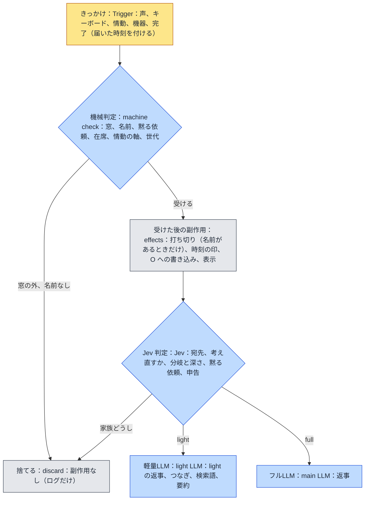

# familiar-ai 設計方針：判定の段（v0.8）

届いたきっかけ（声、キーボード、情動、機器、完了）をどう扱うかを、**判定の段**に分けて決める。段は安い順に
**機械判定、Jev 判定、軽量LLM、フルLLM** の 4 つで、前の段で決まったことは後ろの段へ渡さない。課題は `課題8` の
出-au。環-w（軽量LLM の判定を Jev へ移す）は、この文書の Jev 判定の段に取り込む。決まりは本人が 2026-09-26 に
1 問ずつ決めた。

## 1. 目的

2026-09-26 の見直しで、**声が「話していいか」の門より前に副作用を起こしている**ことが分かった。門で捨てる声（テレビ、
窓の外の家族の話）でも、次のことが起きていた。

- **打ち切り**：調べもの、考えている途中の主LLM、情動の求め、タイマーの知らせを考えている求め、人の出入りの記録の
  書き込みを、すべて取り消していた（`push_utterance` が入口の門より前に `_abort_lookups` を呼ぶ）。
- **話しかけられた時刻の印**：テレビの声で「ひとりの回数」が 0 に戻っていた。
- **画面の表示**：捨てた声も会話ログに出ていた。

ほかに、窓を届いた時刻でなく取り出した時刻で判定していること、`_finish` に世代の確認が無いこと、窓の中の家族どうしの
話にも返事をしてしまうことが見つかった。どれも「どの段で何を決めるか」が決まっていないことから来ている。

## 2. 判定の段

原則は 3 つある。

1. **各段は、その段で決まることだけを決める。** 決まらなければ次の段へ渡す。
2. **副作用は、機械判定で受けると決まった入力にだけ起こす。** 打ち切り、話しかけられた時刻の印、O への書き込み、
   画面の表示がこれに当たる。
3. **判定は届いた時刻で行う。** 駆動体が別の反復を回していても、窓の判定は届いた時刻に対して行う。

### 2.1 機械判定

| 決めること | 決まり |
|---|---|
| 窓 | **30 秒**（v0.3 の 1 分から変える）。**声もキーボードも**、名前（`ME.md`、1 字違いまで）で開き、窓の中の入力で 30 秒へ延ばす。窓の外の入力は捨て、副作用を起こさない |
| 打ち切り | **名前がある入力でだけ**起こす。名前の無い入力は、途中の求めを打ち切らない（§2.4） |
| タイマー | 止める、一時停止、再開も**名前が要る**（「パジュ、止めて」で止まる。「止めて」だけでは止まらない） |
| 黙る依頼 | いまのまま（`設計方針_話していいかの決まり` §2.5）。解くのは名前と「話していいよ」が同じ発話にあるとき |
| 在席、情動の軸 | いまのまま（同 §2.1） |
| 世代 | 打ち切られた求めの反復は、声にする前と記録を書く前（`_finish`）の両方で畳む |

### 2.2 Jev 判定

いま軽量LLM がしている**判定の役目は、すべて Jev へ移す**。軽量LLM に残るのは文章を書く仕事（light の返事、つなぎ、
動作の中身、日付、要約、自己像など）だけになる。決めたのは本人で、2026-09-27 に 1 問ずつ詰めた。過去のログで精度を
測る実験は、入力そのもの（門が無かったころのテレビの声や聞き違い）が崩れていたので途中でやめ、測らずに置き換える。

#### 2.2.1 どの判定でも同じ決まり

- **Jev が使えないとき**（鍵が無い、時間切れ、429、529、形の誤り）は、判定ごとの**機械の既定へ倒す**。軽量LLM の判定の口は
  外す（判定の作りを 1 通りにする）。
- **確信度が 0.6〔仮〕より低ければ**、判定ごとの**倒し先**へ倒す。倒し先は「迷ったときに害が小さい側」で、下の表に書く。
- はい／いいえの質問（Noul）は確信度を持たないので、はいの確率が 0.5 以上なら「はい」とする。
- 感情の評価と気分の見立ては、確信度で倒さずにそのまま使う（Score は段の確率で重みづけた値なので、迷いは値が真ん中に寄る形で表れる）。

#### 2.2.2 調停

Jev に **1 回で**次の質問をまとめて送る。送る文（`state`）は、W 全部とその場の言葉（本人の決定 イ）に、起点ごとの先導文、
判断の目安（分岐の決め方。見る動作が使えるときは、写真の読み取りの記録で答えてよいか、首を向けた帰りに向け直さないか、も）、
反復の上限と回数の但し書き、いまの時刻、在席を添えたものである。人格と家族は送らない。

| 質問 | 型 | 選択肢 | 使うとき |
|---|---|---|---|
| 分岐 | Choice | light（何も動かさず短く答える）、full（何も動かさず、記憶を踏まえた言葉や説明で答える）、action（先に何かを動かす） | いつも |
| 深さ | Choice | low（ふつう）、medium（複雑な気持ち、4 つ以上の記憶、調べた結果をまとめる）、high（よく考えるよう明示された） | 分岐が full のとき |
| 動作 | Choice | そのとき使える動作だけを並べる（見る、首を向ける、タイマー、止める、一時停止、再開、ストップウォッチ、アラーム、予定、家の決まり、日次記録、メモを探す、記録を聞く、記憶を探す、インターネット、確認待ちへの「いい」） | 分岐が action のとき |
| 時期を指しているか | Noul | 特定の過去の時期（去年の夏、先週など）を指している | いつも |
| 黙る依頼か | Noul | いまは話しかけないでほしいと頼んでいる（名前は問わない。名前は入口の窓で見る。「待って」は当たらない） | 道具の帰りでないとき |
| 黙る長さ | Choice | 指定なし（既定 30 分）、5 分、10 分、15 分、30 分、60 分 | 黙る依頼のとき |
| 解く依頼か | Noul | 黙っているところへ、もう話していいと解いた | 黙っているとき（機械の判定 `is_release` と並べる） |
| 名乗ったか | Noul | 自分の名前を名乗った（「〜だよ」「〜です」） | 道具の帰りでないとき |
| 誰を名乗ったか | Choice | `FAMILY.md` の呼び方と「家族以外・分からない」 | 名乗ったとき（家族以外は話者に付けない・いまと同じ） |
| 打ち消したか | Noul | いまの呼び方の人ではないと打ち消した（「〜じゃないよ」「ちがう」） | 道具の帰りでないとき |
| どの呼び方を打ち消したか | Choice | 家族の呼び方と、いまの話者 | 打ち消したとき |

確信度で倒すのは分岐と動作だけである。深さ、黙る長さ、名乗った名前、打ち消した呼び方は、いちばん確率の高い選択肢をそのまま採る。
道具の帰りの反復では、黙る依頼、名乗り、打ち消しを問わず、答えに混じっていても読まない。道具の返りの文（「その間は黙って待ちます」など）を
人の頼みとして読まないための機械の守りである。

そのあと、**文章が要るときだけ**軽量LLM を 1 回呼ぶ。何も要らなければ呼ばない。

| Jev の答え | 軽量LLM が書くもの |
|---|---|
| light | 返事 |
| full | 何も書かない（呼ばない） |
| action | 動作の中身（分数、時刻、番号、探す語など）だけ。行き先の決まった動作（家の決まりなど）は探す語も書かない |
| （待ちの知らせ・分岐は判定しない） | つなぎと、言いたいことの捨て場（`trash`）。§2.3 |
| 時期を指している | 日付（本人の決定 ア。日付は Jev の弱点なので書かせない） |

つなぎは、決まった言い回しから選ばず、軽量LLM が書く（本人の決定 ア）。捨て場は読み捨てる欄で、置かないとつなぎが用件を言い切る
（`課題8` 出-aj）。軽量LLM には、人格と家族をシステム文で、口調の決まり（丁寧さを混ぜない、すでに伝えた一言があれば言い直さずに
続けて短く）と、決まった分岐をプロンプトで渡す。軽量LLM はもう選ばないので、先導文の「次のどれかを選ぶ」は「決まったことに要る言葉を
書く」に替えて渡す。

Jev の答えと軽量LLM の文章を合わせて決定に組み立てるとき、前の調停の機械の守りをそのまま通す（見る動作はカメラがあるときだけ、
使えない動作は倒す、など）。組み立てた決定が light でも、人の言葉が道具の要る頼み（タイマー、アラーム、測る、止める）か、
動いているタイマーへの操作の言葉なら、full（深さ low）へ倒す。light は道具を使えず、「掛けました」と言うだけになるためである。

**写真の読み取りは、システムの状態として残す**（本人の決定 ア・2026-09-27）。Jev は写真を見られないので、調停に写真を
渡す形（v0.46）はやめる。見る動作のあと、写真を読む口（`scene.read_photo`。場面用の担い手、設定が無ければ軽量LLM）を 1 回呼び、「見えたもの」と
「写っている人の見立て（呼び方と確信度）」を返させる。見えたものは O の記録（「見えたもの：…」）、見立ては在席
（`_apply_seen_people`・1 人なら話者にする）に残す。調停が見ると決めた帰りの反復は、この読み取りを**待ってから**回し、
Jev は W の中の記録を文として読んで分岐を決める。主LLM が見ると決めた道（主LLM に写真を渡す・`say` の `seen_people`）は
変えない。調停の返りにあった人の見立ての欄（`seen_people`）は外した（調停に写真が渡らないので、いつも空になるため）。

| 場合 | 倒し先・既定 |
|---|---|
| Jev が使えない | 分岐 full、深さ low、時期は指していない、黙る依頼は無し |
| 分岐・動作の確信度が低い | full（主LLM に任せる。違う動作をするより害が小さい） |
| 軽量LLM が時間切れ、失敗、読めない返り | full、深さ low。時間切れは計測ログの調停の行に「時間切れ=yes」と残す（層 3 が調停の時間切れの秒数を見直す材料） |

#### 2.2.3 残りの判定

| 判定 | Jev に送る文 | 聞くこと（型） | 使えないとき・確信度が低いとき |
|---|---|---|---|
| 続き先 | W 全部、その場の言葉 | この言葉は W のどの行の続きか。W の行の id と「どれの続きでもない」を選択肢に（Choice・255 個まで） | どれの続きでもない（間違った続きは次の想起を汚す） |
| 発話前の検査 | 返事の文、その場の言葉、在席、W | この返事が破っている決まりはどれか。決まりの一覧と「破っていない」を選択肢に（Choice） | 破っていない（迷っただけで主LLM を呼び直さない） |
| 感情の評価 | そのターンの言葉と返事 | 快、不快、支配を **5 段**ずつ（Score ×3・本人の決定 ア） | 測らない（いまも測れないときは使わない） |
| 気分の見立て | 相手の言葉 | 相手の気分を、いまの見立ての名前から選ぶ（Choice） | 見立てない（既定の absent） |
| 記憶の申告 | 返事の文、W に載った記憶 | 記憶ごとに、返事に使った／大事だった／使わなかった（Choice を記憶の数だけ 1 回で） | その記憶は申告しない（間違った「大事」は根づきを誤って動かす） |
| 宛先（新） | 窓の中の名前の無い言葉、直近のやりとり、在席 | パジュ宛て／家族どうし／分からない（Choice）。家族どうしは受けない | 受ける（無視されたと感じさせるより害が小さい） |

**気分の見立ての効かせ先**（出-av・2026-09-30・本人の決定ア）：会話の求めで主LLM を呼ぶ反復だけ見立て（続き先の判定を待つあいだに投げる）、主LLM の system 文の在席の隣に `[相手の様子]` の一行を置く（乗り気で話している／うれしそう・楽しそう／疲れていそう／苛立っているか、困っていそう。話者が分かればその名前で）。返事の調子を相手に合わせるためで、パジュ自身の気分と O には効かせない。分からない（absent）ときは何も置かない。情動と機器の求めでは見立てない。
| 考え直すか（新・§2.4） | 元の問い、主LLM の返事、考えているあいだに言い足された言葉 | 考え直す／そのまま出す（Choice） | そのまま出す |

#### 2.2.4 移す順

1 つずつ移し、そのたびに試験を通す。小さく新しいものから始め、組み替えの大きい調停を最後にする。

1. 考え直すか（新）
2. 宛先（新）
3. 発話前の検査
4. 続き先
5. 記憶の申告
6. 感情の評価と気分の見立て
7. 調停

### 2.3 つなぎで窓を保つ

調べものと主LLM のどちらでも、**待たせている時間が 5 秒を超えたら 1 回、その後は 20 秒ごとに**つなぎを出し、窓を
延ばす。窓が 30 秒になるので、30 秒を超える調べものの答えが窓の外になって独り言になるのを防ぐ。

**つなぎを出すのはこの口だけである**（出-aq 段 6・7・2026-09-29）。会話の求めにだけ付け、情動と機器には付けない。
主LLM の前や、調べものを投げる前には言わない。速く返れば、つなぎ無しで答える。知らせで起きた反復は分岐を判定せず、
Jev に聞かないで、軽量LLM につなぎと捨て場だけを書かせる（`Arbiter.write_filler`・何を待っているかは機械が渡す）。
同じつなぎは 2 度言わない（記号を外し、どちらかがもう片方を含めば同じ・本人の決定ア）。つなぎの声が鳴り終わって
1 秒は、答えを声にしない（`filler_answer_gap_seconds`・本人の決定）。詳しくは `イベント駆動ループ` の
「つなぎの作り直し」。`設計方針_話していいかの決まり` v0.3 §2.3 の
「窓を保つための能動的なつなぎは作らない」は、この決定で改める。

### 2.4 名前の無い入力が途中の求めに届いたとき

名前の無い入力は打ち切らず、**前の求めに添える**。

| 途中の状態 | 扱い |
|---|---|
| 調べもの中 | 結果が届いた後の決める反復で W に載せる |
| 主LLM が考えている最中 | 返りが来たら、返りと届いた入力を組にして Jev で判定する。**考え直す**（返りを声にせず、入力を前の求めに添え、返りを「考えかけていた返事」として W に載せて、調停から決め直す）か、**そのまま出す**（返りを声にし、入力は別の新しい求めにする）。Jev が使えなければ「そのまま出す」 |

## 3. 前の決定と入れ替わるもの

| 文書 | 前の決定 | 改めた決定 |
|---|---|---|
| `話していいかの決まり` v0.3 §2.3 | 窓は 1 分 | 30 秒 |
| 同 §2.3 | キーボードはいつでも受けて窓を開ける | 声と同じく名前で開く |
| 同 §2.3 | 窓を保つための能動的なつなぎは作らない | 5 秒、その後 20 秒ごとにつなぐ |
| 同 §2.4 | タイマーの操作の言葉は名前が無くても通す | 名前が要る |
| `課題8` 環-w | 3 つの判定で測ってから広げる | 判定はすべて Jev へ移す（測る順は残す） |

## 3b. 実装の進み（v0.5・2026-09-27）

| 段 | 中身 | コミット |
|---|---|---|
| 1-1 | 入力に届いた時刻と出どころを付ける（`core/wake_window.InputText`・`VoiceText`・`KeyText`・`arrived_at`）。積む口 4 か所（声の書き起こし、画面、TUI の打鍵と録音、CUI）で包み、`agent.run` は名前の札を外す前に読む | `eb359a8` |
| 1-2、1-3 | 門を `push_utterance` の中で届いた時刻で判定する。窓の外の入力は打ち切りも時刻の印も付けない。打ち切りは名前があるときだけ（`Trigger.named`）。窓 30 秒、キーボードも名前で開く、タイマーの操作にも名前が要る（`lifts` も）。名前の無い入力は飛行中の調べものがある間は保留箱で待つ（`_take_trigger`） | `79ac518` |
| 1-5 | 打ち切られた求めの `_finish` は、声になった事実だけを書き、次の求めの状態に触らない | `6c206d9` |
| 1-4 | 会話ログは門が受けた入力だけ（`set_heard_listener`）。捨てた入力は状態の行に「聞いていない」を次の表示まで（画面、TUI）。コマンドは `agent.run` が知らせる | `4ba020e` |
| 2 | 会話の求めで待たせている間は、つなぎを 5 秒、その後 20 秒ごと（`wait_filler_repeat_seconds`）に繰り返す。主LLM の待ちも見張る。見張りは求めごとに 1 本（`_watch_waiting`）。「進捗」の反復は上限に数えない。本物の結果と「進捗」が一緒なら結果に答える | `9bcdb8e` |
| 3 | 名前の無い入力は、調べもの中なら前の求めに添える（`_attach_to_request`・役割「添え」・W の「言い足したこと」の枠）。主LLM の待ち中は返りで判定の口（`_rethink_or_speak`）を通す（段 5 までは常に「そのまま出す」） | `d5b1e72` |
| 4 | Jev を呼ぶ口（`backends/jev.py`）と、退避ログの判定に Jev を当てる実験の道具（`scripts/experiment_jev.py`）。調停の分岐で一致 62.5%（293 件）。入力が崩れていた（門の前のテレビの声や聞き違い）ので、測るのはやめた | `2866ea2`、`9da6efd`〜`4dcb402` |
| 5-0、5-1 | Jev の判定の土台（`core/jev_judges`。確信度 0.6 未満と失敗は倒し先へ、時間切れ 2.0 秒）。考え直すかを Jev が決める | `a93f56e` |
| 5-2 | 窓の中の名前の無い声の宛先を Jev が決め、家族どうしなら捨てる。あわせて、駆動体が待つ所のキャンセルの握りつぶしを直した（環-aa・`core/aio.wait_within`） | `a96b28b` |
| 5-3 | 発話前の検査を Jev が決める。照らす決まりはシステム文から機械で読む。差し戻しは「決まり id と説明」 | `c47c5da` |
| 5-4 | 続き先を Jev が決める（W の行が選択肢）。失敗は落ちたと数える | `97d0648` |
| 5-5 | 軽量LLM が答えて閉じた反復の記憶の申告を Jev が決める（記憶ごとの質問を 1 回で） | `d9cb0ce` |
| 5-6 | 感情の評価（Score 5 段 ×3）と相手の気分の見立て（Choice）を Jev が決める | `801cc05` |
| 5-7a | 写真の読み取りを状態として残す（`scene.read_photo`。調停が見ると決めた帰りは待って O と在席へ） | `7cad840` |
| 5-7b、5-7c | 調停の骨組み（`loop/arbiter.Arbiter`）。Jev が 1 回で判定し、要るときだけ軽量LLM が 1 回で書く | `3e911a2`、`0924dbc` |
| 5-7d | ループを `Arbiter.decide` へつなぎ替え、前の調停（1 つの軽量LLM の指示文と JSON の読み取り）を外した。捨て場、文章の時間切れの計測、道具の帰りの守りを戻した。黙る依頼の問いから名前を外し、調停の返りの見立ての欄を外した | `a95d48a`、`e387063` |

試験では、ループの仕組みを確かめる試験が名前の無い素の文を渡すので、`conftest` が窓を開けて通す。門そのものを確かめる試験は `real_window` の印で本物の判定を使う。
調停の試験は、偽の Jev の答え（決めること）と偽の軽量LLM の文章（書くこと）を分けて与え、本物の `Arbiter.decide` を通す（`tests/_arbiter_fakes.py`・環-ab の B）。前の調停の書き方（軽量LLM の返す 1 つの JSON）で答えを与える試験用の口は、移し終えて外した。

段 5 はどれも机上の実装で、実機ではまだ確かめていない。

## 4. 未決〔仮〕

- 確信度のしきい値 0.6 は仮の値。実機で倒れ方を見て直す。
- 名前の聞き違い（「はじゅ」「パチュー」）は、実機で続けて直す。

## 更新履歴

> v0.8：§2.2.3 に、気分の見立てをどこで見立て、何に効かせるか（主LLM の `[相手の様子]`）を書き足した（2026-09-30・出-av）。
> v0.7：§2.2 の軽量LLM が書くものの表と §2.3 を出-aq 段 6・7 に合わせた。調停はつなぎを書かせず、つなぎは待ちの知らせの口だけが書く（2026-09-29）。
> v0.6：§3b の試験の段落を、環-ab の B（試験用の古い口を外し、Jev の答えと文章を分けて与える道具へ移した）に合わせた（2026-09-28）。
> v0.5：段 5（判定を Jev へ移す）の実装を反映した（2026-09-27・`a93f56e`〜`e387063`）。§2.2.2 を実物に合わせた（送る文の中身、確信度で倒すのは分岐と動作だけ、道具の帰りの守り、書くものの細目と捨て場、組み立ての守り、軽量LLM の時間切れ、写真を読む口と見立ての欄の撤去、黙る依頼の問いから名前を外した）。§2.4 の考え直すを実物の形に、§3b に段 5 を足した。
> v0.4：§2.2.2 の調停に、解く依頼・名乗り・打ち消しの質問を足し、写真の読み取りをシステムの状態として残す形（調停に写真を渡さない）を決めた（2026-09-27・本人）。
> v0.3：§2.2 を詳しくした（2026-09-27・本人）。Jev が使えないときは機械の既定、確信度 0.6〔仮〕未満は倒し先へ、調停は Jev に 1 回で聞いてから文章が要るときだけ軽量LLM、時期は Noul で聞いて日付は軽量LLM、動作の中身とつなぎは軽量LLM が 1 回で、送る文は W 全部、感情は 5 段、移す順。§3b に段 2〜4 を足した。
> v0.2：段 1（機械判定）を実装した（§3b・2026-09-27）。
> v0.1：新規作成（2026-09-26）。判定の段（機械判定、Jev 判定、軽量LLM、フルLLM）、副作用は受けた入力にだけ起こす、
> 窓 30 秒と名前で開くキーボード、打ち切りとタイマーの操作に名前が要る、つなぎで窓を保つ、名前の無い入力は前の求めに
> 添える、軽量LLM の判定をすべて Jev へ移す、を決めた。
