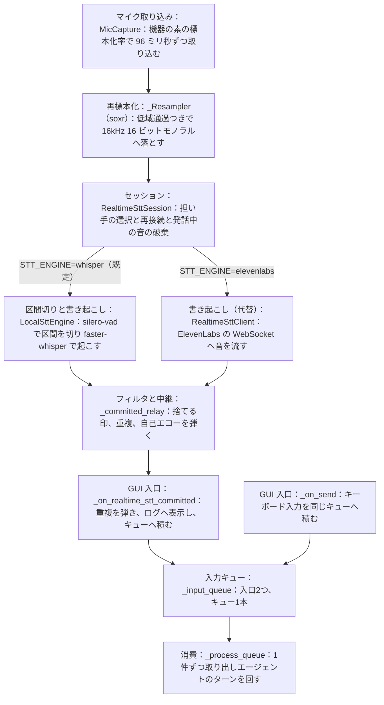

# familiar-ai 音声入力から GUI への経路 v0.1

> 常時集音した音声が書き起こされ、GUI の入力キューへ届くまでの実装済みの経路の記録。
> 2026-07-30 時点のソースコード（ブランチ `develop-ikuchan`）を正とする。設計の正本は
> `設計図_Mermaid` の [D-知覚] にあり、本書はその実装がいまどう動いているかを記す。
> 録音ボタン式の別経路（`tools/stt.py` の `STTTool`。録音を終えてから一括で起こす）は
> 本書の対象外である。

## 全体像

経路は6段で、すべて GUI プロセス内の asyncio イベントループ上で動く。書き起こしの担い手は
環境変数 `STT_ENGINE` で選び、既定はローカル（silero-vad と faster-whisper）である。
`elevenlabs` を指定すると従来の WebSocket 版（ElevenLabs Scribe v2 Realtime）へ戻せる。
両者は口の形（`connect`、`close`、`send_audio`、`on_committed`）が同じで、後段の
フィルタと中継はどちらでも変わらない。

## 1. 取り込みと再標本化（`tools/mic.py`）

`MicCapture` が sounddevice で既定のマイクを開く。`AUDIO_INPUT_DEVICE` に名前の一部を
指定すると、その機器を選ぶ。標本化率は機器の素の値を使い（Yamaha YVC-300 は 48,000 Hz）、
96 ミリ秒ずつ取り込む。この長さは 16kHz 換算で 1,536 サンプルになり、silero-vad が要求する
512 サンプルで割り切れる（余りを持ち越さない）。

再標本化は `_Resampler` が行う。`soxr.ResampleStream` で低域通過フィルタを通してから
3:1 に間引き、16kHz 16 ビットモノラルにする。フィルタの状態を取り込みブロックをまたいで
保つので、96 ミリ秒ずつ渡しても境目に段差が入らない。以前は `np.interp` で位置を拾うだけで
帯域を切っておらず、8kHz より上の成分が折り返して書き起こしが話した内容と全く違うものに
なっていた。

## 2. セッションと担い手の選択（`realtime_stt_session.py`）

`REALTIME_STT=true` のときだけ `create_realtime_stt_session()` がセッションを作る。
API キー（`ELEVENLABS_API_KEY`）が要るのは `STT_ENGINE=elevenlabs` のときだけで、
ローカル（既定）では要らない。

`RealtimeSttSession._connect_client()` が担い手を組み立てる。既定はローカルの
`LocalSttEngine`、`elevenlabs` なら `RealtimeSttClient`（WebSocket）である。切断の監視
（1 秒ごと）と再接続もセッションが持つ。ローカルの担い手は `connected` が常に真なので、
この監視は実質 WebSocket 版のためにある。

マイクの音は `_send_audio()` を通って担い手へ渡るが、**自分が喋っているあいだ
（`VoiceLoopGuard.speaking`）の音は捨てる**。スピーカーから出た自分の声がマイクへ回り込み、
書き起こされて自分への入力になるのを、音の段階で防ぐ。

## 3. 区間切りと書き起こし（`tools/local_stt.py`、ローカル既定）

`LocalSttEngine` は受け取った音を 512 サンプルずつ `silero_vad.VADIterator` へ渡す。
VAD は発話の始まりと終わりの境目でだけ値を返し、無音の長さは VAD が内部で数える
（`STT_VAD_SILENCE_SEC`＝1.0 秒の無音で区間の終わり）。区間の扱いは3つに分かれる。

- **通常**：区間の終わりで溜めた音を一括で書き起こす。
- **長すぎる区間**：`STT_MAX_SEGMENT_SEC`（30 秒）に達したら強制的に区切る。雑音が
  続いたときに GPU とメモリを食い続けないための蓋で、whisper の処理単位（30 秒）に合わせた。
- **短すぎる区間**：`STT_MIN_SEGMENT_SEC`（1.5 秒）未満はその場で書き起こさず、次の発話の
  頭へ持ち越して文脈を繋ぐ。実測で、1.0 秒に分断された断片が「ジュージュージュー」に崩れた
  （一括なら正しく起こせた）ためである。次の発話が `STT_HOLD_GIVE_UP_SEC`（3.0 秒）来なければ
  諦めて単独で書き起こす。「はい」だけの返事が永久に届かないのを避ける。

書き起こしのモデルは `tools/stt.py` の `load_whisper_model()` をプロセスで1つだけ共有する
（既定は `large-v3`、`int8_float16`、cuda）。`agent.py` が起動時に背景スレッドで先読みし、
最初の書き起こしを待たせない。モデルへは 16kHz の float32 配列を直接渡す。WAV に包むと
faster-whisper が復号と再標本化を行い、その途中で落ちる経路があるためである。

**部分結果は出さない。** 途中で何度も書き起こすと GPU を無駄に回す（発話 3 秒なら 6 回）。
代わりに発話の始まりを `on_speech_start` で知らせ、セッションが GUI のステータス行へ
「聞いています」の印を出す。WebSocket 版は部分結果を返すので、その場合はステータス行に
書き起こし途中の文が流れる。

## 4. フィルタと中継（`realtime_stt_session.py` の `_committed_relay`）

確定した書き起こしは、GUI へ渡る前にセッション内で4段のふるいを通る。

1. **捨てる印**（`should_skip_stt`）：2 文字未満、括弧書きの音イベントだけのもの、
   「聞き取り不能」等の印を含むもの、記号だけ、フィラー（「えっと」等）、同じ語の繰り返し
   （幻聴的な書き起こし）を捨てる。印は後ろに文が続いても捨てる。実機で「（聞き取り不能）
   え、…」が通り抜け、聞き返しの声をまた拾う往復が 35 秒に 7 回起きた。
2. **重複の除去**：正規化した文が 3 秒以内に連続したら捨てる（セッション内の窓）。
3. **自己エコーの門**（`VoiceLoopGuard.check_transcript`）：直前の自分の発話と一致する
   書き起こしを弾く。段2で音を捨てても、喋り終わりの残響が拾われることがある。弾きが
   繰り返されると watchdog がセッションを再起動する。
4. 通過した文だけを、表示用コールバックへ渡し、GUI から預かった入力キューへ積む。

## 5. GUI の入口（`gui.py`）

GUI は起動時に `RealtimeSttController`（セッションの包み）を作り、表示用コールバックと
`_input_queue` を配線する。確定文が届くと `_on_realtime_stt_committed` が動き、
`DuplicateInputFilter.accept` を通し、チャットログへ話者名つきで表示し、キューへ積み、
入口名 `stt` を添えてログを残す。キーボードの `_on_send` も同じフィルタとキューを通り、
入口名は `keyboard` である。**入力キューは1本で、入口が2つ**という形になっており、
実機で1つの発言に2回答えた件（2026-07-30）を受けて、入口名のログとこのフィルタが入った。

`DuplicateInputFilter` は同じ文が `INPUT_DEDUPE_WINDOW_SEC`（3.0 秒）以内に続けて来たら
落とす。窓は受け入れた時刻から測るので、聞こえなかったと思って言い直した同じ文は通る。
段4の重複除去がセッション内（音声どうし）なのに対し、こちらは入口をまたぐ
（音声とキーボードの衝突も弾く）。

## 6. 消費（`gui.py` の `_process_queue`）

`_process_queue` がキューから1件ずつ取り出し、`_run_agent(text)` でエージェントのターンを
回す。取り出し待ちのあいだの自発的な動きは GUI の仕事ではなく、Tonic が drive を回して
別のキューへ積む。GUI は入力を待つだけである。

## 設定値

| 環境変数 | 既定値 | 意味 |
|---|---|---|
| `REALTIME_STT` | （無効） | `true` で常時集音を有効にする |
| `STT_ENGINE` | `whisper` | 書き起こしの担い手。`elevenlabs` で WebSocket 版へ戻せる |
| `WHISPER_MODEL` | `large-v3` | faster-whisper のモデル |
| `WHISPER_COMPUTE_TYPE` | `int8_float16` | 量子化。精度をほぼ保って VRAM を約半分（2.5GB 程度）にする |
| `WHISPER_DEVICE` | `cuda` | 書き起こしを回す機器 |
| `STT_LANGUAGE` | `ja` | 書き起こしの言語 |
| `STT_VAD_SILENCE_SEC` | 1.0 | 発話の終わりとみなす無音の長さ（秒） |
| `STT_MAX_SEGMENT_SEC` | 30.0 | 1つの発話区間の上限（秒） |
| `STT_MIN_SEGMENT_SEC` | 1.5 | これより短い区間は次の発話まで持ち越す（秒） |
| `STT_HOLD_GIVE_UP_SEC` | 3.0 | 持ち越しを諦めて単独で書き起こすまでの無音（秒） |
| `AUDIO_INPUT_DEVICE` | （既定機器） | マイクを名前の一部で選ぶ |
| `INPUT_DEDUPE_WINDOW_SEC` | 3.0 | GUI 入口の重複を弾く窓（秒） |
| `ELEVENLABS_API_KEY` | （空） | `STT_ENGINE=elevenlabs` のときだけ要る |

## 既知のずれ

- GUI の起動メッセージが `🎤 Realtime STT ON (ElevenLabs)` という固定文字列で、ローカルの
  faster-whisper で動いていても ElevenLabs と表示する（`gui.py`）。
- `直近の進め方と進捗` v0.59 の申し送りに「STT は ElevenLabs のまま」とあるが、常時集音は
  ローカル化済みで既定がローカルである。進捗側の記述が実装より古い。

---

## 更新履歴

> v0.1：初版。常時集音のローカル化（silero-vad と faster-whisper）後の経路を、2026-07-30
> 時点のソースコードに基づいて記録した。
