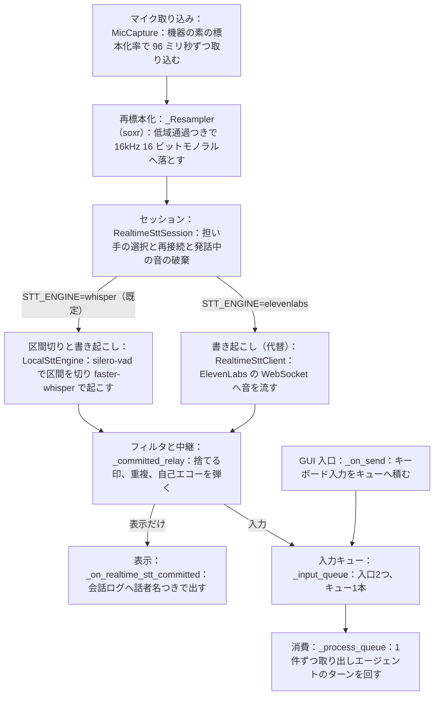

# familiar-ai 音声入力から GUI への経路 v0.10

> 常時集音した音声が書き起こされ、GUI の入力キューへ届くまでの実装済みの経路の記録。
> 2026-07-30 時点のソースコード（ブランチ `develop-ikuchan`）を正とする。設計の正本は
> `設計図_Mermaid` の [D-知覚] にあり、本書はその実装がいまどう動いているかを記す。
> 録音ボタン式の別経路（`tools/stt.py` の `STTTool`。録音を終えてから一括で起こす）は
> 本書の対象外である。

## 全体像

経路は6段で、すべて GUI プロセス内の asyncio イベントループ上で動く。書き起こしの担い手は
環境変数 `STT_ENGINE` で選び、既定はローカル（silero-vad と faster-whisper）である。
`elevenlabs` を指定すると従来の WebSocket 版（ElevenLabs Scribe v2 Realtime）へ戻せる。
両者は口の形（`connect`、`close`、`send_audio`、`on_committed`）が同じで、後段の
フィルタと中継はどちらでも変わらない。

## 1. 取り込みと再標本化（`tools/mic.py`）

`MicCapture` が sounddevice で既定のマイクを開く。`AUDIO_INPUT_DEVICE` に名前の一部を
指定すると、その機器を選ぶ。標本化率は機器の素の値を使い（Yamaha YVC-300 は 48,000 Hz）、
96 ミリ秒ずつ取り込む。この長さは 16kHz 換算で 1,536 サンプルになり、silero-vad が要求する
512 サンプルで割り切れる（余りを持ち越さない）。

再標本化は `_Resampler` が行う。`soxr.ResampleStream` で低域通過フィルタを通してから
3:1 に間引き、16kHz 16 ビットモノラルにする。フィルタの状態を取り込みブロックをまたいで
保つので、96 ミリ秒ずつ渡しても境目に段差が入らない。以前は `np.interp` で位置を拾うだけで
帯域を切っておらず、8kHz より上の成分が折り返して書き起こしが話した内容と全く違うものに
なっていた。

再標本化のあとに**入力ゲイン**を掛ける（`apply_gain`・`AUDIO_INPUT_GAIN`・既定 1.0）。
マイク（YVC-300）のハード音量は上限（20/20・0 dB）で、それでも普通の声だと VAD が区間を
1.3 秒で短く切り、whisper は無音時の定型を出して `no_speech_prob` で捨てられた（2026-09-16
実機）。VAD と whisper はどちらもこの後段なので、ここで増やせば両方に効く。int16 の範囲を
超えた分は飽和させる（折り返して逆相の雑音にしない）。倍率は起動ログの
`Microphone capture: … gain=` に残る。

## 2. セッションと担い手の選択（`realtime_stt_session.py`）

`REALTIME_STT=true` のときだけ `create_realtime_stt_session()` がセッションを作る。
API キー（`ELEVENLABS_API_KEY`）が要るのは `STT_ENGINE=elevenlabs` のときだけで、
ローカル（既定）では要らない。

`RealtimeSttSession._connect_client()` が担い手を組み立てる。既定はローカルの
`LocalSttEngine`、`elevenlabs` なら `RealtimeSttClient`（WebSocket）である。切断の監視
（1 秒ごと）と再接続もセッションが持つ。ローカルの担い手は `connected` が常に真なので、
この監視は実質 WebSocket 版のためにある。

マイクの音は `_send_audio()` を通って担い手へ渡るが、**自分が喋っているあいだ
（`VoiceLoopGuard.speaking`）の音は捨てる**。スピーカーから出た自分の声がマイクへ回り込み、
書き起こされて自分への入力になるのを、音の段階で防ぐ。

## 3. 区間切りと書き起こし（`tools/local_stt.py`、ローカル既定）

`LocalSttEngine` は受け取った音を 512 サンプルずつ `silero_vad.VADIterator` へ渡す。
VAD は発話の始まりと終わりの境目でだけ値を返し、無音の長さは VAD が内部で数える
（`STT_VAD_SILENCE_SEC`＝1.0 秒の無音で区間の終わり）。区間の扱いは3つに分かれる。

- **通常**：区間の終わりで溜めた音を一括で書き起こす。
- **長すぎる区間**：`STT_MAX_SEGMENT_SEC`（30 秒）に達したら強制的に区切る。雑音が
  続いたときに GPU とメモリを食い続けないための蓋で、whisper の処理単位（30 秒）に合わせた。
- **短すぎる区間**：`STT_MIN_SEGMENT_SEC`（1.5 秒）未満はその場で書き起こさず、次の発話の
  頭へ持ち越して文脈を繋ぐ。実測で、1.0 秒に分断された断片が「ジュージュージュー」に崩れた
  （一括なら正しく起こせた）ためである。次の発話が `STT_HOLD_GIVE_UP_SEC`（3.0 秒）来なければ
  諦めて単独で書き起こす。「はい」だけの返事が永久に届かないのを避ける。

書き起こしのモデルは `tools/stt.py` の `load_whisper_model()` をプロセスで1つだけ共有する
（既定は `large-v3`、`int8_float16`、cuda）。`agent.py` が起動時に背景スレッドで先読みし、
最初の書き起こしを待たせない。モデルへは 16kHz の float32 配列を直接渡す。WAV に包むと
faster-whisper が復号と再標本化を行い、その途中で落ちる経路があるためである。

**音声でなかったものは捨てる。** Whisper は無音や物音に対して、学習データの字幕によくある文（「ご視聴ありがとうございました」等）を当てはめる。silero-vad は音の有無しか見ないので、物音が区間として切り出されると書き起こしへ回る。faster-whisper が返す `no_speech_prob` が `STT_NO_SPEECH_MAX`（0.72）を超えたら、その書き起こしをまるごと捨てる。この値は実機15件にラベルを付けて決めた（幻聴は全件 0.722 以上、本物は全件 0.709 以下）。根拠は『計測・設定値 根拠台帳』§20 にある。`no_speech_prob` は 30 秒の窓ごとの値なので、セグメント単位では捨て分けられない。

**語の組で、渡す語と直す語を 1 つの表にする**（v0.9・2026-09-20）。表は **(直すべき語, (あり得る語…))** の
並びで（`STTConfig.word_groups`）、ここから 2 つが導かれる。**STT へ渡す語の列**（faster-whisper の
`hotwords`・`stt_rules.hotwords_for`）と、**書き起こしの直し**（`stt_rules.fix_words`・あり得る語を
直すべき語へ置き換える・長い語から当てる）である。直すべき語が `-` の組は「消す」（置き換え先が空）。
表は env `STT_WORD_GROUPS` でも足せる（組は `;`、直すべき語と配列は `：`、語は読点。空白は区切りに
使わないので、語の中の空白はそのまま残る）。名前は `ME.md` の「名前：」が**先頭の組**になる
（正本は `ME.md`・`create_realtime_stt_session` が組み立てる）。

**渡した語は、そのまま書き起こされることがある。** faster-whisper は `hotwords` を `initial_prompt` と
**同じ枠**（`<|startofprev|>`＝直前に出てきた言葉）へ入れる（`transcribe.py` の `get_prompt`）。Whisper は
音と直前の文章の両方から次の語を選ぶので、珍しい名前は「直前に出た」と置くと出やすくなる。裏返して、
音に情報がほとんど無い区間（遠いテレビの音・物音）では音が効かず、渡した言葉だけで決まる。実機
2026-09-20 17:22〜17:26 に、当時渡していた例文（`initial_prompt`）の後半「パジュ、3 分測って。」が
10.7 秒の音や 30 秒の窓から 11 字ちょうどで繰り返し上がり、会話入力として積まれ、GUI に並び、タイマーまで
掛かった（`no_speech_prob` は 0.02〜0.22 で、音声でないものを捨てる門（0.72）は通り抜ける）。効くことと
反響することは同じ性質の表裏で、片方だけは取れない。

そこで **`initial_prompt` は撤去した**（v0.8）。書き起こしの道具へ文を渡す口は、常時集音
（`local_stt._transcribe`）にも録音ボタン式（`tools/stt.py`）にも無い。そのうえで、**渡した語の列そのものを
「消す組」として自動で足す**（`stt_rules.with_hint`）。列が丸ごと返れば書き起こしは空になって捨てられ、
後ろに本物の言葉が続いていればその部分だけが残る。**語 1 つは消さない**——「パチュ」は人が名前を呼んだ
言葉でありうるので、消さずに「パジュ」へ直す。沈黙の守り（`core/silence_rules.names_me`）のゆるい読みは
そのまま（`イベント駆動ループ` v0.74）。名前の落ちやすさ（知-z）は開いたままで、表と直しで様子を見る。

**部分結果は出さない。** 途中で何度も書き起こすと GPU を無駄に回す（発話 3 秒なら 6 回）。
代わりに発話の始まりを `on_speech_start` で知らせ、セッションが GUI のステータス行へ
「聞いています」の印を出す。WebSocket 版は部分結果を返すので、その場合はステータス行に
書き起こし途中の文が流れる。

## 4. フィルタと中継（`realtime_stt_session.py` の `_committed_relay`）

確定した書き起こしは、GUI へ渡る前にセッション内で4段のふるいを通る。

1. **捨てる印**（`should_skip_stt`）：2 文字未満、括弧書きの音イベントだけのもの、
   「聞き取り不能」等の印を含むもの、記号だけ、フィラー（「えっと」等）、同じ語の繰り返し
   （幻聴的な書き起こし）を捨てる。印は後ろに文が続いても捨てる。実機で「（聞き取り不能）
   え、…」が通り抜け、聞き返しの声をまた拾う往復が 35 秒に 7 回起きた。
2. **重複の除去**：正規化した文が 3 秒以内に連続したら捨てる（セッション内の窓）。
3. **自己エコーの門**（`VoiceLoopGuard.check_transcript`）：直前の自分の発話と一致する
   書き起こしを弾く。段2で音を捨てても、喋り終わりの残響が拾われることがある。弾きが
   繰り返されると watchdog がセッションを再起動する。
4. 通過した文だけを、表示用コールバックへ渡し、GUI から預かった入力キューへ積む。

## 5. GUI の入口（`gui.py`）

GUI は起動時に `RealtimeSttController`（セッションの包み）を作り、表示用コールバックと
`_input_queue` を配線する。配線が済むとチャットログへ `🎤 Realtime STT ON (faster-whisper)`
のように出す。担い手の名前はセッションの `engine_label` から取り、その値は担い手を選ぶのと
同じ判定（`should_use_local`）で決まるので、`STT_ENGINE` を切り替えると表示も一緒に変わる。**入力キューは1本で、入口が2つ**という形になっている。音声は
セッションが段4の最後で直接キューへ積み、キーボードは `_on_send` が積む。

`_on_realtime_stt_committed` は**表示だけを担う**。「聞いています」の印を消し、チャット
ログへ話者名つきで一行出し、入口名 `stt` を添えてログを残す。ここでキューへ積まない。
セッションは確定文をこの差し込み口へ渡した**直後に**キューへも積むので、ここでも積むと
1つの発言が必ず2件になり、ターンが2回走る。実機で1つの発言に2回答えた件（2026-07-30）は
これが原因だった。

**表示の口では重複を落とさない。** 入力は別の口から入るため、ここで落としても入力は
止まらず、画面に出ないのにエージェントが答える食い違いになる。書き起こしどうしの重複は、
両方の口より前にある段4（セッション内の 3 秒の窓と `VoiceLoopGuard`）が済ませている。
キーボードは人が意図して打つものなので、重複を弾かない。

入口名を添えたログのキュー長は、両方の入口で同じ数え方になるよう揃えてある。音声は
積まれる前にログを出すため、`_log_input_queued` へ `pending=1` を渡して、積んでから出す
キーボード側と一致させる。

## 6. 消費（`gui.py` の `_process_queue`）

`_process_queue` がキューから1件ずつ取り出し、`_run_agent(text)` でエージェントのターンを
回す。取り出し待ちのあいだの自発的な動きは GUI の仕事ではなく、Tonic が drive を回して
別のキューへ積む。GUI は入力を待つだけである。

## 設定値

| 環境変数 | 既定値 | 意味 |
|---|---|---|
| `REALTIME_STT` | （無効） | `true` で常時集音を有効にする |
| `STT_ENGINE` | `whisper` | 書き起こしの担い手。`elevenlabs` で WebSocket 版へ戻せる |
| `WHISPER_MODEL` | `large-v3` | faster-whisper のモデル |
| `WHISPER_COMPUTE_TYPE` | `int8_float16` | 量子化。精度をほぼ保って VRAM を約半分（2.5GB 程度）にする |
| `WHISPER_DEVICE` | `cuda` | 書き起こしを回す機器 |
| `STT_LANGUAGE` | `ja` | 書き起こしの言語 |
| `STT_VAD_SILENCE_SEC` | 1.0 | 発話の終わりとみなす無音の長さ（秒） |
| `STT_MAX_SEGMENT_SEC` | 30.0 | 1つの発話区間の上限（秒） |
| `STT_MIN_SEGMENT_SEC` | 1.5 | これより短い区間は次の発話まで持ち越す（秒） |
| `STT_HOLD_GIVE_UP_SEC` | 3.0 | 持ち越しを諦めて単独で書き起こすまでの無音（秒） |
| `STT_NO_SPEECH_MAX` | 0.72 | これを超えたら音声でないとみなして捨てる（幻聴よけ） |
| （`ME.md` の「名前：」） | — | 綴りの並びが `STTConfig.word_groups` の**先頭の組**になる（先頭の綴りが直すべき語）。env からは与えない |
| `STT_WORD_GROUPS` | （空） | 語の組を足す。`パジュ：はじゅ、パチュ; -：消す語`（組は `;`・直すべき語と配列は `：`・語は読点・`-` は消す） |
| `AUDIO_INPUT_DEVICE` | （既定機器） | マイクを名前の一部で選ぶ |
| `AUDIO_INPUT_GAIN` | 1.0 | 取り込んだ PCM に掛ける倍率（0 以下・読めない値は 1.0）。この機械は 2.0 |
| `ELEVENLABS_API_KEY` | （空） | `STT_ENGINE=elevenlabs` のときだけ要る |

## 読み直し（GUI の `/reload`・`env_reload.py`）

設定値表の値は起動時に `.env` から一度だけ読まれ、マイクの倍率は集音開始時、`STT_*` は
セッション生成時に固定される。GUI の `/reload` は `.env` を読み直して環境変数を上書きし
（`reload_env`）、いまの常時集音を止めて `create_realtime_stt_controller()` で作り直し、
起動する。吹き出しに `🔄 .env を読み直した（AUDIO_INPUT_GAIN=2.5・STT_MIN_SEGMENT_SEC=1.0・…）`
と、効いた値を並べて出す。効くのは集音の立て直しで読まれるものだけ（`LISTENER_KEYS`）で、
LLM・鍵・カメラ・声の担い手は再起動が要る旨を同じ行に添える。

## 既知のずれ

いまのところ無い。

---

## 声の速さと、どの声で読むか（環-u・v0.10・2026-09-21）

本書は入力の経路だが、出口（声）の設定もここに置く（同じ機器を使い、同じ `.env` で切り替えるため）。

**速さは 0.9**（`TTS_SPEED`・`voice_settings.speed`）。それまで `speed` を一度も渡しておらず、
既定の 1.0 で鳴っていた。0.9／0.8／0.7 を聴き比べて本人が 0.9 を選んだ（同じ文で 6.6 秒／7.6 秒／
8.8 秒）。**「言葉が壊れる」は速さとは別の話だった**——アプリが動いている最中に別プロセスから
鳴らすと機器（`hw:1,0`）を取り合い、その音が崩れて聞こえていた。誰も掴んでいない状態では崩れない。

**どの声で読むかは 2 つ**（`core/voice_rules.careful_voice`）。

| 場面 | 声 | 理由 |
|---|---|---|
| ふだん（調停の一言・その場で返る道具の帰り・ふつうの返事） | `eleven_flash_v2_5`・ひらがな化あり | 合成 0.6 秒。漢字が読めないので `pyopenjtalk` で読みに直す |
| **主LLM が話し、かつ外へ問い合わせた返りから起きた反復** | **`eleven_v3`・漢字のまま** | 漢字を読めるのでひらがな化が要らない。合成 3.4 秒だが、相手はもう数秒待っている場面である |

「外へ問い合わせた返り」は `search_deferred`・`fetch_deferred`・家の決まり・家族の予定・Notion・
日次記録・個人の記録（`ASYNC_RETURNS`）。**字数は見ない**（本人の決定）。調停の短い一言は、
どれだけ待たされた後でも flash のままにする。

## 更新履歴

> v0.10：声の速さ 0.9 と、じっくり読む声（v3）の使い分けを足した（環-u・2026-09-21・`1e1e7a0`）。
> v0.9：語の組（`STTConfig.word_groups`・`STT_WORD_GROUPS`）で、渡す語の列と書き起こしの直しを 1 つの表から導く（2026-09-20・`81c3ec9`）。v0.8 の「語の並びは文ではないので反響しない」は**誤り**——`hotwords` は `initial_prompt` と同じ枠に入るので反響し得る。列そのものを消す組として足して受ける。
> v0.8：`initial_prompt` を撤去（渡した例文がそのまま人の発話として積まれた・2026-09-20・`d698379`）。渡した手がかりの反響を捨てる門を追加（`c399ebb`）。
> v0.7：名前の綴りを全部 `hotwords` に、名前入りの例文を `initial_prompt` に、聞き違いの綴りは先頭の名前へ直す（知-z・2026-09-19・`e92dfa8`）。
> v0.6：名前を書き起こしの手がかり（`hotwords`）として渡す（2026-09-17・「パジュ」が 体重／はじゅ に化けた）。
> v0.5：**読み直し（`/reload`）**の節を足した。`.env` を読み直して常時集音を作り直す。元の `/reload` は存在しないメソッドを呼ぶ死んだ命令だった。
> v0.4：**入力ゲイン**（`AUDIO_INPUT_GAIN`）を §1 と設定値表へ足した。ハード音量が上限でも普通の声が VAD／whisper にほぼ無音に見えたので、再標本化のあとにソフトで増やす。
> v0.3：**幻聴を捨てる仕組み**を §3 と設定値表へ反映した。話していないのに「ご視聴ありがとうございました」が入力になっていた。faster-whisper の `no_speech_prob` が `STT_NO_SPEECH_MAX`（0.72）を超えたら捨てる。値は実機15件のラベル付き計測から決めた（根拠台帳 §20）。
> v0.2：**1つの発言に2回答えた件の真因と是正**を反映した。表示の口（`_on_realtime_stt_committed`）
> がセッションとは別にキューへ積んでおり、1つの発言が必ず2件になっていた。表示の口から
> キュー投入を外し、入力をセッションの1本にした。あわせて GUI 側の重複除去
> （`DuplicateInputFilter` と `INPUT_DEDUPE_WINDOW_SEC`）を撤去した。重複除去は音声側の
> 課題で、段4のセッション内で済んでいる。§5 と全体像の図、設定値表を書き換えた。あわせて
> 起動メッセージを実物の担い手（セッションの `engine_label`）から作るようにし、「既知のずれ」
> に挙げていた ElevenLabs の固定文字列を解消した。
> v0.1：初版。常時集音のローカル化（silero-vad と faster-whisper）後の経路を、2026-07-30
> 時点のソースコードに基づいて記録した。
